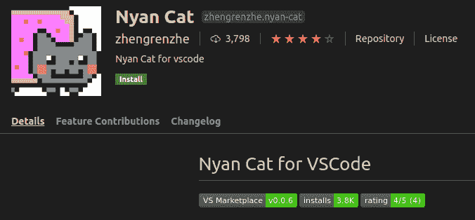
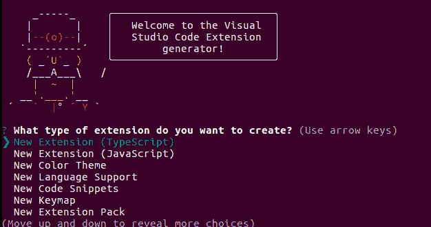
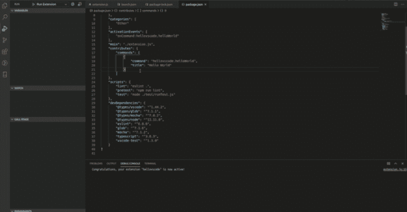
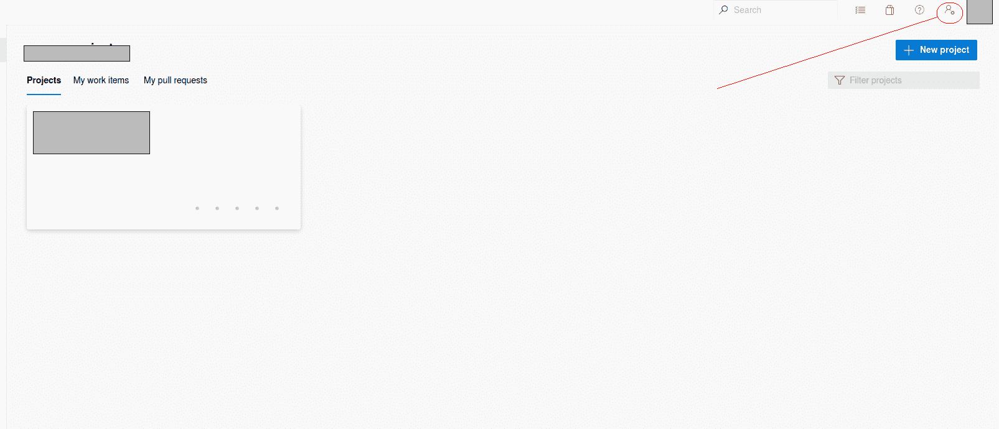
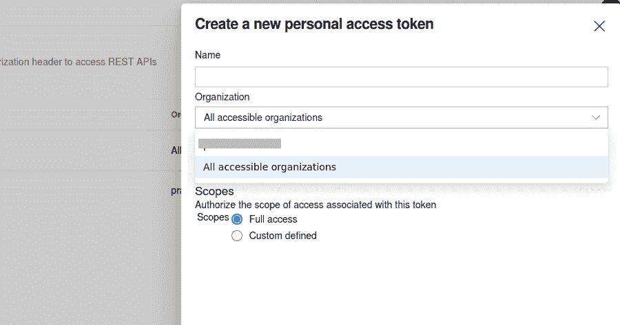

# 如何制作自己的 VS 代码扩展

> 原文：<https://www.freecodecamp.org/news/making-vscode-extension/>

我刚刚做了我的第一个 VS 代码扩展。感觉很好！本文将介绍帮助您创建自己的 VS 代码扩展的基本步骤。在这个过程中，我会分享我从第一次制作过程中学到的东西。

我还不是这方面的专家，但我可以真诚地说，没有什么事情像看起来那么难。？

## 让我们来谈谈 VS 代码及其扩展市场

如果你打开这篇文章，你可能至少听说过 VS 代码(或 Visual Studio 代码)。如果没有，基本上就是微软开发的轻量级代码编辑器。

由于 VS Code 是一个代码编辑器，它可以比典型的 IDE(如 Eclipse)执行得更快更轻。但是伴随这种性能而来的是一个缺点:ide 通常提供更好的工具，比如内置的 linters，更好的代码模板，代码版本控制工具，以及一些特性，比如自动完成。

但是 VS 代码真正闪光的地方是社区的力量。它允许您安装直接来自 VS 代码市场本身的扩展。这些扩展允许您随意定制它。例如，您可以添加短绒或任何其他功能，如彩色支架。你甚至可以在你的 VS 代码中放一只 nyan 猫！

Who doesn't like a nyan cat?

## 为什么要创建 VS 代码扩展？

是的，“为什么”是这里的关键词。当你想开始做一件事时，这是首先要谈的，也是最重要的。

问问自己为什么要做？大多数人通常会回答，因为他们想**学点东西**或者**出名**或者甚至两者都想。但是理由越多，你就越有动力。

我能说的一件事是，你还不需要想得很大。做一个非常具体的工具，也许只有你会用。第一步总是最难的。在一天结束的时候，至少你已经帮助自己完成了扩展。

就我自己而言，我构建一个扩展是因为一个特殊的原因:我想做一个可以用来提高我的生产率的工具。这甚至可能会帮助我附近的一小部分社区。(剧透:是 golang 单元测试生成器)

这就是为什么我所做的扩展非常精确，并且有非常具体的用例。我不追求高分，我的目标是提高我的生产力，学习新的东西。我认为那对我来说是足够的理由。

当然，一开始一切似乎都是不可能的。制作 VS 代码扩展看起来像一些天才级的艺术作品(但当然不是)。既然我现在有很多空闲时间，我想我也可以试试。

## 构建 VS 代码扩展的第一步

要开始，您必须安装 VS 代码。如果你还没有，我会把下载链接[放在这里](https://code.visualstudio.com/download)。

VS 代码扩展支持两种主要语言:JavaScript 和 TypeScript。因此，了解这些知识是非常必要的。

此外，确保您已经安装了 Node.js，因为我们将在这里使用许多 npm 包。

## 如何生成 VS 代码扩展模板

啊，模板。多方便啊。VS 代码已经有了自己的模板生成器，所以让我们直接进入它。

首先，用`npm install -g yo generator-code`安装你的模板生成器

之后，我们用`yo code`来运行一下。而且会提示出这个怪怪的头像的东西(？)和语言选择。只需选择您喜欢的语言，然后继续。(这里我挑了 JavaScript)。

yo code

然后，您需要编辑您的扩展名和描述。你可以做任何你喜欢的事情。

or maybe just enter all the way

现在，将在您的主目录中创建一个名为 hellovscode 的文件夹。只需在文件夹目录中键入`code hellovscode`就可以用 VS 代码打开它。

使用`F5`键运行您的扩展，另一个窗口将会弹出。现在按下`ctrl+shift+p`，找到`Hello World`命令，运行它，右下角会弹出一个窗口。像这样:

Magic? Nope. Just collection of code.

瞧啊。你刚刚完成了你的第一次扩展。但是所有这些实际上都发生了什么呢？别急，下面我来解释一些比特，主要是关于两个文件:`extension.js`和`package.json`。

## VS 代码中的 Extension.js 文件是什么？

这是你将花费大部分时间编码的地方。这个文件将包含您所有的代码块和逻辑流。

这和普通的节点代码没有太大的区别。但是一个主要的区别是注册你的命令。你会遇到这个街区。

简而言之，它将注册你的函数调用。

另一个区别是 VS Code API 的频繁使用——但我们稍后会回到这一点。

如果你浏览了代码，你也会看到这个:`vscode.window.showInformationMessage('Hello World from hellovscode!');`

作为实验，尝试更改消息的值并再次运行它。

### Package.json

这个文件基本上将你从`extension.js`创建的命令与你定义的命令联系起来。

你会看到你在`hellovscode.helloWorld`上面注册的命令被作为标题为`Hello World`的命令的一部分。这就是命令链接到代码的方式。

除此之外，该文件还将使命令能够放在右键单击栏上。它还会过滤命令应该出现的位置(文件类型)。

## 如何发布你的 VS 代码插件

为了以防万一，您可能想要发布您的扩展，我将在这里向您展示如何做:

第一步:首先，用`npm install -g vsce`安装 vsce。我们大部分时间会用这个来发布。

第二步:如果你还没有微软账户，你应该[在这里](https://signup.live.com/)注册，因为我们将需要你得到的访问令牌。

第三步:一旦你的账户登录到[市场](https://marketplace.visualstudio.com/VSCode)。创建您的[组织](https://aex.dev.azure.com/me?mkt=en-US)并点击它(您应该会看到类似下面的内容)。

第 4 步:现在点击右上角的红色圆圈，并选择个人访问令牌。创建您的个人访问令牌，并选择具有完全访问权限的所有可访问组织。

第 5 步:记住你的令牌，因为你将在上传扩展时使用它。

步骤 6:您现在需要创建您的发布者身份。因此，请在命令提示符下键入`run vsce create-publisher YOUR_PUBLISHER_NAME`。
出现提示时，插入您自己的姓名、电子邮件和个人访问令牌。您的发布者帐户应该已成功创建。

第七步:发布时间到了！在命令提示符下准备您的扩展环境，并键入`vsce package`。这将把你的扩展打包成 marketplace 格式。然后输入`vsce publish`。

就这样，你的扩展将被发布。

另一方面，在发布时，您应该修改自述文件(至少是第一部分写着`This is Readme for..`)，因为 vsce 会检测到它并要求您修改它。

## 构建 VS 代码扩展的一些附加技巧

现在你应该对 VS 代码扩展的工作原理有了一些基本的了解。在这里，我将分享一些我所学到的东西。

### 利用 VS 代码的 API

VS 代码本身已经提供了许多 API 供您用来进行扩展。在构建扩展时，您可能会遇到一些常见的障碍，比如获取光标位置、获取行位置，或者获取高亮显示的单词。这些都可以通过使用 VS 代码 API 来解决。

你应该通读他们的文档并尝试他们的 API。您甚至可以尝试通读他们的 API 代码！有了代码本身中的大量文档，您应该能够在某种程度上判断出哪个 API 最有帮助。

### 谷歌搜索东西(阅读文档或代码)

在我们编程生涯的大部分时间里，当我们陷入困境时，总有 Google 或 [Stack Overflow](https://stackoverflow.com/) 可以提供快速帮助。

但这一次它不会永远救你。

首先，在这种情况下用谷歌搜索寻求帮助是相当棘手的。例如，假设你想在光标上高亮显示一个单词，你可以搜索`vs code extension how to get total line...`或类似的东西。

但是让我告诉你，大多数时候它会指引你到真正的扩展本身，或者给你如何使用 VS 代码的手册。

有一种方法可以让你自己变得更容易，那就是在你的搜索中添加“API”关键字，比如`vs code extension api how to ...`。

此外，在 Google 中很难找到相关的答案，因为开发人员社区并不是很大，而且 VS 代码扩展可能会让许多新手望而生畏。但是说实话，**并没有那么难。**

这就是为什么有时候学习如何开发 VS 代码扩展的最好方法是阅读文档或代码。

## VS 代码扩展 GitHub 示例库

我在我的 [GitHub 库](https://github.com/pramonow/vscode-extension-ut)中提供了一个文本操作示例，这可能有助于代码引用(不过要小心一些混乱的代码！).代码将用 Go 语言生成一些模板单元测试。

## 包扎

我在这里介绍的只是创建 VS 代码扩展的基础。我想让你记住的一个信息是，这并不像看起来那么难。有时候你只需要鞭策自己一点，尝试一下。

一路上你可能会遇到一些挑战，但是如果你从来没有开始，你就完全错过了。

最后，感谢您花时间阅读本文。我希望你喜欢它，并开始理解我刚才解释的所有事情。

希望你也能开始扩展！

在这个社交距离遥远的时代，祝大家编码快乐。