# 什么是 Github 动作，如何自动化测试和松弛通知？

> 原文：<https://www.freecodecamp.org/news/what-are-github-actions-and-how-can-you-automate-tests-and-slack-notifications/>

自动化是一个强大的工具。它既节省了我们的时间，也有助于减少人为错误。

但是自动化可能会很困难，有时会被证明是昂贵的。Github Actions 如何帮助强化我们的代码，让我们有更多的时间处理功能而不是 bug？

*   [什么是 Github 动作？](#what-are-github-actions)
*   [什么是 CI/CD？](#what-is-ci-cd)
*   我们要建造什么？
*   [第 0 部分:建立项目](#part-0-setting-up-a-project)
*   第 1 部分:自动化测试
*   [第 2 部分:将新的拉取请求发布到松弛时间](#part-2-post-new-pull-requests-to-slack)

[https://www.youtube.com/embed/1n-jHHNSoTw?feature=oembed](https://www.youtube.com/embed/1n-jHHNSoTw?feature=oembed)

## 什么是 Github 动作？

[动作](https://github.com/features/actions)对于 [Github](https://github.com/) 来说是一个相对较新的特性，它允许你在 Github repo 中使用配置文件设置 CI/CD 工作流。

以前，如果你想用测试、构建或部署建立任何类型的自动化，你将不得不寻找像 [Circle CI](https://circleci.com/) 和 [Travis](https://travis-ci.org/) 这样的服务，或者编写你自己的脚本。但是有了 Actions，您就拥有了对强大工具的一流支持来自动化您的工作流。

## 什么是 CI/CD？

CD/CD 代表持续集成和持续部署(或者可以是持续交付)。它们都是软件开发中的实践，允许团队快速、有效地一起构建项目，并且理想情况下错误更少。

持续集成的思想是，当团队的不同成员在不同的 git 分支上处理代码时，代码被合并到一个单独的工作分支中，然后用自动化的工作流进行构建和测试。这有助于不断地确保每个人的代码都能正常工作，并经过良好的测试。

连续部署更进一步，将这种自动化提升到部署级别。在 CI 流程中，您可以自动化测试和构建，而连续部署将自动将项目部署到环境中。

这个想法是，代码一旦通过任何构建和测试过程，就处于可部署的状态，所以它应该能够被部署。

## 我们要建造什么？

我们将处理两个不同的工作流程。

第一种是简单地运行一些自动化测试，如果失败的话，这些测试可以防止一个拉请求被合并。我们不会遍历构建测试，但是我们会遍历已经存在的运行测试。

在第二部分中，我们将建立一个工作流，每当创建一个新的请求时，它就向 slack 发送一条消息，其中包含一个指向 pull 请求的链接。这在与团队一起处理开源项目时非常有用，并且您需要一种方法来跟踪请求。

## 第 0 部分:设置项目

对于本指南，您真的可以完成任何基于节点的项目，只要它有您可以为第 1 部分运行的测试。

如果你想用一个我将要使用的简单的例子，我已经建立了一个新的项目，你可以用一个函数克隆它，这个函数有两个可以运行和通过的测试。

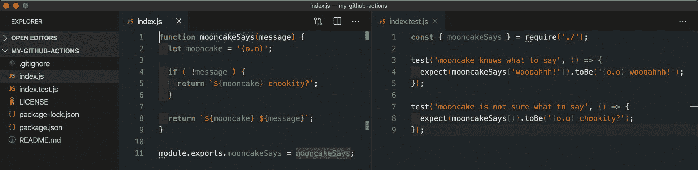

A function with two tests

如果您想从这段代码开始，您可以运行:

```
git clone --single-branch --branch start git@github.com:colbyfayock/my-github-actions.git 
```

一旦在本地克隆并安装了依赖项，您就应该能够运行测试并看到它们通过了！

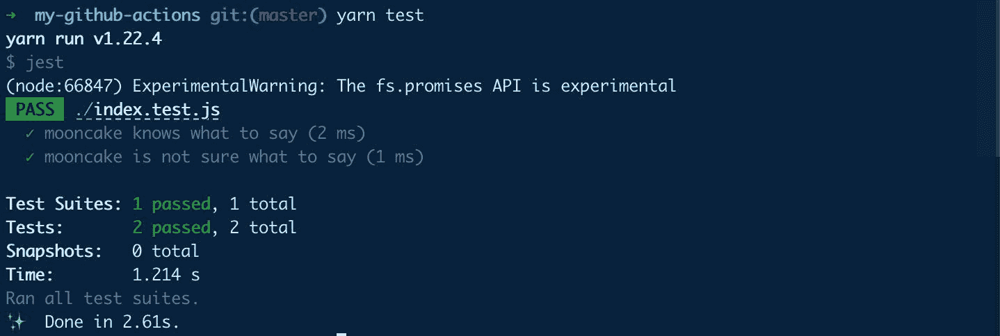

Passing tests

还需要注意的是，你需要将这个项目作为一个新的资源库添加到 Github 上，以便继续跟进。

[跟随提交！](https://github.com/colbyfayock/my-github-actions/commit/6919b1b9beea4823fd28375f1864d233e23f2d26)

## 第 1 部分:自动化测试

测试是任何项目的重要组成部分，它允许我们确保在工作时不会破坏现有的代码。虽然它们很重要，但也很容易被遗忘。

我们可以将人性从等式中移除，并自动运行我们的测试，以确保我们无法在不修复我们所破坏的东西的情况下继续进行。

### 步骤 1:创建新操作

好消息是，Github 实际上使启动这个工作流程变得非常容易，因为它是他们的预烤选项之一。

我们将从导航到存储库页面上的**操作**选项卡开始。

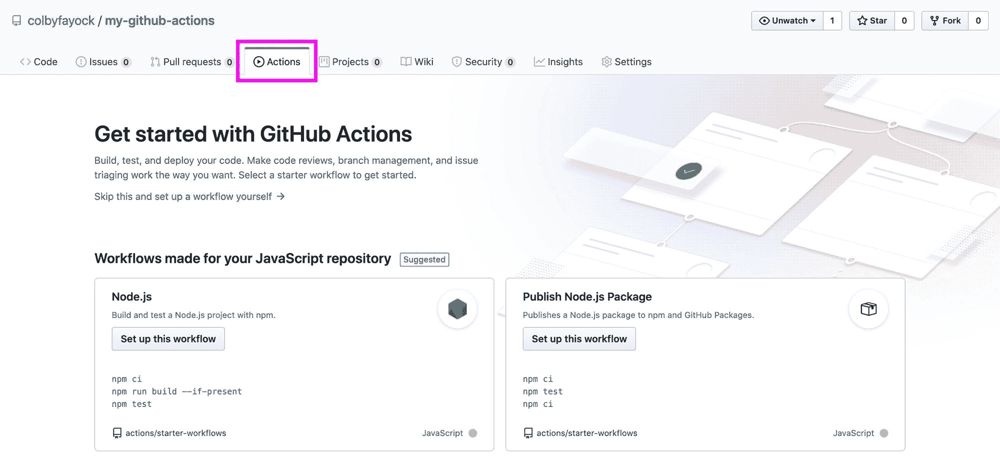

Github Actions starting page

一旦到达那里，我们将立即看到 Github 为我们提供的一些启动工作流。由于我们使用的是节点项目，我们可以点击**在 **Node.js** 工作流下设置这个工作流**。

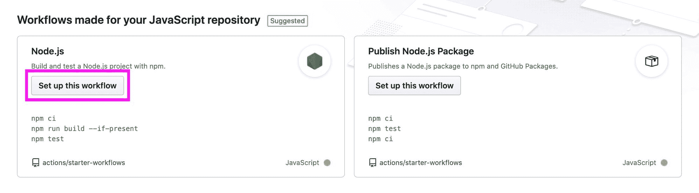

Setting up a Node.js Github Action workflow

页面加载后，Github 将带你进入一个新的文件编辑器，该编辑器已经添加了许多配置选项。

实际上，我们的第一步是保持现状。或者，您可以将文件名更改为`tests.yml`或您能记住的名称。

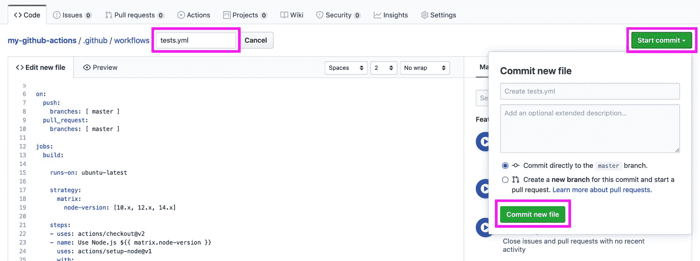

Adding a new Github Action workflow file

您可以点击**开始提交**，然后或者将它提交到`master`分支，或者将变更添加到一个新的分支。对于本演练，我将直接提交给`master`。

要查看我们的新操作，我们可以再次单击**操作**选项卡，这将导航我们回到我们的新操作仪表板。

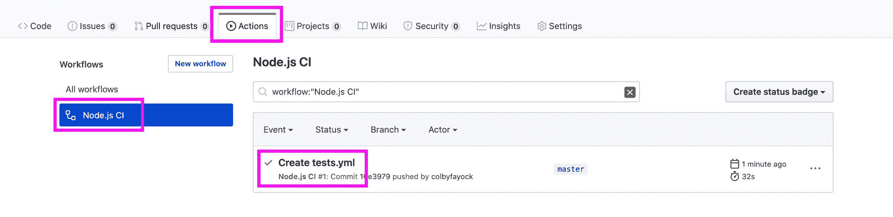

Viewing Github Action workflow events

在那里，您可以单击 **Node.js CI** 并选择您刚才所做的提交，然后您将进入我们新的操作仪表板。然后，您可以通过 **build (#点击侧栏中的一个节点版本。x)** ，点击**运行 npm 测试**下拉菜单，我们将能够看到我们正在运行的测试的输出(如果你跟着我，应该通过了！).

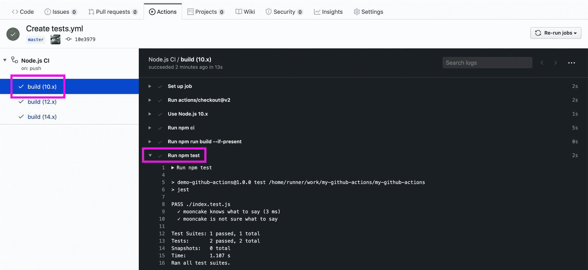

Viewing logs of a Github Action workflow

[跟随提交！](https://github.com/colbyfayock/my-github-actions/commit/10e397966572ed9975cac40f6ab5f41c1255a947)

### 步骤 2:配置我们的新操作

那么我们刚才在上面做了什么？我们将浏览配置文件以及我们可以定制的内容。

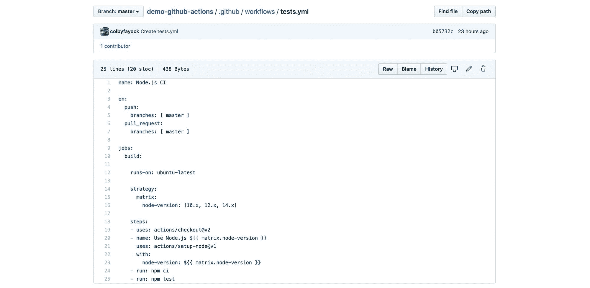

Github Action Node.js workflow file

从顶部开始，我们指定我们的名称:

```
name: Node.js CI 
```

这真的可以是你想要的任何东西。无论你选择什么，都应该帮助你记住它是什么。我将把它定制为“测试”,这样我就能确切地知道发生了什么。

```
on:
  push:
    branches: [ master ]
  pull_request:
    branches: [ master ] 
```

关键是我们如何指定什么事件触发我们的行动。这可以是各种各样的事情，如基于时间与[克朗](https://en.wikipedia.org/wiki/Cron)。但是在这里，我们说我们希望这个动作在任何时候有人将提交推送到`master`或者有人创建一个针对`master`分支的拉请求时运行。我们不会在这里做出改变。

```
jobs:
  build:
    runs-on: ubuntu-latest 
```

下一个位创建了一个名为`build`的新作业。这里我们说我们想使用最新版本的 Ubuntu 来运行我们的测试。Ubuntu 是通用的，所以如果你想在特定的环境下运行它，你只需要定制它。

```
 strategy:
      matrix:
        node-version: [10.x, 12.x, 14.x] 
```

在我们的工作中，我们指定了一个[战略](https://help.github.com/en/actions/reference/workflow-syntax-for-github-actions#jobsjob_idstrategy)矩阵。这允许我们在一些不同的变体上运行相同的测试。

在这种情况下，我们在 3 个不同版本的[节点](https://nodejs.org/en/)上运行测试，以确保它在所有版本上都能工作。这肯定有助于确保您的代码是灵活的和经得起未来考验的，但是如果您在特定的节点版本上构建和运行您的代码，您可以安全地将其更改为仅该版本。

```
 steps:
    - uses: actions/checkout@v2
    - name: Use Node.js ${{ matrix.node-version }}
      uses: actions/setup-node@v1
      with:
        node-version: ${{ matrix.node-version }}
    - run: npm ci
    - run: npm run build --if-present
    - run: npm test 
```

最后，我们指定希望作业运行的步骤。分解如下:

*   为了运行我们的代码，我们需要让它可用。这将在我们的工作环境中检查我们的代码，因此我们可以使用它来运行测试。
*   由于我们在项目中使用 node，我们需要在我们的环境中设置它。我们使用此操作为我们在上面配置的矩阵中指定的每个版本进行设置。
*   `run: npm ci`:如果你不熟悉`npm ci`，它类似于运行`npm install`，但是使用`package-lock.json`文件而不执行任何补丁升级。所以本质上，这安装了我们的依赖项。
*   `run: npm run build --if-present` : `npm run build`在我们的项目中运行构建脚本。`--if-present`标志执行它听起来的功能，并且只在构建脚本存在的情况下运行这个命令。把它留在这里并没有什么坏处，因为没有脚本它就不会运行，但是你可以随意删除它，因为我们并没有在这里构建项目。
*   最后，我们运行`npm test`来运行我们的测试。这使用了在我们的`package.json`文件中设置的`test` npm 脚本。

因此，我们做了一些调整，但是我们的测试应该在我们提交了这些更改并像以前一样通过之后运行！

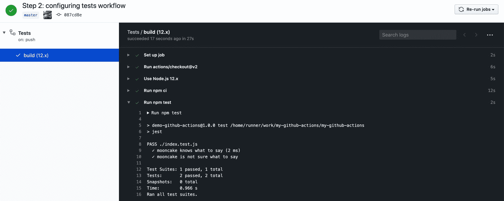

Logs of passing tests in Github Action workflow

[跟随提交！](https://github.com/colbyfayock/my-github-actions/commit/087cd8e8592d1f2b520b6e44b70b0a242a9d2d72)

### 步骤 3:测试我们的测试失败并阻止合并

现在我们的测试已经设置为自动运行，让我们试着破坏它来看看它是如何工作的。

在这一点上，你真的可以做任何你想故意破坏测试的事情，但是[这里是我所做的](https://github.com/colbyfayock/my-github-actions/pull/1):

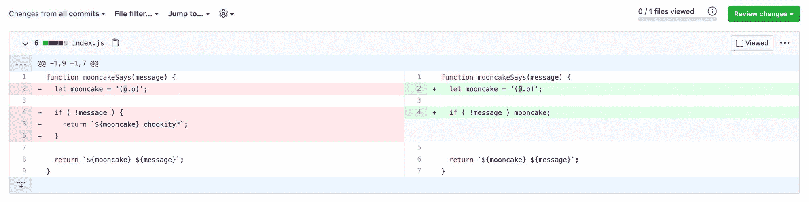

Code diff - https://github.com/colbyfayock/my-github-actions/pull/1

我故意返回不同的预期输出，这样我的测试就会失败。他们做到了！

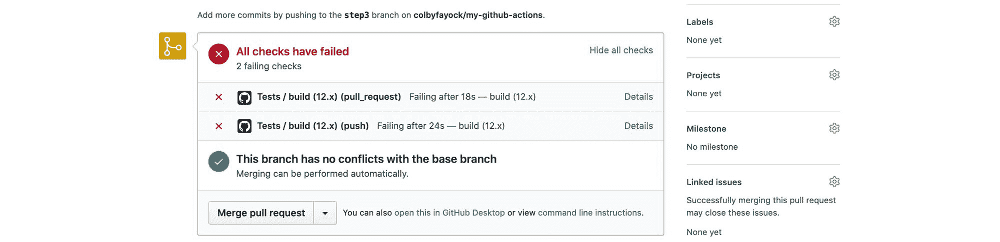

Failing status checks on pull request

在我新的拉请求中，我的新分支破坏了测试，所以它告诉我我的检查失败了。如果你注意到了，合并仍然是绿色的，那么我们如何防止合并呢？

我们可以通过在项目设置中设置一个受保护的分支来防止拉请求被合并。

首先导航到**设置**，然后**分支**，点击**添加规则**。

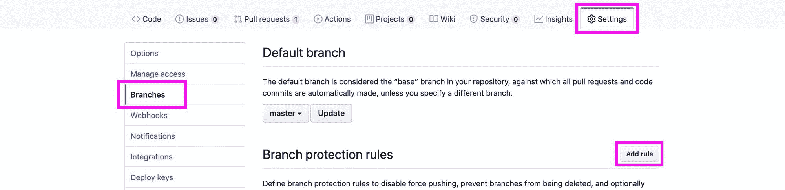

Github branch protection rules

然后，我们希望将分支名称模式设置为`*`，这意味着所有分支，选中**要求在合并前通过状态检查选项**，然后选择我们希望在合并前通过的所有不同的状态检查。

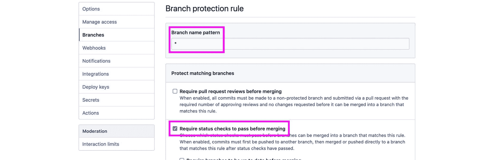

Setting up a branch protection rule in Github

最后，点击页面底部的**创建**。

当您导航回“拉”请求时，您会注意到消息传递有点不同，并声明我们需要通过我们的状态才能进行合并。

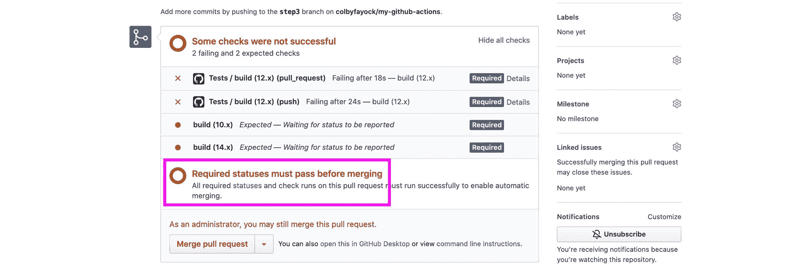

Failing tests preventing merge in pull request

*注意:作为存储库的管理员，您仍然可以进行合并，所以这在技术上只是防止非管理员进行合并。但是如果测试失败，会给你更多的消息。*

这样，我们有了一个新的 Github 动作来运行我们的测试，并防止拉请求在失败时合并。

[跟随拉取请求！](https://github.com/colbyfayock/my-github-actions/pull/1)

*注意:在继续第 2 部分之前，我们不会合并拉取请求。*

## 第 2 部分:将新的拉取请求发布到时差

既然我们正在防止失败的合并请求，我们希望每当打开一个新的拉请求时，向我们的 [Slack](http://slack.com/) 工作区发布一条消息。这将有助于我们密切关注闲置的回购。

对于指南的这一部分，您需要一个 Slack 工作空间，您有权使用它创建新的开发人员应用程序，并且能够为将与该应用程序关联的 bot 用户创建新的频道。

### 步骤 1:设置时差

在为我们的工作流设置松弛时间时，我们将完成一些事情:

*   为我们的工作区创建新应用
*   分配我们的机器人权限
*   将我们的机器人安装到我们的工作区
*   邀请我们的新机器人加入我们的频道

首先，我们将创建一个新的应用程序。前往 [Slack API 应用仪表板](https://api.slack.com/apps)。如果您还没有，请使用您想要设置的工作区登录您的 Slack 帐户。

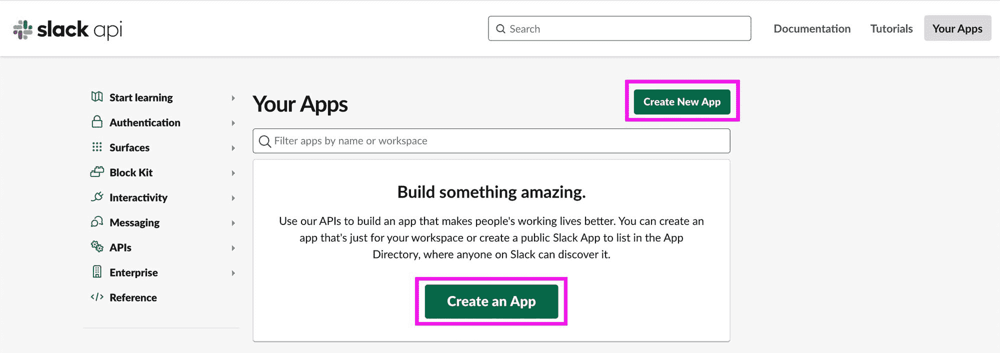

Creating a new Slack app

现在，单击**创建新应用**，系统会提示您输入名称，并选择您希望为其创建此应用的工作区。我将把我的应用程序命名为“Gitbot ”,但您可以选择任何对您有意义的名称。然后点击**创建 App** 。

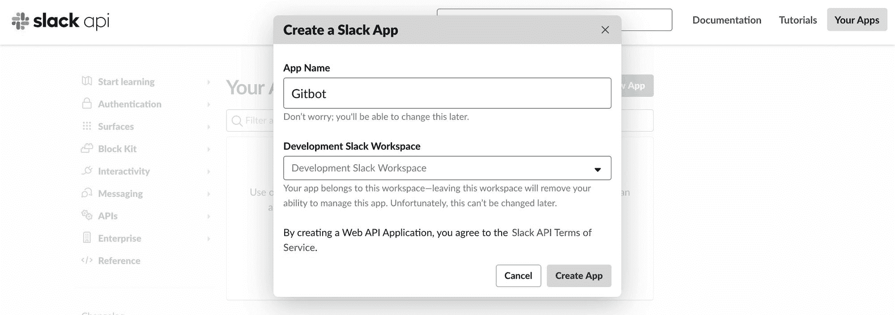

Configuring a new Slack app

创建完成后，导航至左侧工具条中的**应用主页**链接。为了使用我们的 bot，我们需要为它分配 [OAuth](https://oauth.net/) 范围，以便它有权限在我们的通道中工作，因此选择 **Review Scopes 以在该页面上添加**。

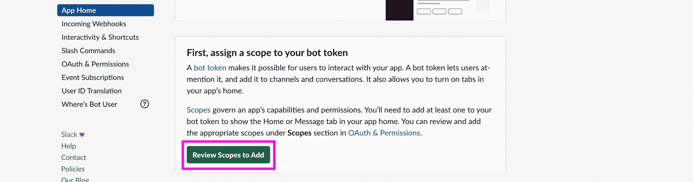

Reviewing Slack app scopes

向下滚动，你会看到一个**范围**部分和一个**机器人令牌**部分。在这里，点击**添加 OAuth 作用域**。对于我们的机器人，我们不需要太多的权限，所以添加`channels:join`和`chat:write`范围，我们就可以开始了。


Adding scopes for a Slack app Bot Token

现在我们有了范围，让我们把机器人添加到我们的工作空间。将同一页面向上滚动到顶部，您会看到一个按钮，上面写着**将应用程序安装到工作区**。

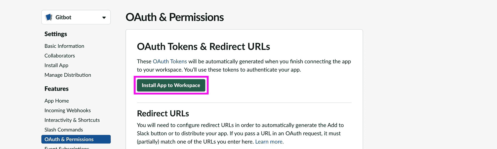

Installing Slack app to a workspace

单击此按钮后，您将被重定向到授权页面。在这里，你可以看到我们为机器人选择的范围。接下来，点击**允许**。


Allowing permission for Slack app to be installed to workspace

此时，我们的 Slack bot 已经准备就绪。在 **OAuth &权限**页面的顶部，你会看到一个 **Bot 用户 OAuth 访问令牌**。这是我们在设置工作流时将使用的内容，因此要么复制并保存此令牌，要么记住此位置，以便您知道以后如何找到它。

注意:这个令牌是私有的，不要把它拿出来，在截屏中展示，或者让任何人看到！

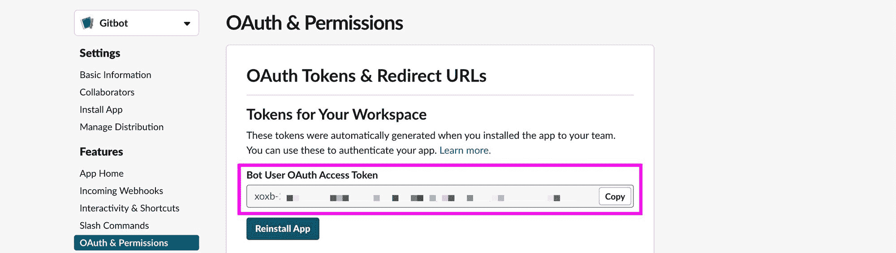

Copying OAuth Access Token for Slack bot user

最后，我们需要邀请我们的 Slack bot 加入我们的频道。如果您打开您的工作区，您可以使用现有的通道或者为这些通知创建一个新的通道，但是您将希望输入命令`/invite @[botname]`，这将邀请我们的 bot 进入我们的通道。

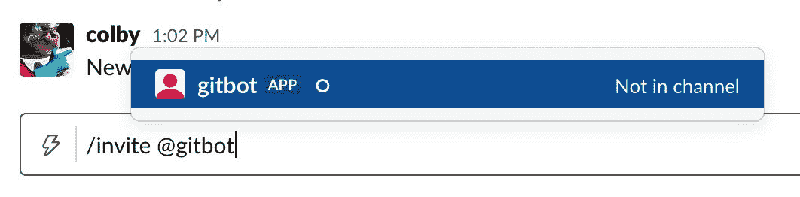

Inviting Slack bot user to channel

一旦添加，我们就完成了设置 Slack！


Slack bot was added to channel

### 创建一个 Github 动作来通知 Slack

我们的下一步将有点类似于我们创建第一个 Github 动作的时候。我们将创建一个工作流文件，并对其进行配置以发送通知。

虽然我们可以使用我们的代码编辑器通过在`.github`目录中创建一个文件来做到这一点，但我将使用 Github UI。

首先，让我们导航回到存储库中的 *Actions* 选项卡。在那里，选择**新工作流程**。

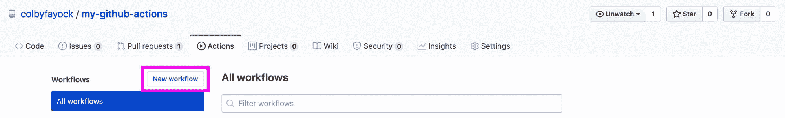

Setting up a new Github Action workflow

这一次，我们将手动启动工作流，而不是使用预先设定的操作。选择顶部的**自行设置工作流程**。

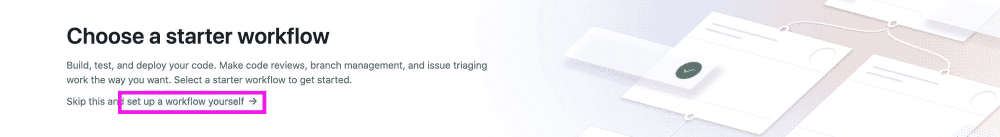

Setting up a Github Action workflow manually

新页面加载后，您将进入一个新模板，我们可以在那里开始工作。这是我们新工作流程的样子:

```
name: Slack Notifications

on:
  pull_request:
    branches: [ master ]

jobs:
  notifySlack:

    runs-on: ubuntu-latest

    steps:
    - name: Notify slack
      env:
        SLACK_BOT_TOKEN: ${{ secrets.SLACK_BOT_TOKEN }}
      uses: abinoda/slack-action@master
      with:
        args: '{\"channel\":\"[Channel ID]\",\"blocks\":[{\"type\":\"section\",\"text\":{\"type\":\"mrkdwn\",\"text\":\"*Pull Request:* ${{ github.event.pull_request.title }}\"}},{\"type\":\"section\",\"text\":{\"type\":\"mrkdwn\",\"text\":\"*Who?:* ${{ github.event.pull_request.user.login }}\n*Request State:* ${{ github.event.pull_request.state }}\"}},{\"type\":\"section\",\"text\":{\"type\":\"mrkdwn\",\"text\":\"<${{ github.event.pull_request.html_url }}|View Pull Request>\"}}]}' 
```

那么上面发生了什么呢？

*   我们正在为我们的工作流程设置一个友好的名称
*   `on`:我们希望当创建了针对我们的`master`分支的拉请求时，触发我们的工作流
*   `jobs`:我们正在创建一个名为`notifySlack`的新工作
*   我们希望我们的工作在最新的 Unbuntu 的基本设置上运行
*   `jobs.notifySlack.steps`:这里我们实际上只有一个步骤——我们使用一个预先存在的 Github 动作，叫做 [Slack 动作](https://github.com/marketplace/actions/post-slack-message),我们将它配置为向我们的 Slack 发布通知

这里有两点我们需要注意，即`env.SLACK_BOT_TOKEN`和`with.args`。

为了让 Github 与 Slack 通信，我们需要一个令牌。这是我们在`env.SLACK_BOT_TOKEN`中设置的。我们在第一步中生成了这个令牌。既然我们将在我们的工作流配置中使用它，我们需要[将它作为 Git 秘密添加到我们的项目](https://help.github.com/en/actions/configuring-and-managing-workflows/creating-and-storing-encrypted-secrets#creating-encrypted-secrets-for-a-repository)中。

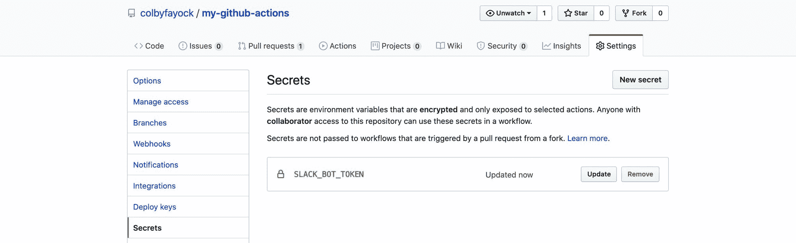

Github secrets including SLACK_BOT_TOKEN

`with.args`属性是我们用来配置 Slack API 的有效负载的，它包括通道 ID ( `channel`)和我们的实际消息(`blocks`)。

参数中的有效负载被字符串化和转义。例如，展开后看起来像这样:

```
{
  "channel": "[Channel ID]",
  "blocks": [{
    "type": "section",
    "text": {
      "type": "mrkdwn",
      "text": "*Pull Request:* ${{ github.event.pull_request.title }}"
    }
  }, {
    "type": "section",
    "text": {
      "type": "mrkdwn",
      "text": "*Who?:*n${{ github.event.pull_request.user.login }}n*State:*n${{ github.event.pull_request.state }}"
    }
  }, {
    "type": "section",
    "text": {
      "type": "mrkdwn",
      "text": "<${{ github.event.pull_request._links.html.href }}|View Pull Request>"
    }
  }]
} 
```

注意:这只是为了显示内容的样子，我们需要使用带有字符串化和转义参数的原始文件。

回到我们的配置文件，我们设置的第一件事是我们的通道 ID。要找到我们的渠道 ID，您需要使用 Slack web 界面。在浏览器中打开 Slack 后，您希望在 URL 中找到您的频道 ID:

```
https://app.slack.com/client/[workspace ID]/[channel ID] 
```

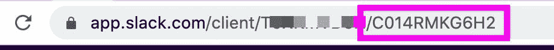

Channel ID in Slack web app URL

使用该通道 ID，您可以修改我们的工作流配置并用该 ID 替换`[Channel ID]`:

```
with:
  args: '{\"channel\":\"C014RMKG6H2\",... 
```

arguments 属性的其余部分是我们设置消息的方式。它包括来自 Github 事件的变量，我们使用这些变量来定制我们的消息。

我们不会在这里进行调整，因为我们已经拥有的将发送一个基本的拉请求消息，但你可以用 Slack 的 [Block Kit Builder](https://app.slack.com/block-kit-builder/) 测试并构建你自己的有效载荷。

[跟随提交！](https://github.com/colbyfayock/my-github-actions/commit/e228b9899ef3da218d1a100d06a72259d45ea19e)

### 测试我们的松弛工作流程

现在我们已经用 Slack 应用程序配置了工作流，最后我们准备好使用我们的机器人了！

对于这一部分，我们需要做的就是创建一个新的 pull 请求，包含我们想要的任何更改。为了测试这一点，我简单地[创建了一个新的分支](https://github.com/colbyfayock/my-github-actions/pull/2)，在那里我向`README.md`文件添加了一个句子。

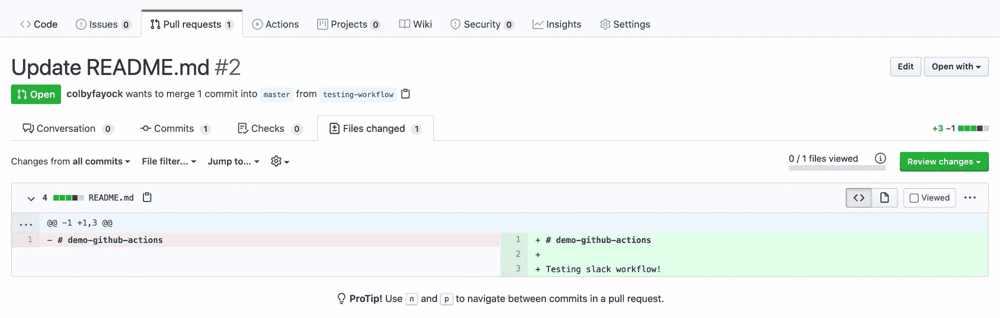

Code diff - [https://github.com/colbyfayock/my-github-actions/pull/2](https://github.com/colbyfayock/my-github-actions/pull/2)

一旦您[创建了 pull 请求](https://github.com/colbyfayock/my-github-actions/pull/2)，类似于我们的测试工作流，Github 将运行我们的 Slack 工作流！您可以在 Actions 选项卡中看到它的运行，就像之前一样。

只要你设置正确，一旦工作流运行，你现在应该有一个来自你的新机器人的新消息。

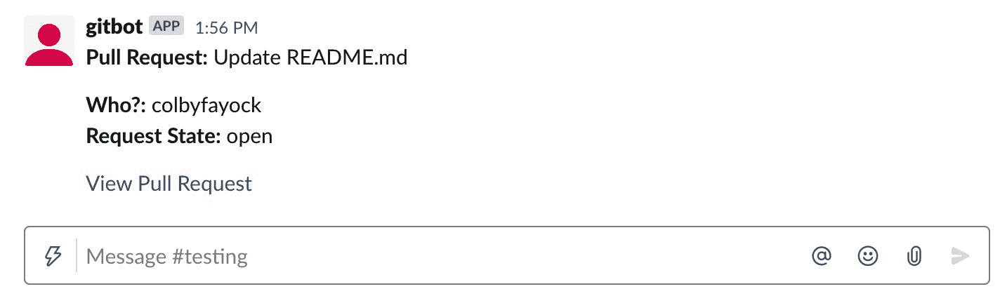

Slack bot automated message about new pull request

*注意:我们不会合并那个拉取请求。*

## 我们还能做什么？

### 自定义时差通知

我整理的信息很简单。它告诉我们是谁创建了拉请求，并给了我们一个链接。

要定制格式和消息，您可以使用 Github [Block Kit Builder](https://app.slack.com/block-kit-builder/) 来创建自己的格式和消息。

如果您想包括额外的细节，比如我在 pull 请求中使用的变量，您可以利用 Github 可用的[上下文](https://help.github.com/en/actions/reference/context-and-expression-syntax-for-github-actions#contexts)。这使您可以获取有关环境和作业的信息，以定制您的消息。

我似乎找不到任何示例有效负载，所以这里有一个示例`github`上下文有效负载的例子。

[示例 github 上下文](https://gist.github.com/colbyfayock/1710edb9f47ceda0569844f791403e7e)

### 更多 Github 动作

凭借我们创建新的定制工作流的能力，没有什么是我们不能自动化的。Github 甚至有一个 [marketplace](https://github.com/marketplace?type=actions) ，你可以在那里浏览。

如果你想更进一步，你甚至可以自己创造！这允许您设置脚本来配置工作流，以执行项目所需的任何任务。

## 加入对话！

> 。@github 动作是自动化开发工作流程的绝佳方式？
> 
> 你可以做一些事情，比如自动运行测试，向 [@slack](https://twitter.com/slack?ref_src=twsrc%5Etfw) 发送通知！？
> 
> 在这里，我将带您了解什么是动作，以及如何在您的项目中使用它们
> 
> ？[https://t.co/CNDIsNXbhm](https://t.co/CNDIsNXbhm)
> 
> — Colby Fayock (@colbyfayock) [June 3, 2020](https://twitter.com/colbyfayock/status/1268197100539514881?ref_src=twsrc%5Etfw)