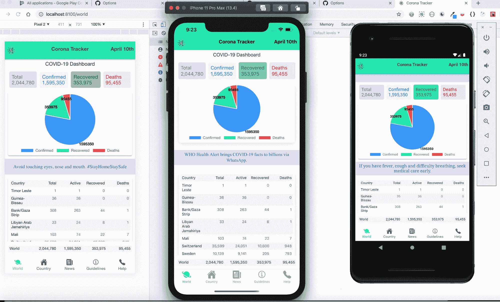
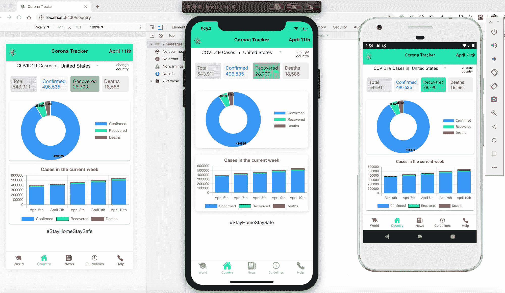
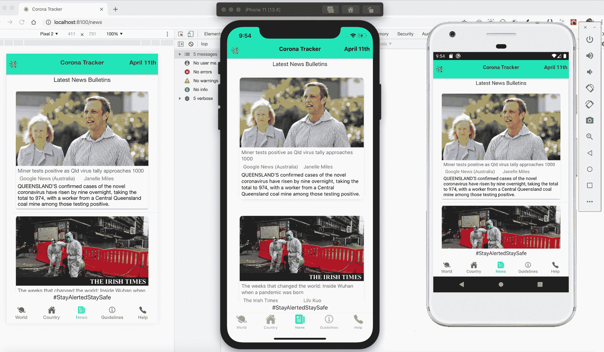
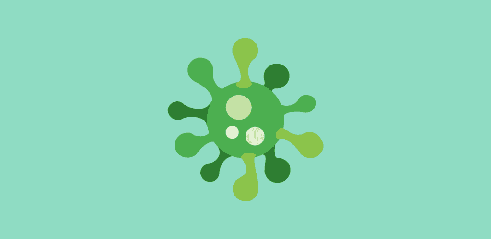

# 我如何在短短 3 天内用 Ionic 和 Firebase 创建了一个冠状病毒跟踪器应用程序

> 原文：<https://www.freecodecamp.org/news/how-to-create-corona-tracker-app-in-3-days/>

我真的很喜欢混合应用技术——它们帮助我们在一个代码库中实现了这么多。使用 Ionic 框架，我开发了一个跨平台的移动解决方案，用于在短短 3 天内跟踪冠状病毒病例。

在本教程中，我们将学习如何开发一个 **Android、iOS 和 Progressive Web 应用程序**，通过最新的相关新闻、帮助和反馈部分来跟踪我们周围的案例。准备好迎接新的编码之旅吧！？

### 先决条件

混合移动应用程序开发流程适用于所有类型的开发人员，无论他们的技术水平如何。因为我们将使用 Web 开发的三个基本支柱——****HTML+CSS+JAVASCRIPT****——作为核心，你可以很容易地理解过程和技术。

因此，本教程是为每个对 Web 基础有基本了解的人准备的。那么，我们开始吧。

## 第 0 天-想法、计划和工程

### 想法

最初，我在寻找身边最新的 Covid19 病例(2020 年 3 月)。我得到了几个链接，在数字上差别不大。

然后，我意识到来自[https://github.com/backtrackbaba/covid-ap](https://github.com/backtrackbaba/covid-api)I 的数据定期更新并且更加准确。我决定利用约翰霍普金斯大学 ****提供的数据，开发一个通用、小巧、方便的移动解决方案。****

### 计划

我计划开发一个每个人都可以通用的跨平台移动解决方案。我考虑过 Ionic 框架，它将允许我开发一个 **Android **，iOS &渐进式网络应用** **(PWA)**** ？只需要编写和维护一个代码库。

我还想通过各种插图展示世界各地和各个国家的 COVID19 病毒病例。

### 工程

我们的想法是开发 5 个独立的选项卡，放在应用程序的底部:

1.  ****世界**** —将显示 COVID19 仪表盘
2.  ****【国家】—**** 允许您选择一个国家来查看病例
3.  ****新闻—**** 会得到关于疫情冠状病毒的最新消息
4.  ****指南—**** 允许您阅读和观看所有咨询和指南
5.  ****帮助****——会提供帮助和反馈。


Photo by [Scott Graham](https://unsplash.com/@sctgrhm?utm_source=ghost&utm_medium=referral&utm_campaign=api-credit) / [Unsplash](https://unsplash.com/?utm_source=ghost&utm_medium=referral&utm_campaign=api-credit)

### 技术栈

我之前通过 Angular 和 Ionic 开发过几个网站和 app。但是这次我想学习和使用 React.js，下面的库需要使用节点包管理器( ****npm**** )安装:

*   ****React.js**** 包含最新的 react-hooks
*   ****离子架构**** (版本 4)带 ****电容****
*   ****Node.js**** 环境支持 JavaScript 和 npm 库
*   ****TypeScript**** 语言编写实际代码(。tsx 文件)
*   ****Chart.js**** 为各种插图
*   ****Firebase**** 用于托管内容( ****渐进式 Web App**** )

### 工具

*   VS 代码
*   谷歌浏览器
*   Android 应用程序的 Android Studio
*   用于 iOS 应用程序的 Xcode(遗憾的是仅在苹果电脑上可用)

### 安装和脚手架

我们需要安装和配置所有上述软件和框架。所以，让我们从第一组终端命令开始(无论是在 Mac、Linux 还是 Windows 上):

1.  安装具有全局范围的 ionic**" NPM install-g @ ionic/CLI native-run Cordova-RES "**
2.  创建带有电容器的 react 应用程序**“离子启动电晕跟踪器标签—类型=react —电容器”**
3.  添加 react 挂钩和 pwa 元素**" NPM install @ ionic/react-hooks @ ionic/pwa-elements "**

在默认工作区打开 ****电晕跟踪器**** 文件夹。您应该已经获得了所有默认的 HTML、CSS 和。tsx 文件和其他子文件夹按正确的顺序排列。现在，转到你的应用程序文件夹，运行这两个命令

**cd 电晕追踪器**
**离子发球**

瞧啊。？您的 Ionic 应用程序现在可以在网络浏览器中运行。单击终端中的 localhost 选项进行检查。？这是你基本的应用程序安装和搭建。

到目前为止，你应该在本地浏览器上运行 ionic-react 应用程序。现在****【index.html】****和 ****index.tsx**** 是你 ****单页申请(SPAs)的第一页。****

### 应用程序路由

让我们将路由添加到我们的应用程序中，这将允许我们访问上面解释的所有 5 个不同的选项卡。打开你的 ****App.tsx**** 文件，在<内添加下面的路由器> < /IonReactRouter >

```
 <IonTabs>
        <IonRouterOutlet>
          <Route path="/world" component={WorldTab} exact={true} />
          <Route path="/country" component={CountryTab} exact={true} />
          <Route path="/news" component={NewsTab} />
          <Route path="/guidelines" component={GuidelinesTab} />
          <Route path="/help" component={HelpTab} />
          <Route path="/" render={() => <Redirect to="/world" />} exact={true} />
        </IonRouterOutlet>
        <IonTabBar slot="bottom" >
          <IonTabButton tab="WorldTab" href="/world">
            <IonIcon icon={planet} />
            <IonLabel>World</IonLabel>
          </IonTabButton>
          <IonTabButton tab="CountryTab" href="/country">
            <IonIcon icon={home} />
            <IonLabel> Country</IonLabel>
          </IonTabButton>
          <IonTabButton tab="NewsTab" href="/news">
            <IonIcon icon={newspaper} />
            <IonLabel> News</IonLabel>
          </IonTabButton>
          <IonTabButton tab="GuidelinesTab" href="/guidelines">
            <IonIcon icon={informationCircleOutline} />
            <IonLabel>Guidelines</IonLabel>
          </IonTabButton>
          <IonTabButton tab="HelpTab" href="/help">
            <IonIcon icon={call} />
            <IonLabel>Help</IonLabel>
          </IonTabButton>
        </IonTabBar>
      </IonTabs>
```

Basic Ionic routing for our app

再次在浏览器中检查您的应用程序，您应该会看到所有这些标签及其各自的页面。所有的标签都应该能够正常工作。

> 如果你*遇到任何关于安装、编译时*、*或运行时错误的问题，请告诉我*。**

这是它的 ****日** 0** 。？

## 第 1 天-开发 COVID19 仪表板和安全指南标签

在这部分流程中，我们将为我们的 Ionic React 混合应用程序开发**和 ****指南**** 标签。到目前为止，我们已经完成了 app 的基本安装和搭建。我们还在我们的应用程序中添加了 5 个不同的标签。**

### **世界选项卡:设计**

**让我们现在就建立我们的主页 ****世界**** 标签。我决定在这个主页选项卡上有 4 个不同的部分:**

1.  **4 个不同的方框显示实际数字:总数，积极，恢复和死亡**
2.  **描述案例数量的饼图**
3.  **基本健康提示的幻灯片**
4.  **所有国家按降序排列。**

### **世界选项卡:数据和 API**

**我研究了开源的 postman API 源代码，其中包含了所有与 Corona Cases[****https://documenter.getpostman.com/view/2568274/SzS8rjbe?相关的应用编程接口(API)版本=最新****](https://documenter.getpostman.com/view/2568274/SzS8rjbe?version=latest) ****。******

**首先，我们将使用 Axios 库的 [global](https://covidapi.info/api/v1/global) API，通过使用状态& useEffect React-hooks 获得全球案例总数。**

```
`const [data, setData] = useState<IGLobalCount>();
const [showLoading, setShowLoading] = useState(true);
  useEffect(() => {
    const getGlobalData = async () => {
      //latest global count
      const result = await axios('https://covidapi.info/api/v1/global');
      // console.log(result);
      setData(result.data);
      setShowLoading(false);
    };
    getGlobalData();
  }, []);`
```

**get the total global count in the world**

**然后使用 HTML 设置返回块中的数据:**

```
`<IonRow class="casesBox">
    <IonCol class="totalCases">Total <AddNumFunc a={confirmed} b={recovered} c={deaths} /></IonCol>
    <IonCol class="confirmedBox">Confirmed {confirmed?.toLocaleString()}</IonCol>
    <IonCol class="recoveredBox">Recovered {recovered?.toLocaleString()}</IonCol>
    <IonCol class="deathsBox">Deaths {deaths?.toLocaleString()}</IonCol>
</IonRow>`
```

**HTML boxes**

**现在，我们有了前 4 个响应框，包含总病例数、确诊病例数、痊愈病例数和死亡病例数。使用****NPM install react-chart js-2****在项目中安装 chart.js。让我们利用同样的数据来画一个饼状图。**

```
`import axios from 'axios';
import { Pie } from 'react-chartjs-2';

<IonCard class="pieCard">
   <Pie data={GlobalCasesPieChart}
     options={{
       legend: {
         display: true,
         position: 'bottom',
       },
       plugins: {
         datalabels: {
           anchor: 'end',
           clamp: 'true',
           align: 'bottom',
           color: 'black',
           labels: {
             title: {
               font: {
                 weight: 'bold'
               }
             }
           }
         }
       }
    }} />
</IonCard>`
```

**PieChart**

**现在，我们在 ****世界**** 标签中有 4 个部分中的 2 个。所以接下来，让我们添加一个幻灯片来描述一般的健康提示。**

```
`<IonSlides class="tipsSlides" options={slideOpts}>
  <IonSlide class="slide">
    Maintain at least 1 metre (3 feet) distance between yourself and anyone who is coughing or sneezing.
  </IonSlide>
  <IonSlide class="slide">
    Regularly and thoroughly clean your hands with an alcohol-based hand rub or wash them with soap and water.
  </IonSlide>
  <IonSlide class="slide">
    If you have fever, cough and difficulty breathing, seek medical care early.
  </IonSlide>
  <IonSlide class="slide">
    Avoid touching eyes, nose and mouth. #StayHomeStaySafe
  </IonSlide>
  <IonSlide class="slide">
    WHO Health Alert brings COVID-19 facts to billions via WhatsApp.
  </IonSlide>
</IonSlides>`
```

**Health Tips Slideshow**

**现在，我们按降序制作一个所有国家的数据表来描绘各种情况。同样，我们将使用 Axios 库使用最新的 API 来获得世界上所有国家的总数量，这些国家使用的是 useState(T2)use effect React-hooks。**

```
`const [countryWiseData, setCountryWiseData] = useState<ICountry[]>([]);
  useEffect(() => {
    const getGlobalCountryData = async () => {
      //latest global country wise count
      const result = await axios('https://covidapi.info/api/v1/global/latest');
      //console.log(result.data.result);
      let sortedResult = result.data.result;
      sortedResult.sort((a: Object, b: Object) => {
        return (Object.values(a)[0].confirmed > Object.values(b)[0].confirmed ? -1 : (Object.values(a)[0].confirmed < Object.values(b)[0].confirmed ? 1 : 0));
      });
      setCountryWiseData(sortedResult);
    };
    getGlobalCountryData();
  }, []);`
```

**to get the total global count for all the countries in the world**

**我们已经完成了我们的主页标签与上述所有 4 个部分的发展。你可以在下面看到它们:**

**

World Tab — Working Emulator Snapshots in PWA, android and iOS** 

**现在，让我们继续开发我们的下一个标签——指南****标签**标签**。******

**这只是世卫组织和州政府给出的各种 ****顾问****和指导方针**** 的一个信息性的静态标签。我们在 HTML 中添加了各种图像和视频:**

```
`<IonList>
   <IonCard>
     <iframe title="WHO" width="100%" height="200" src="https://www.youtube.com/embed/5jD2xd3Cv80"
       allow="accelerometer; autoplay; encrypted-media; gyroscope; picture-in-picture">
     </iframe>
   </IonCard>
   <IonCard>
     <IonCardHeader>Symptoms</IonCardHeader>
     <IonImg class="guidlineImages" src="assets/images/Symptoms2.png"></IonImg>
   </IonCard>
   <IonCard>
     <IonCardHeader>Diseases</IonCardHeader>
     <IonImg class="guidlineImages" src="assets/images/Symptoms.png"></IonImg>
   </IonCard>
   <IonCard>
     <IonCardHeader>Myths Busted</IonCardHeader>
     <IonImg class="guidlineImages" src="assets/images/Myth.jpeg"></IonImg>
   </IonCard>
   <IonCard>
     <IonCardHeader>Stress Distraction Tips</IonCardHeader>
     <IonImg class="guidlineImages" src="assets/images/Stress.jpg"></IonImg>
   </IonCard>
   <IonCard>
     <IonCardHeader>Stay Home</IonCardHeader>
     <IonImg class="guidlineImages" src="assets/images/SafeHands.jpeg"></IonImg>
   </IonCard>
</IonList>`
```

**Advisory and Guidelines are given by WHO and State Govts**

**如果您遇到任何与安装、编译时或运行时错误相关的问题，请告诉我。**

**第一天到此为止。？**

## **第 2 天-发展中国家和新闻选项卡**

**在本节中，我们将为我们的 Ionic React 混合应用程序开发 ****国家**** 和 ****新闻**** 选项卡。到目前为止，我们已经在我们的 ionic react 应用程序中建立了 ****世界**** 和 ****指南**** 标签，并提供了基本的应用程序路由。**

### **国家选项卡:设计**

**现在让我们构建我们的第二页 ****国家**** 标签。我决定在第二个选项卡上有 4 个不同的部分:**

1.  **国家下拉列表选择您选择的国家**
2.  **4 个不同的方框显示实际数字:总数，积极的，恢复和死亡在选定的国家**
3.  **描述所选国家/地区的病例数的圆环图**
4.  **所选国家/地区案例的每周趋势。**

### **国家选项卡:数据和 API**

**我研究了开源的 postman link，它包含了与 Corona Cases[****https://documenter.getpostman.com/view/2568274/SzS8rjbe?相关的所有应用编程接口(API)版本=最新****](https://documenter.getpostman.com/view/2568274/SzS8rjbe?version=latest) ****。******

**在这里，我们将使用 Axios 库的 [country](https://covidapi.info/api/v1/country/) API，使用 useState&use effect React-hooks 来获取所选国家的总计数。**

**我们将在本地存储中存储用户选择的国家，以便其他插图更新。**

```
`import moment from 'moment';
import axios from 'axios';
import { Doughnut, Bar } from 'react-chartjs-2';

  const [yourCountry, setYourCountry] = useState<string>('IND');
  Storage.set({ key: 'yourCountry', value: yourCountry });
  const [countryData, setcountryData] = useState<ICountryCount>();
  const [showLoading, setShowLoading] = useState(true);

  useEffect(() => {
    const getCountryData = async () => {
      let result: any = '';
      const { value } = await Storage.get({ key: 'yourCountry' });
      if (value) {
        result = await axios('https://covidapi.info/api/v1/country/' + value + '/latest');
      } else {
        result = await axios('https://covidapi.info/api/v1/country/' + yourCountry + '/latest');
      }
      // console.log(result);
      setcountryData(result.data.result);
      setShowLoading(false);
    };

    getCountryData();
  }, [yourCountry]);`
```

**Selecting a country using the dropdown**

**现在，使用 API 获取特定于国家的数据:**

```
`const [countryTimeSeriesData, setcountryTimeSeriesData] = useState<ISeriesCases[]>([]);
  let endDate: string = new Date().toISOString().split('T')[0];
  let todaysDate = new Date();
  let startDate: string = new Date(todaysDate.getTime() - (5 * 24 * 60 * 60 * 1000)).toISOString().split('T')[0];

  useEffect(() => {
    const getCountryTimeSeriesData = async () => {
      const result = await axios('https://covidapi.info/api/v1/country/' + yourCountry + '/timeseries/' + startDate + '/' + endDate);
      // console.log(result);
      setcountryTimeSeriesData(result.data.result);
      setShowLoading(false);
    };

    getCountryTimeSeriesData();
  }, [yourCountry, endDate, startDate]);`
```

**Consuming API with date range**

**现在，设计圆环图和条形趋势图:**

```
 `<IonCard>
    <Doughnut
      data={CountryDoughnutChart}
      options={{
        legend: {
          display: true,
          position: 'right'
        },
        plugins: {
          datalabels: {
            anchor: 'bottom',
            clamp: 'true',
            align: 'end',
            color: 'black',
            labels: {
              title: {
                font: {
                  weight: 'bold',
                  size: 10
                }
              }
            }
          }
        }
    }} />
  </IonCard>`
```

**Design doughnut chart**

```
 `<Bar
   data={countryBarChart}
   options={{
     scales: {
       xAxes: [{
         stacked: true
       }],
       yAxes: [{
         stacked: true
       }]
     },
     title: {
       display: true,
       text: 'Cases in the current week',
       fontSize: 15
     },
     legend: {
       display: true,
       position: 'bottom'
     },
     plugins: {
       datalabels: { display: false }
     }
   }}
  />`
```

**Design Bar chart for the trend of last week**

**现在保存文件，并在浏览器中将其签出。所以，最后，我们应该得到下面的设计:**

**

Country tab — Working Emulator Snapshots in PWA, android and iOS** 

**现在，让我们继续开发我们的第三个标签——****新闻标签。******

### **新闻选项卡:设计**

**我们添加了一个基本的离子卡，其中包含各种新闻资源，如 URL、标题、图片、作者和出版商的详细信息:**

```
`<IonList>
   {data.map((news, idx) => (
     <IonItem key={idx}>
       <IonCard>
         <IonImg src={news?.urlToImage} class="newsImage" ></IonImg>
         <IonGrid>
           <IonRow class="newsTitle">{news?.title}</IonRow>
           <IonRow class="newsSource">
             <IonCol>{news?.source?.name}</IonCol>
             <IonCol>{trimSourceDetails(news?.author)}</IonCol>
             {/* <IonCol text-right>{moment(news?.publishedAt).format('DD MMM YYYY')}</IonCol> */}
           </IonRow>
           <IonRow class="newsContent">{news?.description}</IonRow>
         </IonGrid>
       </IonCard>
     </IonItem>
   ))}
</IonList>`
```

**News Card with all the details**

### **新闻选项卡:数据和 API**

**为了得到消息，我用了****【Newsapi.org】****哪个是 ****不是开源的**** ？应用编程接口(API)。但是用一个开发者账号，我搜索了冠状病毒相关的新闻。如果您想使用其他新闻 API，您可以使用它们。**

**在这里，我们将使用 Axios 库使用 [top-headlines](https://newsapi.org/v2/top-headlines) API，并使用 useState&use effect React-hooks 来获取所选国家的总计数。**

```
`const [data, setData] = useState<IArticles[]>([]);
  const [showLoading, setShowLoading] = useState(true);

  useEffect(() => {
    const getNewsData = async () => {
      const result = await axios('https://newsapi.org/v2/top-headlines?q=coronavirus&language=en&apiKey=YOUR_OWN_KEY');
      // console.log(result);
      setData(result.data.articles);
      setShowLoading(false);
    };

    getNewsData();
  }, []);`
```

**Consuming news API**

**现在，保存文件并在浏览器中检查。所以，最后，我们应该得到下面的设计:**

**

News tab — Working Emulator Snapshots in PWA, android and iOS** 

**如果您遇到任何与代码、编译时或运行时错误相关的问题，请告诉我。**

**第二天到此为止。？**

****

## **第 3 天-开发帮助选项卡和部署**

**在这一部分——我们的最后一部分——我们将开发 ****帮助选项卡**** ，并学习使用 ****电容器来构建** A **ndroid**** 和 ****iOS**** 应用。**

**到目前为止，我们已经在我们的 ionic react 应用程序中建立了 ****世界、国家、新闻**、**和指南**** 标签。此外，将我们的应用程序部署到 Firebase 作为一个 ****PWA。现在将会是最有趣的时刻。穿上袜子，准备好在真实环境中真正看到自己的应用程序。******

### **帮助选项卡:设计**

**首先，让我们创建帮助和反馈选项卡。这只是一个来自世界卫生组织 ****(世卫组织**** )的信息性静态帮助选项卡，向开发者提供反馈。**

```
`<IonCard>
    <IonList>
      <IonItem>
        <IonLabel>Call WHO helpline Number</IonLabel>
        <IonButton color='warning' href="tel:+41-22-7912111"><IonIcon slot="start" icon={callOutline} /> Call</IonButton>
      </IonItem>
      <IonItem>
        <IonLabel>Email WHO Team</IonLabel>
        <IonButton color='warning' href="mailto:mediainquiries@who.int"><IonIcon slot="start" icon={mailOutline} /> Email</IonButton>
      </IonItem>
      <IonItem>
        <IonLabel>Text 'Hi' to WHO helpdesk</IonLabel>
        <IonButton color='warning' href="https://api.whatsapp.com/send?phone=41798931892&text=hi&source=&data="><IonIcon slot="start" icon={logoWhatsapp} /> WhatsApp</IonButton>
      </IonItem>
      <IonItem>
        <IonLabel>Donate via WHO website</IonLabel>
        <IonButton color='warning' href="https://www.who.int/emergencies/diseases/novel-coronavirus-2019/donate"><IonIcon slot="start" icon={walletOutline} /> Donate</IonButton>
      </IonItem>
    </IonList>
  </IonCard>`
```

**Help tab with the phone, WhatsApp options**

## **环境安装检查**

**正如我们在第一部分(第 0 天)中提到的，我们应该在系统中安装以下所有软件:**

*   **VS 代码**
*   **谷歌浏览器**
*   **Android 应用程序的 Android Studio**
*   **用于 iOS 应用程序的 Xcode(遗憾的是仅在苹果电脑上可用)**

**我们需要设置好需要的路径，安装好目标的 Android(比如 Android 9 Pie)和 iOS(比如 iOS 11)操作系统版本。**

**等等，如果您对这个平台设置非常陌生，请不要担心。在接下来的部分中，按照以下步骤依次使用所有提供的******链接**** 。****

**在创建 ionic react 应用程序时，我们已经在第一个终端命令中安装了 ****电容器**** 。(检查安装部分的第 0 天)。Capacitor 是跨平台 Web 应用的本地桥。它用一个代码库调用 iOS、Android 和 Web 上的原生 SDK。**

**//转到您的项目目录，运行以下命令，将 Capacitor 初始化到您的项目中，并将 Android 和 iOS 平台添加到您的应用程序中:**

 ****NPM install-save @ capacitor/core @ capacitor/CLI
npx cap init
npx add Android
npx add IOs**

## 应用程序图标和闪屏

对于创建 android 和 iOS 图标和闪屏，我推荐使用[https://pgicons.abiro.com/](https://pgicons.abiro.com/)。它将为所有目标移动操作系统创建不同大小的图标和飞溅。

创建这些之后，你可以直接在你的目标平台文件夹中用默认的离子图标和飞溅来替换这些图标。

# 渐进式网络应用程序(PWA)

PWA 的两个主要需求是[服务人员](https://developers.google.com/web/fundamentals/primers/service-workers/)和[网络清单](https://developers.google.com/web/fundamentals/web-app-manifest/)。一旦添加了这些文件，运行`ionic build`和`build`目录就可以作为 PWA 部署到任何托管平台，比如 Firebase。

跟着链接走？[https://ionicframework.com/docs/react/pwa](https://ionicframework.com/docs/react/pwa)了解详情。

首先，[在 ****Firebase**** 网站中创建项目](https://console.firebase.google.com/)。你现在可以选择免费计划。启用左侧导航中的主机选项。接下来，在终端中安装 Firebase CLI:

**NPM install-g fire base-tools**

它会询问您一些 firebase 相关文件的默认名称和文件夹选项。继续回答所有问题。现在，使用下面给出的 **- prod** 标志再次构建您的项目:

**离子制造
火焰基地部署**

就是这样。？转到 Firebase 在托管部分提供的链接。在 Firebase 上部署应用程序非常简单明了。每次您将代码推送到您自己的 GitHub repo 时，只需遵循这两个命令来构建和部署 Firebase 项目的最新更改。

# 安卓应用

[Android Studio](https://developer.android.com/studio/) 是用于创建原生 Android 应用的 IDE。它包括 [Android SDK](https://ionicframework.com/docs/reference/glossary#android-sdk) ，需要在命令行中配置使用。

Android Studio 还用于[创建 Android 虚拟设备](https://ionicframework.com/docs/developing/android#creating-an-android-virtual-device)，这是 Android 模拟器所需要的。Ionic 应用程序也可以通过设备[启动。](https://ionicframework.com/docs/developing/android#set-up-an-android-device)

使用链接完成设置和安装？[https://ionicframework.com/docs/developing/android](https://ionicframework.com/docs/developing/android)。

//运行以下命令同步原生插件，运行原生 app:
**离子电容复制
离子电容同步
离子电容运行安卓
离子电容打开安卓**

现在，您的应用程序将在 Android Studio 中打开，您可以在其中检查相同的文件夹、您的项目 id 和其他默认设置。此外，您可以为自己的应用程序创建图标和闪屏，并替换项目中现有的默认 ionic。

创建一个模拟器并运行应用程序。你现在应该可以在 Android 模拟器中看到你的冠状病毒追踪器应用了。在 Android Studio 中进入顶部的 ****Build**** 选项，选择 ****Build Bundle(s)/APK(s)。**** 第一次，需要创建签名密钥。然后，单击“下一步”以构建 apk/捆绑包选项。

**万岁**T3！？你现在在构建文件夹中有你自己的 Android 应用程序，准备部署到**(开发者账户 ****花费美元****25****终身访问)和 ****亚马逊应用商店**** (免费)。**

# **iOS 应用程序**

**Xcode 是用于创建原生 iOS 应用的 IDE。它包括 iOS SDK 和 Xcode 命令行工具。Xcode 可以通过苹果账户[免费下载](https://developer.apple.com/download/)，也可以通过 App Store 安装。**

**使用链接完成设置和安装？[https://ionicframework.com/docs/developing/ios](https://ionicframework.com/docs/developing/ios)。**

**不幸的是，iOS 应用程序只能在装有 macOS 操作系统的苹果电脑中构建。**

**//运行以下命令同步原生插件，运行原生 app:
**离子电容复制
离子电容同步
离子电容运行 ios
离子电容打开 ios****

 **现在，您的应用程序将在 Xcode 中打开，您可以在其中设置项目 ID 和其他默认设置。此外，为你自己的应用程序创建图标和闪屏，并替换项目中现有的默认 ionic。

创建一个模拟器并运行应用程序。你现在应该在 iOS 模拟器中看到你的冠状病毒追踪器应用了。如果你有一个活跃的 ****苹果开发者账户**** ，每年花费 ****美元****99 美元，你可以构建你的 iOS 应用并将其部署到 ****应用商店**** 。


由于疫情的政策问题，谷歌 Play 商店、亚马逊应用商店和其他公司不接受与冠状病毒相关的应用程序包。因此，除非你有来自任何政府、医院或任何指定卫生机构的真实性证明，否则没有商店接受这些应用程序。

但是，万维网( ****WWW**** )是免费使用的。所以我们现在只在网上部署了我们的应用。

**最后，我们的 Ionic React 应用程序在互联网上对最终用户免费开放——哒哒！**

[CoronaTracker](https://coronatracker-20efc.web.app/) (使用移动设备获得流畅体验)【https://coronatracker-20efc.web.app/world 

## 未完成的工作

自从写了这篇文章，我就在 GitHub 上开源了这个项目。你可以在这里通过分叉以下回购贡献。

1.  桌面响应能力？(目前适用于移动设备和平板电脑)
2.  单元测试用例。
3.  总是有格式和缩进。？

要获得完整的代码，请进入 GitHub repo。不要忘记星和叉的情况下，你想添加一些更酷的功能。对于 fork 过程，请遵循 README 中给出的步骤。MD 文件。

[kapilraghuwanshi/corona-tracker-appCorona Tracker? - Track the latest Corona Virus cases around you. A universal, small-sized and handy cross platform mobile solution (android, iOS and web PWA) to track the COVID19 virus affected c...kapilraghuwanshiGitHub](https://github.com/kapilraghuwanshi/corona-tracker-app)

我希望这篇文章对你有用，能够帮助你学习和构建一个很棒的应用程序。如果你真的喜欢它，请在所有社交媒体平台上分享它。

**让我们在 LinkedIn(**[**@ kapilraghuwansh**](https://www.linkedin.com/in/kapilraghuwanshi/)**I)和 Twitter(**[**@ techygeeek**](https://twitter.com/techygeeeky)**y)上连线，了解更多此类科技故事。？******