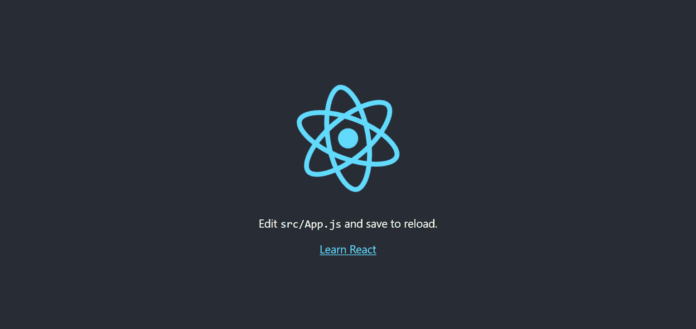
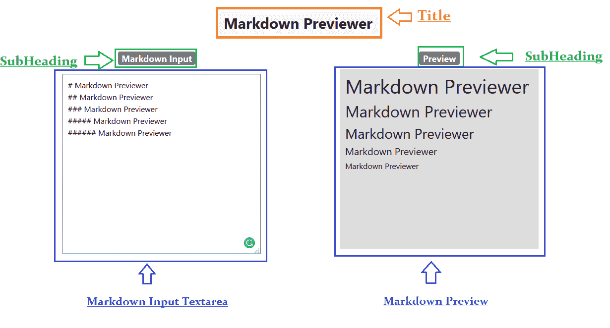
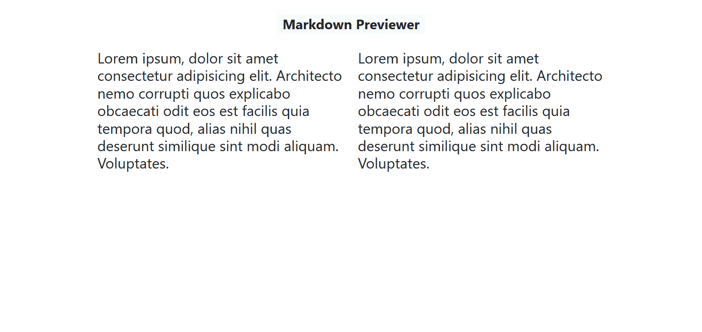

# 如何用 React.js 构建 Markdown 预览器

> 原文：<https://www.freecodecamp.org/news/how-to-build-a-markdown-previewer-with-react-js/>

构建实际项目是学习反应和巩固一些基本原则的好方法。所以在这篇文章中，我们将建立一个简单的降价预览器，就像你在上面的图片中看到的那样。这将是一个简单的 react 应用程序，它将包含一个用于 Markdown 输入的文本区域和一个预览选项卡，其中将显示转换后的文本。

如果你想直接进入代码，请点击这里查看 GitHub Repo:[https://github.com/lelouchB/markdown-previewer/tree/master](https://github.com/lelouchB/markdown-previewer/tree/master)

这里有一个部署版本的链接:[https://markdown-previewer.lelouch-b.now.sh/](https://markdown-previewer.lelouch-b.now.sh/)。

现在让我们开始吧。

## 先决条件

1.  HTML，CSS，Javascript 和 Bootstrap 的知识。
2.  React 的基础知识。
3.  安装在本地开发机器上的节点和 NPM。
4.  您选择的任何代码编辑器。

如果你觉得自己的进步受到了阻碍，因为你对这些科目了解不够，那就去看看 https://www.freecodecamp.org/learn 吧。那里有一些很棒的模块，可以让你立刻开始学习。

## 设置

我们将在`npx create-react-app`的帮助下构建这个应用。**创建 React 应用**是官方支持的创建*单页面 React 应用*的方式。它提供了一个没有配置的现代构建设置。

在您的项目目录中，在终端中运行以下命令:

```
npx create-react-app markdown-previewer
cd markdown-previewer
npm start
```

然后打开 [http://localhost:3000/](http://localhost:3000/) 看你的 app。它看起来会像这样:



http://localhost:3000/

现在，让我们看看这里的**项目结构**:

```
markdown-previewer
├── README.md
├── node_modules
├── package.json
├── .gitignore
├── public
│   ├── favicon.ico
│   ├── index.html
│   ├── logo192.png
│   ├── logo512.png
│   ├── manifest.json
│   └── robots.txt
└── src
    ├── App.css
    ├── App.js
    ├── App.test.js
    ├── index.css
    ├── index.js
    ├── logo.svg
    └── serviceWorker.js
```

Project Structure

没有配置或复杂的文件夹结构-只有你需要建立你的应用程序的文件。

现在，在我们继续之前，让我们清理这些文件:

1.  删除`index.css`和`App.css`。
2.  由于我们已经删除了`index.css`和`App.css`，所以分别从`index.js`和`App.js`中删除`import './index.css';`和`import './App.css';`。
3.  删除`logo.svg`并移除`App.js`中的`import logo from './logo.svg';`。
4.  在`App.js`内部移除功能`App()`。我们将导出一个类组件，而不是一个功能组件。所以，把`App.js`改成这样:

```
import React from 'react';

export default class App extends React.Component{
render(){
  return (
    <div className="App">

    </div>
  );}
} 
```

App.js 

前往 [http://localhost:3000](http://localhost:3000) ，现在它将是空白的。

## 设计

但是在我们开始之前还有一件事…在你开始打字之前有一个你将要建立的计划总是一个好主意。尤其是当您使用 React 构建用户界面时。

我们希望对接口的外观有一些了解，这样我们就可以知道我们需要构建什么组件，以及每个组件将负责处理什么数据。

首先，我已经画了一个关于 markdown-previewer 应用程序的草图。我还标记了我们需要创建的所有组件:



Design

因此，看起来我们需要构建三个主要组件:

1.  **标题和副标题** —这将简单地显示我们的标题和副标题。
2.  **降价输入文本区** —这是我们想要预览的降价将被写入的输入文本区。
3.  **降价预览** —这是一个带有灰色背景的容器，将在其中显示输出。

### 需要注意一些事情:

1.  我们将有一个包含一切的“应用程序”组件。这是一个小项目，所以很容易在一个文件中维护所有组件。但是随着项目规模的增加(例如，当构建一个电子商务平台时)，您必须将组件按照它们的类型分离到不同的文件和文件夹中。
2.  因为这篇文章不是关于 CSS 和设计的，我将使用 [React-Bootstrap](https://react-bootstrap.github.io/) 库和内联样式。关于它们的任何讨论都将保持简短。

### React 中的内联样式

当使用内联样式时，这意味着不是制作单独的 CSS 文件，而是通过将 CSS 属性作为对象传递来设置组件的样式。例如:

```
var divStyle = {
  color: 'white',
  backgroundImage: 'url(' + imgUrl + ')',
  WebkitTransition: 'all', // note the capital 'W' here
  msTransition: 'all' // 'ms' is the only lowercase vendor prefix
};

ReactDOM.render(<div style={divStyle}>Hello World!</div>, document.getElementById("root");
```

Inline Styles

样式键是驼峰式的，以便与从 JS(例如`node.style.backgroundImage`)访问 DOM 节点上的属性保持一致。除了`ms`之外的供应商前缀应该以大写字母开头。这就是为什么`WebkitTransition`有一个大写的“W”。

然后使用`{}`将样式对象传入 DOM 组件。我们可以使用`{}`在我们的`return`方法中运行 Javascript 代码。

## 密码

好了，是时候开始写代码了！如果你在任何时候遇到困难，可以在这里随意查阅已经完成的应用程序:[https://github.com/lelouchB/markdown-previewer/tree/master](https://github.com/lelouchB/markdown-previewer/tree/master)和[https://markdown-previewer.lelouch-b.now.sh/](https://markdown-previewer.lelouch-b.now.sh/)

### 安装依赖项

让我们从安装项目依赖项开始。在项目目录中，运行以下命令:

```
npm install react-bootstrap bootstrap 
npm install marked
```

Installing Dependicies

现在，让我们来讨论它们:

1.  第一个命令安装 [React-Bootstrap](https://react-bootstrap.github.io/getting-started/introduction) 和 Bootstrap，我们将使用它们来设计我们的项目。
2.  第二个命令安装 [Marked.js](https://marked.js.org) ，这是一个低级的 markdown 编译器，用于解析 markdown，无需长时间缓存或阻塞。这将运行转换降价背后的实际逻辑。

在我们开始在项目中使用 React-Bootstrap 之前，我们必须将缩小的 bootstrap CSS 文件添加到我们的`index.js`:

```
import '../node_modules/bootstrap/dist/css/bootstrap.min.css'; 
```

至此，依赖项已经安装完毕，可以使用了。

### 标题


我们的第一个任务是给 React 应用添加一个标题，并居中对齐。为此，我们将使用[标记](https://react-bootstrap.github.io/components/badge/)，它是 React-Bootstrap 库的一个组件。以下是实现这一点的步骤:

1.  将徽章导入到`App.js`。在`App.js`内添加以下内容:

```
import Badge from "react-bootstrap/Badge"; 
```

2.在`App.js`内回程中，在带`className="App"`的`div`下，再增加一个带`className="container"`的`div`。

```
import React from "react";
import Badge from "react-bootstrap/Badge";

export default class App extends React.Component {
  render() {
    return (
      <div className="App">
        <div className="container">

        </div>
      </div>
    );
  }
} 
```

3.接下来在带有`className="container"`的 div 中，我们将添加如下标题:

```
 <h1>
 <Badge className="text-align-center" variant="light">
 Markdown Previewer
</Badge>
 </h1>
```

4.你现在可以在 [http://localhost:3000](http://localhost:3000) 看到一个标题，但是没有居中。为了使标题居中，我们将使用 bootstrap 并将上面的代码块放在两个 div 中。

```
<div className="row mt-4">
  <div className="col text-center">
    <h1>
     <Badge className="text-align-center" variant="light">
        Markdown Previewer
     </Badge>
    </h1>
  </div>
</div>
```

Heading

因此，我们在应用程序中添加了一个标题。

### 副标题

如果你看看我们上面讨论的设计，你会发现下一步是添加两列，副标题分别是**降价输入**和**预览。**一个包含输入文本区，另一个包含预览。

1.  首先，我们必须创建两个并排放置在我们的应用程序列。我们将使用 bootstrap 来实现这一点。在 div 容器内，添加以下内容:

```
 <div className="row mt-4">
  <div className="col-md-6">
    <h2>Lorem Ipsum</h2>
  </div>

  <div className="col-md-6">
    <h2>Lorem Ipsum</h2>
  </div>
</div>; 
```

我现在使用 Lorem Ipsum，下一步将删除它。使用 bootstrap 类创建列，带有`className="row mt-4"`的第一个`div`创建一个**行**。`m`表示`margin`。`t`表示`top`。另外两个带有`className="col-md-6"`的`div`创建**两列**。

该应用程序现在看起来像这样。



2.下一步是给这些列添加标题，并使它们居中对齐。这可以通过在徽章中添加一个带有 className="col text-center "的 div 来实现，添加到带有`className="col-md-6"`的两个 div 中。

```
<div className="col text-center">
  <h1>
    <Badge className="text-align-center" variant="light">
    // Actual Sub Heading: This code block will be same for both columns
    </Badge>
  </h1>
</div> 
```

3.您的`App.js`现在看起来像这样: