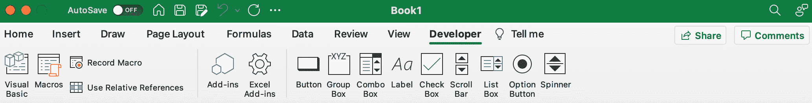
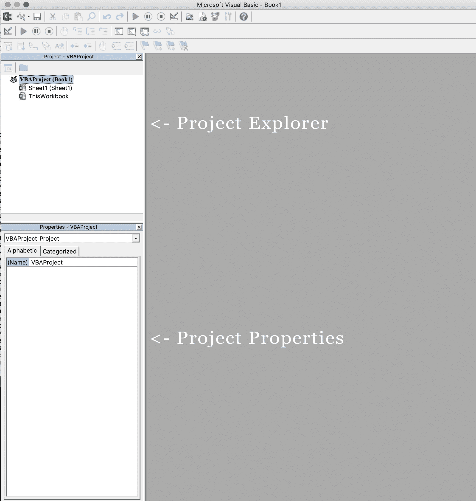
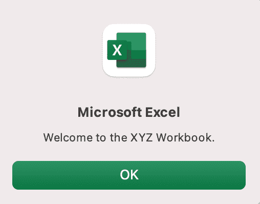
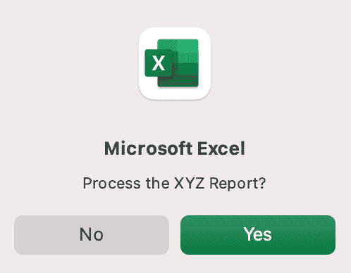
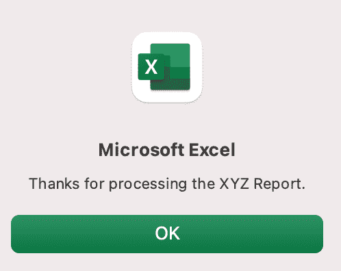
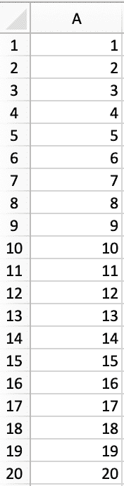

# Excel VBA 教程–如何使用 Visual Basic 在电子表格中编写代码

> 原文：<https://www.freecodecamp.org/news/excel-vba-tutorial/>

# 介绍

这是一个关于使用 Visual Basic for Applications (VBA)在 Excel 电子表格中编写代码的教程。

Excel 是微软最受欢迎的产品之一。2016 年，微软首席执行官说“想象一个没有 Excel 的世界。那对我来说是不可能的。”好吧，也许这个世界没有 Excel 就无法思考。

*   1996 年，微软 Excel 的用户超过 3000 万([来源](https://news.microsoft.com/1996/05/20/more-than-30-million-users-make-microsoft-excel-the-worlds-most-popular-spreadsheet-program/))。
*   今天，估计有 7.5 亿用户使用 Microsoft Excel。这比欧洲的人口多一点，比 1996 年多 25 倍。

我们是一个快乐的大家庭！

在本教程中，您将了解 VBA 以及如何使用 Visual Basic 在 Excel 电子表格中编写代码。

### 先决条件

你不需要任何编程经验来理解本教程。但是，您将需要:

*   对 Microsoft Excel 有基本到中等的熟悉程度
*   如果你想了解本文中 VBA 的例子，你需要使用 Microsoft Excel，最好是最新版本(2019)，但 Excel 2016 和 Excel 2013 也可以。
*   尝试新事物的意愿

### 学习目标

通过本文的学习，您将了解到:

1.  VBA 是什么
2.  为什么你会用 VBA
3.  如何在 Excel 中设置写 VBA
4.  如何用 VBA 解决一些现实世界的问题

### 重要概念

为了全面理解本教程，您应该熟悉以下一些重要概念。

对象:Excel 是面向对象的，这意味着一切都是对象——Excel 窗口、工作簿、表格、图表、单元格。VBA 允许用户在 Excel 中操作和执行对象操作。

如果你没有任何面向对象编程的经验，而且这是一个全新的概念，花一点时间让它深入了解！

**过程**:过程是一段 VBA 代码，用 Visual Basic 编辑器编写，完成一项任务。有时，这也被称为宏(下面有更多关于宏的内容)。有两种类型的程序:

*   子程序:执行一个或多个动作的一组 VBA 语句
*   函数:一组执行一个或多个动作的 VBA 语句，返回一个或多个值

注意:你可以在子程序中运行函数。你以后会明白的。

**宏**:如果你花时间学习更高级的 Excel 功能，你可能会遇到“宏”的概念 Excel 用户可以记录由用户命令/击键/点击组成的宏，并以闪电般的速度回放它们，以完成重复的任务。录制的宏会生成 VBA 代码，您可以检查这些代码。实际上，记录一个简单的宏，然后查看 VBA 代码是非常有趣的。

请记住，有时录制宏可能比手工编写 VBA 程序更容易、更快。

例如，也许你从事项目管理工作。每周一次，你必须将从项目管理系统导出的原始报告转换成格式精美、干净的报告，以供领导使用。您需要用红色粗体字格式化超预算项目的名称。您可以将格式更改记录为宏，并在需要更改时运行该宏。

# 什么是 VBA？

Visual Basic for Applications 是微软开发的一种编程语言。微软办公套件中的每个软件程序都免费捆绑了 VBA 语言。VBA 允许 Microsoft Office 用户创建在 Microsoft Office 软件程序中运行的小程序。

把 VBA 想象成餐馆里的披萨烤箱。Excel 是餐厅。厨房配有标准的商用电器，如大型冰箱、炉子和普通的 ole '烤箱——这些都是 Excel 的标准功能。

但是如果你想做木火披萨呢？在标准的商用烤箱里是做不到的。VBA 是披萨烤箱。

好吃。

# 为什么在 Excel 中使用 VBA？

因为木火披萨最好吃！

但是说真的。

作为工作的一部分，许多人在 Excel 中花费了大量的时间。Excel 中的时间也有不同的变化。根据不同的情况，如果你不能做你需要做的事情，在 Excel 中的 10 分钟可能感觉像是永恒，或者如果一切顺利，10 个小时可能过得很快。这时候你应该问问自己，**我到底为什么要花 10 个小时在 Excel 上？**

有时候，那些日子是不可避免的。但是，如果你每天花 8-10 个小时在 Excel 中做重复的任务，重复许多相同的过程，试图在其他用户之后清理文件，甚至在 Excel 文件发生变化后更新其他文件，VBA 程序可能就是你的解决方案。

如果需要，您应该考虑使用 VBA:

*   自动化重复性任务
*   为用户创建与您的电子表格交互的简单方式
*   处理大量数据

# 在 Excel 中编写 VBA 的准备工作

## 开发者标签

要编写 VBA，您需要将“开发人员”选项卡添加到功能区，因此您将看到这样的功能区。

要将“开发人员”选项卡添加到功能区:

1.  在文件选项卡上，转到选项>自定义功能区。
2.  在“自定义功能区”和“主选项卡”下，选中“开发人员”复选框。

显示该选项卡后，除非清除复选框或必须重新安装 Excel，否则“开发人员”选项卡将保持可见。有关详细信息，请参阅 Microsoft 帮助文档。

## VBA 编辑

导航到“开发人员”选项卡，然后单击“Visual Basic”按钮。一个新的窗口将会弹出-这是 Visual Basic 编辑器。出于本教程的目的，您只需熟悉项目浏览器窗格和特性属性窗格。

# Excel VBA 示例

首先，让我们创建一个文件供我们在其中玩耍。

1.  打开新的 Excel 文件
2.  将其保存为启用宏的工作簿(。xlsm)
3.  选择开发人员选项卡
4.  打开 VBA 编辑器

让我们用一些简单的例子来指导您使用 Visual Basic 在电子表格中编写代码。

## 示例 1:当用户打开 Excel 工作簿时显示一条消息

在 VBA 编辑器中，选择插入->新建模块

将这段代码写在模块窗口中(不要粘贴！):

MsgBox("欢迎使用 XYZ 工作簿。")
结束短接

保存，关闭工作簿，然后重新打开工作簿。应该会显示此对话框。

哒哒！

### 它是怎么做到的？

根据你对编程的熟悉程度，你可能会有一些猜测。这并不特别复杂，但是有很多事情要做:

*   sub(Subroutine 的缩写):从头开始记住，执行一个或多个动作的一组 VBA 语句。"
*   Auto_Open:这是特定的子程序。当 Excel 文件打开时，它会自动运行您的代码——这是触发该过程的事件。Auto_Open 仅在手动打开工作簿时运行；如果该工作簿是通过另一个工作簿中的代码打开的，它将不会运行(Workbook_Open 会这样做，[了解有关两者之间的差异的更多信息](https://www.pcreview.co.uk/threads/auto_open-vs-workbook_open.953960/ ))。
*   默认情况下，子例程的访问是公共的。这意味着任何其他模块都可以使用这个子程序。本教程中的所有例子都是公共子程序。如果需要，您可以将子例程声明为私有的。这在某些情况下可能是需要的。了解更多关于子程序访问修饰符的信息。
*   msgBox:这是一个函数——一组执行一个或多个动作并返回值的 VBA 语句。返回值是消息“欢迎使用 XYZ 工作簿”

简而言之，这是一个包含函数的简单子例程。

### 我什么时候可以用这个？

也许您有一个非常重要的文件，该文件很少被访问(比如说，一个季度一次)，但是每天都会被另一个 VBA 程序自动更新。当它被访问时，会被整个公司多个部门的许多人访问。

*   问题:大部分时候用户在访问文件的时候，对这个文件的用途(为什么存在)，怎么更新这么频繁，谁维护它，以及应该如何与它交互感到困惑。新员工总是有很多问题，你必须一遍又一遍地回答这些问题。
*   解决方案:创建一条用户消息，其中包含对这些常见问题的简明回答。

### 真实世界的例子

*   使用 MsgBox 函数在发生任何事件时显示消息:用户关闭 Excel 工作簿、用户打印、新工作表添加到工作簿等。
*   当用户需要在关闭 Excel 工作簿之前满足某个条件时，使用 MsgBox 函数显示一条消息
*   使用 InputBox 函数从用户处获取信息

## 示例 2:允许用户执行另一个过程

在 VBA 编辑器中，选择插入->新建模块

将这段代码写在模块窗口中(不要粘贴！):

sub usereportquery()
Dim user input As Long
Dim Answer As Integer
user input = vbYesNo
Answer = MsgBox("处理 XYZ 报告？"，用户输入)
如果答案= vbYes，则处理报告
结束子

MsgBox("感谢您处理 XYZ 报告。")
结束短接

保存并导航回 Excel 的开发人员选项卡，然后选择“按钮”选项。单击一个单元格，并将 UserReportQuery 宏分配给该按钮。

现在点击按钮。该消息应显示:

单击“是”或按回车键。

再一次，tada！

请注意，第二个子例程 ProcessReport 可以是*任何东西*。我将在例 3 中展示更多的可能性。但是首先...

### 它是怎么做到的？

这个例子建立在前一个例子的基础上，并有相当多的新元素。让我们复习一下新的内容:

*   Dim UserInput As Long: Dim 是“dimension”的缩写，允许您声明变量名。在这种情况下，UserInput 是变量名，Long 是数据类型。用简单的英语来说，这一行意味着“这里有一个名为“UserInput”的变量，它是一个长变量类型。”
*   Dim Answer As Integer:声明另一个名为“Answer”的变量，数据类型为 Integer。在此了解有关数据类型的更多信息。
*   UserInput = vbYesNo:为变量赋值。在本例中，vbYesNo 显示“是”和“否”按钮。*按钮种类繁多*，[在这里了解更多](https://docs.microsoft.com/en-us/office/vba/language/reference/user-interface-help/msgbox-function)。
*   Answer = MsgBox("处理 XYZ 报告？"，UserInput):将变量 Answer 的值指定为 MsgBox 函数和 UserInput 变量。是的，变量中的变量。
*   If Answer = vbYes Then ProcessReport:这是一个“If 语句”，一个条件语句，它允许我们说如果 x 为真，则执行 y，在这种情况下，如果用户选择了“Yes”，则执行 process report 子例程。

### 我什么时候可以用这个？

这可以用在很多很多方面。这种功能的价值和多功能性更多地是由第二个子例程所定义的。

例如，您可能有一个用于生成 3 个不同的每周报告的文件。这些报告的格式截然不同。

*   问题:每次需要生成这些报告时，用户打开文件并更改格式和图表；如此等等。该文件每周至少被广泛编辑 3 次，每次编辑至少需要 30 分钟。
*   解决方案:为每种报告类型创建一个按钮，它会自动重新格式化报告的必要组件，并生成必要的图表。

### 真实世界的例子

*   为用户创建一个对话框，以便在多个工作表中自动填充某些信息
*   使用 InputBox 函数从用户处获取信息，然后在多个工作表中填充这些信息

## 示例#3:用 For-Next 循环将数字添加到范围中

如果您需要对特定范围的值(数组或单元格区域)执行重复的任务，For 循环非常有用。用简单的英语来说，一个循环表示“对每个 x，做 y。”

在 VBA 编辑器中，选择插入->新建模块

将这段代码写在模块窗口中(不要粘贴！):

sub loop example()
Dim X As Integer
For X = 1 到 100
范围(" A" & X)。Value = X
Next X
End Sub

保存并导航回 Excel 的“开发人员”选项卡，然后选择“宏”按钮。运行 LoopExample 宏。

这应该发生:

等等，直到第 100 行。

### 它是怎么做到的？

*   Dim X As Integer:将变量 X 声明为 Integer 的数据类型。
*   对于 X = 1 到 100:这是 For 循环的开始。简单地说，它告诉循环一直重复，直到 X = 100。x 是*计数器*。循环将一直执行到 X = 100，最后执行一次，然后停止。
*   范围(" A" & X)。Value = X:这声明了循环的范围以及在这个范围内应该放什么。由于最初 X = 1，第一个单元格将是 A1，此时循环将把 X 放入该单元格。
*   下一个 X:这告诉循环再次运行

### 我什么时候可以用这个？

For-Next 循环是 VBA 最强大的功能之一；有许多潜在的使用案例。这是一个更复杂的例子，需要多层逻辑，但它在 For-Next 循环中传达了各种可能性。

也许您在 A 列中有您的面包店出售的所有产品的列表，在 B 列中有产品的类型(蛋糕、甜甜圈或松饼)，在 C 列中有配料的成本，在另一个表中有每种产品类型的市场平均成本。

你需要算出每种产品的零售价应该是多少。你在想应该是配料成本加 20%，但如果可能的话，也要比市场平均水平低 1.2%。For-Next 循环将允许您进行这种类型的计算。

### 真实世界的例子

*   使用带有嵌套 if 语句的循环，仅当特定值满足特定条件时，才将它们添加到单独的数组中
*   对一个范围内的每个值执行数学计算，例如，计算附加费用并将它们添加到该值中
*   遍历字符串中的每个字符并提取所有数字
*   从数组中随机选择一些值

# 结论

既然我们已经讨论了比萨饼和松饼，以及如何在 Excel 电子表格中编写 VBA 代码，让我们来做一个学习检查。看看你能不能回答这些问题。

*   什么是 VBA？
*   如何开始在 Excel 中使用 VBA？
*   为什么以及什么时候你会使用 VBA？
*   我能和 VBA 解决哪些问题？

如果你知道如何回答这些问题，那么这就是成功的。

无论您是临时用户还是高级用户，我希望本教程提供了有用的信息，告诉您在 Excel 电子表格中只需一点代码就可以完成什么。

编码快乐！

## 学习资源

*   Excel VBA 编程的傻瓜，约翰沃肯巴赫
*   [VBA 入门，微软文档](https://docs.microsoft.com/en-us/office/vba/library-reference/concepts/getting-started-with-vba-in-office)
*   [在 Excel 中学习 VBA，琳达](https://www.lynda.com/Excel-tutorials/Learning-VBA-Excel/802840-2.html?srchtrk=index%3a5%0alinktypeid%3a2%0aq%3avba%0apage%3a1%0as%3arelevance%0asa%3atrue%0aproducttypeid%3a2)

## 关于我的一点

我是克洛伊·塔克，俄勒冈州波特兰市的艺术家和开发者。作为一名前教育工作者，我一直在寻找学习和教学，或者技术和艺术的交集。请在 Twitter 上联系我 [@_chloetucker](https://twitter.com/_chloetucker) 并查看我的网站 [chloe.dev](https://chloe.dev/) 。