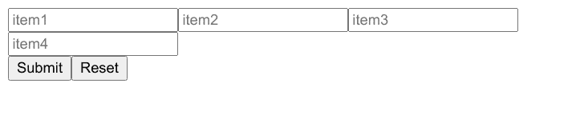
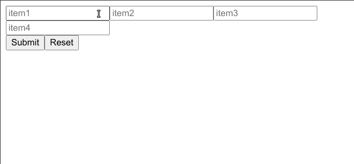
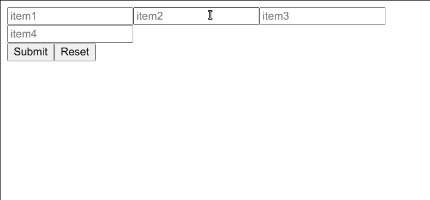

# 如何清除 React 中动态表单的输入值

> 原文：<https://www.freecodecamp.org/news/how-to-clear-input-values-of-dynamic-form-in-react/>

在使用 React 应用程序时，有很多事情需要考虑，尤其是当它们涉及到表单时。即使你能够创建一个提交按钮，并按照你想要的方式更新你的应用程序的状态，清除表单也是很困难的。

假设您的应用程序有这样的动态表单:

```
import React from "react";
import ReactDOM from "react-dom";
import Cart from "./Cart";

import "./styles.css";

class App extends React.Component {
  constructor(props) {
    super(props);
    this.state = {
      Items: [
        {
          name: "item1",
          description: "item1",
          group: "groupA",
          dtype: "str"
        },
        {
          name: "item2",
          description: "item2",
          group: "groupA",
          dtype: "str"
        },
        {
          name: "item3",
          description: "item3",
          group: "groupB",
          dtype: "str"
        },
        {
          name: "item4",
          description: "item4",
          group: "groupB",
          dtype: "str"
        }
      ],
      itemvalues: [{}]
    };
    this.onChangeText = this.onChangeText.bind(this);
    this.handleReset = this.handleReset.bind(this);
    this.handleSubmit = this.handleSubmit.bind(this);
    this.findFieldIndex = this.findFieldIndex.bind(this);
    this.trimText = this.trimText.bind(this);
  }

  onChangeText = e => {
    const valuesCopy = [...this.state.itemvalues];
    //debugger;

    // get data-group value
    const itemvalue = e.target.dataset.group;

    if (!valuesCopy[0][itemvalue]) {
      valuesCopy[0][itemvalue] = [];
    }

    const itemvalues = valuesCopy[0][itemvalue];
    const index = this.findFieldIndex(itemvalues, e.target.name);

    if (index < 0) {
      valuesCopy[0][itemvalue] = [
        ...itemvalues,
        { [e.target.name]: e.target.value.split(",").map(this.trimText) }
      ];
    } else {
      // update the value
      valuesCopy[0][itemvalue][index][e.target.name] = e.target.value
        .split(",")
        .map(this.trimText);
    }

    // console.log(itemsCopy);

    this.setState({ itemvalues: valuesCopy });
  };
  findFieldIndex = (array, name) => {
    return array.findIndex(item => item[name] !== undefined);
  };
  trimText(str) {
    return str.trim();
  }

  handleReset = () => {
    this.setState({
      itemvalues: [{}]
    });
  };

  handleSubmit = () => {
    console.log(this.state.itemvalues);
  };

  render() {
    return (
      <Cart
        Items={this.state.Items}
        handleSubmit={this.handleSubmit}
        handleReset={this.handleReset}
        onChangeText={this.onChangeText}
      />
    );
  }
}

ReactDOM.render(<App />, document.getElementById("root")); 
```

index.js

```
import React from "react";
import Form from "./Form";

const Cart = props => {
  return (
    <div>
      <Form Items={props.Items} onChangeText={props.onChangeText} />

      <button onClick={props.handleSubmit}>Submit</button>
      <button onClick={props.handleReset}>Reset</button>
    </div>
  );
};

export default Cart; 
```

Cart.js

```
import React from "react";

const Form = props => {
  return (
    <div>
      {props.Items.map((item, index) => (
        <input
          name={item.name}
          placeholder={item.description}
          data-type={item.dtype}
          data-group={item.group}
          onChange={e => props.onChangeText(e)}
          key={index}
        />
      ))}
    </div>
  );
};
export default Form; 
```

Form.js

简单的输入框呈现在页面上:



当用户在其中一个输入框中输入文本时，文本会保存到应用程序状态中，如下所示:

```
Itemvalues:
  0:
    groupA: 
            item1: itemvalue1
            item2: itemvalue2
    groupB: 
            item3: itemvalue3
            item4: itemvalue4
```

这很复杂，但你成功做到了。

在`handleReset`中，当按下“复位”按钮时，您可以将`itemvalues`设置回零状态:

```
handleReset = () => {
  this.setState({
    itemvalues: [{}]
  });
};
```

但问题是文本并没有从所有的输入框中清除:



您已经在状态中存储了实际的文本，所以这里有一个简单的方法来清除所有输入框中的文本。

## 如何清除所有输入的值

在`handleReset`的顶部，使用`document.querySelectorAll('input')`选择页面上的所有输入元素:

```
handleReset = () => {
  document.querySelectorAll('input');
  this.setState({
    itemvalues: [{}]
  });
};
```

`document.querySelectorAll('input')`返回一个`NodeList`，和数组有点不一样，不能对它使用任何有用的数组方法。

要将其转换为数组，请将`document.querySelectorAll('input')`传递给`Array.from()`:

```
handleReset = () => {
  Array.from(document.querySelectorAll('input'));
  this.setState({
    itemvalues: [{}]
  });
};
```

现在您所要做的就是遍历每个输入并将它的`value`属性设置为一个空字符串。`forEach`方法是一个很好的选择:

```
handleReset = () => {
  Array.from(document.querySelectorAll("input")).forEach(
    input => (input.value = "")
  );
  this.setState({
    itemvalues: [{}]
  });
};
```

现在，当用户按下“重置”按钮时，每个输入的值也会被清除:

