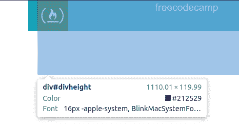

# 引导行高

> 原文：<https://www.freecodecamp.org/news/bootstrap-row-height/>

Bootstrap 是启动项目最快的方法之一。该库包括许多有用的 CSS 实用程序类，可以快速启动和运行响应迅速的移动优先布局。

但是，如果您开始添加自己的 CSS 规则，但它们似乎对布局没有任何影响，该怎么办呢？是自举改写了你的风格吗？还是别的？

例如，假设您想要增加一行的高度，并调整大小和图像。

这是您的 HTML:

```
<div class="container">
  <div id="divheight">
    <div class="row bg-info text-white">
      <div class="col-sm-2 align-middle">
        
      </div>
      <div class="col-sm-3 align-middle">
        <label>freecodecamp</label>
      </div>
      <div class="col-sm-7 align-middle">
        <label>Greg working on Electron-Vue boilerplate w/ Akira #programming #vuejs #electron</label>
      </div>
    </div>
  </div>
</div>
```

和 CSS:

```
#divheight {
  heights: 120px;
}

img {
  width: 50px;
  height: 50px;
} 
```

问题是，出于某种原因，行的高度像图像一样是 50px，而不是 120px:


## 解决办法

发生这种情况有几个原因。第一，你注意到上面的错别字了吗？

解决这个问题，你的 CSS 将如下所示:

```
#divheight {
  height: 120px;
}

img {
  width: 50px;
  height: 50px;
}
```

但是你的行仍然不是 120px。如果你检查`#divheight`，你会看到它刚好低于 120px:



不是以`#divheight`为目标，而是向下到下一个`div`元素，并以类`row`为目标:

```
.row {
  height: 120px;
}

img {
  width: 50px;
  height: 50px;
}
```

那么该行将如您所料为 120px:

