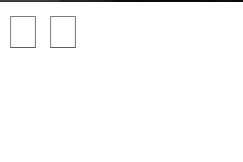

# 如何在 HTML 中使用字体 Awesome v5.7.2

> 原文：<https://www.freecodecamp.org/news/how-to-use-font-awesome-v5-7-2-with-html/>

字体牛逼是给你的网站添加图标最流行的方式之一。但是如果你将 CDN 添加到页面的`<head>`元素中，而你看到的只是黑色的矩形，那该怎么办呢？



当你在下一个项目中添加字体时，请记住以下几点。

### 将链接添加到标题

假设您有以下 HTML:

```
<!DOCTYPE html>
<html>
<head>
	<title></title>
	<link rel="stylesheet" type="text/css" href="testing.css">
	<link rel="stylesheet" type="text/css" href="css/all.css">
	<meta name="viewport" content="width=device-width, initial-scale=1 user-scalable=no">
</head>
<body>
	<i class="fab fa-github-square"><a href="https://github.com/willyblackkeez" id="profile-link"></a></i>
	<i class="fab fa-facebook"></i>
</body>
</html>
```

像其他 cdn 一样，您需要在`<head>`中添加一个`<link>`元素。对于字体 Awesome 5.7.2，它看起来像这样:

`<link rel="stylesheet" href="//use.fontawesome.com/releases/v5.0.7/css/all.css">`

### 在线与本地

如果您在基于 web 的编辑器(如 CodePen 或 CodeSandbox)中运行以下代码，以下代码会正确呈现图标:

```
<!DOCTYPE html>
<html>
<head>
	<title></title>
    <link rel="stylesheet" href="//use.fontawesome.com/releases/v5.0.7/css/all.css">
	<link rel="stylesheet" type="text/css" href="testing.css">
	<link rel="stylesheet" type="text/css" href="css/all.css">
	<meta name="viewport" content="width=device-width, initial-scale=1 user-scalable=no">
</head>
<body>
	<i class="fab fa-github-square"><a href="https://github.com/willyblackkeez" id="profile-link"></a></i>
	<i class="fab fa-facebook"></i>
</body>
</html>
```

但是，如果您尝试在浏览器中本地打开该页面，您仍然会看到黑色矩形，而不是图标:


再看一下上面的`<link>`元素中的`href`。你看到了吗？

问题是，当您从本地文件系统加载页面时，浏览器试图在文件系统的根目录下找到字体 Awesome CSS 文件。

为了让事情在网上和本地工作，确保将 URL 方案(HTTP，或者更好，HTTPS)添加到`href`:

`<link rel="stylesheet" href="https://use.fontawesome.com/releases/v5.0.7/css/all.css">`

### 这是怎么回事？

当您关闭 URL 方案(`href="//use.fontawesome..."`)时，浏览器将使用加载页面时使用的相同 URL 方案。

因此，如果您通过在浏览器中运行 HTML 文件来本地运行页面，`href`假定字体 Awesome CSS 也是一个本地保存的文件(`file:`)。

只要确保您的`<link>`元素的`href`属性都指向完整的 URL，包括 URL 方案，您就可以开始了。