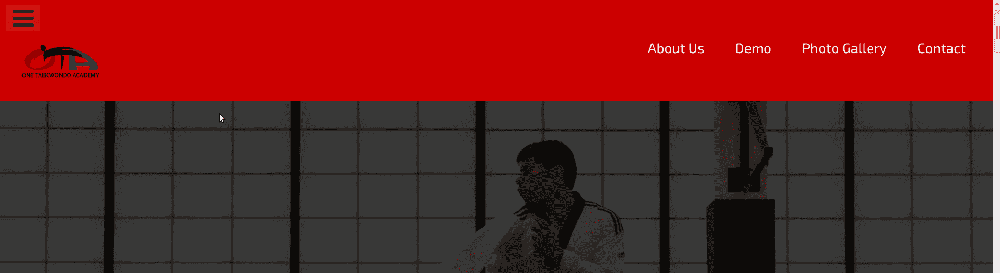

# 如何在我的视窗顶部保持一个导航条？

> 原文：<https://www.freecodecamp.org/news/how-to-keep-a-navbar-at-the-top-of-my-viewport/>

如果你正在做[产品登陆页面](https://www.freecodecamp.org/learn/responsive-web-design/responsive-web-design-projects/build-a-product-landing-page)项目，并且在一些用户故事上有困难，你并不孤单。

用户故事#13 给很多人带来了麻烦。上面写着:

> 导航栏应该总是在视窗的顶部。

### 非固定的普通导航条

假设您有以下 HTML:

```
...
<header id="header">
  
  <nav id="nav-bar">
    <ul> 
      <li><a href="#about-us" class="nav-link">About Us</a></li>
      <li><a href="#videos" class="nav-link">Demo</a></li>
      <li><a href="#photos" class="nav-link">Photo Gallery</a></li>
      <li><a href="#contact-us" class="nav-link">Contact</a></li>
  </nav>
</header>
...
```

但是当你向下滚动页面时，导航条最终会离开视图:



### 如何创建固定的导航栏

要创建一个固定的导航条，或者创建一个即使你向下滚动页面也总是在视窗顶部的导航条，你需要做一些事情。

首先，将标题作为目标，并按照以下规则将其固定到页面上:

```
header {
  position: fixed;
}
```

您会注意到 navbar 收缩到其默认宽度，因此将其宽度设置为页面的全宽:

```
header {
  position: fixed;
  width: 100%;
}
```

根据其他元素的`display`属性，您可能需要手动设置导航栏的`top`和`left`位置:

```
header {
  position: fixed;
  width: 100%;
  top: 0;
  left: 0;
}
```

然后你需要做的就是应用一些额外的样式来让事情看起来更好:

```
header {
  position: fixed;
  width: 100%;
  top: 0;
  left: 0;
  background-color: #cc0000;
  color: white;
  font-family: 'Exo 2', sans-serif;
  padding: 1em;
}
```

### 固定导航条—结果

之后，即使你向下滚动页面，你的导航条应该仍然可见:

