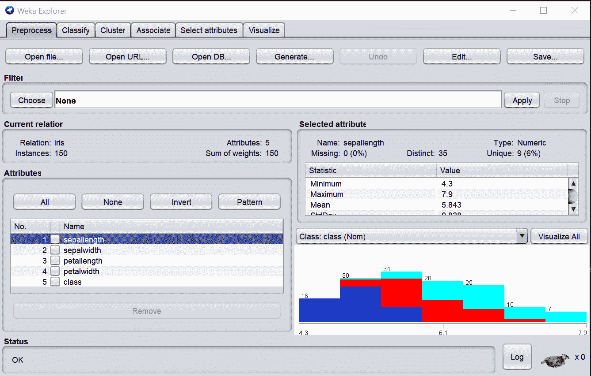
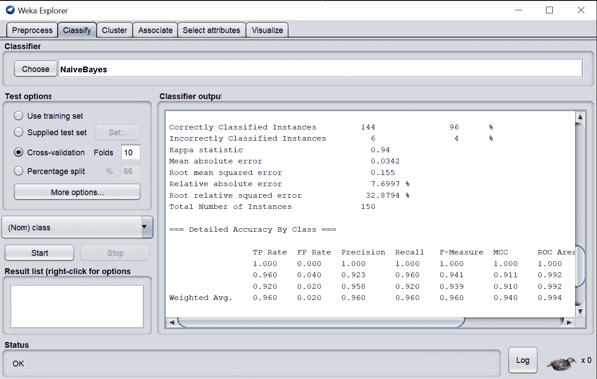

# Weka 教程——基于图形用户界面的 Java 机器学习

> 原文：<https://www.freecodecamp.org/news/machine-learning-using-weka/>

如今，Python 和 R 等编程语言无疑是数据科学和机器学习领域最受欢迎的语言之一。

但是，在不一定精通编码的情况下，也有可能执行常见的机器学习和数据科学任务吗？

当然是啦！Weka 是一个基于图形用户界面的开源软件包。只需使用图形界面，就可以使用它来执行常见的数据科学任务。

## 基础

按照以下[链接](https://waikato.github.io/weka-wiki/downloading_weka/)中的说明，Weka 可以轻松安装在任何类型的平台上。唯一的先决条件是在本地机器上安装 Java 8.0。

一旦安装了 Weka，您将拥有一套标准的数据处理和推理技术，例如:

*   **数据预处理**:一旦你加载了一个数据集，Weka 可以让你快速浏览它的属性和实例。此外，不同的过滤技术也是可用的，例如，将分类数据转换为数字数据或执行[特征选择](https://towardsdatascience.com/feature-selection-techniques-1bfab5fe0784)，以降低数据集的维度(例如，加快训练时间和性能)。
*   **分类和回归算法:**不同算法的集合，如高斯朴素贝叶斯、决策树、K-最近邻、集成技术和各种线性回归变量。
*   **聚类:**这种技术可以用来以无监督的方式识别我们数据中的主要类别。Weka 集合中可用的一些示例算法是 K 均值聚类和期望最大化。
*   **发现关联:**在我们的数据集中发现规则，以便更容易地识别不同特征之间的模式和联系。
*   **数据可视化:**一套集成的数据可视化技术，可以快速可视化特征之间的相关性，并表示已学习的机器学习模式，如决策树和 K-Means 聚类。

Weka 的另一个有趣的特性是能够在创建新的包时安装它们。

可以安装的附加软件包的一个例子是 AutoML。事实上，AutoML 对于初学者来说特别有用，他们可能会发现很难确定哪种机器学习模型最适合用于特定的任务。

使用 Weka AutoML 包，您可以轻松地动态测试不同的机器学习模型。它还允许您自动调整其[超参数](https://towardsdatascience.com/hyperparameters-optimization-526348bb8e2d)以提高性能。

最后，对于更多的专家用户，Weka 还提供了一个命令行界面来使用 Java 代码。这在处理大量数据时尤其有用。

## 例子

我们现在将通过一个简单的例子来演示如何开始使用 Weka。

首先，我们可以通过打开 Weka Explorer 并打开我们的数据集(在本例中是 Iris 数据集)来开始我们的分析。

Figure 1: Importing and Visualising the data

选择 Classify 选项卡，选择 Naive Bayes 作为我们的分类器，然后单击 start。你会看到我们不用写任何代码就能快速达到 96%的分类准确率！

Figure 2: Naive Bayes Classification Results

## 结论

如果你正在寻找更多关于如何开始使用 Weka 的信息，Google 开发者的这个 YouTube 系列是一个很好的起点。

### 联系我

如果你想了解我最新的文章和项目，[通过媒体](https://medium.com/@pierpaoloippolito28?source=post_page---------------------------)关注我，并订阅我的[邮件列表](http://eepurl.com/gwO-Dr?source=post_page---------------------------)。以下是我的一些联系人详细信息:

*   [Linkedin](https://uk.linkedin.com/in/pier-paolo-ippolito-202917146?source=post_page---------------------------)
*   [个人博客](https://pierpaolo28.github.io/blog/?source=post_page---------------------------)
*   [个人网站](https://pierpaolo28.github.io/?source=post_page---------------------------)
*   [中等轮廓](https://towardsdatascience.com/@pierpaoloippolito28?source=post_page---------------------------)
*   [GitHub](https://github.com/pierpaolo28?source=post_page---------------------------)
*   [卡格尔](https://www.kaggle.com/pierpaolo28?source=post_page---------------------------)

来自本文的封面照片[。](https://www.techiexpert.com/list-of-data-mining-tools/)