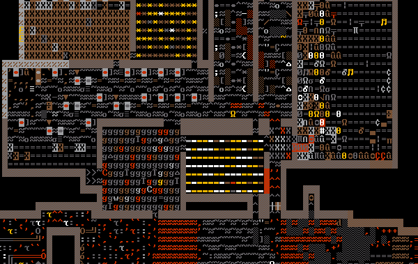

# Alt 代码–如何使用 Alt 键在 Windows 上键入特殊字符和键盘符号

> 原文：<https://www.freecodecamp.org/news/alt-codes-special-characters-keyboard-symbols-windows-list/>

在 Windows 中，您可以通过按住 ALT 键，键入一系列数字，然后释放 ALT 键来键入任何想要的字符。

您可以键入许多可能在键盘上没有对应键的字符，例如欧洲语言字母字符、ASCII 符号，甚至汉字(也称为汉字、日本汉字或韩国汉字)。

如果您的键盘有卡住或丢失的键，这些 Alt 代码也很有帮助。

下面我将按类别分解 alt 键的整个列表。但首先，这是完整的名单。(注意:这不包括来自非西欧语言的许多许多字符——否则将有 100，000 个代码长。)

下面是一个很好的 ASCII 格式的表格，列出了最常用的符号和字符。我花了一段时间来组装这些东西，让它们看起来不错。

作为一名开发人员，当我搜索这些代码时，我经常得到基于图像的结果。这些对于有视觉障碍的人来说是不可访问的，并且使得每个人都很难复制粘贴代码。

```
 Alt Code   Symbol  
 ---------- -------- 
  alt 1      ☺       
  alt 2      ☻       
  alt 3      ♥       
  alt 4      ♦       
  alt 5      ♣       
  alt 6      ♠       
  alt 7      •       
  alt 8      ◘       
  alt 9      ○       
  alt 10     ◙       
  alt 11     ♂       
  alt 12     ♀       
  alt 13     ♪       
  alt 14     ♫       
  alt 15     ☼       
  alt 16     ►       
  alt 17     ◄       
  alt 18     ↕       
  alt 19     ‼       
  alt 20     ¶       
  alt 21     §       
  alt 22     ▬       
  alt 23     ↨       
  alt 24     ↑       
  alt 25     ↓       
  alt 26     →       
  alt 27     ←       
  alt 28     ∟       
  alt 29     ↔       
  alt 30     ▲       
  alt 31     ▼       
  alt 32             
  alt 33     !       
  alt 34     "       
  alt 35     #       
  alt 36     $       
  alt 37     %       
  alt 38     &       
  alt 39     '       
  alt 40     (       
  alt 41     )       
  alt 42     *       
  alt 43     +       
  alt 44     ,       
  alt 45     -       
  alt 46     .       
  alt 47     /       
  alt 48     0       
  alt 49     1       
  alt 50     2       
  alt 51     3       
  alt 52     4       
  alt 53     5       
  alt 54     6       
  alt 55     7       
  alt 56     8       
  alt 57     9       
  alt 58     :       
  alt 59     ;       
  alt 60     <       
  alt 61     =       
  alt 62     >       
  alt 63     ?       
  alt 64     @       
  alt 65     A       
  alt 66     B       
  alt 67     C       
  alt 68     D       
  alt 69     E       
  alt 70     F       
  alt 71     G       
  alt 72     H       
  alt 73     I       
  alt 74     J       
  alt 75     K       
  alt 76     L       
  alt 77     M       
  alt 78     N       
  alt 79     O       
  alt 80     P       
  alt 81     Q       
  alt 82     R       
  alt 83     S       
  alt 84     T       
  alt 85     U       
  alt 86     V       
  alt 87     W       
  alt 88     X       
  alt 89     Y       
  alt 90     Z       
  alt 91     [       
  alt 91     [       
  alt 92     \       
  alt 92     \       
  alt 93     ]       
  alt 93     ]       
  alt 94     ^       
  alt 95     _       
  alt 96     `       
  alt 97     a       
  alt 98     b       
  alt 99     c       
  alt 100    d       
  alt 101    e       
  alt 102    f       
  alt 103    g       
  alt 104    h       
  alt 105    i       
  alt 106    j       
  alt 107    k       
  alt 108    l       
  alt 109    m       
  alt 110    n       
  alt 111    o       
  alt 112    p       
  alt 113    q       
  alt 114    r       
  alt 115    s       
  alt 116    t       
  alt 117    u       
  alt 118    v       
  alt 119    w       
  alt 120    x       
  alt 121    y       
  alt 122    z       
  alt 123    {       
  alt 124    |       
  alt 125    }       
  alt 126    ~       
  alt 127    ⌂       
  alt 155    ¢       
  alt 156    £       
  alt 157    ¥       
  alt 158    ₧       
  alt 159    ƒ       
  alt 164    ñ       
  alt 165    Ñ       
  alt 166    ª       
  alt 167    º       
  alt 168    ¿       
  alt 169    ®       
  alt 170    ¬       
  alt 171    ½       
  alt 172    ¼       
  alt 173    ¡       
  alt 174    «       
  alt 175    »       
  alt 176    ░       
  alt 177    ▒       
  alt 178    ▓       
  alt 179    │       
  alt 180    ┤       
  alt 181    ╡       
  alt 182    ╢       
  alt 183    ╖       
  alt 184    ╕       
  alt 185    ╣       
  alt 186    ║       
  alt 187    ╗       
  alt 188    ╝       
  alt 189    ╜       
  alt 190    ╛       
  alt 191    ┐       
  alt 192    └       
  alt 193    ┴       
  alt 194    ┬       
  alt 195    ├       
  alt 196    ─       
  alt 197    ┼       
  alt 198    ╞       
  alt 199    ╟       
  alt 200    ╚       
  alt 201    ╔       
  alt 202    ╩       
  alt 203    ╦       
  alt 204    ╠       
  alt 205    ═       
  alt 206    ╬       
  alt 207    ╧       
  alt 208    ╨       
  alt 209    ╤       
  alt 210    ╥       
  alt 211    ╙       
  alt 212    ╘       
  alt 213    ╒       
  alt 214    ╓       
  alt 215    ╫       
  alt 216    ╪       
  alt 217    ┘       
  alt 218    ┌       
  alt 219    █       
  alt 220    ▄       
  alt 221    ▌       
  alt 222    ▐       
  alt 223    ▀       
  alt 224    α       
  alt 225    ß       
  alt 226    Γ       
  alt 227    π       
  alt 228    Σ       
  alt 229    σ       
  alt 230    µ       
  alt 231    τ       
  alt 232    Φ       
  alt 233    Θ       
  alt 234    Ω       
  alt 235    δ       
  alt 236    ∞       
  alt 237    φ       
  alt 238    ε       
  alt 239    ∩       
  alt 240    ≡       
  alt 241    ±       
  alt 242    ≥       
  alt 243    ≤       
  alt 244    ⌠       
  alt 245    ⌡       
  alt 247    ≈       
  alt 248    °       
  alt 249    ·       
  alt 250    ·       
  alt 251    √       
  alt 252    ⁿ       
  alt 254    ■       
  alt 255            
  alt 0128   €       
  alt 0130   ‘       
  alt 0132   „       
  alt 0133   …       
  alt 0134   †       
  alt 0135   ‡       
  alt 0137   ‰       
  alt 0138   Š       
  alt 0139   ‹       
  alt 0140   Π      
  alt 0142   Ž       
  alt 0145   ‘       
  alt 0146   ’       
  alt 0147   “       
  alt 0148   ”       
  alt 0151   —       
  alt 0153   ™       
  alt 0154   š       
  alt 0155   ›       
  alt 0156   œ       
  alt 0158   ž       
  alt 0159   Ÿ       
  alt 0164   ¤       
  alt 0166   ¦       
  alt 0168   ¨       
  alt 0169   ©       
  alt 0175   ¯       
  alt 0178   ²       
  alt 0179   ³       
  alt 0180   ´       
  alt 0183   ·       
  alt 0184   ¸       
  alt 0185   ¹       
  alt 0188   ¼       
  alt 0189   ½       
  alt 0190   ¾       
  alt 0192   À       
  alt 0193   Á       
  alt 0194   Â       
  alt 0195   Ã       
  alt 0196   Ä       
  alt 0197   Å       
  alt 0198   Æ       
  alt 0199   Ç       
  alt 0200   È       
  alt 0201   É       
  alt 0202   Ê       
  alt 0203   Ë       
  alt 0204   Ì       
  alt 0205   Í       
  alt 0206   Ï       
  alt 0207   Ï       
  alt 0208   Ð       
  alt 0210   Ò       
  alt 0211   Ó       
  alt 0212   Ô       
  alt 0213   Õ       
  alt 0214   Ö       
  alt 0215   ×       
  alt 0216   Ø       
  alt 0217   Ù       
  alt 0218   Ú       
  alt 0219   Û       
  alt 0220   Ü       
  alt 0221   Ý       
  alt 0222   Þ       
  alt 0223   ß       
  alt 0224   à       
  alt 0225   á       
  alt 0226   â       
  alt 0227   ã       
  alt 0228   ä       
  alt 0229   å       
  alt 0230   æ       
  alt 0231   ç       
  alt 0232   è       
  alt 0233   é       
  alt 0234   ê       
  alt 0235   ë       
  alt 0236   ì       
  alt 0237   í       
  alt 0238   î       
  alt 0239   ï       
  alt 0240   ð       
  alt 0242   ò       
  alt 0243   ó       
  alt 0244   ô       
  alt 0245   õ       
  alt 0246   ö       
  alt 0247   ÷       
  alt 0248   ø       
  alt 0249   ú       
  alt 0250   û       
  alt 0251   ü       
  alt 0252   ù       
  alt 0253   ý       
  alt 0254   þ       
  alt 0255   ÿ 
```

好的——现在让我们将这个列表按部分分解。

# 表情符号和其他有趣角色的替代代码

前 31 个 alt 代码专用于有趣的字符，如笑脸、箭头和其他常见符号:

```
 Alt Code   Symbol  
 ---------- -------- 
  alt 1      ☺       
  alt 2      ☻       
  alt 3      ♥       
  alt 4      ♦       
  alt 5      ♣       
  alt 6      ♠       
  alt 7      •       
  alt 8      ◘       
  alt 9      ○       
  alt 10     ◙       
  alt 11     ♂       
  alt 12     ♀       
  alt 13     ♪       
  alt 14     ♫       
  alt 15     ☼       
  alt 16     ►       
  alt 17     ◄       
  alt 18     ↕       
  alt 19     ‼       
  alt 20     ¶       
  alt 21     §       
  alt 22     ▬       
  alt 23     ↨       
  alt 24     ↑       
  alt 25     ↓       
  alt 26     →       
  alt 27     ←       
  alt 28     ∟       
  alt 29     ↔       
  alt 30     ▲       
  alt 31     ▼ 
```

# 大写字母、小写字母、数字和键盘符号的 Alt 代码

正如我前面提到的，您可以使用 Alt 代码来键入原本可以在键盘上键入的字符。如果您的某个键盘键无法操作，这将很有帮助。

Alt 代码 32 到 126 专用于这些键。而且没错，Alt 32 是空格符。

```
 Alt Code   Symbol  
 ---------- --------
  alt 32             
  alt 33     !       
  alt 34     "       
  alt 35     #       
  alt 36     $       
  alt 37     %       
  alt 38     &       
  alt 39     '       
  alt 40     (       
  alt 41     )       
  alt 42     *       
  alt 43     +       
  alt 44     ,       
  alt 45     -       
  alt 46     .       
  alt 47     /       
  alt 48     0       
  alt 49     1       
  alt 50     2       
  alt 51     3       
  alt 52     4       
  alt 53     5       
  alt 54     6       
  alt 55     7       
  alt 56     8       
  alt 57     9       
  alt 58     :       
  alt 59     ;       
  alt 60     <       
  alt 61     =       
  alt 62     >       
  alt 63     ?       
  alt 64     @       
  alt 65     A       
  alt 66     B       
  alt 67     C       
  alt 68     D       
  alt 69     E       
  alt 70     F       
  alt 71     G       
  alt 72     H       
  alt 73     I       
  alt 74     J       
  alt 75     K       
  alt 76     L       
  alt 77     M       
  alt 78     N       
  alt 79     O       
  alt 80     P       
  alt 81     Q       
  alt 82     R       
  alt 83     S       
  alt 84     T       
  alt 85     U       
  alt 86     V       
  alt 87     W       
  alt 88     X       
  alt 89     Y       
  alt 90     Z       
  alt 91     [       
  alt 91     [       
  alt 92     \       
  alt 92     \       
  alt 93     ]       
  alt 93     ]       
  alt 94     ^       
  alt 95     _       
  alt 96     `       
  alt 97     a       
  alt 98     b       
  alt 99     c       
  alt 100    d       
  alt 101    e       
  alt 102    f       
  alt 103    g       
  alt 104    h       
  alt 105    i       
  alt 106    j       
  alt 107    k       
  alt 108    l       
  alt 109    m       
  alt 110    n       
  alt 111    o       
  alt 112    p       
  alt 113    q       
  alt 114    r       
  alt 115    s       
  alt 116    t       
  alt 117    u       
  alt 118    v       
  alt 119    w       
  alt 120    x       
  alt 121    y       
  alt 122    z       
  alt 123    {       
  alt 124    |       
  alt 125    }       
  alt 126    ~ 
```

# 货币的替代代码

接下来的几个 Alt 代码关注于货币，也有一些西班牙特有的字符。如果您需要键入西班牙语字母或制作颠倒的问号或感叹号，这些选项会很有帮助。

```
 Alt Code   Symbol  
 ---------- --------
  alt 127    ⌂       
  alt 155    ¢       
  alt 156    £       
  alt 157    ¥       
  alt 158    ₧       
  alt 159    ƒ       
  alt 164    ñ       
  alt 165    Ñ       
  alt 166    ª       
  alt 167    º       
  alt 168    ¿       
  alt 169    ®       
  alt 170    ¬       
  alt 171    ½       
  alt 172    ¼       
  alt 173    ¡       
  alt 174    «       
  alt 175    » 
```

## ASCII 符号的 Alt 代码，用于构建命令行界面和 ASCII Art

这是我最喜欢的部分——你可以用很多很多的 ASCII 符号来制作命令行菜单和 ASCII 艺术。



A screenshot from Dwarf Fortress, a video game with graphics made entirely from ASCII characters.

```
 Alt Code   Symbol  
 ---------- --------
  alt 176    ░       
  alt 177    ▒       
  alt 178    ▓       
  alt 179    │       
  alt 180    ┤       
  alt 181    ╡       
  alt 182    ╢       
  alt 183    ╖       
  alt 184    ╕       
  alt 185    ╣       
  alt 186    ║       
  alt 187    ╗       
  alt 188    ╝       
  alt 189    ╜       
  alt 190    ╛       
  alt 191    ┐       
  alt 192    └       
  alt 193    ┴       
  alt 194    ┬       
  alt 195    ├       
  alt 196    ─       
  alt 197    ┼       
  alt 198    ╞       
  alt 199    ╟       
  alt 200    ╚       
  alt 201    ╔       
  alt 202    ╩       
  alt 203    ╦       
  alt 204    ╠       
  alt 205    ═       
  alt 206    ╬       
  alt 207    ╧       
  alt 208    ╨       
  alt 209    ╤       
  alt 210    ╥       
  alt 211    ╙       
  alt 212    ╘       
  alt 213    ╒       
  alt 214    ╓       
  alt 215    ╫       
  alt 216    ╪       
  alt 217    ┘       
  alt 218    ┌       
  alt 219    █       
  alt 220    ▄       
  alt 221    ▌       
  alt 222    ▐       
  alt 223    ▀ 
```

## 数学符号和其他非英语字符的 Alt 代码

当然，你可以用 alt 键输入希腊字母。这些对你在任何需要的地方打出数学格式都非常有帮助。对于任何真正繁重的工作，您可能希望使用 TeX 之类的东西，但是如果您只是试图通过即时消息发送数学表达式，这些 alt 代码可以派上用场。

```
 Alt Code   Symbol  
 ---------- --------
  alt 224    α       
  alt 225    ß       
  alt 226    Γ       
  alt 227    π       
  alt 228    Σ       
  alt 229    σ       
  alt 230    µ       
  alt 231    τ       
  alt 232    Φ       
  alt 233    Θ       
  alt 234    Ω       
  alt 235    δ       
  alt 236    ∞       
  alt 237    φ       
  alt 238    ε       
  alt 239    ∩       
  alt 240    ≡       
  alt 241    ±       
  alt 242    ≥       
  alt 243    ≤       
  alt 244    ⌠       
  alt 245    ⌡       
  alt 247    ≈       
  alt 248    °       
  alt 249    ·       
  alt 250    ·       
  alt 251    √       
  alt 252    ⁿ       
  alt 254    ■       
  alt 255            
  alt 0128   €       
  alt 0130   ‘       
  alt 0132   „       
  alt 0133   …       
  alt 0134   †       
  alt 0135   ‡       
  alt 0137   ‰       
  alt 0138   Š       
  alt 0139   ‹       
  alt 0140   Π      
  alt 0142   Ž       
  alt 0145   ‘       
  alt 0146   ’       
  alt 0147   “       
  alt 0148   ”       
  alt 0151   —       
  alt 0153   ™       
  alt 0154   š       
  alt 0155   ›       
  alt 0156   œ       
  alt 0158   ž       
  alt 0159   Ÿ       
  alt 0164   ¤       
  alt 0166   ¦       
  alt 0168   ¨       
  alt 0169   ©       
  alt 0175   ¯       
  alt 0178   ²       
  alt 0179   ³       
  alt 0180   ´       
  alt 0183   ·       
  alt 0184   ¸       
  alt 0185   ¹       
  alt 0188   ¼       
  alt 0189   ½       
  alt 0190   ¾       
  alt 0192   À       
  alt 0193   Á       
  alt 0194   Â       
  alt 0195   Ã       
  alt 0196   Ä       
  alt 0197   Å       
  alt 0198   Æ       
  alt 0199   Ç       
  alt 0200   È       
  alt 0201   É       
  alt 0202   Ê       
  alt 0203   Ë       
  alt 0204   Ì       
  alt 0205   Í       
  alt 0206   Ï       
  alt 0207   Ï       
  alt 0208   Ð       
  alt 0210   Ò       
  alt 0211   Ó       
  alt 0212   Ô       
  alt 0213   Õ       
  alt 0214   Ö       
  alt 0215   ×       
  alt 0216   Ø       
  alt 0217   Ù       
  alt 0218   Ú       
  alt 0219   Û       
  alt 0220   Ü       
  alt 0221   Ý       
  alt 0222   Þ       
  alt 0223   ß       
  alt 0224   à       
  alt 0225   á       
  alt 0226   â       
  alt 0227   ã       
  alt 0228   ä       
  alt 0229   å       
  alt 0230   æ       
  alt 0231   ç       
  alt 0232   è       
  alt 0233   é       
  alt 0234   ê       
  alt 0235   ë       
  alt 0236   ì       
  alt 0237   í       
  alt 0238   î       
  alt 0239   ï       
  alt 0240   ð       
  alt 0242   ò       
  alt 0243   ó       
  alt 0244   ô       
  alt 0245   õ       
  alt 0246   ö       
  alt 0247   ÷       
  alt 0248   ø       
  alt 0249   ú       
  alt 0250   û       
  alt 0251   ü       
  alt 0252   ù       
  alt 0253   ý       
  alt 0254   þ       
  alt 0255   ÿ 
```

## 感谢您使用此替代代码参考

我希望这个小抄对你有帮助。如果有，我鼓励你链接到它，并与你的朋友分享，这样更多的人可以从中受益。