# 我是如何通过 AZ-900 微软 Azure 基础考试的

> 原文：<https://www.freecodecamp.org/news/how-i-passed-the-az-900-microsoft-azure-fundamentals-exam/>

你可能听说过亚马逊网络服务和# AWS 认证挑战。但是您知道吗，微软也是一家云提供商，也提供专业认证。

在通过了 3 个 AWS 认证后，我想学习新的东西，并从另一个云提供商 Azure 开始。

我的目标是了解 Azure 是如何工作的，并通过一项新的认证。我决定考第一门，AZ-900:微软 Azure 基础，给自己一个从 AWS 到 Azure 的平稳过渡。

在这篇文章中，我将解释 Azure 认证以及如何成为微软认证。

我们开始吧。

## 什么是 Azure？

在解释微软认证之前，我先简单介绍一下 Azure。

Azure 是微软的云计算平台，它让你可以使用自己喜欢的工具和框架，在一个巨大的全球网络上自由地构建、管理和部署应用程序。

Azure 功能可以分为 8 个主要类别:

1.  计算服务
2.  云存储
3.  建立工作关系网
4.  应用托管
5.  人工智能
6.  物联网
7.  综合
8.  安全性

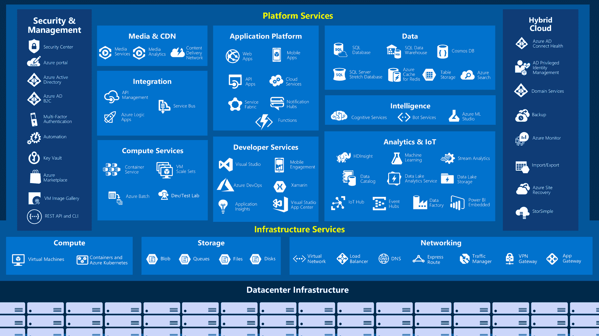

Big-picture view of the available services and features in Azure

## 微软认证

微软为他们的不同产品提供认证:Azure、Dynamics 365、Microsoft 365、Office、Power Platform、SQL Server 和 Windows。

如果我们只考虑 Azure 产品，我们有 13 个认证，分为两类:

*   应用和基础设施
*   数据和 IA

指以下技术工作角色:

*   管理人员
*   人工智能工程师
*   数据工程师
*   数据科学家
*   数据库管理员
*   开发者
*   DevOps 工程师
*   安全工程师
*   解决方案架构师

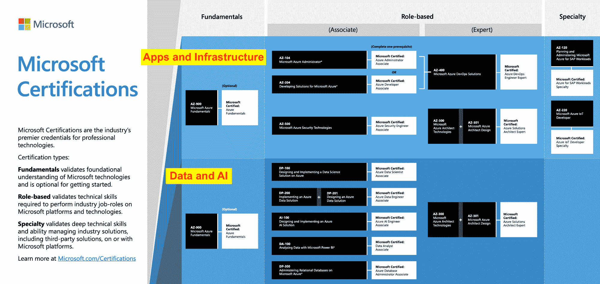

Microsoft Azure Certifications

### 开发者认证途径

对于每个认证，您可以在[文档](https://docs.microsoft.com/en-us/learn/certifications/)中找到相关的路径。

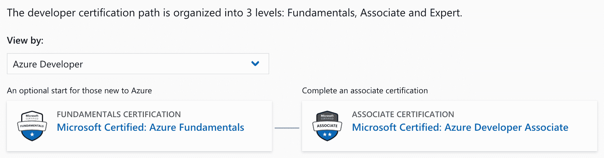

开发人员认证路径需要两次考试:

1.  考试 AZ-900: Microsoft Azure 基础知识(可选)
2.  考试 AZ-204:为 Microsoft Azure 开发解决方案

### 解决方案架构师认证途径

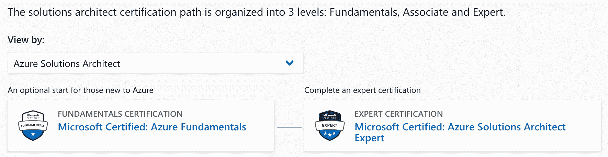

解决方案架构师认证路径需要三次考试:

*   考试 AZ-900: Microsoft Azure 基础知识(可选)
*   考试 AZ-300:微软 Azure Architect 技术
*   考试 AZ-301:微软 Azure 架构师设计

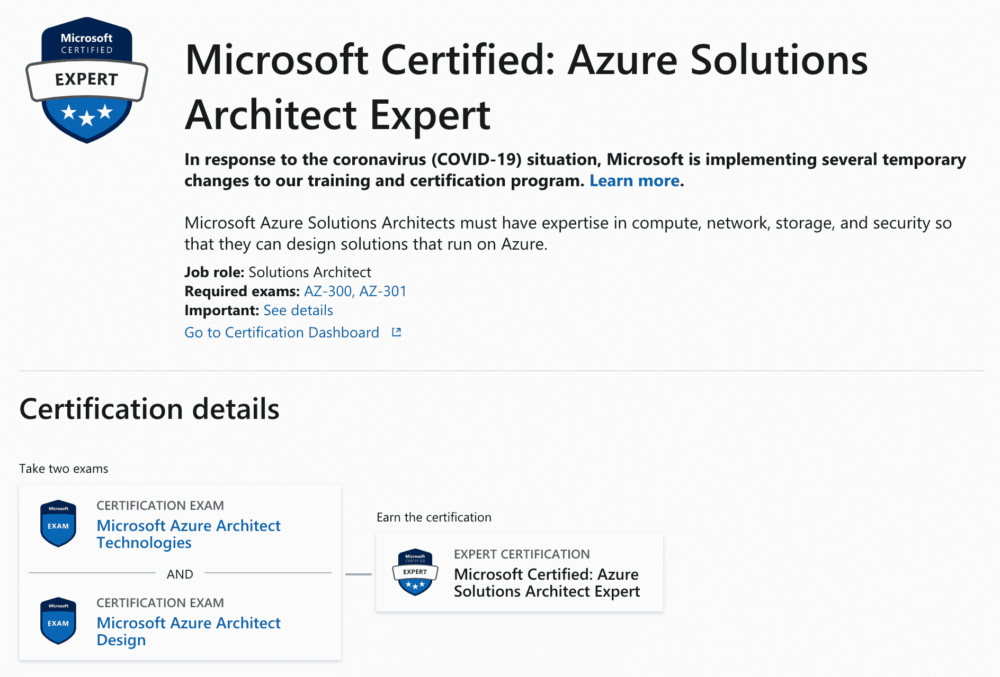

如果您熟悉 AWS 考试，您可能已经注意到解决方案架构师角色没有助理级别。我在下表中总结了 AWS 和 Azure 之间的考试等价性:

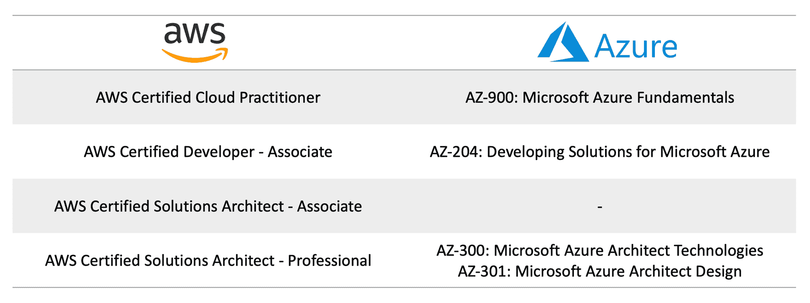

Comparison between AWS and Azure exams

## 关注 AZ-900:微软 Azure 基础知识

微软表示，这次考试的目的是展示云服务的基础知识，以及 Azure 如何提供这些服务。

不需要以前的 IT 技术经验。技术背景和非技术背景的考生都可以参加考试。

## 考试时衡量哪些技能？

根据技能大纲，本次考试中测试的技能如下:

### 描述云概念(15-20%)

*   描述使用云服务的好处和注意事项
*   描述基础设施即服务(IaaS)、平台即服务(PaaS)和软件即服务(SaaS)之间的区别
*   描述公共云、私有云和混合云模型之间的差异

### 描述核心 Azure 服务(30-35%)

*   描述核心 Azure 架构组件
*   描述一些 Azure 中可用的核心产品
*   描述 Azure 上可用的一些解决方案
*   描述 Azure 管理工具

### 描述安全性、隐私性、合规性和信任度(25-30%)

*   描述在 Azure 中保护网络连接
*   描述核心 Azure 身份服务
*   描述 Azure 的安全工具和特性
*   描述 Azure 治理方法
*   描述 Azure 中的监控和报告选项
*   描述 Azure 中的隐私、合规性和数据保护标准

### 描述 Azure 定价、服务水平协议和生命周期(20-25%)

*   描述 Azure 订阅
*   描述成本的计划和管理
*   描述 Azure 服务级别协议(SLA)
*   了解 Azure 中的服务生命周期

## 考试要多少钱？

如果你有幸参加了微软 Azure 虚拟培训日:基础，你会收到一张优惠券，允许你免费参加考试。

否则，你需要支付 99 美元，并且你可以[在皮尔森 VUE 公司安排你的在线考试](https://docs.microsoft.com/en-us/learn/certifications/exams/az-900)。

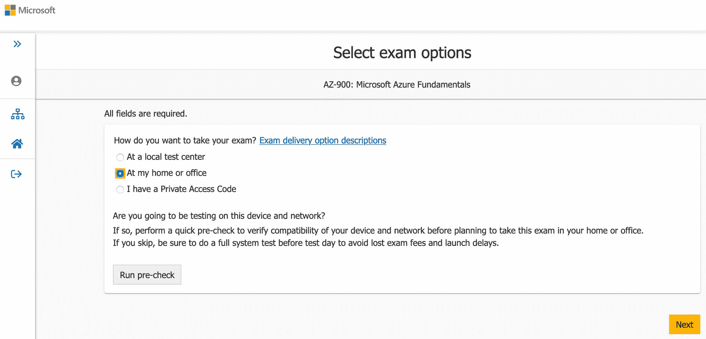

### 考试是什么样子的？

从 [FAQ](https://www.microsoft.com/en-us/learning/certification-exam-policies.aspx) 开始，你有 60 分钟时间回答 40-60 个问题。但是我的考试只有 32 道题。这真是一个惊喜！

考试呈现几种[题型](https://www.microsoft.com/en-us/learning/certification-exams.aspx):

*   不同形式的多项选择:一个正确答案和三个错误答案，选择正确描述，从五个或更多选项中选择两个或更多正确答案
*   拖放:将答案移动到正确的描述上
*   热点区域:以图形形式回答问题(截图、图片或图表)

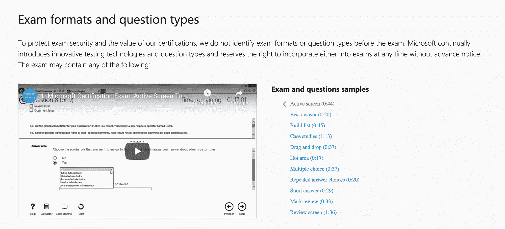

## 如何准备考试

有大量的资源可以帮助你准备考试。微软建议使用其在线平台 Microsoft Learn，该平台提供学习路径和模块，您可以按照自己的进度免费阅读。

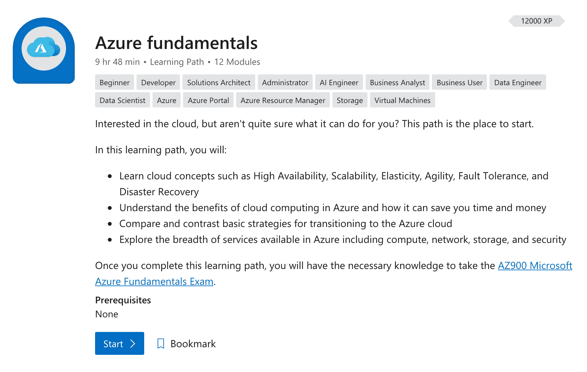

[Azure fundamentals 学习路径](https://docs.microsoft.com/en-us/learn/paths/azure-fundamentals/)是准备 AZ-900 考试的推荐课程。这是一门 10 小时的课程，包含 12 个模块:

1.  云概念-云计算的原理
2.  创建 Azure 帐户
3.  核心云服务 Azure 简介
4.  核心云服务——Azure 架构和服务保证
5.  核心云服务——使用 Azure 门户管理服务
6.  核心云服务- Azure 计算选项
7.  核心云服务- Azure 数据存储选项
8.  核心云服务- Azure 网络选项
9.  Azure 中的安全性、责任和信任
10.  使用 Azure 策略应用和监控基础架构标准
11.  使用 Azure 资源管理器控制和组织 Azure 资源
12.  预测 Azure 的成本并优化支出

如果你经常看安德鲁·布朗的课程，你会对微软学习感到失望。这些模块是没有任何视频的纯文本。准备好阅读和做笔记！

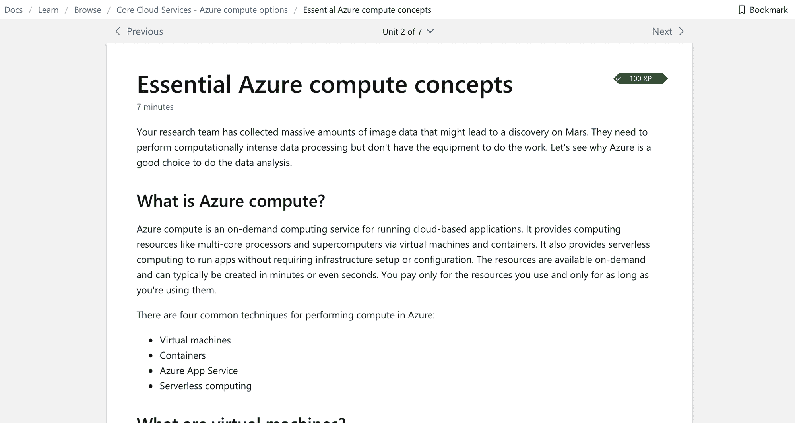

我强烈建议您:

1.  创建一个[免费账户](https://azure.microsoft.com/en-us/)
2.  阅读 Azure 服务概述
3.  使用 Azure quickstarts 自行练习
4.  用技能大纲监控你的进度
5.  参加模拟考试

Microsoft 在文档中解释了您需要了解的每项服务。其中的解释包括服务概述和快速入门，您可以尝试一下，以便更好地理解。

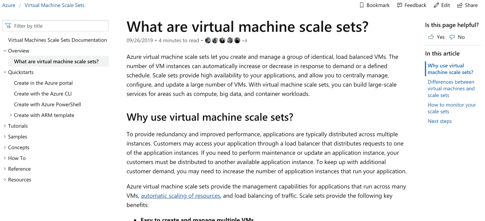

注意:使用 Azure 门户网站就足够练习了，因为它不是一个深入的考试。

所有这些步骤足以让我通过 AZ-900？

> 微软官方认证！！！今天早上参加了微软 [@Azure](https://twitter.com/Azure?ref_src=twsrc%5Etfw) 基础考试，通过了！！！？
> 
> 当然我会在一篇 [@freecodecamp](https://twitter.com/freeCodeCamp?ref_src=twsrc%5Etfw) 文章里分享我的反馈✍️[# azure certified](https://twitter.com/hashtag/AzureCertified?src=hash&ref_src=twsrc%5Etfw)[# azure](https://twitter.com/hashtag/Azure?src=hash&ref_src=twsrc%5Etfw)[pic.twitter.com/rvhJbz8av6](https://t.co/rvhJbz8av6)
> 
> — Johan Rin (@johanrin) [May 26, 2020](https://twitter.com/johanrin/status/1265221875183038464?ref_src=twsrc%5Etfw)