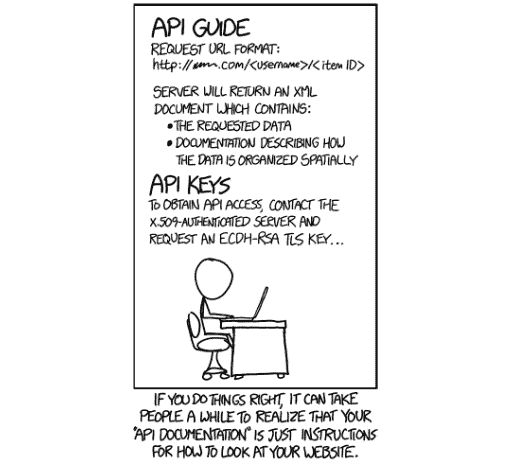
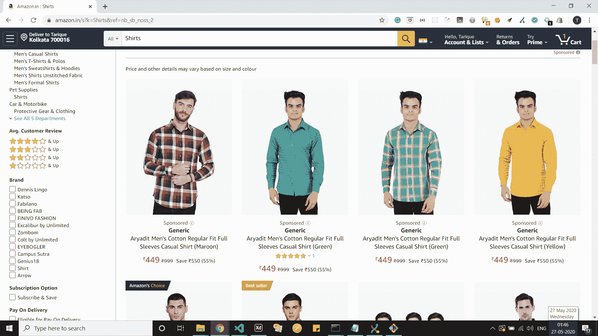
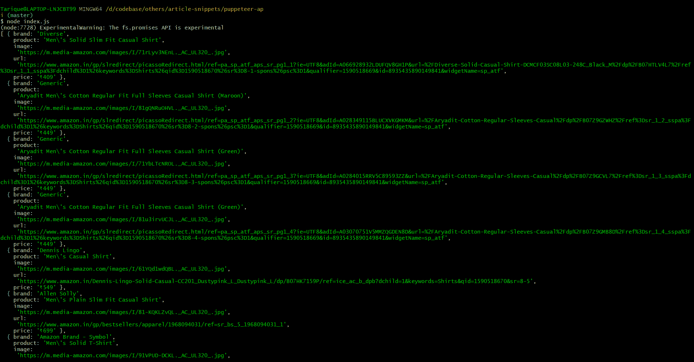
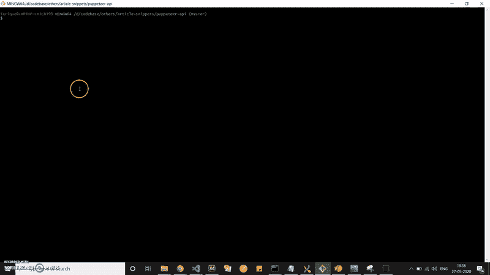

# 如何使用木偶师从任何网站创建自定义 API

> 原文：<https://www.freecodecamp.org/news/create-api-website-using-puppeteer/>

经常会遇到这样的情况，你碰到一个网站，被迫执行一组动作，最终得到一些数据。然后，您面临着一个难题:如何使这些数据以一种应用程序可以轻松使用的形式可用？

在这种情况下，刮擦可以解决问题。选择合适的工具非常重要。



API is just a way to look at a Website after all (Source: XKCD Comics)

## 木偶师:不只是另一个刮库

木偶师是由谷歌 Chrome Devtools 团队维护的 Node.js 库。它基本上以一种无头(或可配置)的方式运行一个 Chrome 或 Chrome(可能是更容易识别的名称)实例，并公开一组高级 API。

从其[官方文档](https://pptr.dev/)来看，木偶师通常用于多个流程，这些流程不限于以下内容:

*   生成截图和 pdf
*   抓取 SPA 并生成预渲染内容(即服务器端渲染)
*   测试 Chrome 扩展
*   Web 界面的自动化测试
*   通过捕捉网站的时间轴跟踪等技术来诊断性能问题

对于我们的例子，我们需要能够访问一个网站，并以一种我们的应用程序可以轻松使用的形式映射数据。

听起来很简单？实现也没有那么复杂。我们开始吧。

## 把代码串起来

我对亚马逊产品的喜爱促使我在这里使用他们的一个产品列表页面作为示例。我们将分两步实现我们的用例:

*   从页面中提取数据，并将其映射到易于使用的 JSON 表单中
*   加入一点自动化，让我们的生活变得更简单

您可以在这个[库](https://github.com/tejazz/article-snippets/tree/master/puppeteer-api)中找到完整的代码。

我们将从这个链接中提取数据:[https://www.amazon.in/s?k=Shirts&ref = nb _ sb _ noss _ 2](https://www.amazon.in/s?k=Shirts&ref=nb_sb_noss_2)(如图所示的搜索次数最多的衬衫列表)，以 API servable 的形式显示。



Amazon India - Shirts Listing Page

在本节开始广泛使用 puppeteer 之前，我们需要理解它提供的两个主要类。

*   **[浏览器:](https://pptr.dev/#?product=Puppeteer&version=v3.1.0&show=api-class-browser)** 当我们使用`puppeteer.launch`或`puppeteer.connect`时会启动一个 Chrome 实例。这是一个简单的浏览器模拟。
*   **[页面:](https://pptr.dev/#?product=Puppeteer&version=v3.1.0&show=api-class-page)** 类似于 Chrome 浏览器上的单个标签。它提供了一组详尽的方法，您可以将这些方法用于特定的页面实例，并在我们调用`browser.newPage`时被调用。就像您可以在浏览器中创建多个选项卡一样，您也可以在 puppeteer 中一次创建多个页面实例。

### 设置木偶师并导航到目标 URL

我们开始使用提供的 npm 模块设置木偶师。安装完 puppeteer 后，我们创建一个浏览器和页面类的实例，并导航到目标 URL。

```
const puppeteer = require('puppeteer');

const url = 'https://www.amazon.in/s?k=Shirts&ref=nb_sb_noss_2';

async function fetchProductList(url) {
    const browser = await puppeteer.launch({ 
        headless: true, // false: enables one to view the Chrome instance in action
        defaultViewport: null, // (optional) useful only in non-headless mode
    });
    const page = await browser.newPage();
    await page.goto(url, { waitUntil: 'networkidle2' });
    ...
}

fetchProductList(url); 
```

Launching the Browser and Navigating to the Target URL (index.js)

在导航到 URL 时，我们使用`networkidle2`作为`waitUntil`选项的值。这确保了当运行至少 500 毫秒的连接不超过 2 个时，页面加载状态被视为最终状态。

> 注意:你不需要在你的系统上安装 Chrome 或者它的一个实例来让木偶师工作。它已经附带了一个与库捆绑在一起的精简版。

### 提取和映射数据的页面方法

DOM 已经加载到创建的页面实例中。我们将继续利用`page.evaluate()`方法来查询 DOM。

在开始之前，我们需要计算出需要提取的确切数据点。在当前示例中，每个产品对象看起来都像这样。

```
{
	brand: 'Brand Name', 
    product: 'Product Name',
    url: 'https://www.amazon.in/url.of.product.com/',
    image: 'https://www.amazon.in/image.jpg',
    price: '₹599',
}
```

Product Object Structure

我们已经设计出了我们想要实现的结构。是时候开始检查 DOM 中的标识符了。我们检查要映射的项目中出现的选择器。我们将主要使用`[document.querySelector](https://developer.mozilla.org/en-US/docs/Web/API/Document/querySelector)`和`[document.querySelectorAll](https://developer.mozilla.org/en-US/docs/Web/API/Document/querySelectorAll)`来遍历 DOM。

```
...

async function fetchProductList(url) {
	...

    await page.waitFor('div[data-cel-widget^="search_result_"]');

    const result = await page.evaluate(() => {
        // counts total number of products
        let totalSearchResults = Array.from(document.querySelectorAll('div[data-cel-widget^="search_result_"]')).length;

        let productsList = [];

        for (let i = 1; i < totalSearchResults - 1; i++) {
            let product = {
                brand: '',
                product: '',
            };
            let onlyProduct = false;
            let emptyProductMeta = false;

            // traverse for brand and product names
            let productNodes = Array.from(document.querySelectorAll(`div[data-cel-widget="search_result_${i}"] .a-size-base-plus.a-color-base`));

            if (productNodes.length === 0) {
                // traverse for brand and product names 
				// (in case previous traversal returned empty elements)
                productNodes = Array.from(document.querySelectorAll(`div[data-cel-widget="search_result_${i}"] .a-size-medium.a-color-base.a-text-normal`));
                productNodes.length > 0 ? onlyProduct = true : emptyProductMeta = true;
            }

            let productsDetails = productNodes.map(el => el.innerText);

            if (!emptyProductMeta) {
                product.brand = onlyProduct ? '' : productsDetails[0];
                product.product = onlyProduct ? productsDetails[0] : productsDetails[1];
            }

            // traverse for product image
            let rawImage = document.querySelector(`div[data-cel-widget="search_result_${i}"] .s-image`);
            product.image =rawImage ? rawImage.src : '';

            // traverse for product url
            let rawUrl = document.querySelector(`div[data-cel-widget="search_result_${i}"] a[target="_blank"].a-link-normal`);
            product.url = rawUrl ? rawUrl.href : '';

            // traverse for product price
            let rawPrice = document.querySelector(`div[data-cel-widget="search_result_${i}"] span.a-offscreen`);
            product.price = rawPrice ? rawPrice.innerText : '';

            if (typeof product.product !== 'undefined') {
                !product.product.trim() ? null : productsList = productsList.concat(product);
            }
        }

        return productsList;
    });

    ...
}

...
```

DOM Traversal and Data Mapping Logic (index.js)

//遍历品牌和产品名称

在研究了 DOM 之后，我们看到每个列出的条目都包含在一个带有选择器`div[data-cel-widget^="search_result_"]`的元素之下。这个特定的选择器寻找所有属性为`data-cel-widget`且值以`search_result_`开始的`div`标签。

类似地，我们为列出的所需参数绘制了选择器。如果您想了解更多关于 DOM 遍历的知识，可以查看 Zell 的这篇内容丰富的文章。

*   **所列项目合计:** `div[data-cel-widget^="search_result_"]`
*   **品牌:** `div[data-cel-widget="search_result_${i}"] .a-size-base-plus.a-color-base` ( `i`代表`total listed items`中的节点号)
*   **产品:** `div[data-cel-widget="search_result_${i}"] .a-size-base-plus.a-color-base`或`div[data-cel-widget="search_result_${i}"] .a-size-medium.a-color-base.a-text-normal` ( `i`代表`total listed items`中的节点号)
*   **url:** `div[data-cel-widget="search_result_${i}"] a[target="_blank"].a-link-normal` ( `i`代表`total listed items`中的节点号)
*   **图像:** `div[data-cel-widget="search_result_${i}"] .s-image` ( `i`代表`total listed items`中的节点号)
*   **价格:** `div[data-cel-widget="search_result_${i}"] span.a-offscreen` ( `i`代表`total listed items`中的节点号)

> **注意:**我们使用`page.waitFor`方法等待`div[data-cel-widget^="search_result_"]`选择器命名的元素出现在页面上。

一旦调用了`page.evaluate`方法，我们就可以看到我们需要记录的数据。



It works! We have our API data ready to serve what we require

### 增加自动化以简化流程

到目前为止，我们能够导航到一个页面，提取我们需要的数据，并将其转换成 API 就绪的形式。听起来很不错。

然而，考虑一下这样一种情况，您必须通过执行一些操作从一个 URL 导航到另一个 URL，然后尝试提取您需要的数据。

这会让你的生活变得更棘手吗？一点也不。木偶师可以很容易地模仿用户的行为。是时候给我们现有的用例添加一些自动化了。

与上例不同，我们将转到`amazon.in`主页，搜索“衬衫”。这将把我们带到产品列表页面，我们可以从 DOM 中提取所需的数据。很简单。让我们看看代码。

```
...

async function fetchProductList(url, searchTerm) {
	...
	await page.goto(url, { waitUntil: 'networkidle2' });

    await page.waitFor('input[name="field-keywords"]');
    await page.evaluate(val => document.querySelector('input[name="field-keywords"]').value = val, searchTerm);

    await page.click('div.nav-search-submit.nav-sprite');

    // DOM traversal and data mapping logic
	// returns a productsList array
    ...
}

fetchProductList('https://amazon.in', 'Shirts'); 
```

Automating Search Operation and Navigation to Products Page (index.js)

我们可以看到，我们等待搜索框可用，然后使用`page.evaluate`添加传递的`searchTerm`。然后，我们通过模拟“search button”点击动作并显示 DOM 来导航到产品列表页面。

自动化的复杂性因用例而异。

### 一些值得注意的问题:一个小警告

木偶师的 API 相当全面，但我在使用它时遇到了一些问题。请记住，并非所有这些问题都与木偶师直接相关，但与它一起工作会更好。

*   如前所述，木偶师创建了一个 Chrome 浏览器实例。然而，很可能一些现有的网站可能会阻止访问，如果他们怀疑机器人活动。有一个叫做`[user-agents](https://www.npmjs.com/package/user-agents)`的包，它可以和木偶师一起使用，为浏览器随机化用户代理。

> **注:**抓取网站存在于法律认可的灰色地带。我建议谨慎使用它，并检查你居住的地方的规则。

```
const puppeteer = require('puppeteer');
const userAgent = require('user-agents');

...

const browser = await puppeteer.launch({ headless: true, defaultViewport: null });
const page = await browser.newPage();
await page.setUserAgent(userAgent.toString());

...
```

user-agents usage

*   我们在启动 Chrome 实例时遇到了`defaultViewport: null`,我把它列为可选的。这是因为它只有在你查看正在启动的 Chrome 实例时才会派上用场。它可以防止网站的宽度和高度在渲染时受到影响。
*   说到表演，木偶戏并不是最终的解决方案。作为一名开发人员，你必须对它进行优化，通过限制网站上的动画、只允许必要的网络调用等措施来提高性能效率。
*   记住总是通过使用`browser.close`关闭浏览器实例来结束木偶表演会话。(我碰巧在第一次尝试时错过了)它有助于结束正在运行的浏览器会话。
*   某些常见的 JavaScript 操作如`console.log()`在页面方法的范围内无法工作。原因是[页面上下文/浏览器上下文](https://pptr.dev/#?product=Puppeteer&version=v3.1.0&show=api-class-browsercontext)不同于应用程序运行的节点上下文。

这些是我注意到的一些问题。如果你还有更多，请随时联系我。我很想了解更多。

完成了吗？让我们运行应用程序。

## 从网站到你的 API:把所有的东西放在一起

应用程序以非无头模式运行，因此您可以看到到底发生了什么。我们将自动导航到我们从中获取数据的产品列表页面。



那里。您可以从自己选择的网站上设置自己的 API 消耗数据。你现在需要做的就是用一个服务器端框架连接起来，比如 [`express`](https://expressjs.com/) ，你就可以开始了。

## 结论

有这么多你可以做的木偶戏。这只是一个特殊的用例。我建议您花些时间阅读官方文档。我也会这么做。

Puppeteer 在一些大型组织中广泛用于自动化任务，如测试和服务器端渲染等。

没有比现在更好的时机开始与木偶师。

如果您有任何问题或意见，可以通过 [LinkedIn](https://www.linkedin.com/in/tarique-ejaz/) 或 [Twitter](https://twitter.com/theguynameddate) 联系我。

同时，继续编码。