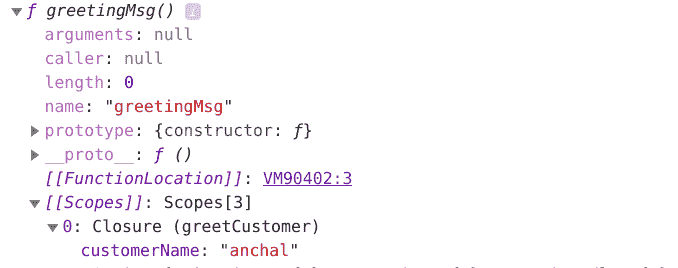

# JavaScript 闭包教程——包含 JS 闭包示例代码

> 原文：<https://www.freecodecamp.org/news/javascript-closure-tutorial-with-js-closure-example-code/>

闭包–你们中的许多 JavaScript 开发人员可能听说过这个术语。当我开始我的 JavaScript 之旅时，我经常遇到闭包。我认为它们是 JavaScript 中最重要和最有趣的概念之一。

你不觉得它们有趣吗？这通常发生在你不理解一个概念的时候——你觉得它没意思。(不知道你有没有这种情况，但我就是这样)。

所以在这篇文章中，我会试着让闭包变得有趣。

在进入闭包的世界之前，让我们先了解一下**词法范围**。如果你已经知道了，跳过下一部分。否则，就跳到这里来更好地理解闭包。

## 词法范围

你可能会想——我知道局部和全局作用域，但是到底什么是词法作用域呢？当我听到这个术语时，我也有同样的反应。不要担心！让我们仔细看看。

它和其他两个示波器一样简单:

```
function greetCustomer() {
    var customerName = "anchal";
    function greetingMsg() {
	  console.log("Hi! " + customerName); // Hi! anchal
    }
   greetingMsg();
}
```

从上面的输出可以看出，内部函数可以访问外部函数的变量。这就是词法范围，其中变量的范围和值是由它的定义/创建位置(即它在代码中的位置)决定的。明白了吗？

我知道最后一点可能会让你困惑。让我带你深入了解一下。您知道词法作用域也被称为静态作用域吗？是的，那是它的另一个名字。

还有一些编程语言支持的**动态范围**。为什么我提到了动态范围？因为它可以帮助您更好地理解词法范围。

让我们看一些例子:

```
function greetingMsg() {
  console.log(customerName);// ReferenceError: customerName is not defined
}

function greetCustomer() {
   var customerName = "anchal";
   greetingMsg();
}

greetCustomer();
```

你同意这个输出吗？是的，它会给出一个参考误差。这是因为两个函数都不能访问对方的作用域，因为它们是分开定义的。

让我们看另一个例子:

```
function addNumbers(number1) {
  console.log(number1 + number2);
}

function addNumbersGenerate() {
  var number2 = 10;
  addNumbers(number2);
}

addNumbersGenerate();
```

对于动态范围的语言，上面的输出将是 20。支持词法范围的语言将给出`referenceError: number2 is not defined`。为什么？

因为在动态作用域中，搜索首先发生在局部函数中，然后进入*调用*该局部函数的函数中。然后，它在调用栈中搜索调用了*的那个*函数，依此类推。

它的名字不言自明——“动态”意味着变化。变量的范围和值可以不同，因为这取决于调用函数的位置。变量的含义可以在运行时改变。

了解动态范围的要点了吗？如果是，那么只要记住词法范围是它的对立面。

在词法作用域中，搜索首先发生在局部函数中，然后进入定义了函数的*函数中。然后在定义了*函数的*函数中进行搜索，依此类推。*

因此，**词法**或**静态范围**意味着变量的范围和值是从它被定义的地方确定的。它不会改变。

让我们再次看看上面的例子，并尝试自己计算出输出。只需扭转一下——在顶部声明`number2`:

```
var number2 = 2;
function addNumbers(number1) {
  console.log(number1 + number2);
}

function addNumbersGenerate() {
  var number2 = 10;
  addNumbers(number2);
}

addNumbersGenerate(); 
```

你知道输出会是什么吗？

正确-对于词汇范围的语言是 12。这是因为首先，它查看一个`addNumbers`函数(最里面的作用域),然后它向内搜索，在那里定义这个函数。因为它得到了`number2`变量，意味着输出是 12。

您可能想知道为什么我在这里花了这么多时间在词法范围上。这是一篇结束文章，而不是关于词法范围的文章。但是如果你不了解词法范围，你就不会理解闭包。

为什么？当我们看闭包的定义时，你会得到你的答案。因此，让我们进入轨道，回到闭包。

## 什么是终结？

让我们看看闭包的定义:

> 当内部函数可以访问它的外部函数变量和参数时，闭包就创建了。内部函数可以访问–
> 1。自身的变数。
> 2。外部函数的变量和参数。
> 3。全局变量。

等等！这是闭包的定义还是词法范围的定义？这两个定义看起来一样。它们有什么不同？

这就是为什么我在上面定义了词法范围。因为闭包与词法/静态范围有关。

让我们再来看看它的另一个定义，它会告诉你闭包有什么不同。

> 闭包是指函数能够访问其词法范围，即使该函数在其词法范围之外执行。

或者，

> 内部函数可以访问其父作用域，即使父函数已经执行。

迷茫？如果你还没有抓住要点，不要担心。我有例子可以帮助你更好的理解。让我们修改词法范围的第一个例子:

```
function greetCustomer() {
  const customerName = "anchal";
  function greetingMsg() {
    console.log("Hi! " + customerName);
  }
  return greetingMsg;
}

const callGreetCustomer = greetCustomer();
callGreetCustomer(); // output – Hi! anchal
```

这段代码的不同之处在于，我们返回的是内部函数，稍后再执行。在一些编程语言中，局部变量存在于函数的执行过程中。但是一旦函数被执行，那些局部变量就不存在了，也就不可访问了。

然而，这里的情况有所不同。执行父函数后，内部函数(返回的函数)仍然可以访问父函数的变量。是的，你猜对了。关闭是原因。

当父函数执行时，内部函数保留其词法范围，因此，以后内部函数可以访问这些变量。

为了更好地理解它，让我们使用控制台的`dir()`方法来查看`callGreetCustomer`的属性列表:

```
console.dir(callGreetCustomer);
```



从上图中，您可以看到当执行`greetCustomer()`时，内部函数是如何保留其父作用域(`customerName`)的。后来，当`callGreetCustomer()`被执行时，它使用了`customerName`。

我希望这个例子能帮助你更好地理解闭包的上述定义。也许现在你会觉得闭包更有趣了。

那么接下来呢？让我们通过看不同的例子来让这个话题变得更有趣。

## 实际应用中的闭包示例

```
function counter() {
  let count = 0;
  return function() {
    return count++;
  };
}

const countValue = counter();
countValue(); // 0
countValue(); // 1
countValue(); // 2
```

每调用一次`countValue`，count 变量值加 1。等等，你以为 count 的值是 0 吗？

这是错误的，因为闭包不能和值一起工作。它存储变量的**引用**。这就是为什么当我们更新值时，它会反映在第二次或第三次调用中，以此类推，因为闭包存储了引用。

感觉好点了吗？让我们看另一个例子:

```
function counter() {
  let count = 0;
  return function () {
    return count++;
  };
}

const countValue1 = counter();
const countValue2 = counter();
countValue1();  // 0
countValue1();  // 1
countValue2();   // 0
countValue2();   // 1 
```

我希望你猜对了答案。如果没有，原因如下。As `countValue1`和`countValue2`，都保留了自己的词法范围。他们有独立的词汇环境。在这两种情况下，您都可以使用`dir()`来检查`[[scopes]]`值。

让我们看第三个例子。

这个有点不同。在其中，我们必须编写一个函数来实现输出:

```
const addNumberCall = addNumber(7);
addNumberCall(8) // 15
addNumberCall(6) // 13
```

简单。使用您新获得的结束知识:

```
function addNumber(number1) {
  return function (number2) {
    return number1 + number2;
  };
}
```

现在让我们来看一些棘手的例子:

```
function countTheNumber() {
  var arrToStore = [];
  for (var x = 0; x < 9; x++) {
    arrToStore[x] = function () {
      return x;
    };
  }
  return arrToStore;
}

const callInnerFunctions = countTheNumber();
callInnerFunctions[0]() // 9
callInnerFunctions[1]() // 9
```

每一个存储函数的数组元素都会给出 9 的输出。你猜对了吗？希望如此，但还是让我告诉你原因吧。这是因为闭包的行为。

闭包存储的是**引用**，而不是值。循环第一次运行时，x 的值为 0。然后第二次 x 是 1，以此类推。因为闭包存储了引用，所以每次循环运行时，它都会改变 x 的值，最后，x 的值将会是 9。所以`callInnerFunctions[0]()`给出了 9 的输出。

但是如果你想要 0 到 8 的输出呢？简单！使用闭包。

在查看下面的解决方案之前，请想一想:

```
function callTheNumber() {
  function getAllNumbers(number) {
    return function() {
      return number;
    };
  }
  var arrToStore = [];
  for (var x = 0; x < 9; x++) {
    arrToStore[x] = getAllNumbers(x);
  }
  return arrToStore;
}

const callInnerFunctions = callTheNumber();
console.log(callInnerFunctions[0]()); // 0
console.log(callInnerFunctions[1]()); // 1
```

这里，我们为每个迭代创建了单独的范围。您可以使用`console.dir(arrToStore)`来检查不同数组元素的`[[scopes]]`中 x 的值。

就是这样！我希望你现在可以说你觉得闭包很有趣。

要阅读我的其他文章，请点击这里查看我的简介。