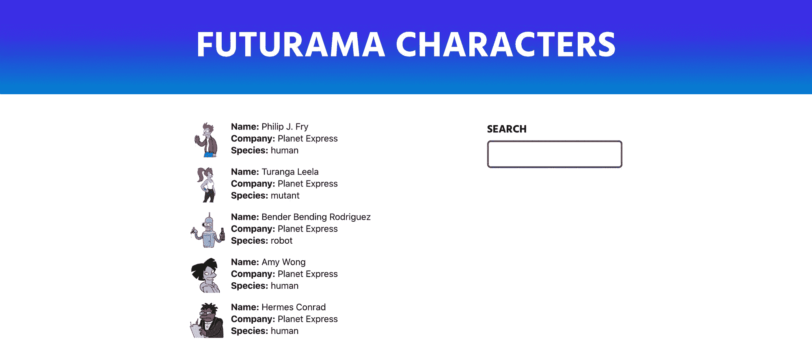
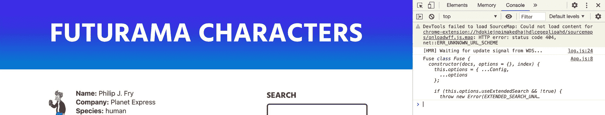
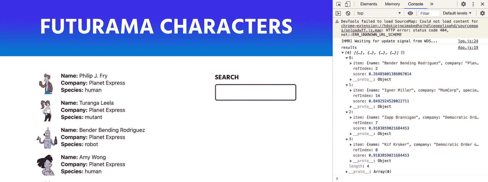
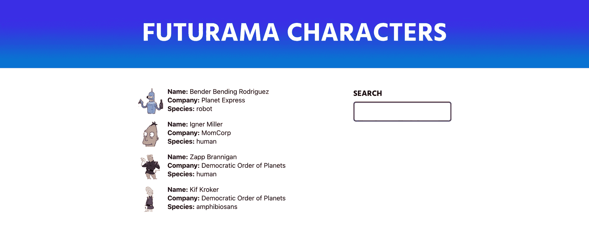
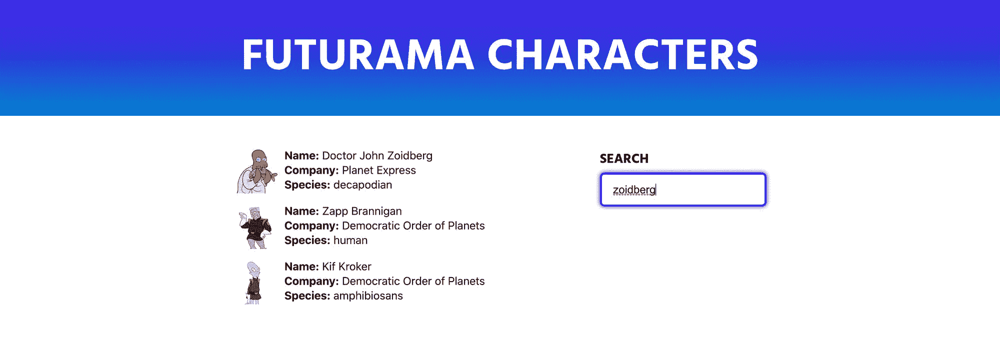

# 如何使用 Fuse.js 向 React 应用添加搜索

> 原文：<https://www.freecodecamp.org/news/how-to-add-search-to-a-react-app-with-fuse-js/>

搜索是一种强有力的方式，可以帮助人们找到对他们来说最重要的内容。但通常要找出实现这一目标的规则和逻辑是非常具有挑战性的。在本文中，我们将了解如何使用 fuse.js 将搜索添加到我们的应用程序中。

*   [fuse . js 是什么？](#what-is-fuse-js)
*   为什么搜索很重要？
*   我们要建造什么？
*   [步骤 0:引导我们的应用](#step-0-bootstrapping-our-app)
*   [第一步:安装 Fuse.js](#step-1-installing-fuse-js)
*   [步骤 2:创建新的融合搜索实例](#step-2-creating-a-new-fuse-search-instance)
*   [步骤 3:基于用户输入设置动态搜索](#step-3-setting-up-dynamic-search-based-on-user-input)

[https://www.youtube.com/embed/GZl-yEz4_qw?feature=oembed](https://www.youtube.com/embed/GZl-yEz4_qw?feature=oembed)

## fuse.js 是什么？

[Fuse.js](https://fusejs.io/) 是一个 JavaScript 库，为应用和网站提供模糊搜索功能。它很好，开箱即用，但也包括配置选项，允许您调整和创建强大的解决方案。

## 为什么搜索很重要？

无论你是一个内容创建者还是试图在你的网站上销售产品，帮助你的访问者找到他们想要的东西是很重要的。

如果你正在建立一个电子商务网站，你希望有人能够很容易地找到你的 Bender 乙烯基数字，而不是必须先通过整个目录挖掘。

## 我们要建造什么？

我们将从一个基本的 Create React 应用程序示例开始。它将包含一些角色信息，作为我最喜欢的电视剧《未来》的结构化数据，这些信息被简单地转储到一个 HTML 列表中。

有了这个列表，我们将使用 fuse.js 来提供客户端搜索功能，允许我们演示如何通过名称和其他细节来搜索我们要查找的字符。

## 步骤 0:引导我们的应用程序

首先，我们需要一些内容。我首先构建了一个来自 Futurama 的角色列表，作为结构化的 json 数据，我用一个新的 Create React 应用程序将它放在一个列表中。



Futurama character search demo

您还会注意到，我已经为我们的搜索添加了一个输入。它还没有功能，但我们将使用它开始。

如果你想从同一个地方开始，我用我的演示 repo 创建了一个分支，你可以在本地克隆它，和我一起完成这个项目！

```
git clone --single-branch --branch start git@github.com:colbyfayock/my-futurama-characters.git 
```

[Git 分支“开始”](https://github.com/colbyfayock/my-futurama-characters/tree/start)

或者[跟随提交](https://github.com/colbyfayock/my-futurama-characters/commit/20d4e42aaf69e214b63e684e012cd2f8c95d427b)。

## 步骤 1:安装 Fuse.js

我们首先要做的是将 Fuse.js 添加到我们的应用程序中。在您的项目中，运行:

```
yarn add fuse.js
# or
npm install --save fuse.js 
```

这将保存对我们项目的依赖，以便我们能够在我们的项目中使用它。

接下来，我们要将依赖项导入到我们的应用程序中，这样我们就可以开始使用它进行构建了。在你的文件的顶部，在我们的例子中`src/App.js`如果你和我一起在一个新的 Create React App 项目中，添加:

```
import Fuse from 'fuse.js'; 
```

如果你想测试它的工作，你可以`console.log(Fuse)`并查看我们的`Fuse`类，我们将使用它来创建我们的搜索功能。



Imported fuse.js class

就这样，我们准备好开始了！

[跟随提交](https://github.com/colbyfayock/my-futurama-characters/commit/54720daffa6ff415997c319b12f8f44d7ec8b748)

## 步骤 2:创建新的 Fuse 搜索实例

要使用 Fuse.js，我们首先要创建它的一个新实例。

在组件的顶部，添加:

```
const fuse = new Fuse(characters, {
  keys: [
    'name',
    'company',
    'species'
  ]
}); 
```

有了这个确实:

*   创建 Fuse 的新实例
*   传入我们的`characters`对象数组
*   指定我们要搜索的数据中的 3 个键

接下来，为了执行搜索，我们可以添加:

```
const results = fuse.search('bender'); 
```

如果我们在控制台上记录结果，我们可以看到:


Basic fuse.js search results

你会注意到我们比我们的朋友 Bender 有更多的结果。Fuse.js 提供了“模糊搜索”,这意味着如果你不确定你在找什么或者你拼错了你的查询，它会尽力帮助你。

为了了解这是如何工作的，让我们在搜索中添加`includeScore`选项:

```
const fuse = new Fuse(characters, {
  keys: [
    'name',
    'company',
    'species'
  ],
  includeScore: true
}); 
```

现在我们可以在结果对象中看到`score`属性。



Fuse.js search results with score

你会注意到我们的第一个结果得分很低。对于 fuse.js，较低的分数意味着它更接近精确匹配。

0 分表示完全匹配，1 分表示完全不匹配。

它说第一个结果极有可能是我们所期待的，但它对其他结果没有信心。

因此，对于我们的结果，我们希望将其实际连接到我们的用户界面。如果您注意到我们的数组输出与我们为 HTML 列表映射的不同，那么让我们创建一个新变量，我们可以将它更改为:

```
const results = fuse.search('bender');
const characterResults = results.map(character => character.item); 
```

这样做的目的是使用 [map](https://developer.mozilla.org/en-US/docs/Web/JavaScript/Reference/Global_Objects/Array/map) 方法创建一个新数组，该方法将只包含每个数组对象的`item`属性。

然后，如果我们用`characterResults.map`替换列表中的`characters`地图:

```
<ul className="characters">
  {characterResults.map(character => {
    const { name, company, species, thumb } = character; 
```

我们现在可以看到我们的页面只显示了“bender”的结果！



Demo with filtered results

[跟随提交！](https://github.com/colbyfayock/my-futurama-characters/commit/adbf30a872fa134cfca4e142ba479877b9665e9a)

## 步骤 3:基于用户输入设置动态搜索

现在我们有了一个硬编码的搜索工作，我们希望有人实际上能够使用搜索输入进行搜索！

为了实现这一点，我们将使用`useState`钩子并监听对`input`字段的更改，这将动态地创建对我们数据的搜索。

首先，从 React 导入`useState`钩子:

```
import React, { useState } from 'react'; 
```

接下来，让我们使用这个钩子来创建一个状态实例:

```
const [query, updateQuery] = useState(''); 
```

这里，我们创建了一个新的状态`query`，我们可以用默认为空字符串(`''`)的`updateQuery`来更新它。

这样，让我们告诉我们的搜索输入使用那个`query`值作为它的值:

```
<input type="text" value={query} /> 
```

此时，应该没有什么不同，因为我们使用的是一个空白查询。


Demo with filtered results - nothing changed

现在让我们向输入添加一个事件处理程序，我们可以用它来更新我们的状态:

```
<input type="text" value={query} onChange={onSearch} /> 
```

我们希望创建该函数，以便能够使用它:

```
function onSearch({ currentTarget }) {
  updateQuery(currentTarget.value);
} 
```

这将在输入值发生变化时更新我们的`query`。

既然我们的`query`将拥有我们想要搜索的内容，我们可以更新我们的搜索实例:

```
const results = fuse.search(query); 
```

现在如果你重新加载页面，它是空白的！？


Demo with no results

这是因为默认情况下，Fuse 会看到我们的空查询，并且不会将其与任何内容进行匹配。如果我们现在搜索类似于`slurms`的东西，我们可以看到我们的搜索结果动态更新！


Demo with results for "slurms"

如果我们想解决这个问题，以便在没有查询时显示所有结果，我们可以使用一个`if`语句，或者在我的例子中，一个三元组，如果没有查询，它将显示所有字符:

```
const characterResults = query ? results.map(character => character.item) : characters; 
```


Demo with all results

这样，我们就有了基本的搜索！



Demo with filtered results for "zoidberg"

[跟随提交！](https://github.com/colbyfayock/my-futurama-characters/commit/1b8918fc56f31517686a6c73f1969787728736ac)

## 接下来我能做什么？

### 调整您的搜索

Fuse.js 提供了很多选项，您可以根据自己的喜好调整搜索。想只展示自信的结果？使用`threshold`选项！想要区分大小写的查询吗？使用`isCaseSensitive`选项！

[https://fusejs.io/api/options.html](https://fusejs.io/api/options.html)

### 使用 URL 参数设置默认查询

有时，您希望某人能够链接到一组特定的结果。为此，我们可能希望能够添加一个新的 URL 参数，如`?q=bender`。

为此，您可以用 javascript 获取 URL 参数，并使用该值来设置我们的`query`状态。

## 加入对话！

> 曾经想给你的 [@reactjs](https://twitter.com/reactjs?ref_src=twsrc%5Etfw) 应用添加模糊的动态搜索，但不知道如何添加？？
> 
> 本指南将带你了解如何使用 Fuse.js 将强大的客户端搜索添加到 React 应用⚛️
> 
> 看看吧！？[https://t.co/EMlvXaOCat](https://t.co/EMlvXaOCat)
> 
> — Colby Fayock (@colbyfayock) [May 26, 2020](https://twitter.com/colbyfayock/status/1265298322891378688?ref_src=twsrc%5Etfw)