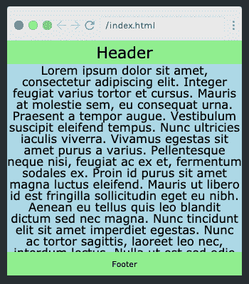
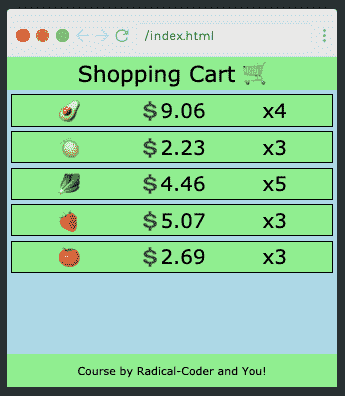
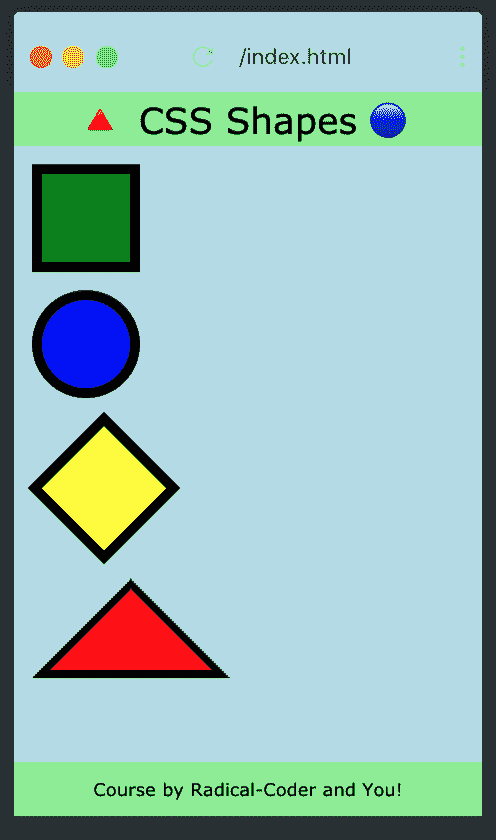
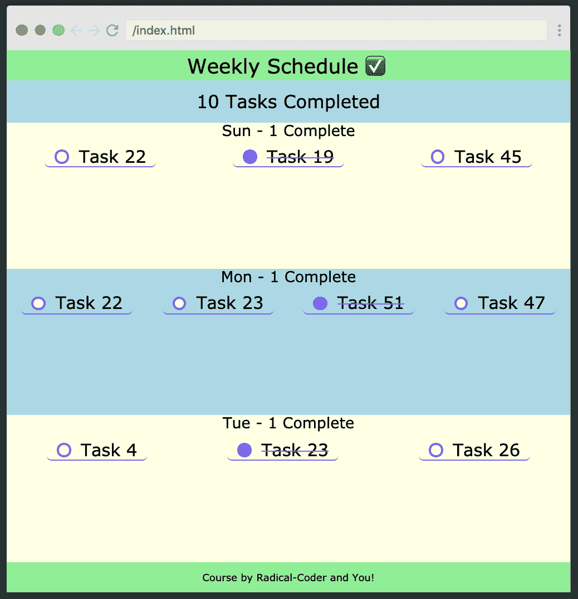
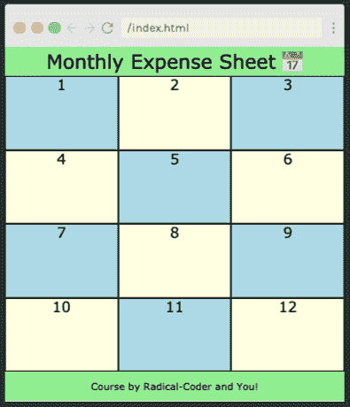
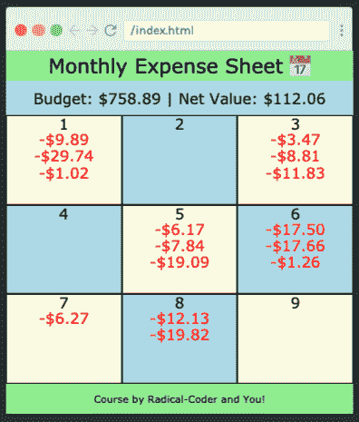

# 这里有一个免费的课程来帮助前端开发人员学习数学

> 原文：<https://www.freecodecamp.org/news/want-to-learn-practical-math-for-front-end-developers-heres-our-free-11-part-course-by-radical-coder/>

你想通过提高你的基本数学技能而不需要达到 NASA 级别的计算来成为一个更有效的开发者吗？不要再看了！

在 Scrimba，我们非常兴奋地宣布我们的新课程[‘面向前端开发人员的实用数学’](https://scrimba.com/course/gpracticalmath)，它提供的正是这种课程。在本课程中，我们构建了 3 个项目:

1.  购物车，我们在其中生成产品列表，计算产品的总价并应用税率。
2.  一个每周的时间表，在这里我们引入了`Date`对象，执行布局操作并学习了`reduce`函数。
3.  每月费用表，它汇集了我们所学的一切，并给了我们一些方便的提示和技巧。

本课程由瑞安·高尼恩为您带来，他有自己的 [Twitch](https://www.google.com/url?q=https://www.twitch.tv/radicalcoder&sa=D&ust=1585686482555000&usg=AFQjCNHoQP_okALIk85y1YojlBM-DwEiHw) 和 [YouTube](https://www.google.com/url?q=https://www.youtube.com/channel/UC2J1l95xB98Fd-v9xGkxHIg&sa=D&ust=1585686482556000&usg=AFQjCNGzqdwTLYFINOKqnrb4a0XgwxY_DA) 频道。

Ryan 拥有 5 年的 Web 开发经验，计算机科学学士学位，以及辅导 K-12 和大学数学的经验，是这门课程的完美导师。前往 [Scrimba](https://scrimba.com/playlist/pzKyeuP?utm_source=fcc&utm_medium=referral&utm_campaign=gpracticalmath_launch_article) 看看他在商店里有什么！

# 应用程序布局和 CSS calc()简介

[](https://scrimba.com/p/pzKyeuP/c73zJGtp?utm_source=fcc&utm_medium=referral&utm_campaign=gpracticalmath_launch_article) 
*点击图片进入课程。*

在这个截屏中，Ryan 向我们展示了如何通过 CSS 变量和`calc()`函数正确地调整`<header>`、`<footer>`和`<main>`标签的大小来构建应用程序的外壳。

我们用`overflow-y: auto`；确保`<main>`标签的内容不会超出页脚。

```
* {
	--headerFontSize: 2rem;
	--headerPadding: 0.5rem;
	--footerFontSize: 1rem;
	--footerPadding: 1rem;
}

header {
	font-size: var(--headerFontSize);
	padding: var(--headerPadding);
}

main {
	font-size: 1.5rem;
	height: calc(
		100vh - var(--headerFontSize) - (2 * var(--headerPadding)) - var(
				--footerFontSize
			) - (2 * var(--footerPadding))
	);
	overflow-y: auto;
}

footer {
	font-size: var(--footerFontSize);
	padding: var(--footerPadding);
} 
```

# roll()函数

在您的前端旅程中的某个时刻，生成随机数据来测试您的布局会很有用。`roll()`函数正是这样做的。这个角色还向我们展示了如何使用 JavaScript 的`Math`模块和`random()`函数。

```
function roll(min, max, floatFlag) {
	let r = Math.random() * (max - min) + min;
	return floatFlag ? r : Math.floor(r);
} 
```

# 购物车-生成数据/构建布局

[](https://scrimba.com/p/pzKyeuP/cn4kQnUK?utm_source=fcc&utm_medium=referral&utm_campaign=gpracticalmath_launch_article) 
*点击图片进入课程。*

现在我们开始构建我们的第一个项目，购物车，使用我们新编写的`roll()`函数来生成价格。这向我们展示了我们使用新知识节省了多少时间！

```
let products = [...Array(5)].map((_, i) => {
	return {
		index: i,
		title: possibleProducts[roll(0, possibleProducts.length)],
		price: roll(1, 10, 1).toFixed(2),
		count: roll(1, 6),
	};
}); 
```

# 购物车-计算总额/应用税率

在这个截屏中，我们学习如何使用`.reduce`来计算购物车的总价

```
let cartTotal = products
	.reduce(function (accumulator, product) {
		console.log(accumulator, product);
		return accumulator + parseFloat(product.price) * product.count;
	}, 0)
	.toFixed(2); 
```

我们还将看到如何使用`roll()`来生成随机税率并应用它。

```
let taxRate = roll(5, 9, 1).toFixed(1); 
```

在这个过程中，我们练习解析浮点值，并将它们四舍五入到小数点后一个指定的数字。

# 购物车(奖金挑战)-重量

作为这个角色的额外挑战，我们随机生成购物车中每件商品的重量，并在结账时计算总重量。在现实世界中，这可以用来估计买家的运输成本。

这里没有剧透，所以如果你想看到解决方案，你必须点击[到课程。](https://scrimba.com/p/pzKyeuP/ce99mQsa?utm_source=fcc&utm_medium=referral&utm_campaign=gpracticalmath_launch_article)？

# CSS 形状初探

[](https://scrimba.com/p/pzKyeuP/cGmWKMfR?utm_source=fcc&utm_medium=referral&utm_campaign=gpracticalmath_launch_article) 
*点击图片进入课程。*

在这个造型中，我们学习如何用 CSS 创建一个正方形、一个圆形、一个菱形和一个三角形。

```
.triangle {
	height: 0;
	width: 0;
	border-left: 5.5rem solid transparent;
	border-right: 5.5rem solid transparent;
	border-bottom: 5.5rem solid black;
	margin: 1rem;
	position: relative;
}

.triangle:after {
	content: "";
	position: absolute;
	height: 0;
	width: 0;
	border-left: 4.5rem solid transparent;
	border-right: 4.5rem solid transparent;
	border-bottom: 4.5rem solid red;
	left: -4.5rem;
	top: 0.6rem;
} 
```

# 周计划——使用 Date()构建周/生成任务

在这一集里，我们开始制作每周日程应用程序。首先，我们学习 JavaScript 的`Date`对象。

```
function getNextDay(day) {
	let nextDay = new Date(day);
	nextDay.setDate(day.getDate() + 1);
	return nextDay;
} 
```

接下来，我们看看如何使用`roll()`函数来测试布局并生成任务列表。看看球场的[，看看它是如何运作的](https://scrimba.com/p/pzKyeuP/c2KKPGh6?utm_source=fcc&utm_medium=referral&utm_campaign=gpracticalmath_launch_article)

# 周计划-构建布局/显示数据

[](https://scrimba.com/p/pzKyeuP/caZZyNA9?utm_source=fcc&utm_medium=referral&utm_campaign=gpracticalmath_launch_article) 
*点击图片进入课程。*

在这个造型中，Ryan 向我们展示了如何使用`calc()`函数来显示在前一个造型中生成的数据。

```
--mainHeight: calc(
	100vh - var(--headerFontSize) - (2 * var(--headerPadding)) - var(
			--footerFontSize
		) - (2 * var(--footerPadding))
); 
```

我们还学习如何划掉已完成的任务([)点击](https://scrimba.com/p/pzKyeuP/caZZyNA9?utm_source=fcc&utm_medium=referral&utm_campaign=gpracticalmath_launch_article)了解如何划掉。)结果是一个干净、功能齐全的应用程序，我们可以在日常生活中使用。

# 月度费用表-生成并显示月份

[](https://scrimba.com/p/pzKyeuP/cD44VpTW?utm_source=fcc&utm_medium=referral&utm_campaign=gpracticalmath_launch_article) 
*点击图片进入课程。*

接下来，使用以前的概念来构建更复杂的东西——我们的费用跟踪器。在这个项目中，我们生成数据，显示月份并绘制网格。

```
function displayMonth(month) {
	// <div class="day">3</div>
	let monthHtml = month.reduce(function (accumulator, day) {
		return accumulator + `<div class="day">${day.date.getDate()}</div>`;
	}, "");
	document.getElementById("MonthlyExpenses").innerHTML = monthHtml;
} 
```

# 每月费用表-生成、显示和跟踪费用

[](https://scrimba.com/p/pzKyeuP/cD4weyhd?utm_source=fcc&utm_medium=referral&utm_campaign=gpracticalmath_launch_article) 
*点击图片进入课程。*

最后，我们通过编写函数来跟踪我们的开支、租金和公用事业账单，从而进行预算计算。然后，我们在剩余的可用预算旁边显示支出。

```
function displayMonth(month, budget, netValue) {
	let monthHtml =
		`<div class="monthly-summary">
        Budget: \$${budget.toFixed(2)} | Net Value: \$${netValue.toFixed(2)}
    </div>` +
		month.reduce(function (accumulator, day) {
			return accumulator + `<div class="day">${day.date.getDate()}</div>`;
		}, "");
	document.getElementById("MonthlyExpenses").innerHTML = monthHtml;
} 
```

# 结论

很好地完成了这个课程，我真的希望你学到了一些有用的技巧和诀窍，可以在你未来的编码冒险中应用！

快乐学习；)