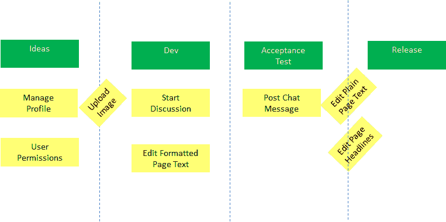
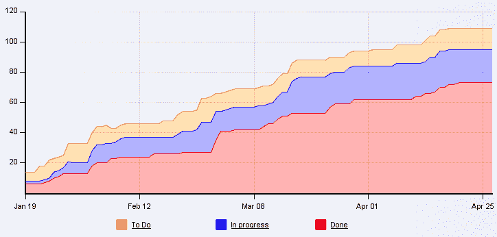

# 什么是看板？定义的敏捷方法，以及如何在软件开发团队中使用它

> 原文：<https://www.freecodecamp.org/news/what-is-kanban-the-agile-methodology-defined-and-how-to-use-it-for-your-software-development-team-2/>

看板是 20 世纪上半叶在日本汽车行业发明的。受超市根据需求储存货架的启发，丰田的目标是减少库存，改善整个生产系统的流程。

David Anderson 在他的书 *Kanban:你的技术业务的成功进化变化*中描述了如何将 Kanban 原则应用到软件开发中。这些原则是:

*   从你现在做的事情开始
*   同意追求渐进的、进化的变革
*   尊重当前的流程、角色、职责和头衔

## 这对敏捷软件开发意味着什么？

在我的培训课程中，我会问参与者他们对敏捷软件开发了解多少。常见的回答是:“在 Sprints 中工作”，“有一个产品所有者”，“管理积压的用户故事。”人们受到当今最流行的敏捷框架 Scrum 的影响。

Scrum 自带预定义的角色、事件和工件。如果你想把你正在做的事情称为 Scrum，Scrum 要求你遵循 Scrum 指南中定义的规则。看板不一样。

看板从你公司现在遵循的流程开始。在看板板上想象这些步骤。他们可以包括你做的一切，从想法到交付。

每一步都成为棋盘上一个专栏的标题。

为了跟踪你的日常工作，最好把它分成小项目。也许用户故事最多可以在 2 天内实现。在便笺上写下每一项，然后挂在黑板上。您可以使用板上的垂直顺序来确定优先级。

卡片从左向右移动。工作人员拉动上一个流程步骤已经完成的项目。当他们有能力这样做的时候。因此，示例中的开发人员在有能力实现时，将*上传图像*卡拉入*开发*中。

## 追求渐进的、进化的变革

所以你已经创建了一个看板来展示你的过程？你让你的工作可见，这是一个很好的开始！

为了获得看板的好处，你需要做更多的事情。您需要:

*   限制在制品和队列
*   观察和改善流程
*   有效协作

### 限制在制品和队列

限制在制品意味着:你为你工作的项目数量设定一个最大值。这就是所谓的在制品限制，简称 WiP 限制。这是看板，上面有一些流程步骤的 WiP 限制。

开发人员可以一次处理 5 个项目。最多。如果他们的列包含 5 个项目，则不允许他们再拉取项目。这有两个后果。

首先:它鼓励人们完成他们的工作，而不是开始更多的工作。未完成的工作有风险。当你不能按计划发布你的软件时，你的客户会有多高兴？因为你开始着手所有这些伟大的想法，但你没有坚持到底？

限制在制品的第二个后果是:瓶颈变得明显。当一个流程步骤开始了它无法完成的工作时，人们会立即感觉到。因为下一个流程步骤将无法拉动项目。

除了限制正在进行的工作，您还应该限制队列大小。在上图中，它们显示为列之间的虚线。它与限制在制品的工作方式相同。

综上:*停止开始，开始完成*是座右铭。从概念到交付的时间越短越好。

### 观察和改善流程

起初，观察瓶颈可能会很痛苦。但是至少你知道在你的过程中主要的问题在哪里。看板鼓励你通过消除瓶颈来改善流程。一致的流程使您能够更可靠地交付，这对所有利益相关者都有好处，包括开发人员。

要观察流程，您需要记录卡片进入流程步骤的时间。以及完成处理步骤的时间。这样你就知道卡在每一步以及每一步之间的队列中花费了多少时间。

基于这些数据，您可以设置帮助您改进流程的指标。常见指标包括:

*   周期时间:从一个团队开始制作卡片(即 *Dev* )到交付(即 *Release* )的时间。改进这一指标可以帮助您缩短上市时间。
*   吞吐量:在给定时间内通过系统的卡片数量。改进这一指标可以帮助您提高交付组织的绩效。

了解一段时间内有多少卡处于哪个流程步骤的一个常用方法是累积流程图。理想情况下，随着时间的推移，除最后一步外，每一步中的卡片数量大致保持不变。发行的卡的数量应该增加。当图表偏离这一点时，您可能会遇到瓶颈。

### 有效协作

看板度量是分析和改进你正在做的事情的强大工具。但是如果没有人来做这些工作，它们就一文不值。参与流程步骤的每个人都应该对看板创造的透明度保持开放。

人们应该建设性地合作来消除瓶颈，而不是责怪个人。定期看看现在的状态。有什么瓶颈吗？某个流程步骤的工作量是过多还是过少？吞吐量足够吗？还有其他不满的来源吗？有哪些需要改进的地方？

同意对系统进行小改动的实验。意识到变化。稍后，看看实验是否如预期的那样进行。为了能够实施变革，管理层的支持通常至关重要。

## 何时使用看板

看板非常灵活。可以和 Scrum 结合使用，称为 [Scrumban](https://en.wikipedia.org/wiki/Scrumban) 。它可以在产品开发之外使用。你甚至可以用它来计划一次旅行或者组织你在空闲时间做的事情。

我发现当在 Scrum Sprints 中工作是不可能的或者很困难的时候，它特别有帮助。例如:两家公司，一家是客户，另一家是供应商，交接是不可避免的。另一个例子是，当你在开发一个同时涉及软件和硬件的产品时，会涉及到多个工程学科。

当开发以敏捷的方式进行时，看板也可以在你的公司内部使用，但并不是公司的其他部门都这样做。它可以用来促进战略规划和软件开发之间的合作。

不要认为仅仅因为你在实现 Scrum 上有困难，就没有办法变得更加敏捷。看板从你现在做的事情开始。如果你认真对待它，它会帮助你提高。一次一小步。

*到* [*了解更多关于敏捷软件开发*](https://skl.sh/2Cq497P) *，访问我的在线课程。想了解我正在做的事情或给我留言，请关注我的*[*dev . to*](https://dev.to/bertilmuth)*，*[*LinkedIn*](https://www.linkedin.com/in/bertilmuth/)*或*[*Twitter*](https://twitter.com/BertilMuth)*。或者访问我的* [*GitHub 项目*](https://github.com/bertilmuth/requirementsascode) *。*