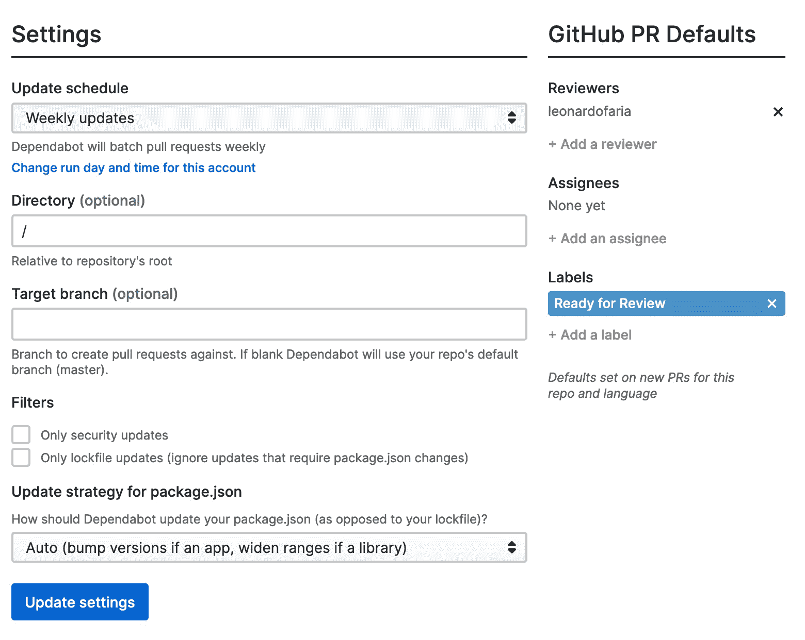
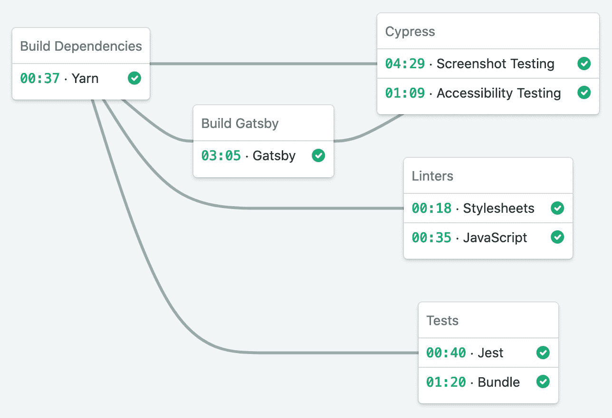

# 如何使用 Dependabot 使您的环境保持最新

> 原文：<https://www.freecodecamp.org/news/using-dependabot-to-keep-your-environment-up-to-date/>

向项目中添加依赖项通常有助于避免重复劳动。但同时，它会在项目的许多不同方面引发问题:

*   版本控制:有时依赖项可能需要其他依赖项的特定版本，这可能会导致应用程序出现问题
*   捆绑:你需要小心不要以过多的额外代码结束，这会膨胀你的捆绑包
*   更新:JavaScript 运行速度很快，如果你不定期更新包，将来你就只能玩 Jenga 了。

有不同的工具来覆盖更新依赖项的任务，如 [Dependencies.io](https://dependencies.io) 、 [Snyk](https://snyk.io/) 和[dependent bot](https://dependabot.com/)。由于我使用 Dependabot 已经有一段时间了，所以我决定写一写我的经历。

Dependabot 是 GitHub 一年前收购的一个工具，它检查不同语言(Ruby、JavaScript、Python、PHP、Elixir 等)的依赖文件，并找到您在项目中使用的新版本库。设置如下:

每日更新可能会让人不知所措，我认为每周更新有更好的成本/效益。此外，我给自己分配了拉取请求，这样我就可以在请求打开时收到通知。

## 如何有效地使用依赖机器人

Dependabot 在每个 PR 中包括发行说明、变更日志、提交链接和漏洞详细信息(如果有的话)。这是很有用的，因为你可以看看这些信息，然后决定是否继续。

然而，作为务实的程序员，我们希望确保事情不会破裂。公关细节是重要的，但不仅如此，我们希望所有(或几乎所有)项目交付的模拟。

这张截屏显示了每次在我的工作的组件库代码库中打开 PR 时会发生什么。

*   **Tests(Jest/Bundle)**:Jest 任务将测试 React 组件，而 Bundle 任务将模拟我们在 NPM 注册表中更新包时运行的捆绑命令
*   **Linters(样式表/ JavaScript)** :样式表文件遵循定制的 sass-lint 设置，JS 代码遵循一系列 ESLint 规则。如果一个公关推出了一个新版本的新规则，我们将能够捕捉到它。
*   **Cypress(截屏测试/可访问性测试)**:如果一个新的包引入了可能反映在组件的外观和感觉中的变化，Cypress 将捕获差异，截屏它，并存储在 S3。因为 Cypress 需要一个文档网站的实时版本，所以我们也涵盖了 Gatsby 的构建过程。

有了所有这些步骤，外部包就不太可能破坏我们的主分支。我的同事格兰特·李也在这个项目中工作，这值得称赞。

*也发表在[我的博客](https://bit.ly/2ZhD9GC)上。如果你喜欢这些内容，请在 [Twitter](https://twitter.com/leozera) 和 [GitHub](https://github.com/leonardofaria) 上关注我。封面照片由[张肯尼](https://unsplash.com/@kennyzhang29?utm_source=unsplash&utm_medium=referral&utm_content=creditCopyText)在[Unsplash](https://unsplash.com/s/photos/dependency-tree?utm_source=unsplash&utm_medium=referral&utm_content=creditCopyText)*