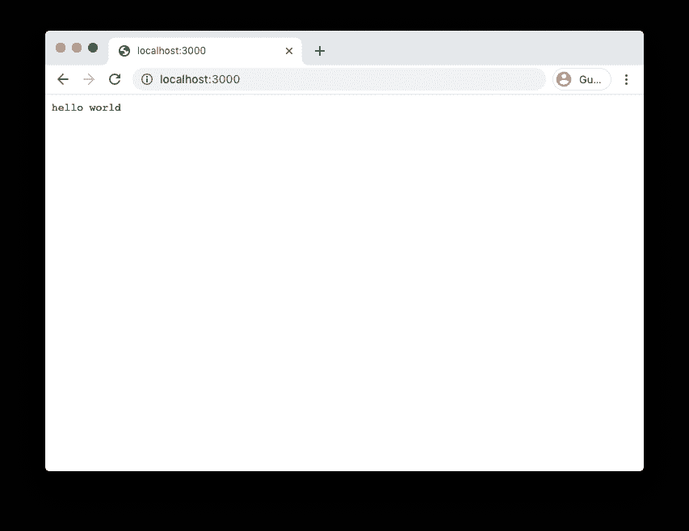
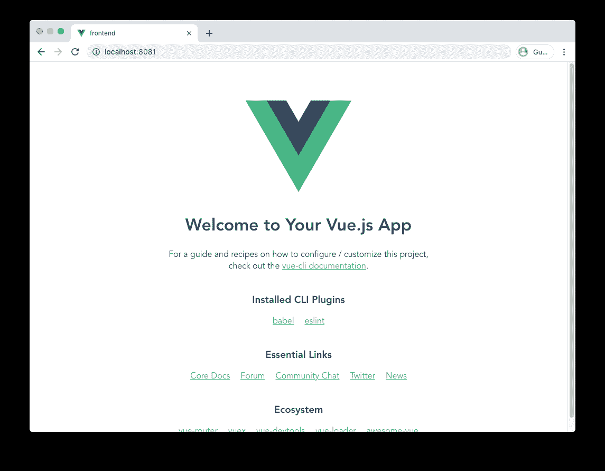
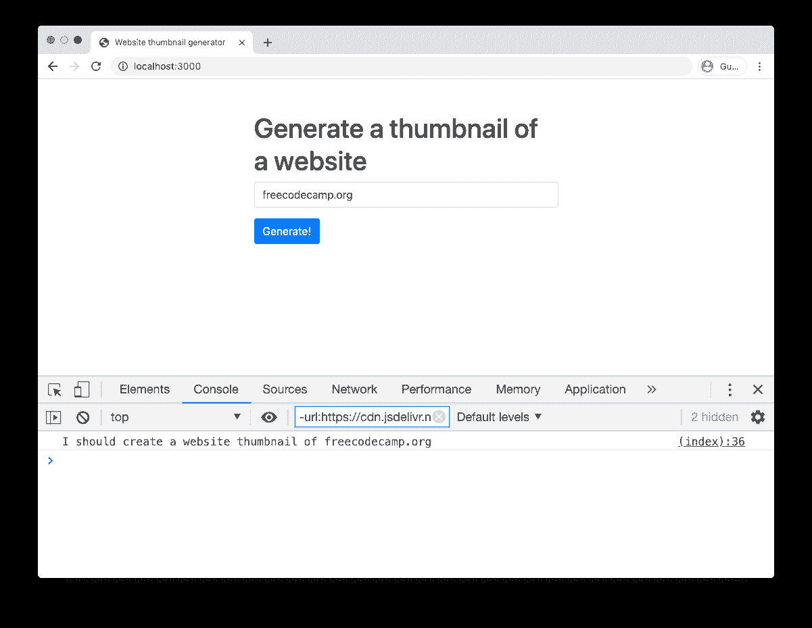
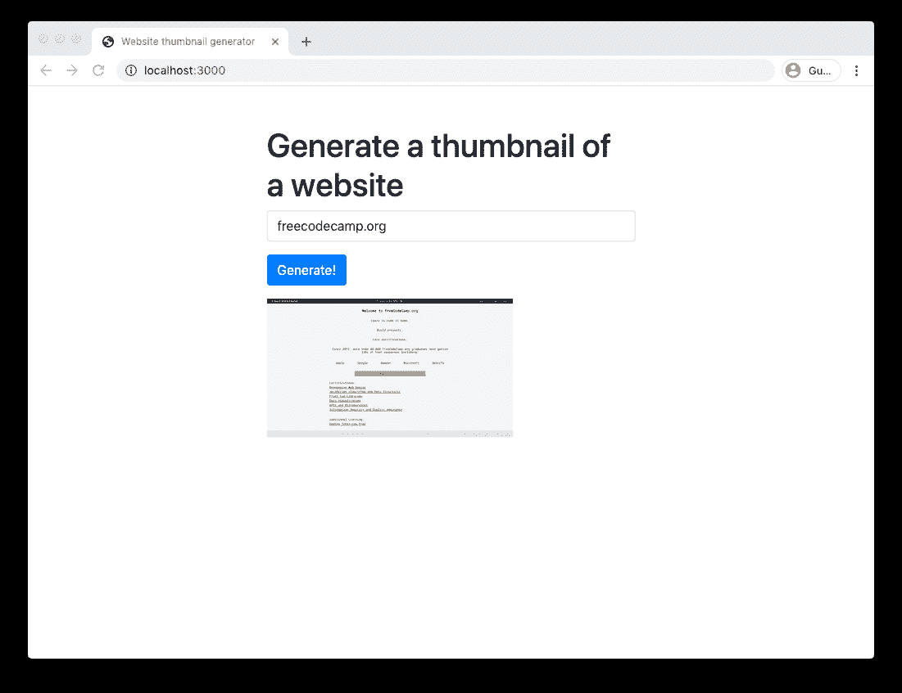
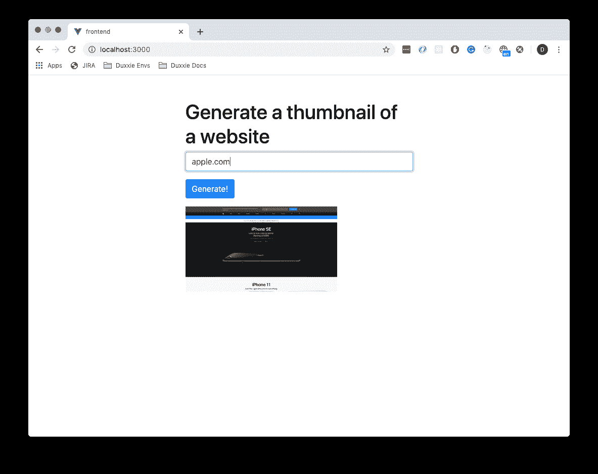

# 如何用 Go 和 Vue 建立一个真实的项目

> 原文：<https://www.freecodecamp.org/news/how-i-set-up-a-real-world-project-with-go-and-vue/>

当我第一次开始学习围棋编程时，我发现很难理解它。这比我编写的任何代码都要低级。

快进几个月，现在我是一个完全的粉丝，并且在很多项目中使用它。

在本文中，我将向您展示如何用 Go 和 Vue 建立一个全栈 web 应用程序。

让我们开始吧！

## 我们将要创造的

我认为创建一个网站缩略图生成器会很酷。这个想法是，你输入一个网站的网址，应用程序将为你生成该网站的缩略图。

## 设置 Go 模块

首先，我创建一个新目录。然后，我通过运行以下命令来设置 Go 模块。

```
go mod init github.com/Dirk94/website-thumbnail-generator
```

这将创建一个`go.mod`文件来跟踪所有的模块依赖关系。这类似于节点项目中的`package.json`文件。

接下来，我创建一个新目录`main`，在其中添加一个`server.go`文件。这将是应用程序的主要入口点。

现在，让我们只打印一个“hello world”消息。

```
package main

import "fmt"

func main() {
	fmt.Println("Hello world")
}
```

为了运行程序，我从项目目录中运行以下命令。

```
go run main/server.go
Hello world
```

很好，到目前为止一切正常！？

## 设置 web 服务器

我们应该创建一个 web 服务器来监听传入的请求。

我们来更新一下主函数。

```
func main() {
	http.HandleFunc("/", homePageHandler)

	fmt.Println("Server listening on port 3000")
	log.Panic(
		http.ListenAndServe(":3000", nil),
	)
}
```

这将启动一个 web 服务器并监听端口 3000。

任何进来的请求都将由`homePageHandler`函数处理。这还不存在，所以让我们创建它。

```
func homePageHandler(w http.ResponseWriter, r *http.Request) {
	_, err := fmt.Fprintf(w, "hello world")
	checkError(err)
}

func checkError(err error) {
	if err != nil {
		log.Panic(err)
	}
}
```

这个函数所做的就是将“hello world”写入`http.ResponseWriter`

`checkError`函数只是一个方便的函数，如果`error`不为零，它将停止程序并打印堆栈跟踪。

当运行程序时，网络服务器正确地打印“hello world”信息！



## 创建 Vue 项目

为了创建一个新的 Vue 项目，我从项目目录中运行以下命令。

```
vue create frontend
```

这会创建很多文件，但不要不知所措。让我们从运行 Vue 开发服务器开始。

```
yarn serve
```

当导航到 localhost:8081 时，您可以看到 Vue 应用程序工作！



好吧，让我们清理一下前端目录。

首先，我删除了`assets`和`components`目录，因为我不会使用它们。

然后我更新了`App.vue`文件。

```
<template>
  <div id="app" class="container">
    <div class="row">
      <div class="col-md-6 offset-md-3 py-5">
        <h1>Generate a thumbnail of a website</h1>

        <form v-on:submit.prevent="makeWebsiteThumbnail">
          <div class="form-group">
            <input v-model="websiteUrl" type="text" id="website-input" placeholder="Enter a website" class="form-control">
          </div>
          <div class="form-group">
            <button class="btn btn-primary">Generate!</button>
          </div>
        </form>
      </div>
    </div>
  </div>
</template>
```

我使用了`v-model`标签，并在表单提交时调用了一个`makeWebsiteThumbnail`函数。现在这些都不存在。我们来补充一下。

```
<script>
export default {
  name: 'App',

  data() { return {
    websiteUrl: '',
  } },

  methods: {
    makeWebsiteThumbnail() {
      console.log(`I should create a website thumbnail of ${this.websiteUrl}`);
    }
  }
}
</script>
```

我还使用了一些 Bootstrap 4 类，因此为了工作，我必须将 bootstrap CSS 添加到`public/index.html`文件中。

```
<!DOCTYPE html>
<html lang="en">
  <head>
    <link rel="stylesheet" href="https://stackpath.bootstrapcdn.com/bootstrap/4.4.1/css/bootstrap.min.css" integrity="sha384-Vkoo8x4CGsO3+Hhxv8T/Q5PaXtkKtu6ug5TOeNV6gBiFeWPGFN9MuhOf23Q9Ifjh" crossorigin="anonymous">

      <!--- The other stuff in the head tag here... -->
  </head>
```

好了，让我们启动 web 服务器，检查我们是否看到了日志消息。



很好，成功了！？

## 创建网站缩略图

为了创建网站缩略图，我将使用[screenshotapi.net](https://screenshotapi.net)。这样，我只需要调用一个 API 来帮我完成繁重的工作。

首先我安装 axios。

```
yarn add axios
```

然后我将它导入到`App.vue`文件中。

```
<script>
  import axios from 'axios';

  export default {
    name: 'App', 

    // The rest here... 
```

接下来，我更新了`makeWebsiteThumbnail`函数来实际调用截图 API。

```
makeWebsiteThumbnail() {
  axios.post("https://screenshotapi.net/api/v1/screenshot", {
    token: "SCREENSHOTAPI_TOKEN",
    url: this.websiteUrl,
    width: 1920,
    height: 1080,
    output: 'json',
    thumbnail_width: 300
  })
  .then((response) => {
    this.thumbnailUrl = response.data.screenshot;
  })
  .catch((error) => {
    window.alert(`The API returned an error: ${error}`);
  })
}
```

确保用您的令牌替换`SCREENSHOTAPI_TOKEN`。

我将变量`thumbnailUrl`设置为由 API 创建的截图 URL。为了使这个工作，我必须添加 2 件事。

首先，我将变量`thumbnailUrl`添加到 Vue `data`对象中。

```
data: {
  websiteUrl: '',
  thumbnailUrl: '',
},
```

其次，我创建了一个将显示`thumbnailUrl`图像的`img`标签。

```

```

让我们启动 web 服务器，看看结果:



它显示了 freeCodeCamp 的缩略图，不错！

## 将 Go 和 Vue 粘合在一起

现在，我们已经使用 Vue 开发服务器来加速前端。它可以工作，但是开发服务器应该只用于本地开发。

当我们在生产环境中托管这个应用程序时，您将希望使用一个“真正的”web 服务器来处理传入的请求。

幸运的是，我们有这样一个东西:我们的围棋服务器。

我们要做的第一件事是编译我们的前端。

```
yarn run build
```

这将创建一个包含已编译资产的`dist`目录。

我们应该更新 Go 服务器来提供这个目录中的文件。

为此，我更新了`main.go`文件中的`main`函数。

```
func main() {
	// Serve static files from the frontend/dist directory.
	fs := http.FileServer(http.Dir("./frontend/dist"))
	http.Handle("/", fs)

	// Start the server.
	fmt.Println("Server listening on port 3000")
	log.Panic(
		http.ListenAndServe(":3000", nil),
	)
}
```

如您所见，我们简单地将`frontend/dist`目录传递给文件服务器。

当运行 go 程序并导航到`localhost:3000`时，您确实可以看到该应用程序！

## 让应用程序更加安全

现在我们有一个重大的安全漏洞。截屏 API 令牌在我们的前端代码中是可见的。

这意味着任何查看网页的人都可以窃取令牌。

让我们通过使用我们的服务器调用截图 API 来解决这个问题。这样，只有服务器需要知道令牌。

在`server.go`中，我创建了一个新的函数，它将监听对`/api/thumbnail`端点的任何请求。

```
type thumbnailRequest struct {
	Url string `json:"url"`
}

func thumbnailHandler(w http.ResponseWriter, r *http.Request) {
	var decoded thumbnailRequest

	// Try to decode the request into the thumbnailRequest struct.
	err := json.NewDecoder(r.Body).Decode(&decoded)
	if err != nil {
		http.Error(w, err.Error(), http.StatusBadRequest)
		return
	}

	fmt.Printf("Got the following url: %s\n", decoded.Url)
}
```

现在，我们只是从请求中提取并打印 URL 参数。

为了完成这项工作，我更新了`main`函数来使用我们的`thumbnailHandler`函数。

```
func main() {
	// Use the thumbnailHandler function 
	http.HandleFunc("/api/thumbnail", thumbnailHandler)

	fs := http.FileServer(http.Dir("./frontend/dist"))
	http.Handle("/", fs)

	fmt.Println("Server listening on port 3000")
	log.Panic(
		http.ListenAndServe(":3000", nil),
	)
}
```

最后，我应该更新`App.vue`文件来调用 Go 服务器，而不是截图 API。

```
makeWebsiteThumbnail() {
  // Call the Go API, in this case we only need the URL parameter.
  axios.post("http://localhost:3000/api/thumbnail", {
    url: this.websiteUrl,
  })
  .then((response) => {
    this.thumbnailUrl = response.data.screenshot;
  })
  .catch((error) => {
    window.alert(`The API returned an error: ${error}`);
  })
}
```

当测试新的设置时，我确实在 go 服务器上看到了一条日志消息。

```
go run main/server.go
Got the following url: freecodecamp.org
```

## 从 Go 调用屏幕截图 API

让我们实际上从我们的 Go 服务器调用截图 API。

首先，我创建了一个`struct`，它保存了调用截图 API 所需的所有参数。

```
type screenshotAPIRequest struct {
	Token          string `json:"token"`
	Url            string `json:"url"`
	Output         string `json:"output"`
	Width          int    `json:"width"`
	Height         int    `json:"height"`
	ThumbnailWidth int    `json:"thumbnail_width"`
}
```

然后，我更新了`thumbnailHandler`函数来创建一个 http POST 请求并调用 API。

```
func thumbnailHandler(w http.ResponseWriter, r *http.Request) {
	var decoded thumbnailRequest

	// Try to decode the request into the thumbnailRequest struct.
	err := json.NewDecoder(r.Body).Decode(&decoded)
	if err != nil {
		http.Error(w, err.Error(), http.StatusBadRequest)
		return
	}

	// Create a struct with the parameters needed to call the ScreenshotAPI.
	apiRequest := screenshotAPIRequest{
		Token:          "SCREENSHOTAPI_TOKEN",
		Url:            decoded.Url,
		Output:         "json",
		Width:          1920,
		Height:         1080,
		ThumbnailWidth: 300,
	}

	// Convert the struct to a JSON string.
	jsonString, err := json.Marshal(apiRequest)
	checkError(err)

	// Create a HTTP request.
	req, err := http.NewRequest("POST", "https://screenshotapi.net/api/v1/screenshot", bytes.NewBuffer(jsonString))
	req.Header.Set("Content-Type", "application/json")

	// Execute the HTTP request.
	client := &http.Client{}
	response, err := client.Do(req)
	checkError(err)

	// Tell Go to close the response at the end of the function.
	defer response.Body.Close();

	// Read the raw response into a Go struct.
	type screenshotAPIResponse struct {
		Screenshot string `json"screenshot"`
	}
	var apiResponse screenshotAPIResponse
	err = json.NewDecoder(response.Body).Decode(&apiResponse)
	checkError(err)

	// Pass back the screenshot URL to the frontend.
	_, err = fmt.Fprintf(w, `{ "screenshot": "%s" }`, apiResponse.Screenshot)
	checkError(err)
}
```

当重启 Go 服务器时，你可以看到缩略图生成器仍然工作！另外，现在没人能偷我们的 API 令牌了。



## 结论

我们已经使用 Go 和 Vue 建立了一个全栈网站缩略图生成器。前端与后端是分离的，我们在混合中添加了一个外部 API，我们从 Go 服务器调用它。

你可以在这里查看 [live 版本，在这里](https://coffeecoding.dev/website-thumbnail-generator)查看 [Github 源代码。](https://github.com/Dirk94/website-thumbnail-generator)

快乐编码！