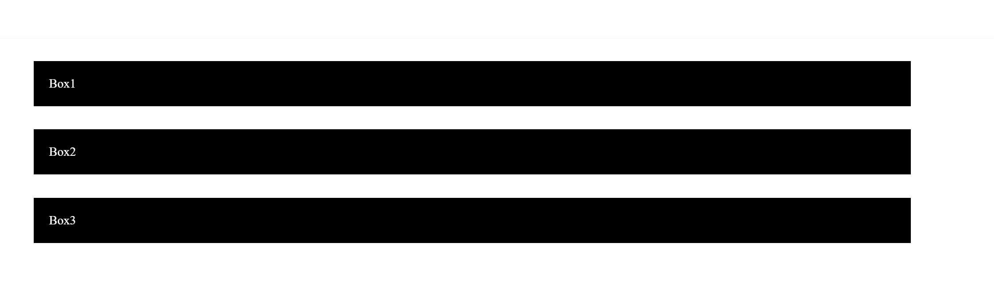
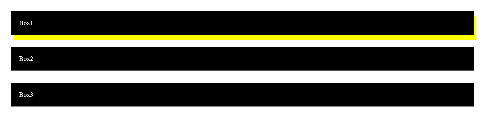
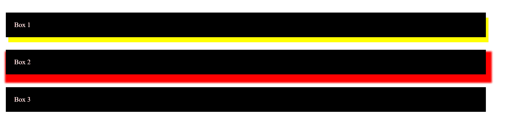
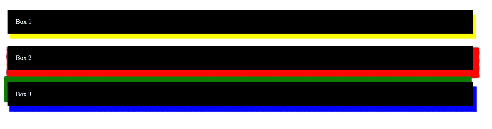
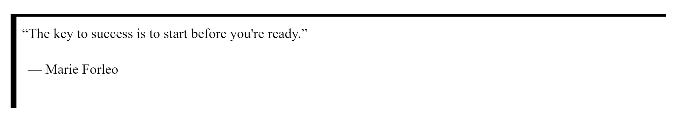
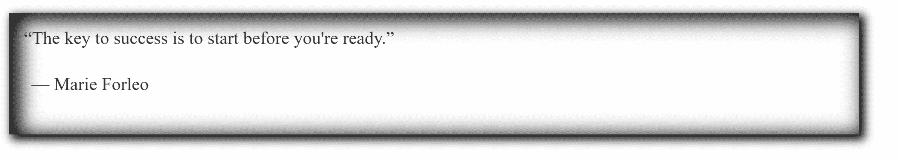

# 如何给任何 HTML 元素添加阴影

> 原文：<https://www.freecodecamp.org/news/css-tutorial-drop-shadow/>

我们可以使用 CSS 属性`box-shadow`给任何 HTML 元素添加阴影。以下是方法。

## 添加基本投影

让我们首先设置一些基本的 HTML 元素来添加我们的阴影:

```
<div id="box1" class="box">Box1</div>
<div id="box2" class="box">Box2</div>
<div id="box3" class="box">Box3</div>
```

然后添加一些基本的 CSS:

```
p {
    padding: 10px;
}
.box {
    padding: 20px;
    width: 50%;
    margin: 30px auto;
    background: #000;
    color: #fff;
}
```

结果就是三个黑盒，我们可以通过调用它们的唯一 id 来轻松添加阴影:



HTML elements setup

要添加一个基本的投影，让我们使用 Box 1 的`box-shadow`属性:

```
/* offset-x | offset-y | color */
#box1 {
    box-shadow: 6px 12px yellow;
}
```



Adding a basic drop shadow to Box 1

这里有三个参数。前两个分别是 x 偏移和 y 偏移。他们设置投影的位置。

偏移量是相对于原点的，在 HTML 中，原点总是元素的左上角。正的 x 偏移会将阴影向右移动，正的 y 偏移会将阴影向下移动。

第三个参数是你的阴影的颜色。

请记住，尽管我们在这里使用了`<div>`元素，但是`box-shadow`属性也可以应用于任何其他 HTML 元素。

## 添加模糊半径

如果我们想让阴影看起来更真实一点，我们将会尝试使用`blur-radius`参数。

此参数控制模糊阴影的程度，使其变得更大更亮。让我们将它应用到方框 2:

```
/* offset-x | offset-y | blur-radius | color */
#box2 {
	box-shadow: 6px 12px 4px red;
}
```


Adding a blur radius to Box 2

4px 的值设置应用于投影的模糊半径。

## 添加扩散半径

如果我们想要控制阴影的大小，我们可以使用`spread-radius`参数来控制阴影的大小。

让我们将 8px 的扩散半径添加到框 2 中:

```
/* offset-x | offset-y | blur-radius | spread-radius | color */
#box2 {
    box-shadow: 6px 12px 4px 8px red;
}
```



Adding a spread radius in addition to a blur to Box 2

记住这些参数的顺序！

## 在单个属性中组合多个阴影

如果我们想变得有趣，我们可以使用一个属性给一个元素添加多个阴影。

让我们通过同时添加蓝色和绿色的阴影来完成第三个盒子:

```
/* Any number of shadows, separated by commas */
#box3 {
    box-shadow: 6px 12px 2px 2px blue, -6px -12px 2px 2px green;
}
```



Adding multiple drop shadows to Box 3

## 额外收获:创造一个嵌入的阴影

虽然`inset`参数不会创建投影，但它也可以与`box-shadow`属性一起使用。

顾名思义，该参数创建一个嵌入阴影(即盒子内部的阴影)。

`inset`参数可以放在
`box-shadow`属性的开头或结尾。这里我们用一个`blockquote`元素来演示它的用法。

HTML:

```
<blockquote>
  <q>The key to success is to start before you're ready.</q>
  <p>&mdash; Marie Forleo</p>
</blockquote>
```

CSS:

```
blockquote {
  width: 50%;
  margin: 50px auto;
  padding: 20px;
  font-size: 24px;
  box-shadow: inset 10px 5px black;
}
```



Create an inset shadow

当然，您可以添加一些模糊和扩散来增强阴影，甚至多个阴影:

```
 box-shadow: inset 10px 5px 25px 5px black, 5px 5px 12px 2px black;
```



Inset shadow combined with drop shadow

使用`box-shadow`属性，我们可以很容易地使网页上的元素突出来，以创建一个漂亮的 3D 灯光效果。

如果你想自己做一些实验，这里有一个我用本教程中的例子创建的[代码笔](https://codepen.io/1000mileworld/pen/dyYeggy)。

玩一玩，看看你能想出什么！

## 想看更多的网页开发技巧和知识？

*   订阅我的每周简讯
*   在 [1000 英里世界](https://1000mileworld.com/)访问我的博客
*   在 Twitter 上关注我