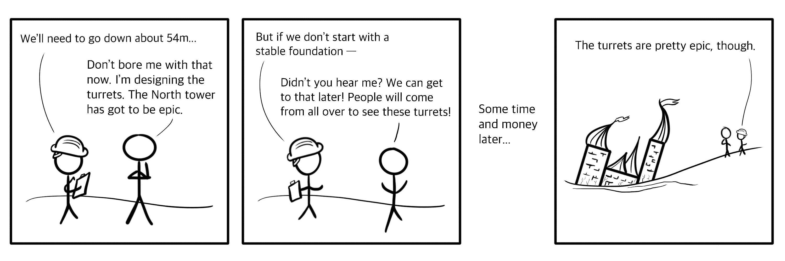

# 如果你想建立一个安全的树屋(或软件应用程序)，从底层开始

> 原文：<https://www.freecodecamp.org/news/if-you-want-to-build-a-treehouse-start-at-the-bottom/>

如果你曾经看过一个孩子画一个树屋，你就会知道当安全性不是首要问题时，应用程序是如何构建的。

画轮胎秋千、前门廊和游泳池要比担心一万加仑的水桶如何悬在半空中有趣得多。

过多的注意力花在有趣和华而不实的功能上，基金会受到损害。

A comic I drew about building stable foundations. It's not that funny.

当然，花费过多的时间来构建像 Fort Knox 这样的后端对于您的应用程序来说可能也是不必要的。成为安全的倡导者并不意味着总是戴着锡纸帽(尽管你戴着它看起来很时髦)，而是意味着建立适当的安全。

多少安全性合适？令人沮丧的是，答案是“视情况而定”。应用程序的适当安全性取决于谁在使用它，它做什么，最重要的是，它可能会做什么不良的事情。

需要进行一些分析来决定您的应用程序所面临的风险种类，以及您将如何准备处理它们。好吧，现在是时候戴上你的锡纸帽子了。让我们想象一下最坏的情况。

## 威胁建模:可能发生的最坏情况是什么？

*威胁模型*是一个乏味的术语，指的是试图想象应用程序可能发生的最坏情况的结果。利用你的想象力来评估风险(恰如其分地称为*风险评估*)是一种便捷的非破坏性方法，可以找到应用程序被攻击的途径。

你不需要任何工具——只需要了解应用程序如何工作，以及一点想象力。你需要用纸和笔来记录你的结果。对于年轻人来说，这意味着你手机上的笔记应用。

在软件世界中可以找到一些不同的应用程序风险评估方法，包括深入的 [NIST 特别出版物 800-30](https://csrc.nist.gov/publications/detail/sp/800-30/rev-1/final) 。每种方法的框架都有特定的步骤和输出，并且在定义威胁时会进入不同的细节层次。

如果遵循一个框架，首先选择一个你最有可能完成的。你总是可以从那里添加更多的深度和细节。

即使是非正式的风险评估也是有益的。通常采用一组问题的形式，它们可能围绕可能的威胁、对资产的影响或漏洞可能被利用的方式。

以下是针对每个方向的一些问题示例:

*   什么样的对手会想破坏我的应用？他们想要什么？
*   如果 *x* 的控制权落入坏人之手，攻击者可以用它做什么？
*   我的应用程序中哪里会出现 *x* 漏洞？

基本威胁模型解释了每种风险的技术、业务和人员考虑因素。它通常会详细说明:

*   可能导致风险的漏洞或组件
*   成功执行风险对应用程序的影响
*   对应用程序用户或组织的影响

风险评估练习的结果就是您的威胁模型。换句话说，这是一个你不希望发生的事情的列表。

它通常按照风险等级排序，从最严重到最轻微。最坏的风险具有最大的负面影响，也是最需要防范的。最温和的风险是最可接受的——尽管仍然是不希望的结果，但它们对应用程序和用户的负面影响最小。

您可以使用这个层次结构作为指南，来确定在每个风险领域应用多少网络安全措施。为您的应用程序提供适当的安全性将消除(在可能的情况下)或减轻最坏的风险。

## 向左推

虽然这听起来像一个舞蹈动作迷因，但是*向左推*指的是在软件开发的早期阶段尽可能多地构建您计划的安全性。

构建软件很像构建树屋，只是没有令人愉快的新鲜空气。你从基本的支撑组件开始，例如将平台连接到树上。然后是框架、墙壁和屋顶，最后是你的乡村现代 Instagram 风格的壁挂和鹿半身像。

构建过程进行得越久，对已经安装的组件进行更改就越困难，成本也越高。

如果您在屋顶安装到位后才发现墙壁有问题，您可能需要更换或拆除屋顶来修复它。对于软件组件也可以画出相似的平行线，只是在分离附加部分时没有相似的容易度。

在树屋的情况下，从装饰甚至屋顶开始是相当不可能的，因为你不能真的把它们悬在半空中。

在软件开发的情况下，不幸的是，在没有足够的支持架构的情况下，构建许多顶层组件和抽象是可能的。

左推式方法认为每增加一层都会增加成本和复杂性。向左推进意味着在进入下一个开发阶段之前，尝试在每个开发阶段尽可能地减少安全风险。

## 自下而上构建

通过在开发应用程序的早期阶段考虑您的威胁模型，您减少了以后需要进行昂贵的重新建模的机会。您可以选择支持特定应用程序主要安全目标的体系结构、组件和代码。

虽然不可能预见到您的应用程序有一天可能需要支持的所有功能，但有可能准备一个坚实的基础，允许更安全地添加附加功能。自下而上地构建适当的安全性将有助于将来更容易地降低安全风险。