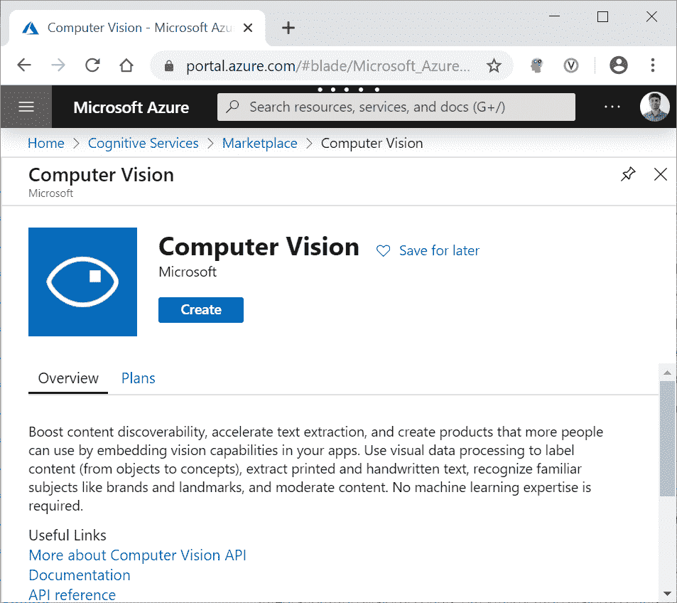
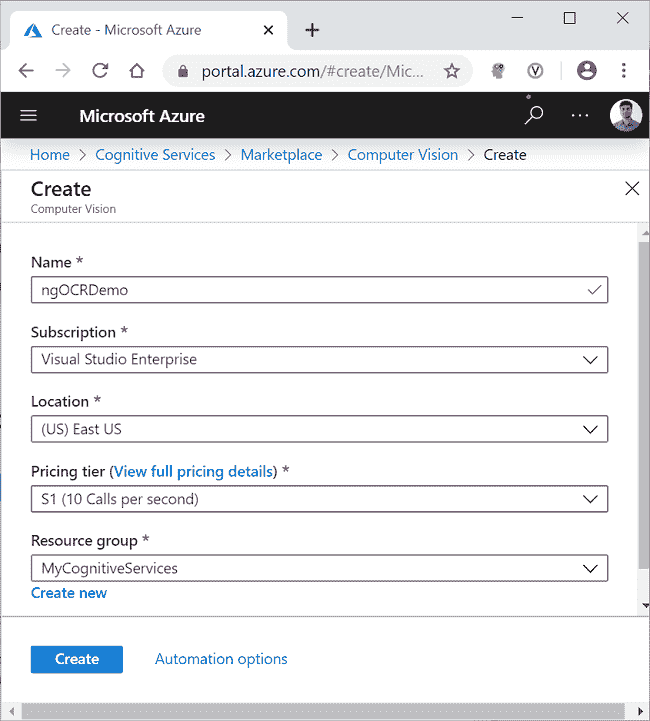
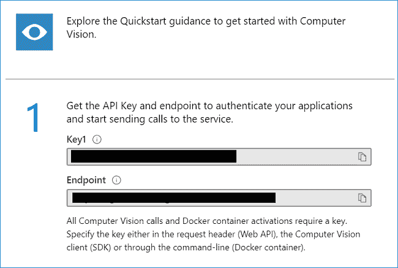
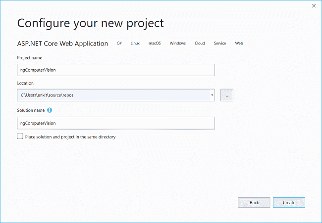
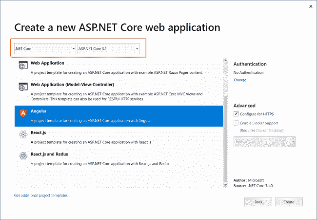
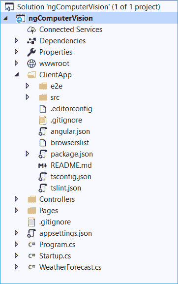
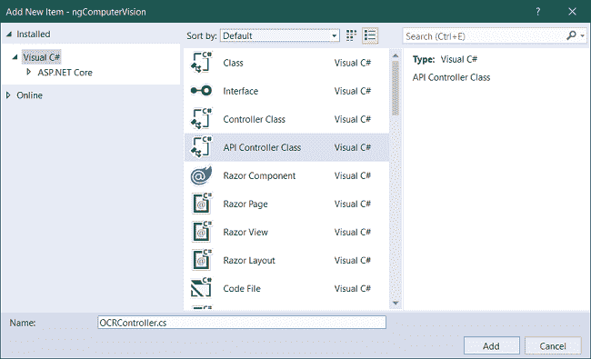
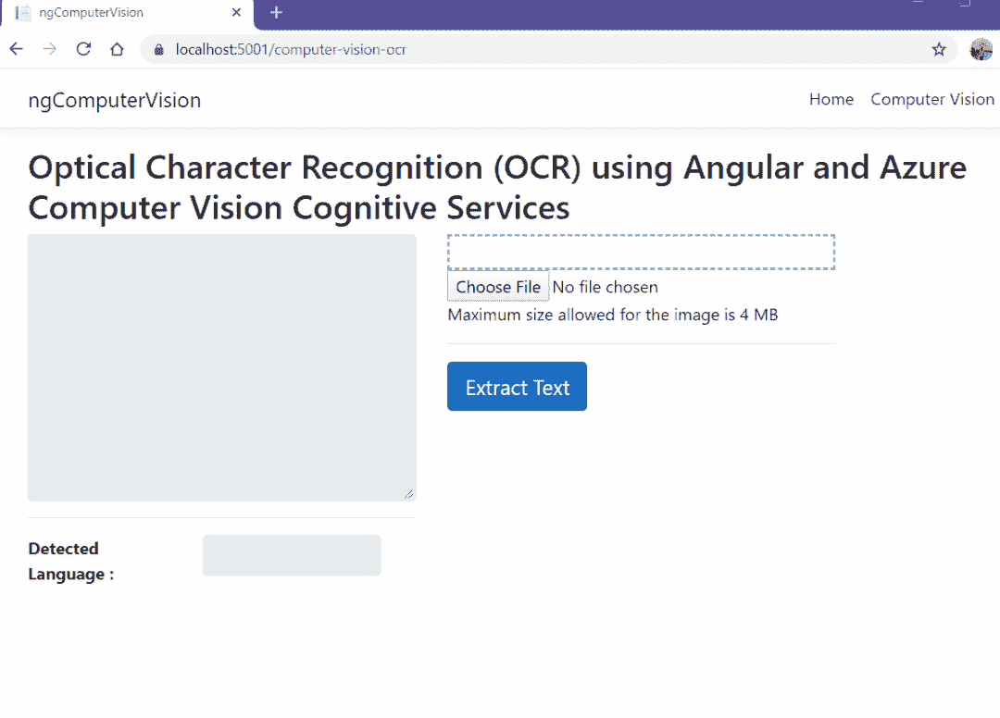

# 如何使用 Angular 和 Azure 计算机视觉创建光学字符阅读器

> 原文：<https://www.freecodecamp.org/news/how-to-create-an-optical-character-reader-using-angular-and-azure-computer-vision/>

## 介绍

在本文中，我们将使用 Angular 和 Azure 计算机视觉认知服务创建一个光学字符识别(OCR)应用程序。

计算机视觉是一种分析图像内容的人工智能服务。我们将使用计算机视觉的 OCR 功能来检测图像中的印刷文本。应用程序将从图像中提取文本，并检测文本的语言。

目前，OCR API 支持 25 种语言。

## 先决条件

*   安装节点的最新 LTS 版本。来自 https://nodejs.org/en/download/的 JS
*   从[https://cli.angular.io/](https://cli.angular.io/)安装角度 CLI
*   安装。来自[https://dotnet.microsoft.com/download/dotnet-core/3.1](https://dotnet.microsoft.com/download/dotnet-core/3.1)的 NET Core 3.1 SDK
*   从[https://visualstudio.microsoft.com/downloads/](https://visualstudio.microsoft.com/downloads/)安装最新版本的 Visual Studio 2019
*   Azure 订阅帐户。你可以在[https://azure.microsoft.com/en-in/free/](https://azure.microsoft.com/en-in/free/)创建一个免费的 Azure 账户

## 源代码

可以从 [GitHub](https://github.com/AnkitSharma-007/Angular-Computer-Vision-Azure-Cognitive-Services) 获取源代码。

> 我们将为这个应用程序使用 ASP.NET 核心后端。ASP.NET 核心后端提供了一个直接的认证过程来访问 Azure 认知服务。这也将确保最终用户不会直接访问认知服务。

## 创建 Azure 计算机视觉认知服务资源

登录 Azure 门户，在搜索栏中搜索认知服务，然后点击结果。请参考下图。


在下一个屏幕上，单击添加按钮。这将打开认知服务市场页面。在搜索栏中搜索计算机视觉，然后单击搜索结果。它将打开计算机视觉 API 页面。单击“创建”按钮创建新的计算机视觉资源。请参考下图。



在“创建”页面上，填写如下所示的详细信息。

*   **Name** :给你的资源起一个唯一的名字。
*   **订阅**:下拉选择订阅类型。
*   **定价等级**:根据您的选择选择定价等级。
*   **资源组**:选择一个已有的资源组或创建一个新的资源组。

点击创建按钮。请参考下图。



成功部署资源后，单击“转到资源”按钮。您可以看到新创建的计算机视觉资源的键和端点。请参考下图。



记下密钥和端点。在本文的后半部分，我们将使用它们从。NET 代码。为了保密，这里的值被屏蔽了。

## 创建 ASP.NET 核心应用程序

打开 Visual Studio 2019，点击“新建项目”。将会打开一个“创建新项目”对话框。选择“ASP。NET Core Web 应用程序”并单击“下一步”。现在，您将进入“配置您的新项目”屏幕，为您的应用程序提供名称`ngComputerVision`，然后单击 create。请参考下图。



您将被导航至“创建新的 ASP.NET 核心 web 应用程序”屏幕。选择”。NET Core”和“ASP。NET Core 3.1 英寸，从顶部的下拉列表中选择。然后，选择“Angular”项目模板并点击`Create`。请参考下图。



这将创建我们的项目。应用程序的文件夹结构如下所示。



`ClientApp`文件夹包含我们应用的角度代码。控制器文件夹将包含我们的 API 控制器。角度组件存在于`ClientApp\src\app`文件夹中。

默认模板包含一些角度组件。这些组件不会影响我们的应用程序，但是为了简单起见，我们将从`ClientApp/app/components`文件夹中删除 fetchdata 和 counter 文件夹。此外，从`app.module.ts`文件中删除这两个组件的引用。

## 安装计算机视觉 API 库

我们将安装 Azure 计算机视觉 API 库，它将为我们提供现成的模型来处理计算机视觉 REST API 响应。要安装软件包，请导航到工具>>获取软件包管理器>>软件包管理器控制台。它将打开软件包管理器控制台。运行如下所示的命令。

```
Install-Package Microsoft.Azure.CognitiveServices.Vision.ComputerVision -Version 5.0.0
```

你可以在 [NuGet gallery](https://www.nuget.org/packages/Microsoft.Azure.CognitiveServices.Vision.ComputerVision/) 了解更多关于这个包的信息。

## 创建模型

右键单击`ngComputerVision`项目并选择添加> >新文件夹。将文件夹命名为 Models。同样，右击 Models 文件夹并选择 Add > > Class 来添加一个新的类文件。将您的类命名为`LanguageDetails.cs`,然后单击 Add。

打开 [LanguageDetails.cs](https://github.com/AnkitSharma-007/Angular-Computer-Vision-Azure-Cognitive-Services/blob/master/ngComputerVision/Models/LanguageDetails.cs) ，将以下代码放入其中。

```
namespace ngComputerVision.Models
{
    public class LanguageDetails
    {
        public string Name { get; set; }
        public string NativeName { get; set; }
        public string Dir { get; set; }
    }
}
```

类似地，添加一个新的类文件 [AvailableLanguage.cs](https://github.com/AnkitSharma-007/Angular-Computer-Vision-Azure-Cognitive-Services/blob/master/ngComputerVision/Models/AvailableLanguage.cs) ，并将以下代码放入其中。

```
using System.Collections.Generic;

namespace ngComputerVision.Models
{
    public class AvailableLanguage
    {
        public Dictionary<string, LanguageDetails> Translation { get; set; }
    }
}
```

我们还将添加两个类作为 DTO(数据传输对象),用于将数据发送回客户端。

创建一个新文件夹，并将其命名为 DTOModels。在 DTOModels 文件夹中添加新的类文件 [AvailableLanguageDTO.cs](https://github.com/AnkitSharma-007/Angular-Computer-Vision-Azure-Cognitive-Services/blob/master/ngComputerVision/DTOModels/AvailableLanguageDTO.cs) ,并将以下代码放入其中。

```
namespace ngComputerVision.DTOModels
{
    public class AvailableLanguageDTO
    {
        public string LanguageID { get; set; }
        public string LanguageName { get; set; }
    }
}
```

添加 [OcrResultDTO.cs](https://github.com/AnkitSharma-007/Angular-Computer-Vision-Azure-Cognitive-Services/blob/master/ngComputerVision/DTOModels/OcrResultDTO.cs) 文件，并将以下代码放入其中。

```
namespace ngComputerVision.DTOModels
{
    public class OcrResultDTO
    {
        public string Language { get; set; }
        public string DetectedText { get; set; }
    }
}
```

## 添加 OCR 控制器

我们将在应用程序中添加一个新的控制器。右键单击控制器文件夹并选择添加>>新项目。将会打开“添加新项目”对话框。从左侧面板中选择“Visual C#”，然后从模板面板中选择“API 控制器类”，并将名称设为`OCRController.cs`。点击添加。

参考下图。



`OCRController`将处理来自客户端应用程序的图像识别请求。该控制器还将返回 OCR API 支持的所有语言的列表。

打开 [OCRController.cs](https://github.com/AnkitSharma-007/Angular-Computer-Vision-Azure-Cognitive-Services/blob/master/ngComputerVision/Controllers/OCRController.cs) 文件，将以下代码放入其中。

```
using System;
using System.Threading.Tasks;
using Microsoft.AspNetCore.Mvc;
using System.Net.Http;
using System.Net.Http.Headers;
using Newtonsoft.Json.Linq;
using System.IO;
using Newtonsoft.Json;
using System.Text;
using ngComputerVision.Models;
using System.Collections.Generic;
using Microsoft.Azure.CognitiveServices.Vision.ComputerVision.Models;
using ngComputerVision.DTOModels;

namespace ngComputerVision.Controllers
{
    [Produces("application/json")]
    [Route("api/[controller]")]
    public class OCRController : Controller
    {
        static string subscriptionKey;
        static string endpoint;
        static string uriBase;

        public OCRController()
        {
            subscriptionKey = "b993f3afb4e04119bd8ed37171d4ec71";
            endpoint = "https://ankitocrdemo.cognitiveservices.azure.com/";
            uriBase = endpoint + "vision/v2.1/ocr";
        }

        [HttpPost, DisableRequestSizeLimit]
        public async Task<OcrResultDTO> Post()
        {
            StringBuilder sb = new StringBuilder();
            OcrResultDTO ocrResultDTO = new OcrResultDTO();
            try
            {
                if (Request.Form.Files.Count > 0)
                {
                    var file = Request.Form.Files[Request.Form.Files.Count - 1];

                    if (file.Length > 0)
                    {
                        var memoryStream = new MemoryStream();
                        file.CopyTo(memoryStream);
                        byte[] imageFileBytes = memoryStream.ToArray();
                        memoryStream.Flush();

                        string JSONResult = await ReadTextFromStream(imageFileBytes);

                        OcrResult ocrResult = JsonConvert.DeserializeObject<OcrResult>(JSONResult);
                        if (!ocrResult.Language.Equals("unk"))
                        {
                            foreach (OcrLine ocrLine in ocrResult.Regions[0].Lines)
                            {
                                foreach (OcrWord ocrWord in ocrLine.Words)
                                {
                                    sb.Append(ocrWord.Text);
                                    sb.Append(' ');
                                }
                                sb.AppendLine();
                            }
                        }
                        else
                        {
                            sb.Append("This language is not supported.");
                        }
                        ocrResultDTO.DetectedText = sb.ToString();
                        ocrResultDTO.Language = ocrResult.Language;
                    }
                }
                return ocrResultDTO;
            }
            catch
            {
                ocrResultDTO.DetectedText = "Error occurred. Try again";
                ocrResultDTO.Language = "unk";
                return ocrResultDTO;
            }
        }

        static async Task<string> ReadTextFromStream(byte[] byteData)
        {
            try
            {
                HttpClient client = new HttpClient();
                client.DefaultRequestHeaders.Add("Ocp-Apim-Subscription-Key", subscriptionKey);
                string requestParameters = "language=unk&detectOrientation=true";
                string uri = uriBase + "?" + requestParameters;
                HttpResponseMessage response;

                using (ByteArrayContent content = new ByteArrayContent(byteData))
                {
                    content.Headers.ContentType = new MediaTypeHeaderValue("application/octet-stream");
                    response = await client.PostAsync(uri, content);
                }

                string contentString = await response.Content.ReadAsStringAsync();
                string result = JToken.Parse(contentString).ToString();
                return result;
            }
            catch (Exception e)
            {
                return e.Message;
            }
        }

        [HttpGet]
        public async Task<List<AvailableLanguageDTO>> GetAvailableLanguages()
        {
            string endpoint = "https://api.cognitive.microsofttranslator.com/languages?api-version=3.0&scope=translation";
            var client = new HttpClient();
            using (var request = new HttpRequestMessage())
            {
                request.Method = HttpMethod.Get;
                request.RequestUri = new Uri(endpoint);
                var response = await client.SendAsync(request).ConfigureAwait(false);
                string result = await response.Content.ReadAsStringAsync();

                AvailableLanguage deserializedOutput = JsonConvert.DeserializeObject<AvailableLanguage>(result);

                List<AvailableLanguageDTO> availableLanguage = new List<AvailableLanguageDTO>();

                foreach (KeyValuePair<string, LanguageDetails> translation in deserializedOutput.Translation)
                {
                    AvailableLanguageDTO language = new AvailableLanguageDTO();
                    language.LanguageID = translation.Key;
                    language.LanguageName = translation.Value.Name;

                    availableLanguage.Add(language);
                }
                return availableLanguage;
            }
        }
    }
} 
```

在类的构造函数中，我们已经初始化了 OCR API 的密钥和端点 URL。

Post 方法将接收图像数据作为请求主体中的文件集合，并返回一个类型为`OcrResultDTO`的对象。我们将把图像数据转换成一个字节数组，并调用`ReadTextFromStream`方法。我们将把响应反序列化成一个类型为`OcrResult`的对象。然后，我们将通过迭代`OcrWord`对象来形成句子。

在`ReadTextFromStream`方法中，我们将创建一个新的`HttpRequestMessage`。这个 HTTP 请求是一个 Post 请求。我们将在请求的头部传递订阅密钥。OCR API 将返回一个 JSON 对象，该对象包含图像中的每个单词以及检测到的文本语言。

方法将返回翻译文本 API 支持的所有语言的列表。我们将设置请求 URI 并创建一个`HttpRequestMessage`,这将是一个 Get 请求。这个请求 URI 将返回一个 JSON 对象，该对象将被反序列化为一个类型为`AvailableLanguage`的对象。

### 为什么我们需要获取支持语言的列表？

OCR API 返回语言代码(例如，en 代表英语，de 代表德语，等等。)的语言。但是我们不能在 UI 上显示语言代码，因为它对用户不友好。所以我们需要一本字典来查找语言代码对应的语言名称。

Azure 计算机视觉 OCR API 支持 25 种语言。要了解 OCR API 支持的所有语言，请参见[支持的语言列表](https://docs.microsoft.com/en-us/azure/cognitive-services/computer-vision/language-support)。这些语言是 Azure 翻译文本 API 支持的语言的子集。

因为没有专门的 API 端点来获取 OCR API 支持的语言列表，所以我们使用翻译文本 API 端点来获取语言列表。我们将使用来自这个 API 调用的 JSON 响应创建语言查找字典，并根据 OCR API 返回的语言代码过滤结果。

## 在应用程序的客户端工作

客户端的代码可以在 ClientApp 文件夹中找到。我们将使用 Angular CLI 来处理客户端代码。

> 使用 Angular CLI 不是强制性的。我在这里使用 Angular CLI，因为它用户友好且易于使用。如果您不想使用 CLI，则可以手动创建组件和服务的文件。

导航到计算机中的 ngComputerVision\ClientApp 文件夹，并打开一个命令窗口。我们将在此窗口中执行所有 Angular CLI 命令。

## 创建客户端模型

在`ClientApp\src\app`文件夹中创建一个名为 models 的文件夹。现在我们将在 models 文件夹中创建一个文件 [availablelanguage.ts](https://github.com/AnkitSharma-007/Angular-Computer-Vision-Azure-Cognitive-Services/blob/master/ngComputerVision/ClientApp/src/app/models/availablelanguage.ts) 。把下面的代码放进去。

```
export class AvailableLanguage {
    languageID: string;
    languageName: string;
}
```

类似地，在 models 文件夹中创建另一个名为 [ocrresult.ts](https://github.com/AnkitSharma-007/Angular-Computer-Vision-Azure-Cognitive-Services/blob/master/ngComputerVision/ClientApp/src/app/models/ocrresult.ts) 的文件。把下面的代码放进去。

```
export class OcrResult {
    language: string;
    detectedText: string
}
```

您可以观察到，这两个类与我们在服务器端创建的 DTO 类具有相同的定义。这将允许我们将从服务器返回的数据直接绑定到我们的模型。

## 创建计算机视觉服务

我们将创建一个 Angular 服务，它将调用 Web API 端点，将 Web API 响应转换为 JSON，并将其传递给我们的组件。运行以下命令。

```
ng g s services\Computervision
```

该命令将创建一个名为 services 的文件夹，然后在其中创建以下两个文件。

*   computer vision . service . ts-服务类文件。
*   computer vision . service . spec . ts—服务的单元测试文件。

打开[computer vision . service . ts](https://github.com/AnkitSharma-007/Angular-Computer-Vision-Azure-Cognitive-Services/blob/master/ngComputerVision/ClientApp/src/app/services/computervision.service.ts)文件，将以下代码放入其中。

```
import { Injectable } from '@angular/core';
import { HttpClient } from '@angular/common/http';

@Injectable({
  providedIn: 'root'
})
export class ComputervisionService {

  baseURL: string;

  constructor(private http: HttpClient) {
    this.baseURL = '/api/OCR';
  }

  getAvailableLanguage() {
    return this.http.get(this.baseURL)
      .pipe(response => {
        return response;
      });
  }

  getTextFromImage(image: FormData) {
    return this.http.post(this.baseURL, image)
      .pipe(response => {
        return response;
      });
  }
} 
```

我们已经定义了一个变量 baseURL，它将保存我们的 API 的端点 URL。我们将在构造函数中初始化 baseURL，并将其设置为`OCRController`的端点。

`getAvailableLanguage`方法将向`OCRController`的`GetAvailableLanguages`方法发送 Get 请求，以获取 OCR 支持的语言列表。

`getTextFromImage`方法将向`OCRController`发送一个 Post 请求，并提供类型为`FormData`的参数。它将从文本的图像和语言代码中获取检测到的文本。

### **创建 Ocr 组件**

在命令提示符下运行以下命令来创建`OcrComponent`。

```
ng g c ocr --module app
```

`--module`标志将确保该组件在`app.module.ts`注册。

打开[ocr.component.html](https://github.com/AnkitSharma-007/Angular-Computer-Vision-Azure-Cognitive-Services/blob/master/ngComputerVision/ClientApp/src/app/ocr/ocr.component.html)，放入以下代码。

```
<h2>Optical Character Recognition (OCR) using Angular and Azure Computer Vision Cognitive Services</h2>

<div class="row">
  <div class="col-md-5">
    <textarea disabled class="form-control" rows="10" cols="15">{{ocrResult?.detectedText}}</textarea>
    <hr />
    <div class="row">
      <div class="col-sm-5">
        <label><strong> Detected Language :</strong></label>
      </div>
      <div class="col-sm-6">
        <input disabled type="text" class="form-control" value={{DetectedTextLanguage}} />
      </div>
    </div>
  </div>
  <div class="col-md-5">
    <div class="image-container">
      
    </div>
    <input type="file" (change)="uploadImage($event)" />
    <p>{{status}}</p>
    <hr />
    <button [disabled]="loading" class="btn btn-primary btn-lg" (click)="GetText()">
      <span *ngIf="loading" class="spinner-border spinner-border-sm mr-1"></span>Extract Text
    </button>
  </div>
</div> 
```

我们定义了一个显示检测到的文本的文本区域和一个显示检测到的语言的文本框。我们已经定义了一个文件上传控件，它将允许我们上传图像。上传图像后，将使用``元素显示图像的预览。

打开 [ocr.component.ts](https://github.com/AnkitSharma-007/Angular-Computer-Vision-Azure-Cognitive-Services/blob/master/ngComputerVision/ClientApp/src/app/ocr/ocr.component.ts) ，把下面的代码放进去。

```
import { Component, OnInit } from '@angular/core';
import { ComputervisionService } from '../services/computervision.service';
import { AvailableLanguage } from '../models/availablelanguage';
import { OcrResult } from '../models/ocrresult';

@Component({
  selector: 'app-ocr',
  templateUrl: './ocr.component.html',
  styleUrls: ['./ocr.component.css']
})
export class OcrComponent implements OnInit {

  loading = false;
  imageFile;
  imagePreview;
  imageData = new FormData();
  availableLanguage: AvailableLanguage[];
  DetectedTextLanguage: string;
  ocrResult: OcrResult;
  DefaultStatus: string;
  status: string;
  maxFileSize: number;
  isValidFile = true;

  constructor(private computervisionService: ComputervisionService) {
    this.DefaultStatus = "Maximum size allowed for the image is 4 MB";
    this.status = this.DefaultStatus;
    this.maxFileSize = 4 * 1024 * 1024; // 4MB
  }

  ngOnInit() {
    this.computervisionService.getAvailableLanguage().subscribe(
      (result: AvailableLanguage[]) => this.availableLanguage = result
    );
  }

  uploadImage(event) {
    this.imageFile = event.target.files[0];
    if (this.imageFile.size > this.maxFileSize) {
      this.status = `The file size is ${this.imageFile.size} bytes, this is more than the allowed limit of ${this.maxFileSize} bytes.`;
      this.isValidFile = false;
    } else if (this.imageFile.type.indexOf('image') == -1) {
      this.status = "Please upload a valid image file";
      this.isValidFile = false;
    } else {
      const reader = new FileReader();
      reader.readAsDataURL(event.target.files[0]);
      reader.onload = () => {
        this.imagePreview = reader.result;
      };
      this.status = this.DefaultStatus;
      this.isValidFile = true;
    }
  }

  GetText() {
    if (this.isValidFile) {

      this.loading = true;
      this.imageData.append('imageFile', this.imageFile);

      this.computervisionService.getTextFromImage(this.imageData).subscribe(
        (result: OcrResult) => {
          this.ocrResult = result;
          if (this.availableLanguage.find(x => x.languageID === this.ocrResult.language)) {
            this.DetectedTextLanguage = this.availableLanguage.find(x => x.languageID === this.ocrResult.language).languageName;
          } else {
            this.DetectedTextLanguage = "unknown";
          }
          this.loading = false;
        });
    }
  }
} 
```

我们将在`OcrComponent`的构造函数中注入`ComputervisionService`，并在构造函数中设置一条消息和允许的最大图像大小的值。

我们将在`ngOnInit`中调用服务的`getAvailableLanguage`方法，并将结果存储在一个`AvailableLanguage`类型的数组中。

上传图像时将调用`uploadImage`方法。我们将检查上传的文件是否是有效的图像，是否在允许的大小限制内。我们将使用一个`FileReader`对象处理图像数据。`readAsDataURL`方法将读取上传文件的内容。

成功完成读取操作后，将触发`reader.onload`事件。`imagePreview`的值将被设置为 fileReader 对象返回的结果，该对象的类型为`ArrayBuffer`。

在`GetText`方法中，我们将把图像文件附加到类型为`FormData`的变量中。我们将调用服务的`getTextFromImage`，并将结果绑定到类型为`OcrResult`的对象。我们将根据服务返回的语言代码，从数组`availableLanguage`中搜索语言名称。如果找不到语言代码，我们会将该语言设置为未知。

我们将在 [ocr.component.css](https://github.com/AnkitSharma-007/Angular-Computer-Vision-Azure-Cognitive-Services/blob/master/ngComputerVision/ClientApp/src/app/ocr/ocr.component.css) 中添加文本区域的样式，如下所示。

```
.preview-image {
    max-height: 300px;
    max-width: 300px;
}

.image-container{
  display: flex;
  padding: 15px;
  align-content: center;
  align-items: center;
  justify-content: center;
  border: 2px dashed skyblue;
} 
```

## 在导航菜单中添加链接

我们将在导航菜单中添加组件的导航链接。打开[nav-menu.component.html](https://github.com/AnkitSharma-007/Angular-Computer-Vision-Azure-Cognitive-Services/blob/master/ngComputerVision/ClientApp/src/app/nav-menu/nav-menu.component.html#L14-L16)，移除计数器和取数据组件的链接。在导航链接列表中添加以下行。

```
<li class="nav-item" [routerLinkActive]="['link-active']">
 <a class="nav-link text-dark" routerLink='/computer-vision-ocr'>Computer Vision</a>
</li> 
```

## 执行演示

按 F5 启动应用程序。点击顶部导航菜单上的计算机视觉按钮。您可以上传图像并从图像中提取文本，如下图所示。



Execution Demo

## 摘要

我们使用 Angular 和计算机视觉 Azure 认知服务创建了一个光学字符识别(OCR)应用程序。该应用程序能够从上传的图像中提取打印文本，并识别文本的语言。使用计算机视觉的 OCR API，它可以识别 25 种语言的文本。

我刚刚发布了一本关于 Angular 和 Firebase 的免费电子书。你可以从[下载免费书籍，使用 Angular & Firebase](https://www.c-sharpcorner.com/ebooks/build-a-full-stack-web-application-using-angular-and-firebase) 构建一个全栈 Web 应用

## 请参见

*   [角度模板驱动的表单验证](https://ankitsharmablogs.com/template-driven-form-validation-in-angular/)
*   [角度反应形式验证](https://ankitsharmablogs.com/reactive-form-validation-in-angular/)
*   [使用 Heroku 和 GitHub 持续部署 Angular App](https://ankitsharmablogs.com/continuous-deployment-for-angular-app-using-heroku-and-github/)
*   [使用 JWT 的 Angular 中基于策略的授权](https://ankitsharmablogs.com/policy-based-authorization-in-angular-using-jwt/)
*   [使用 Blazor 和计算机视觉的光学字符阅读器](https://ankitsharmablogs.com/optical-character-reader-using-blazor-and-computer-vision/)

如果你喜欢这篇文章，与你的朋友分享。你也可以在 [Twitter](https://twitter.com/ankitsharma_007) 和 [LinkedIn](https://www.linkedin.com/in/ankitsharma-007/) 上与我联系。