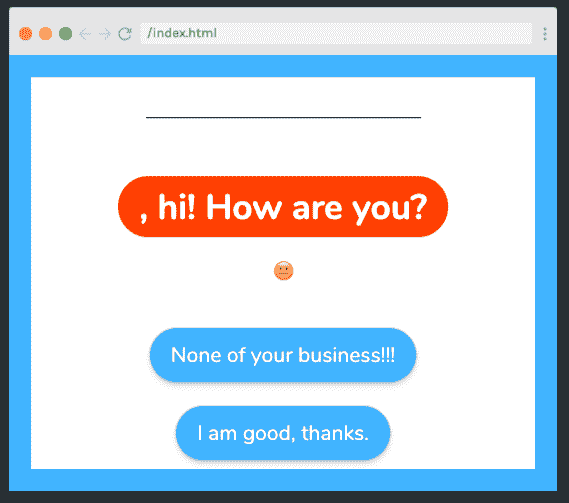

# 想学苗条？这是诺亚·考夫曼的 16 节免费课程

> 原文：<https://www.freecodecamp.org/news/want-to-learn-svelte-heres-our-free-15-part-course-by-noah-kaufman/>

如果你想学习一个新的 Javascript 框架，它允许你写更少的代码，不使用虚拟 DOM，并且创建真正反应式的应用，那么 Svelte 是适合你的。

## 什么是苗条？

Svelte 是一个 Javascript 框架，一个编译器，一种语言。与 React 和 Vue 等在浏览器中完成大量工作的其他框架不同，Svelte 在编译阶段完成工作。这导致了高效的代码和客户端潜在的更快的运行时间。

Svelte 提供了更快的开发速度、更快的网页和更好的开发者体验——Svelte 的创建者在创建它时考虑到了其他开发者)。

最重要的是，知道苗条将帮助你在潜在雇主面前脱颖而出，并表明你对新技术感兴趣。

## 太好了！说说苗条吧。

这篇文章将带你了解 Scrimba 全新的 16 部分瘦身课程，该课程涵盖了以下基本主题，帮助你顺利成为瘦身大师:

*   成分
*   进口/出口
*   时间
*   模板
*   事件处理
*   事件调度
*   小跟班
*   反应
*   有约束力的

本课程通过一系列交互式屏幕广播来讲授，让您练习新技能并真正融入所学内容。

课程以一个深入的期末项目结束，该项目巩固了一路上学到的所有技能，该课程帮助你建立成为一名有效的苗条身材开发者所需的肌肉记忆。

它由 is Noah Kaufman 领导，他是来自加州旧金山的高级前端开发人员，拥有计算语言学硕士学位。

如果这听起来正合你的口味，[前往 Scrimba 上的课程](https://scrimba.com/g/glearnsvelte?utm_source=fcc&utm_medium=referral&utm_campaign=glearnsvelte_launch_article),继续阅读了解更多。

## 成分

在 Svelte 中，所有东西都存在于一个组件中，第一个造型显示了这些组件的解剖结构。

该组件有三个可选部分；`<script>`，它包含 Javascript，`<style>`，它包含 CSS，最后还有一些 HTML，它能够使用来自`<script>`标签的 JS。

```
<script>
    let say = 'hi';
</script>

<style>
    div {
        color: red;
    }
</style>

<div>
    Say: {say}
</div> 
```

## 导入和导出

在这里，我们快速看一下如何导入和导出组件，以便它们可以在我们的应用程序中的其他地方使用。

使用关键字`import`导入组件:

```
import Face from "./Face.svelte"; 
```

而`export`关键字允许其他组件在导入时更改组件:

```
<script>
    export let size;
</script>

<div style="font-size: {size}em">=)</div> 
```

## 挑战 1

在这个演员阵容中，诺亚挑战我们来测试我们新的苗条技巧。这里没有剧透，所以[点击课程](https://scrimba.com/p/pG6X6UG/cvdpNRU8?utm_source=fcc&utm_medium=referral&utm_campaign=glearnsvelte_launch_article)尝试挑战并检查解决方案。

## 时间

插槽允许我们在组件中放置元素。例如，将一个`<slot>`插入到一个带有`Container`类的`<div>`中，允许我们在`<Container>`组件中放置尽可能多的元素:

```
<div class="Container">
  <slot></slot>
</div> 
```

新放置的元素是元件的子元件:

```
<Container>
  <div>Say: {say}</div>

  <Face index={0} />
  <Face />
  <Face index={2} />
</Container> 
```

## 模板

简单的模板语法允许我们在 HTML 中添加 if 语句和 for 循环。没错，到我们的 HTML！

if 语句如下所示:

```
<Container>
    {#if say}
        <div>
            Hi!
        </div>

    {/if}
</Container> 
```

而 for 循环如下所示:

```
{#each [2,1,0] as faceIndex}
        <Face index={faceIndex} />
    {/each} 
```

## 制作割台-挑战 2

在这个挑战中，我们使用我们刚刚学到的关于苗条模板的知识来给我们的应用程序添加一个标题。[查看课程](https://scrimba.com/p/pG6X6UG/cGmeLzsR?utm_source=fcc&utm_medium=referral&utm_campaign=glearnsvelte_launch_article)亲自体验并检查您的答案。

## 事件处理

接下来，Noah 向我们展示了一个简单的内联事件处理程序，它允许用户在点击一个按钮时显示应用程序的标题。

```
<button
  on:click={() => {
    showHeader = true;
  }}
>
  show
</button> 
```

然而，如果我们使用一个`<Button>`组件而不是一个原生的 HTML 按钮，这种`on:click`处理程序就不能工作。我们可以通过**事件转发**来解决这个问题，也就是在组件文件的原生`<button>`中添加一个普通的`on:click`:

```
<button on:click>
  <slot></slot>
</button> 
```

## 事件调度

事件调度允许一个组件发出多种类型的事件，例如，同一个`<Button>`组件既可以用来显示一个元素，也可以用来隐藏它。

我们像这样创建一个事件调度程序:

```
<script>
  import {createEventDispatcher} from 'svelte'; const dispatch =
  createEventDispatcher();
</script> 
```

然后我们将它添加到本地 HTML `<button>`中，如下所示:

```
<button on:click={() => dispatch('show')}>
    Show
</button>
<button on:click={() => dispatch('hide')}>
    Hide
</button> 
```

最后，我们在`App.svelte`文件中定义`<Button>`的功能选项，如下所示:

```
<Buttons
  on:show={() => {
    showHeader = true;
  }}
  on:hide={() => {
    showHeader = false;
  }}
/> 
```

通过分派向上传递值(在本例中为`true`和`false`)也可以获得相同的结果。然后可以通过事件变量`e`访问这些值。

```
<button on:click={() => dispatch('click', true)}>
    Show
</button>
<button on:click={() => dispatch('click', false)}>
    Hide
</button> 
```

```
<Container>
  <Buttons
    on:click={(e) => {
      showHeader = e.detail;
    }}
  />
</Container> 
```

## 按钮-挑战 3

我们的第三个挑战比前两个更复杂，并且考验我们关于事件调度程序的新知识。为了帮助我们，诺亚把挑战分成了小块:

```
<!-- Challenge 3 -
1\. add a prop in Buttons.svelte called buttons which is a list of objects like:
[{value: '', text: ''}, ...etc]
2\. use #each to turn all the objects into buttons that:
    a. have innerHTML equal to the .text of the object.
    b. dispatch a click event that passes the .value of the object.
3\. Handle the event in App.svelte to update the score.
--> 
```

[现在去球场](https://scrimba.com/p/pG6X6UG/cp342mTV?utm_source=fcc&utm_medium=referral&utm_campaign=glearnsvelte_launch_article)试一试，看看解决方案。

## 反应

反应性语句是 Svelte 的一个独特特性，它告诉一段代码在每次代码中的一个变量被更新时重新运行。

例如，下面的代码将在每次 score 变量改变时运行(注意，我们用`$:`声明了一个反应性语句)。

```
let score = 0;
$: smileySays = "Hi there, your score is: " + score; 
```

我们还可以在反应性语句中运行 if 语句:

```
let score = 0;
$: smileySays = "Hi there, your score is: " + score;
$: if (score < -4) smileySays = "Wow your score is low!"; 
```

## 被动挑战-挑战 4

我们现在可以通过完成反应挑战来测试我们的新技能，这使我们离准备期末项目更近了一步。

诺亚再一次将挑战分成更小的部分来帮助我们前进:

```
<!-- Challenge 4 -
1\. add happyScore and storyIndex (both equal 0)
2\. smileySays and buttons get updated whenever storyIndex changes
3\. add clickHandler function that increments storyIndex and adds e.detail.value to the happyScore --> 
```

[点击课程](https://scrimba.com/p/pG6X6UG/cgKqRDt9?utm_source=fcc&utm_medium=referral&utm_campaign=glearnsvelte_launch_article)进行测试并检查您的答案。

## 更多一点的反应

接下来，诺亚给我们举了另一个使用反应式陈述的例子，一个表情符号脸会根据当前的`happyScore`变量而变化:

```
const faceList = [
  "?",
  "?",
  "?",
  "?",
  "?",
  "?",
  "?",
  "?",
  "?",
  "?",
  "?",
];
$: index = happyScore + 5; 
```

与前面的例子类似，每次‘happy score’变量发生变化时，代码都会运行，所以反应式语句正是完成这项工作的合适工具。

## 有约束力的

绑定允许用户通过在`<input>`字段中输入值来更新变量(在本例中称为`name`)。由于绑定是一个双向过程，改变变量也会更新`<input>`的值:

我们像这样绑定价值观:

```
<script>
    import Face from './Face.svelte';
    import Container from './Container.svelte';
    import story from './story';

    let showHeader = false;
    let storyIndex = 0;
    $: smileySays = story[storyIndex].smileySays;
    //variable name below:
    let name = '';
</script>

<Container>
    //binding declared below:
    <input type="text" bind:value={name}>
    <h1>{name}, {smileySays}</h1>
</Container> 
```

除了绑定变量，还可以绑定来自对象、列表或组件的值。

## 最终方案

[](https://scrimba.com/p/pG6X6UG/cgKK4yhG?utm_source=fcc&utm_medium=referral&utm_campaign=glearnsvelte_launch_article) 
*点击图片进入最终项目。*

干得好，完成了课程！我们以一个期末项目结束，这个项目将我们一路上学到的所有技能结合在一起。

诺亚再一次把它分解成小块来帮助我们通过:

```
<!-- Final Challenge
1\. The header appears if the user chooses Svelte answer
(HINT: happyScore will be greater than 0 if they answer Svelte)
2\. Display final message depending on happyScore
3\. Implement the Reset functionality
--> 
```

[查看演员阵容](https://scrimba.com/p/pG6X6UG/cgKK4yhG?utm_source=fcc&utm_medium=referral&utm_campaign=glearnsvelte_launch_article)测试你的新闻苗条技能，看看解决方案。

## 结尾部分

课程到此结束。完成得非常好！如果你渴望学习更多的苗条身材，一定要在 [svelte.dev](https://svelte.dev/) 查看官方文档，主题包括:`Context`、`Stores`、`Lifecycle methods`、`Actions`、`Sapper`等等。

你也可以关注我的[苗条大师 Youtube 频道](https://www.youtube.com/channel/UCg6SQd5jnWo5Y70rZD9SQFA)，并报名参加[斯克林巴苗条训练营](https://rebrand.ly/sveltebootcamp)，成为第一个了解发布会和任何折扣的人。

我希望你已经发现它很有用，并能很快很好地运用你的新知识。

与此同时，为什么不去 Scrimba 看看还有什么课程可以帮助你实现你的编程目标呢？

如果你也想和你的学习伙伴一起玩，或者和更有经验的人和 Scrimba 课程的创建者聊天，请加入我们的 Scrimba Discord server。

快乐学习:)

[https://www.youtube.com/embed/SU25upz4WCI?feature=oembed](https://www.youtube.com/embed/SU25upz4WCI?feature=oembed)