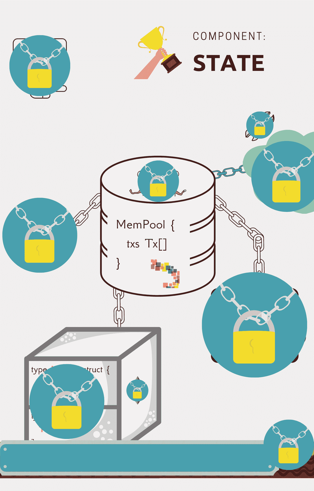
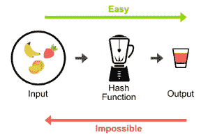
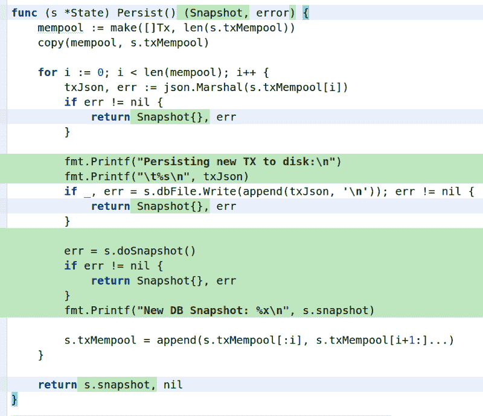

# 如何用 Go 从零开始构建区块链

> 原文：<https://www.freecodecamp.org/news/build-a-blockchain-in-golang-from-scratch/>

## 介绍

随着 Web 3.0 和区块链日益成为主流，你知道区块链是什么吗？你知道它的技术优势和使用案例吗？

本教程的目标是从技术角度介绍区块链技术，从零开始构建。

忘记你从社交媒体上听到的关于区块链的一切。现在，您将从零开始构建一个区块链系统，以真正理解这种对等分布式技术的来龙去脉。

然后，对它的未来和优势做出自己的判断。剧透警告:你会爱上编程区块链软件。

### 怎么会？

您将了解一个软件开发人员的故事，他希望通过在支付系统中采用区块链技术来彻底改变当地的酒吧。

虽然区块链有几个不可否认的用例，但目前，排名第一的应用是支付。这是因为银行仍然运行在由 CSV 文件和 FTP 驱动的效率低下、已有 40 年历史的基础架构上。

这个故事有很多有趣和耐人寻味的事实，关于整个区块链生态系统和不同的协议，如比特币、以太坊和 XRP。

## 在本教程中，您将构建、学习和做什么？

*   您将在没有任何 GoLang 经验的情况下在本地机器上设置一个 Go 项目
*   您将生成并分发您的第一批区块链代币
*   您将从头开始开发一个 CLI 控制的数据库
*   你会发现用户在他们最喜欢的应用程序中拥有的权限是多么的少
*   你会发现区块链的主要价值主张
*   您将使用安全的加密散列函数使您的数据库不可变

所以，让我们开始，进入我们的故事。

## ⭐见到了主角安德烈。

安德烈晚上是一家酒吧的老板，白天在斯洛伐克一个名叫巴德约夫的小镇上做软件开发。

安德烈厌倦了:

*   **编程扎实，老式的 PHP/Java/Javascript 应用程序**
*   忘记了他的朋友和客户欠了他多少钱，因为他们周五晚上欠了他一杯伏特加
*   花时间收集和数硬币，找零，触摸新冠肺炎钞票
*   为桌上足球、飞镖、台球和扑克维护不同的塑料筹码

安德烈很乐意:

*   对酒吧的活动和销售有一个完美的可审计的历史记录，以使他的酒吧符合税收规定
*   **将他的酒吧改造成一个自主的、支付高效的、分散的、安全的环境，让他的顾客可以信任并从中获利**

他的目标是编写一个简单的程序，并以虚拟形式保存客户的所有余额。

安德烈在这里分享了他的想法:

“每个新客户都会给我现金，我会给他们一个等量的数字代币(硬币/加密货币)。代币将代表酒吧内外的货币单位。

用户将使用代币进行所有的酒吧功能，从支付饮料、向朋友借贷代币，到打乒乓球、扑克和踢球。

拥有一个由区块链代币供电的酒吧将为我的顾客创造大量的价值。与我的竞争对手和这条街上的其他酒吧相反，在这些酒吧里，顾客只花钱，换来的是宿醉，**我的酒吧顾客持有酒吧的代币，将拥有股东权利。**

类似于拥有苹果或微软等公司的大部分股票，持有这些酒吧代币的客户将能够通过投票决定酒吧的运营方式:

*   饮料价格
*   营业时间
*   新功能(电视、点唱机...)
*   室内和室外设计
*   利润分配
*   等等。

哦，这将是一个编程梦！

我将把代币称为:区块链条形代币， **TBB！**

既然 Andrej 分享了他的梦想，我们就开始吧。

## 目录

*   [要求](#requirements)
*   [设置项目](#setup-the-project)
*   [01 | MVP 数据库](#01-the-mvp-database)
*   [02 |改变全局数据库状态](#02-mutating-global-db-state)
*   [03 |整体事件 vs 交易](#03-monolithic-event-vs-transaction)
*   人类是贪婪的
*   [05 |我们为什么需要区块链](#05-why-we-need-blockchain)
*   [06 | L'Hash de Immutable](#06-l-hash-de-immutable)
*   [接下来的步骤](#-next-steps)

## 要求

让我们深入我们的教程。我推荐 2 年以上的 Java/PHP/Javascript 编程经验，或者其他类似 Go 的语言。

如果你想快速入门，[这里有一个免费课程](https://www.freecodecamp.org/news/go-golang-course/)可以帮你入门。

也可以完成 [A Tour Of Go](https://tour.golang.org/basics/1) 官方 17 讲，熟悉语言语法和基本概念(约 20 分钟)。

### 为什么要去？

因为像区块链一样，它对你的整个编程生涯来说是一项了不起的技术。Go 是一种流行的语言，Go 开发者的工资比一般的 Java/PHP/Javascript 职位要高。

Go 针对多核 CPU 架构进行了优化。您可以毫无问题地生成数千个轻量级线程(Go-routines)。对于高度并行和并发的软件，如区块链网络，这是非常实用的。

通过用 Go 编写你的软件，你可以获得接近 C++级别的性能，而不会因为忘记释放内存而累死。

Go 还可以编译成二进制文件，这使得它非常具有可移植性。

## 设置项目

本文有一个专用的开源 Github 存储库，其中有完整的源代码，因此您可以在自己的本地机器上编译代码并运行程序。

如果你在某一章或某一行代码中遇到困难，在这个库中创建一个 Github 问题来描述你的问题，我会尽快帮你解决！

↓访问 Github 资源库，按照安装说明进行操作↓

[web3coach/the-blockchain-bar-newsletter-editionThe source-code for the first 7 chapters of: “The Blockchain Way of Programming” eBook. - web3coach/the-blockchain-bar-newsletter-editionweb3coachGitHub](https://github.com/web3coach/the-blockchain-bar-newsletter-edition/)

## 01 | MVP 数据库

✍ `git checkout c1_genesis_json`

Andrej 在 90 年代掌握了关系 SQL 数据库。他知道如何创建高级数据模型，以及如何优化 SQL 查询。

Andrej 是时候赶上创新，开始构建 Web 3.0 软件了。

幸运的是，在上周读完《精益创业》一书后，Andrej 觉得他还不应该过度设计解决方案。因此，他为酒吧的 MVP 数据库选择了一个简单但有效的 JSON 文件。

一开始，有一个原始的中央数据库。

### ？摘要

**区块链是一个数据库。**

### User 1, Andrej

3 月 18 日，星期一。

Andrej 生成 100 万个实用令牌。

在区块链世界中，令牌是区块链数据库中的单元。它们以美元或欧元计价的实际价值随着需求和受欢迎程度而波动。

每个区块链都有一个**【创世纪】**文件。创世纪文件用于向早期区块链参与者分发首批代币。

这一切都从一个简单的虚拟的 genesis.json 开始。

Andrej 创建了文件`./database/genesis.json`,其中他定义了区块链 Bar 的数据库将有 100 万个令牌，并且它们都将属于 Andrej:

```
{
  "genesis_time": "2019-03-18T00:00:00.000000000Z",
  "chain_id": "the-blockchain-bar-ledger",
  "balances": {
      "andrej": 1000000
  }
} 
```

令牌需要有一个真正的“效用”，也就是一个用例。用户应该能够从第一天开始用它们支付！

安德烈必须遵守法律监管机构(美国证券交易委员会)。发行未注册证券是非法的。另一方面，公用事业代币很好，所以他马上在酒吧的门上打印并粘贴了一张新定价的白色 p̶a̶p̶e̶r̶海报。

Andrej 为他的代币指定一个起始货币值，这样他就可以将代币兑换成欧元、美元或其他法定货币。

```
1 TBB token = 1€

| Item                      | Price   |
| ------------------------- | ------- |
| Vodka shot                | 1   TBB |
| Orange juice              | 5   TBB |
| Burger                    | 2   TBB |
| Crystal Head Vodka Bottle | 950 TBB | 
```

Andrej 还决定**他应该每天获得 100 个代币**来维护数据库并拥有如此出色的颠覆性想法。

### ？有趣的事实

> 以太坊区块链上的第一个创世纪以太(ETH)是以与 Andrej 的实用令牌相同的方式创建并分发给早期投资者和开发者的。

> 2017 年，在以太坊区块链网络的 ICO(初始硬币发行)热潮中，项目创始人撰写并向投资者提交了白皮书。白皮书是概述复杂问题和可能解决方案的技术文档，旨在教育和阐明特定问题。在区块链的世界里，一份白皮书概述了特定的区块链发展起来后的样子和行为规范。

> 区块链项目每**份白皮书**个创意筹集 1000 万至 3 亿欧元。

> 作为金钱的交换(ICO“资金”)，投资者的名字将被包括在初始的“创世余额”中，这与 Andrej 的做法类似。投资者希望通过 ICO 让创世纪硬币升值，并让这些团队完成概述的区块链。

> 当然，并不是所有的白皮书想法都会实现。大量投资败给了不清楚或不完整的想法，这就是区块链在这些 ico 中受到媒体负面报道的原因，也是一些人仍然认为它是炒作的原因。但是底层的区块链技术是奇妙而有用的，你将在本书中进一步了解。只是被一些烂演员滥用了。

### ？摘要

区块链是一个数据库。

**您在源文件中定义的令牌供应、初始用户余额和全局区块链设置。**

## 02 |改变全局数据库状态

✍ `git checkout c2_db_changes_txt`

### 死党

3 月 25 日，星期一。

经过一周的工作，酒吧设施准备接受代币。不幸的是，没有人出现，所以 Andrej 为自己点了三杯伏特加，并在一张纸上写下了数据库的变化:

```
andrej-3;   // 3 shots of vodka
andrej+3;   // technically purchasing from his own bar
andrej+700; // Reward for a week of work (7x100 per day) 
```

为了避免重新计算每个客户余额的最新状态，Andrej 创建了一个`./database/state.json`文件，以聚合格式存储余额。

新数据库状态:

```
{
  "balances": {
      "andrej": 1000700
  }
} 
```

### BabaYaga 的奖金

3 月 26 日星期二。

为了给他的酒吧带来流量，Andrej 宣布在未来 24 小时内购买 TBB 代币的每个人都将获得 100%的独家奖励。

冰！他得到了他的第一个顾客，名为**巴巴亚加**。BabaYaga 预先购买了价值 1000 欧元的代币，为了庆祝，她立即花 1 TBB 买了一杯伏特加。她有酗酒问题。

写在纸上的数据库交易:

```
andrej-2000;   // transfer to BabaYaga
babayaga+2000; // pre-purchase with 100% bonus
babayaga-1;
andrej+1;
andrej+100;    // 1 day of sun coming up 
```

新数据库状态:

```
{
  "balances": {
      "andrej": 998801,
      "babayaga": 1999
  }
} 
```

### ？有趣的事实

> 区块链 ICO(基于白皮书的初始硬币发行)项目通常会分发不同奖金的 genesis 代币，具体取决于你购买的数量和购买的时间。团队平均给早期“参与者”提供 10-40%的奖金。

> 避免使用“投资者”一词，因此法律监管机构不会将代币视为证券。项目将推理他们的主要产品，区块链代币，功能为“飞行，忠诚点”

> 几个月后，这些“参与者”通过交易所向公众出售他们的投资，甚至获得了 1000%的收益。

### ？摘要

区块链是一个数据库。

您在源文件中定义的令牌供应、初始用户余额和全局区块链设置。

**创世纪余额表明什么是最初的区块链状态，并且之后从不更新。**

**数据库状态的变化称为事务(TX)。**

## 03 |整体事件与事务

✍ `git checkout c3_state_blockchain_component`

习惯于事件源体系结构的开发人员一定会立即意识到事务背后的熟悉原则。他们是正确的。

区块链交易代表一系列事件，数据库是按照特定顺序重放所有交易后的最终聚合、计算状态。

### Andrej 编程

3 月 26 日星期二晚上。

对于安德烈来说，这是一个轻松的周二晚上。为了庆祝他的第一个客户，他决定玩一些星际争霸游戏，并通过删除一些旧图片来清理他的本地开发机器。

不幸的是，他在终端`sudo rm -rf /`中键入删除命令路径时过早地按下了 enter。哎呀。

他所有的文件，包括酒吧的`genesis.json`和`state.json`都不见了。

Andrej 作为一个资深开发者，在几秒钟内反复非常大声的喊了一些 f*字，但是他没有慌张！

虽然他没有备份，但他有更好的东西—一张记录所有数据库事务的纸。他唯一需要做的就是一个接一个地重放所有的事务，他的数据库状态就会得到恢复。

基于事件架构的优势给他留下了深刻的印象，他决定扩展他的 MVP 数据库解决方案。每个酒吧的活动，如个人饮料购买，必须记录在区块链数据库中。

每个**客户**将使用**账户**结构在 DB 中表示:

```
type Account string 
```

每个**事务** (TX - a 数据库变更)会有以下四个属性: **from、to、value** 和 **data** 。

具有一个可能值(**奖励**)的**数据**属性获取了安德烈发明区块链的奖金，并人为地增加了初始 TBB 代币总供应量(通货膨胀)。

```
type Tx struct {
   From  Account `json:"from"`
   To    Account `json:"to"`
   Value uint    `json:"value"`
   Data  string  `json:"data"`
}

func (t Tx) IsReward() bool {
   return t.Data == "reward"
} 
```

**Genesis DB** 将仍然是一个 JSON 文件:

```
{
  "genesis_time": "2019-03-18T00:00:00.000000000Z",
  "chain_id": "the-blockchain-bar-ledger",
  "balances": {
    "andrej": 1000000
  }
} 
```

之前写在纸上的所有交易都将存储在名为 **tx.db** 的本地文本文件数据库中，以 JSON 格式序列化，并用换行符分隔:

```
{"from":"andrej","to":"andrej","value":3,"data":""}
{"from":"andrej","to":"andrej","value":700,"data":"reward"}
{"from":"andrej","to":"babayaga","value":2000,"data":""}
{"from":"andrej","to":"andrej","value":100,"data":"reward"}
{"from":"babayaga","to":"andrej","value":1,"data":""} 
```

封装所有业务逻辑的最关键的数据库组件将是**状态**:

```
type State struct {
   Balances   map[Account]uint
   txMempool []Tx

   dbFile *os.File
} 
```

该结构将知道所有用户余额，以及谁将 TBB 令牌转移给了谁，转移了多少。

它是通过从`genesis.json`文件中读取初始用户余额构建的:

```
func NewStateFromDisk() (*State, error) {
   // get current working directory
   cwd, err := os.Getwd()
   if err != nil {
      return nil, err
   }

   genFilePath := filepath.Join(cwd, "database", "genesis.json")
   gen, err := loadGenesis(genFilePath)
   if err != nil {
      return nil, err
   }

   balances := make(map[Account]uint)
   for account, balance := range gen.Balances {
      balances[account] = balance
   } 
```

之后，通过顺序重放从`tx.db`开始的所有数据库事件来更新起源`State`余额:

```
 txDbFilePath := filepath.Join(cwd, "database", "tx.db")
   f, err := os.OpenFile(txDbFilePath, os.O_APPEND|os.O_RDWR, 0600)
   if err != nil {
      return nil, err
   }

   scanner := bufio.NewScanner(f)
   state := &State{balances, make([]Tx, 0), f}

   // Iterate over each the tx.db file's line
   for scanner.Scan() {
      if err := scanner.Err(); err != nil {
         return nil, err
      }

      // Convert JSON encoded TX into an object (struct)
      var tx Tx
      json.Unmarshal(scanner.Bytes(), &tx)

      // Rebuild the state (user balances),
      // as a series of events
      if err := state.apply(tx); err != nil {
         return nil, err
      }
   }

   return state, nil
} 
```

`State`组件负责:

*   **向**内存池添加**新事务**
*   **根据当前状态验证**交易(足够的发送方余额)
*   **改变**状态
*   **将**个事务保存到磁盘
*   **通过按顺序重放自创建以来的所有交易来计算**账户余额

**向内存池添加**新事务:

```
func (s *State) Add(tx Tx) error {
   if err := s.apply(tx); err != nil {
      return err
   }

   s.txMempool = append(s.txMempool, tx)

   return nil
} 
```

**将**事务保存到磁盘:

```
func (s *State) Persist() error {
   // Make a copy of mempool because the s.txMempool will be modified
   // in the loop below
   mempool := make([]Tx, len(s.txMempool))
   copy(mempool, s.txMempool)

   for i := 0; i < len(mempool); i++ {
      txJson, err := json.Marshal(mempool[i])
      if err != nil {
         return err
      }

      if _, err = s.dbFile.Write(append(txJson, '\n')); err != nil {
         return err
      }

      // Remove the TX written to a file from the mempool
      s.txMempool = s.txMempool[1:]
   }

   return nil
}
```

**改变、验证**状态:

```
func (s *State) apply(tx Tx) error {
   if tx.IsReward() {
      s.Balances[tx.To] += tx.Value
      return nil
   }

   if tx.Value > s.Balances[tx.From] {
      return fmt.Errorf("insufficient balance")
   }

   s.Balances[tx.From] -= tx.Value
   s.Balances[tx.To] += tx.Value

   return nil
} 
```

### 构建命令行界面(CLI)

3 月 26 日星期二晚上。

Andrej 希望有一种便捷的方式将新交易添加到他的数据库中，并列出他的客户的最新余额。因为 Go 程序编译成二进制，所以他为自己的程序构建了一个 CLI。

在 Go 中开发基于 CLI 的程序最简单的方法是使用第三方`github.com/spf13/cobra`库。

Andrej 为他的项目初始化 Go 的内置依赖管理器，名为`go modules`:

✍ `cd $GOPATH/src/github.com/web3coach/the-blockchain-way-of-programming-newsletter-edition`

✍ `go mod init github.com/web3coach/the-blockchain-way-of-programming-newsletter-edition`

`Go modules`命令将自动获取您在 Go 文件中引用的任何库。

Andrej 创建了一个名为`cmd`的新目录，其中包含一个子目录`tbb`:

✍ `mkdir -p ./cmd/tbb`

他在里面创建了一个`main.go`文件，作为程序的 CLI 入口点:

```
package main

import (
    "github.com/spf13/cobra"
    "os"
    "fmt"
)

func main() {
    var tbbCmd = &cobra.Command{
        Use:   "tbb",
        Short: "The Blockchain Bar CLI",
        Run: func(cmd *cobra.Command, args []string) {
        },
    }

    err := tbbCmd.Execute()
    if err != nil {
        fmt.Fprintln(os.Stderr, err)
        os.Exit(1)
    }
} 
```

使用`install`命令:

✍ `go install ./cmd/tbb/...`编译围棋程序

```
go: finding github.com/spf13/cobra v1.0.0
go: downloading github.com/spf13/cobra v1.0.0
go: extracting github.com/spf13/cobra v1.0.0
```

Go 将检测缺失的库，并在编译程序之前自动获取它们。根据您的`$GOPATH`，生成的程序将保存在`$GOPATH/bin`文件夹中。

✍ `echo $GOPATH`

```
/home/web3coach/go
```

✍ `which tbb`

```
/home/web3coach/go/bin/tbb
```

你现在可以从你的终端运行`tbb`，但是它不会做任何事情，因为`main.go`文件中的`Run`函数是空的。

Andrej 首先需要的是对他的 CLI 程序的版本支持。

在`main.go`文件旁边，他创建了一个`version.go`命令:

```
package main

import (
    "fmt"
    "github.com/spf13/cobra"
)

const Major = "0"
const Minor = "1"
const Fix = "0"
const Verbal = "TX Add && Balances List"

var versionCmd = &cobra.Command{
    Use:   "version",
    Short: "Describes version.",
    Run: func(cmd *cobra.Command, args []string) {
        fmt.Printf("Version: %s.%s.%s-beta %s", Major, Minor, Fix, Verbal)
    },
} 
```

编译并运行它:
✍ `go install ./cmd/tbb/...`
✍ `tbb version`

`Version: 0.1.0-beta TX Add && Balances List`

完美。

与`version.go`文件相同，他创建了一个`balances.go`文件:

```
func balancesCmd() *cobra.Command {
    var balancesCmd = &cobra.Command{
        Use:   "balances",
        Short: "Interact with balances (list...).",
        PreRunE: func(cmd *cobra.Command, args []string) error {
            return incorrectUsageErr()
        },
        Run: func(cmd *cobra.Command, args []string) {
        },
    }

    balancesCmd.AddCommand(balancesListCmd)

    return balancesCmd
} 
```

`balances`命令将负责加载最新的数据库状态，并将其打印到标准输出:

```
var balancesListCmd = &cobra.Command{
    Use:   "list",
    Short: "Lists all balances.",
    Run: func(cmd *cobra.Command, args []string) {
        state, err := database.NewStateFromDisk()
        if err != nil {
            fmt.Fprintln(os.Stderr, err)
            os.Exit(1)
        }
        defer state.Close()

        fmt.Println("Accounts balances:")
        fmt.Println("__________________")
        fmt.Println("")
        for account, balance := range state.Balances {
            fmt.Println(fmt.Sprintf("%s: %d", account, balance))
        }
    },
} 
```

Andrej 验证 cmd 是否按预期工作。它应该打印出在 Genesis 文件中定义的精确余额，因为`tx.db`文件仍然是空的。

✍ `go install ./cmd/tbb/...`

✍ `tbb balances list`

```
Accounts balances:
__________________
andrej: 1000000 
```

效果很好！现在他只需要一个 cmd 来记录酒吧的活动。

Andrej 创建了`./cmd/tbb/tx.go` cmd:

```
func txCmd() *cobra.Command {
    var txsCmd = &cobra.Command{
        Use:   "tx",
        Short: "Interact with txs (add...).",
        PreRunE: func(cmd *cobra.Command, args []string) error {
            return incorrectUsageErr()
        },
        Run: func(cmd *cobra.Command, args []string) {
        },
    }

    txsCmd.AddCommand(txAddCmd())

    return txsCmd
} 
```

`tbb tx add` cmd 使用`State.Add(tx)`函数将 bar 的事件保存到文件系统中:

```
func txAddCmd() *cobra.Command {
    var cmd = &cobra.Command{
        Use:   "add",
        Short: "Adds new TX to database.",
        Run: func(cmd *cobra.Command, args []string) {
            from, _ := cmd.Flags().GetString(flagFrom)
            to, _ := cmd.Flags().GetString(flagTo)
            value, _ := cmd.Flags().GetUint(flagValue)

            fromAcc := database.NewAccount(from)
            toAcc := database.NewAccount(to)

            tx := database.NewTx(fromAcc, toAcc, value, "")

            state, err := database.NewStateFromDisk()
            if err != nil {
                fmt.Fprintln(os.Stderr, err)
                os.Exit(1)
            }

            // defer means, at the end of this function execution,
            // execute the following statement (close DB file with all TXs)
            defer state.Close()

            // Add the TX to an in-memory array (pool)
            err = state.Add(tx)
            if err != nil {
                fmt.Fprintln(os.Stderr, err)
                os.Exit(1)
            }

            // Flush the mempool TXs to disk
            err = state.Persist()
            if err != nil {
                fmt.Fprintln(os.Stderr, err)
                os.Exit(1)
            }

            fmt.Println("TX successfully added to the ledger.")
        },
    } 
```

`tbb tx add` cmd 有 3 个强制标志:`--from`、`--to`和`--value`。

```
cmd.Flags().String(flagFrom, "", "From what account to send tokens")
cmd.MarkFlagRequired(flagFrom)

cmd.Flags().String(flagTo, "", "To what account to send tokens")
cmd.MarkFlagRequired(flagTo)

cmd.Flags().Uint(flagValue, 0, "How many tokens to send")
cmd.MarkFlagRequired(flagValue)

return cmd 
```

CLI 完成了！

Andrej 将所有事务从纸面文档迁移到他的新数据库:

✍ `tbb tx add --from=andrej --to=andrej --value=3`

✍ `tbb tx add --from=andrej --to=andrej --value=700`

✍ `tbb tx add --from=babayaga --to=andrej --value=2000`

✍ `tbb tx add --from=andrej --to=andrej --value=100 --data=reward`

✍ `tbb tx add --from=babayaga --to=andrej --value=1`

从磁盘读取所有事务并计算最新状态:

✍ `tbb balances list`

```
Accounts balances:
__________________
andrej: 998801
babayaga: 1999 
```

酒吧数据成功恢复！唷，多好的夜晚啊！

### 关于 Cobra CLI 库

用于 CLI 编程的`Cobra`库的好处是它附带了额外的特性。例如，您现在可以运行:`tbb help` cmd，它会打印出所有 TBB 注册的子命令，并给出如何使用它们的说明。

```
 tbb help

The Blockchain Bar CLI

Usage:
  tbb [flags]
  tbb [command]

Available Commands:
  balances    Interact with balances (list...).
  help        Help about any command
  tx          Interact with txs (add...).
  version     Describes version.

Flags:
  -h, --help   help for tbb

Use "tbb [command] --help" for more information about a command. 
```

### ？有趣的事实

> 如今，在企业界，意外丢失客户数据是一个标准的星期六。区块链通过分散数据存储来解决这一问题。

> Andrej 通过跳过标记为奖励的交易的余额验证，在程序中加入了这个技巧。**比特币和以太坊的工作原理是一样的。****开采区块的账户余额**突然增加，成为影响整个链的总代币供应膨胀的主题。比特币的总供应量上限为 2100 万 BTC。你将在第 7 章和第 10 章学到更多关于“采矿”和“区块”的知识。

> 组件**状态**和**内存池**不是这个程序独有的。安德烈选择了与简化的[围棋以太坊](https://github.com/ethereum/go-ethereum/blob/7b32d2a47017570c44cd7f8a83612a29656c9857/core/tx_pool.go#L211)模型相匹配的名称和设计，这样你就可以一瞥以太坊的核心源代码。

### ？摘要

区块链是一个数据库。

令牌供应、初始用户余额和全局区块链设置在源文件中定义。

创世平衡表明了最初的区块链状态是什么样的，并且之后从未更新过。

数据库状态的变化称为事务(TX)。

事务是代表系统内动作的老式事件。

### ⚒学习代码

提交: [5d4b0b](https://github.com/web3coach/the-blockchain-way-of-programming-newsletter-edition/commit/5d4b0b6a001e616109da732fdaf7094f1e1acf85)



再说贪婪。

## 04 |人类是贪婪的

✍ `git checkout c4_caesar_transfer`

### 典型的商业贪婪

3 月 27 日星期三。

BabaYaga 投资有点多。她忘了她的房租就要到了，她没有钱。巴巴亚加称她的公寓主人为凯撒。

嘿，凯撒，很抱歉，我没有现金付你这个月的房租…

**凯撒:**有何不可？

**BabaYaga:** 区块链吧 ICO 提供了巨额奖金，我仅用 1000 欧元就购买了价值 2000 欧元的代币。这是一笔好交易！

凯撒:你到底在说什么？什么是 ICO？代币到底是什么？你能以其他方式支付我吗？

**巴巴亚加:**哦，又来了。我可以给你 1000 枚价值 1000 欧元的 TBB 代币，你可以在酒吧里用它们来付酒钱！让我打电话给酒吧老板安德烈，让他转账！

凯撒:好吧...我要了。

安德烈完成了转账，但决定收取额外的 50 TBB 代币作为麻烦的补偿。他不愿意，但是几年前投资他的酒吧股东在逼他尽快产生利润。

安德烈告诉自己，巴巴亚加很可能不会注意到这笔相对较小的费用。最后，只有他有数据库访问权。

//租金支付

✍ `tbb tx add --from=babayaga --to=caesar --value=1000`

//隐藏费用收取

✍ `tbb tx add --from=babayaga --to=andrej --value=50`

//又一天维护数据库的新奖励

✍ `tbb tx add --from=andrej --to=andrej --value=100 --data=reward`

### ？有趣的事实

> 区块链的头号用例是银行业。许多区块链项目旨在优化不同货币走廊(XRP)之间的国内和国际货币兑换。

> 其他项目侧重于自由和自我主权身份(SSI)——这是一场数字运动，承认个人应该拥有和控制自己的身份和金钱，而不受行政当局或其他中央集权中介的干预。SSI 允许人们在数字世界中进行互动，拥有与在离线世界中相同的自由和信任能力。(比特币/以太坊)

> 以下是一些有趣的事实，说明为什么区块链是更换银行当前银行基础设施的完美选择。

> 虚拟代币的好处在于它们的可替代性，也就是说，它们能够被交易，每个单位都可以和下一个单位一样使用。通过简单地改变数据库状态，就可以完成从一个帐户到另一个帐户的转帐。加密货币可以全天候交易。

> 不能直接炒股。你需要通过一个经纪人，他从交易总额中抽取一定比例的费用(平均年利润的 1-3%到 7%)。

> 国际银行转账需要 3-10 个工作日，费用高达转账金额的 5%!如果你要汇 10，000 美元，你可能要支付高达 500 美元。过去 40 年落后的技术？FTP + CSV 文件。

> 你觉得股市公平吗？银行、指数和股票高度集中，由政府和私人华尔街集团控制。自由市场？华尔街控制着价格单日的涨跌幅度。

> 例如，华尔街在“标准普尔 500 指数”下跌 7%后暂停交易，以保护其投资者和对冲基金在 COVID 新闻后的 2020 年 3 月期间因出售股票而遭受损失。后来，美联储印了数万亿美元来支撑股价。如果你是一个喜欢省钱和避免负债的开发人员，你的积蓄一夜之间就失去了价值，损失的百分比还不知道。

> 许多国家正在进入负收益率，这是一个未知的领域，后果不明。这是什么意思？很快你将不得不向银行付款来保留你的存款。最好的通货膨胀。你被迫花钱支持一个你无法控制的系统。

### ⚒学习代码

提交: [00d6ed](https://github.com/web3coach/the-blockchain-way-of-programming-newsletter-edition/commit/00d6ede25b1e54ceb30c0a0314ef99a612db01de)

## 05 |我们为什么需要区块链

✍ `git checkout c5_broken_trust`

### 巴巴亚加寻求正义

3 月 28 日星期四。

BabaYaga 进入酒吧庆祝她的生日。

嘿，安德烈！今天是我的生日！给我你最贵的一瓶！

安德烈:生日快乐！给你:水晶头伏特加。但是你需要额外购买一个 TBB 代币。这瓶价值 950 代币，你的余额是 949。

**巴巴亚加:**什么？！我的余额应该是 999 TBB！

Andrej: 你上周要求转账给凯撒的钱花了你 50 个代币。

**巴巴亚加:**这是不可接受的！我绝不会同意这么高的费用。你不能这么做，安德烈。我信任你的系统，但你和其他企业主一样不可靠。事情必须改变！

好吧，听着。你是我最忠实的客户，我本来不想收你的，是股东逼我的。

让我重新规划我的系统，让它变得完全透明和分散。毕竟，如果每个人都能够不通过我与酒吧互动，这将显著提高酒吧的效率并平衡信任度！

*   点饮料只需几秒钟，而不是几分钟
*   那些把钱包忘在家里的顾客可以互相借用代币
*   我不必担心(再次)丢失客户数据，因为每个人都会有一份副本
*   数据库是不可变的，所以一旦每个人都同意一个特定的状态，没有人能改变它或恶意修改历史。不变性也有助于年度税务审计！
*   如果股东想要引入新的费用或提高现有费用，区块链体系中的每个人都会注意到，并不得不同意。用户和企业所有者甚至不得不一起参与一些基于投票的分散治理系统。在出现分歧的情况下，用户会带走他们所有的数据！

BabaYaga: 嗯，这听起来当然不错，但这可能吗？

是的，我想是的。使用一点**散列、链表、不可变数据结构、分布式复制和非对称加密技术！**

我不知道你刚才在说什么，但去做你那令人讨厌的事情吧，安德烈！

### ？有趣的事实

> 比特币和以太坊矿工也因为运行区块链服务器(节点)和验证交易而每 15 分钟获得奖励。

> 每 15 分钟，一名比特币矿工就能收到 12.5 BTC(在写这篇文章的时候是 10 万美元)来支付他的服务器成本+赚取一些利润。

> 比特币网络消耗的电力相当于整个奥地利。占全球年用电量的 0.29%。

> 每年消耗 76.84 TWh，产生 36.50 Mt 二氧化碳碳足迹(新西兰)。[来源。](https://digiconomist.net/bitcoin-energy-consumption)

> 为什么？你将在后面(第 11 章)学到更多，你将从头开始编写一个比特币挖掘算法！

> PS:我们的算法耗电会少一点:)

### ？摘要

集中访问私人数据的封闭软件只允许少数人拥有很大的权力。用户没有选择，股东做生意是为了赚钱。

区块链开发者的目标是开发协议，让应用程序的企业家和用户以透明、可审计的关系协同工作。区块链系统的规范应该从一开始就明确定义，只有在用户支持的情况下才会改变。

区块链是一个数据库。令牌供应、初始用户余额和全局区块链设置在源文件中定义。创世平衡表明什么是最初的区块链状态，并且之后从不更新。

数据库状态的变化称为事务(TX)。事务是表示系统内动作的老式事件。

### ⚒学习代码

提交: [642045](https://github.com/web3coach/the-blockchain-way-of-programming-newsletter-edition/commit/64204512f2173eb3f3e136e7e2674a2c456d351f)

## 06 | L'Hash de Immutable

✍ `git checkout c6_immutable_hash`

*技术难度从这一节开始！这些概念只会变得更具挑战性，但同时也非常令人兴奋。扣好:)*

### 如何编程一个不可变的数据库？

3 月 29 日星期五。

如果 Andrej 想弄清楚如何编程一个不可变的数据库，他必须认识到为什么其他数据库系统在设计上是可变的。

他决定分析一个全能的 MySQL 数据库表:

```
| id | name     | balance |
| -- | -------- | ------- |
| 1  | Andrej   | 998951  |
| 2  | BabaYaga | 949     | 
| 3  | Caesar   | 1000    |
```

在 MySQL DB 中，任何具有访问权限和足够充分理由的人都可以执行表更新，例如:

```
UPDATE user_balance SET balance = balance + 100 WHERE id > 1 
```

跨不同行更新值是可能的，因为表行是独立的、可变的，并且最新状态不明显。

最新的 DB 变化是什么？最后一列已更改？插入最后一行？如果是，Andrej 怎么知道最近删除了哪一行？如果行和表状态紧密耦合、相互依赖，也就是说，更新行 1 将生成一个全新的不同的表，Andrej 将实现他的不变性。

> 如何判断数据库中是否有字节发生了变化？

### 通过散列函数的不变性

哈希是获取任意长度的字符串输入并产生固定长度的哈希字符串的过程。输入中的任何变化都会产生一个新的不同的散列。

```
package main

import (
	"crypto/sha256"
	"fmt"
)

func main() {
	balancesHash := sha256.Sum256([]byte("| 1 | Andrej | 99895 |"))
	fmt.Printf("%x\n", balancesHash)
	// Output: 6a04bd8e2...f70a3902374f21e089ae7cc3b200751

	// Change balance from 99895 -> 99896

	balancesHashDiff := sha256.Sum256([]byte("| 1 | Andrej | 99896 |"))
	fmt.Printf("%x\n", balancesHashDiff)
	// Output: d04279207...ec6d280f6c7b3e2285758030292d5e1
} 
```

试试看:[https://play.golang.org/p/FTPUa7IhOCE](https://play.golang.org/p/FTPUa7IhOCE)

Andrej 还要求他的数据库具有某种程度的安全性，因此他决定使用具有以下属性的加密散列函数:

*   这是[确定性的](https://en.wikipedia.org/wiki/Deterministic_algorithm)——相同的消息总是产生相同的散列
*   计算任何给定消息的哈希值都很快
*   除非尝试所有可能的消息，否则从消息的哈希值生成消息是不可行的
*   对消息的一个小的改变会导致哈希值的大范围改变，以至于新的哈希值看起来与旧的哈希值不相关
*   找到两个具有相同散列值的不同消息是不可行的



Hashing Fruits Example -> img [src](https://twitter.com/cybergibbons/status/1203291585473110016)

### 实现数据库内容哈希

3 月 30 日星期六晚上。

Andrej 修改了`Persist()`函数，以便在每次持久存储新事务时返回一个新的内容散列`Snapshot`。

```
type Snapshot [32]byte 
```

`Snapshot`由这个新的`sha256 secure hashing`函数产生:

```
func (s *State) doSnapshot() error {
   // Re-read the whole file from the first byte
   _, err := s.dbFile.Seek(0, 0)
   if err != nil {
      return err
   }

   txsData, err := ioutil.ReadAll(s.dbFile)
   if err != nil {
      return err
   }
   s.snapshot = sha256.Sum256(txsData)

   return nil
} 
```

`doSnapshot()`由修改后的`Persist()`函数调用。当一个新的事务被写入`tx.db`文件时，`Persist()`散列整个文件内容并返回它的 32 字节“指纹”散列。



Persist() hashes the entire tx.db file

从这一刻起，每个人都可以 100%放心、安全地使用特定的快照哈希来引用任何特定的数据库状态(数据集)。

### ⚓Practice 时间

**1/4** 运行`tbb balances list` cmd 并检查天平是否匹配。

✍ `tbb balances list`

```
Account balances at 7d4a360f465d...

| id | name     | balance |
| -- | -------- | ------- |
| 1  | Andrej   | 999251  |
| 2  | BabaYaga | 949     | 
| 3  | Caesar   | 1000    |
```

**2/4** 从`./database/tx.db`中移除最后两行，并再次检查平衡。

✍ `tbb balances list`

```
Account balances at 841770dcd3...

| id | name     | balance |
| -- | -------- | ------- |
| 1  | Andrej   | 999051  |
| 2  | BabaYaga | 949     | 
| 3  | Caesar   | 1000    | 
```

**3/4** 奖励 Andrej 最后两天(3 月 28 日至 30 日):

奖励交易 1:

✍ `tbb tx add --from=andrej --to=andrej --value=100 --data=reward`

```
Persisting new TX to disk:
       {"from":"andrej","to":"andrej","value":100,"data":"reward"}

New DB Snapshot: ff2470c7043f5a34169b5dd38921ba6825b03b3facb83e426
TX successfully persisted to the ledger. 
```

奖励交易 2:

✍ `tbb tx add --from=andrej --to=andrej --value=100 --data=reward`

```
Persisting new TX to disk:
       {"from":"andrej","to":"andrej","value":100,"data":"reward"}

New DB Snapshot: 7d4a360f468b837b662816bcdc52c1869f99327d53ab4a9ca
TX successfully persisted to the ledger. 
```

**4/4** 运行`tbb balances list` cmd，确保余额和快照哈希与开始时相同。

✍ `tbb balances list`

```
Account balances at 7d4a360f465d...

| id | name     | balance |
| -- | -------- | ------- |
| 1  | Andrej   | 999251  |
| 2  | BabaYaga | 949     | 
| 3  | Caesar   | 1000    | 
```

**搞定！**

因为加密散列函数 **sha256** 产生相同的输出(给定相同的输入(当前的`tx.db`和 2x `tbb tx add`))，如果您在自己的计算机上遵循确切的步骤，您将生成完全相同的数据库状态和散列！

### ？摘要

集中访问私人数据的封闭软件只把少数人推上权力的位置。用户没有选择，股东做生意是为了赚钱。

区块链开发者的目标是开发协议，让应用程序的企业家和用户以透明、可审计的关系协同工作。区块链系统的规范应该从一开始就定义好，只有在用户支持的情况下才会改变。

区块链是一个**不可变的**数据库。您在源文件中定义的令牌供应、初始用户余额和全局区块链设置。创世平衡表明什么是最初的区块链状态，并且之后从不更新。

数据库状态的变化称为事务(TX)。事务是表示系统内动作的老式事件。

**数据库内容由安全加密哈希函数进行哈希处理。区块链参与者使用产生的散列来引用特定的数据库状态。**

### ⚒学习代码

提交: [b99e51](https://github.com/web3coach/the-blockchain-way-of-programming-newsletter-edition/commit/b99e5191b19bc076b98a3869289e4788d0a4a77b)

## **⭐** 下一步

你读完了前几章！恭喜你！

█▒▒▒▒▒▒▒▒▒ 10%

但这只是一个快速的热身。区块链是一项非常具有挑战性和广泛的技术，你需要一整本书来解释如何从头开始构建完整的系统及其所有组件——所以我写了一本。

你可以在我的时事通讯版《区块链编程之道》电子书的下一个免费章节继续阅读。

**07 |区块链编程模型**

*   提高不可变数据库的性能
*   批处理+哈希+链表块
*   从 TX.db 迁移到 BLOCKS.db

**学习:**你重新设计并重构你的 MVP 数据库，使之成为区块链架构。

### **继续教程:[https://web 3 . coach # book](https://web3.coach/#book)**

感谢阅读！