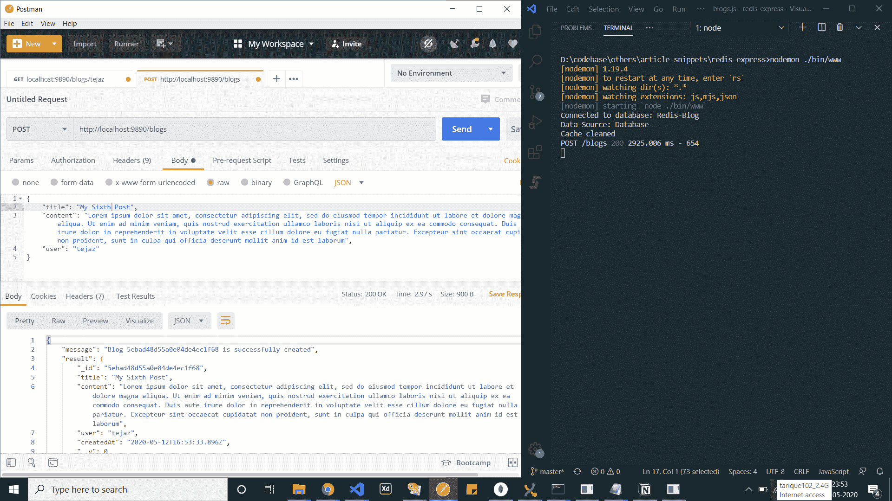
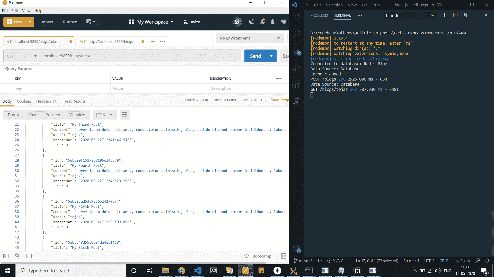
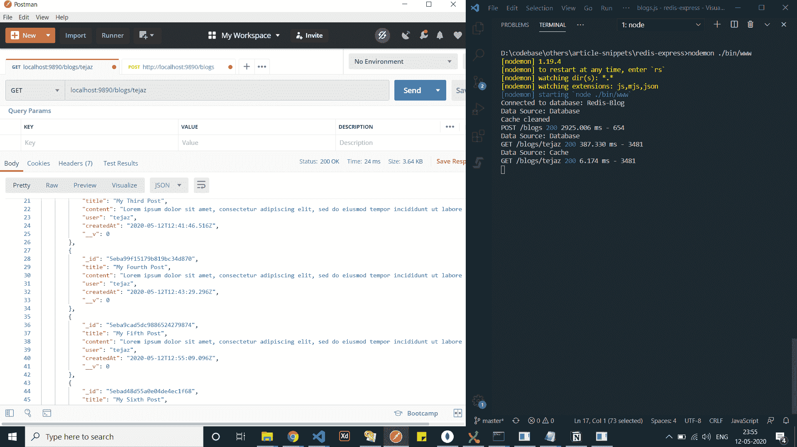

# 如何使用 Redis 增强您的 Web APIs

> 原文：<https://www.freecodecamp.org/news/redis-caching-essentials-with-node-and-mongoose/>

当你设计任何一款软件时，性能都是一个需要考虑的重要参数。当谈到幕后发生的事情时，这一点尤其重要。

作为开发人员和技术人员，我们采用多种调整和实现来提高性能。这就是缓存发挥作用的地方。

> 缓存被定义为一种将数据或文件存储在临时存储位置的机制，在需要时可以从该位置即时访问数据或文件。

如今，缓存已经成为 web 应用程序中的必备功能。我们可以使用 Redis 来增强我们的 web APIs 这些 API 是使用 Node.js 和 MongoDB 构建的。


"Caching would apparently still play a super important role 100 to 200 years down the line."

## -= ytet-伊甸园字幕组=-翻译:粒粒粒尘紫月猫姐 scenery 校对:阿衡时间轴:邦德猪

[Redis](https://redis.io/) ，根据官方文档，定义为内存中的数据结构存储，用作数据库、消息代理或缓存存储。它支持数据结构，如字符串、哈希、列表、集合、带有范围查询的排序集合、位图、超级日志、带有 radius 查询的地理空间索引和流。

好的，这里有相当多的数据结构。简单来说，几乎所有支持的数据结构都可以压缩成某种形式的字符串。当我们运行实现时，您会更加清楚。

但有一点是清楚的。Redis 是强大的，如果使用得当，不仅可以使我们的应用程序更快，而且效率惊人。说够了。让我们把手弄脏吧。

## 让我们谈谈代码

在我们开始之前，您需要在本地系统中安装 redis。您可以按照这个[快速设置](https://redis.io/topics/quickstart)过程来启动和运行 redis。

完成了吗？酷毙了。我们开始吧。我们有一个用 Express 创建的简单应用程序，它利用 MongoDB Atlas 中的一个实例来读写数据。

我们在`/blogs` route 文件中创建了两个主要的 API。

```
...

// GET - Fetches all blog posts for required user
blogsRouter.route('/:user')
    .get(async (req, res, next) => {
        const blogs = await Blog.find({ user: req.params.user });

        res.status(200).json({
            blogs,
        });
    });

// POST - Creates a new blog post
blogsRouter.route('/')
    .post(async (req, res, next) => {
        const existingBlog = await Blog.findOne({ title: req.body.title });

        if (!existingBlog) {
            let newBlog = new Blog(req.body);

            const result = await newBlog.save();

            return res.status(200).json({
                message: `Blog ${result.id} is successfully created`,
                result,
            });
        }

        res.status(200).json({
            message: 'Blog with same title exists',
        });
    });

...
```

./routes/blogs.js

### 洒一些红色的善良

我们从下载 npm 包 [`redis`](https://www.npmjs.com/package/redis) 开始，连接到本地 redis 服务器。

```
const mongoose = require('mongoose');
const redis = require('redis');
const util = require('util');

const redisUrl = 'redis://127.0.0.1:6379';
const client = redis.createClient(redisUrl);
client.hget = util.promisify(client.hget);

...
```

./services/cache.js

我们利用`utils.promisify`函数来转换`client.hget`函数，以返回一个承诺，而不是一个回调。你可以在这里阅读更多关于`promisification`。

Redis 连接已就绪。在我们开始编写更多的缓存代码之前，让我们后退一步，尝试理解我们需要满足的需求以及我们可能面临的挑战。

我们的缓存策略应该能够解决以下几点。

*   缓存特定用户的所有博客帖子的请求
*   每次创建新的博客文章时清除缓存

在实施我们的战略时，我们应该小心的可能挑战有:

*   处理存储缓存数据的键创建的正确方法
*   用于保持高速缓存新鲜度的高速缓存过期逻辑和强制过期
*   缓存逻辑的可重用实现

好吧。我们已经记下了我们的观点，并重新连接起来。进入下一步。

### 覆盖默认的 Mongoose Exec 函数

我们希望缓存逻辑是可重用的。不仅可重用，我们还希望它成为我们对数据库进行任何查询之前的第一个检查点。这可以通过在 mongoose exec 函数上附加一个简单的工具来轻松实现。

```
...

const exec = mongoose.Query.prototype.exec;

...

mongoose.Query.prototype.exec = async function() {
	...

 	const result = await exec.apply(this, arguments);

    console.log('Data Source: Database');
    return result;
}

...
```

./services/cache.js

我们利用 mongoose 的原型对象来添加缓存逻辑代码，作为查询中的第一次执行。

### 将缓存添加为查询

为了指出哪些查询应该进行缓存，我们创建了一个 mongoose 查询。我们提供了通过`options`对象传递用作散列键的`user`的能力。

> **注意:** Hashkey 作为一个散列数据结构的标识符，通俗地说，可以说是一组键-值对的父键。从而能够缓存大量的查询值集。你可以在 redis [这里](https://redislabs.com/ebook/part-1-getting-started/chapter-1-getting-to-know-redis/1-2-what-redis-data-structures-look-like/1-2-4-hashes-in-redis/)阅读更多关于哈希的内容。

```
...

mongoose.Query.prototype.cache = function(options = {}) {
    this.enableCache = true;
    this.hashKey = JSON.stringify(options.key || 'default');

    return this;
};

...
```

./services/cache.js

这样做之后，我们可以很容易地使用`cache(<options argument>)`查询以及我们希望以下面的方式缓存的查询。

```
...

const blogs = await Blog
                    .find({ user: req.params.user })
                    .cache({ key: req.params.user });

...
```

./routes/blogs.js

### 精心制作缓存逻辑

我们已经建立了一个通用的可重用查询来表示哪些查询需要缓存。让我们继续编写中央缓存逻辑。

```
...

mongoose.Query.prototype.exec = async function() {
    if (!this.enableCache) {
        console.log('Data Source: Database');
        return exec.apply(this, arguments);
    }

    const key = JSON.stringify(Object.assign({}, this.getQuery(), {
        collection: this.mongooseCollection.name,
    }));

    const cachedValue = await client.hget(this.hashKey, key);

    if (cachedValue) {
        const parsedCache = JSON.parse(cachedValue);

        console.log('Data Source: Cache');

        return Array.isArray(parsedCache) 
                ?  parsedCache.map(doc => new this.model(doc)) 
                :  new this.model(parsedCache);
    }

    const result = await exec.apply(this, arguments);

    client.hmset(this.hashKey, key, JSON.stringify(result), 'EX', 300);

    console.log('Data Source: Database');
    return result;
};

...
```

./services/cache.js

每当我们将`cache()`查询与主查询一起使用时，我们将`enableCache`键设置为 true。

如果键为 false，我们将默认返回主`exec`查询。如果没有，我们首先形成获取和存储/刷新缓存数据的键。

出于唯一性的考虑，我们使用`collection`名称和默认查询作为键名。使用的散列键是我们之前在`cache()`函数定义中已经设置的`user`的名称。

使用`client.hget()`函数获取缓存的数据，该函数需要 hash-key 和 resulting key 作为参数。

> **注意:**当从 redis 获取任何数据时，我们总是使用`JSON.parse()`。类似地，在将任何东西存储到 redis 之前，我们在键和数据上使用`JSON.stringify()`。这样做是因为 redis 不支持 JSON 数据结构。

一旦我们获得了缓存的数据，我们必须将每个缓存的对象转换成一个 mongoose 模型。这可以通过简单地使用`new this.model(<object>)`来完成。

如果缓存不包含所需的数据，我们就向数据库查询。然后，将数据返回给 API 后，我们使用`client.hmset()`刷新缓存。我们还将默认缓存过期时间设置为 300 秒。这可以根据您的缓存策略进行定制。

缓存逻辑已经就绪。我们还设置了默认的到期时间。接下来，我们看看每当创建新的博客文章时强制缓存过期。

### 强制缓存过期

在某些情况下，例如当用户创建一个新的博客帖子时，用户希望当他们获取所有帖子时，新帖子应该是可用的。

为此，我们必须清除与该用户相关的缓存，并用新数据更新它。所以要强制到期。我们可以通过调用 redis 提供的`del()`函数来实现。

```
...

module.exports = {
    clearCache(hashKey) {
        console.log('Cache cleaned');
        client.del(JSON.stringify(hashKey));
    }
}

...
```

./services/cache.js

我们还必须记住，我们将在多个路由上强制过期。一种可扩展的方式是使用这个`clearCache()`作为中间件，一旦任何与路由相关的查询执行完毕，就调用它。

```
const { clearCache } = require('../services/cache');

module.exports = async (req, res, next) => {
    // wait for route handler to finish running
    await next(); 

    clearCache(req.body.user);
} 
```

./middleware/cleanCache.js

这个中间件可以很容易地在一个特定的路线上以下面的方式被调用。

```
...

blogsRouter.route('/')
    .post(cleanCache, async (req, res, next) => {

    ...

    }

...
```

./routes/blogs.js

我们结束了。我同意这是相当多的代码。但是在最后一部分，我们已经为我们的应用程序设置了 redis，并处理了几乎所有可能的挑战。是时候看看我们的缓存策略在起作用了。

## 重复行动

我们使用 [Postman](https://www.postman.com/) 作为 API 客户端来查看我们的缓存策略。开始了。让我们一个接一个地运行 API 操作。

1.  我们使用`/blogs`路线创建一个新的博客帖子



New Blog Post Creation

2.然后，我们获取与用户`tejaz`相关的所有博客帖子



Fetching all Blog Posts for User tejaz

3.我们再次获取用户`tejaz`的所有博客文章。



Fetch all Blog Posts for User tejaz Once More

您可以清楚地看到，当我们从缓存中取数据时，所用的时间从**409 毫秒**下降到了**24 毫秒**。这通过减少几乎 95%的**花费的时间来加速你的 API。**

另外，我们可以清楚地看到缓存过期和更新操作按预期工作。

你可以在这里的`redis-express`文件夹中找到完整的源代码。

[tarique93102/article-snippetsRepository containing prototype applications and code snippets related to dissemination of concepts - tarique93102/article-snippetstarique93102GitHub](https://github.com/tarique93102/article-snippets/tree/master/redis-express)

## 结论

对于任何高效的数据密集型应用程序来说，缓存都是必不可少的步骤。Redis 帮助您在 web 应用程序中轻松实现这一点。这是一个超级强大的工具，如果使用得当，它肯定可以为开发者和用户提供出色的体验。

你可以在这里找到 redis 命令的完整集合[。您可以使用它和`redis-cli`来监控您的缓存数据和应用程序进程。](https://redis.io/commands)

任何特定技术提供的可能性都是无限的。如果您有任何疑问，可以通过`[LinkedIn](https://www.linkedin.com/in/tarique-ejaz/)`联系我。

同时，继续编码。