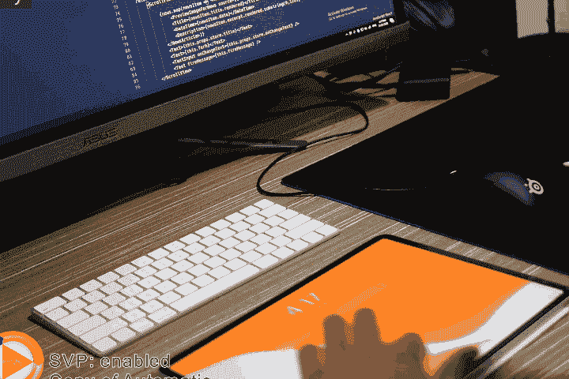
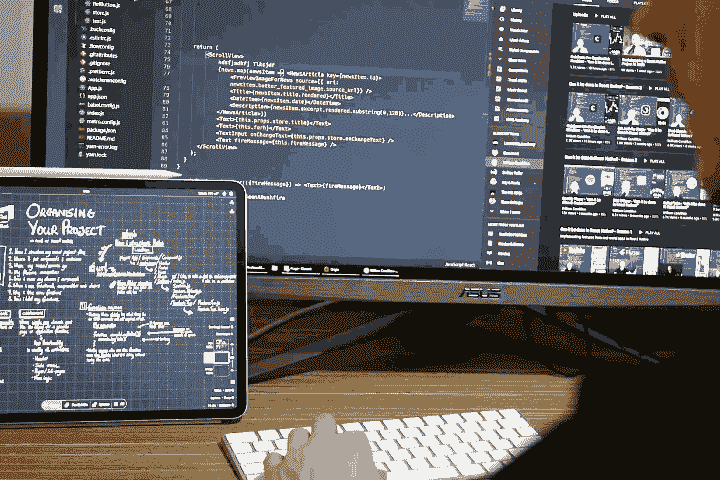
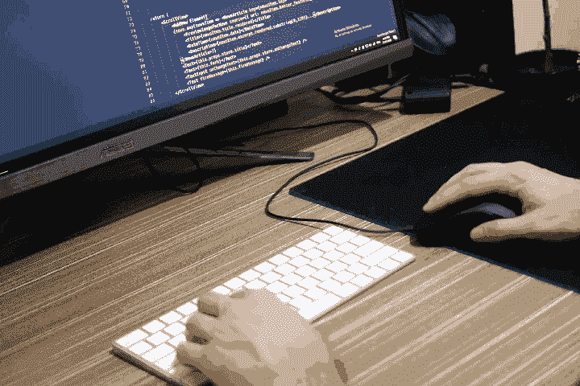
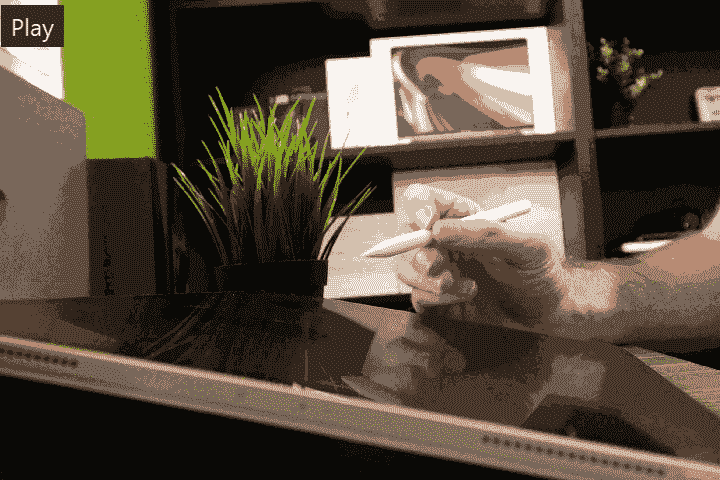
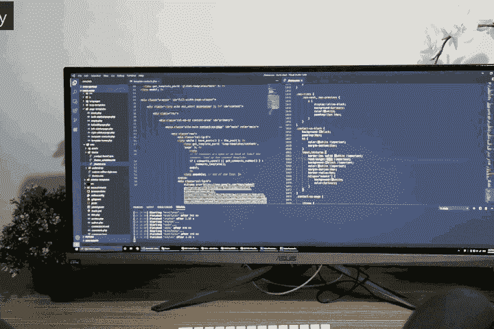
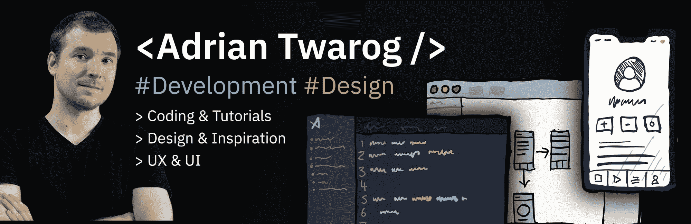

# 如何保持学习编码的动力

> 原文：<https://www.freecodecamp.org/news/how-to-stay-motivated-to-keep-learning-to-code/>

在当今技术、语言和框架不断变化的世界中，很难保持动力并继续学习。我们可能会被选项的数量和每个选项的深度所淹没。

所以我想分享一些我为了保持学习编码的动力而做的事情，以及我如何日复一日、年复一年地继续享受它。

这里是我的 **TLDR** 给那些想看一眼的人。但是如果你想知道更多，请继续阅读！

*   从只留出 5 分钟来学习开始
*   将任何学习分解成更小的可实现的部分
*   选择一件要学的事情，然后立即开始
*   享受作为旅程一部分的学习过程
*   保持常规，留出预定的时间持续学习
*   学习时避免社交媒体等的盲目
*   再做一次，继续学习，这不是你会失败的事情，只是你可能会暂时搁置的事情

## 5 分钟的学习

好像不多。这不算多。但这不仅仅是什么都不做。

当考虑留出几个小时的时间来学习你可能不理解的东西时，很容易被淹没。

学习编程的投入有时会错过你在玩运动或游戏时可能得到的那种娱乐水平。但那是因为那种程度的乐趣只有在我们深入事物的时候才会出现。

每天或每周**留出 **5 分钟足以让你开始**，而开始是最难的部分。一旦你开始编码，剩下的事情会自然发生。**

你会享受并获得想要做得更多的动力。我经常发现自己在计划只花 5 分钟的时间后，一次就能学到很多东西。

## 把大量的学习分成小部分

大多数事情都可以被分解成越来越简单的部分，每个层次都更容易理解。学习编码也不例外。

例如，学习 JavaScript 可能看起来是一项艰巨的任务。它有如此多的细微差别。然而， **JavaScript** 的每一部分，小到它如何处理数组(一组项目)，大到你调用方法的方式(做某事的方式)，都可以被一层一层地分解。

最终的结果是，您可能只是从学习如何**弹出**(从组中删除单个条目)开始。如果你一点一点地继续学习，你最终会学会所有的方法和函数是如何工作的，直到你可以使用这一方面的 JavaScript，而不必每次都谷歌它。

本质上，你是在一点一点地建立你所学的东西，直到你对整体有了更好的理解，而这只能通过将所有的东西缩减成更小的部分来开始。

## 选择一件要学习的事情，并立即开始学习

你可能已经知道你想学什么，你可能已经想了很久了。无论是 HTML，CSS，React 甚至只是普通的旧 JavaScript，想要开始学习一些东西是很棒的。

如果您还不知道您想要什么，freeCodeCamp 会为您提供大量主题，您可以从中挑选一个或从最上面开始。

但是如果你已经有话题了，就不要光想着了。阅读最新的文章、一遍又一遍地查看文档、了解该语言的最新动态都很好，但是要真正开始，您需要从零开始。

这意味着如果你想学习 React，现在就打开一个新项目，开始着手做。它不需要任何花哨的东西，你可能只是在做 Hello World 入门指南，但目标是停止思考学习，开始学习。

## 享受作为旅程一部分的学习过程

当你去跑步，吃一些食物，甚至去看一场电影时，你不会用“我想完整地吃下这顿晚餐”或“我成功地看了那场电影”来思考它。相反，你享受你所做的过程。

我们经常在学习中忘记这一点，我们如此努力地专注于“理解语言”，以至于忘记了“享受学习过程的乐趣”。

当你喜欢你正在做的事情时，你就完成了最好的学习。你的大脑会更容易记住它，并且记忆时间更长。这就是为什么这么多做得好的人是那些已经投入并乐于学习新东西的人。

诀窍在于，不要再过多考虑“收尾”，多想想你遇到的每个话题里有什么好玩有趣的。这样你会走得更远，也更快乐。当你回顾过去时，你会很开心；当你展望未来时，你会想要经历更多的学习旅程。

## 保持常规，留出预定的时间持续学习

很容易把学习放在最后。一天的最后一件事，一周的最后一件事。您实际上是将它设置为最后一个不太重要的对象。当你得到它的时候，你将没有能量，你可能会让它完全消失。

相反，先把它安排进去。你起床后可能做的第一件事，或者上班前完成的一天的第一部分。

你将为它设定一个更容易保持的议程。在一天开始的时候你会有更多的能量，所以你会学得更容易。如果你把它安排在其他事情之前，通常，随着时间的推移(一天又一天，一周又一周)，你会学到很多东西。

不一定要几个小时——当你每天花 15 分钟在一个主题上超过一年，那就是超过 90 个小时的学习！

## 学习时避免社交媒体等的盲目

当你有一百个小干扰时，很容易忘记自己或失去注意力。学习需要精神集中，保持学习的动力意味着你应该只把一个焦点放在你面前。

随着社交媒体通知在背景中弹出，YouTube 在边上以画中画的形式播放，以及十几个其他干扰，你可能会觉得你永远无法学习。

保持学习动力和专注的最好方法就是在学习期间把这些事情都关掉。将手机设置为静音或勿扰模式。关闭所有的浏览器窗口，如果你打算听音乐，确保它没有歌词，因为歌词可能很吸引人，你会发现自己在跟着唱。

这些都影响你的学习，如果你能把它们去掉，你会做得更好。

## 再做一次

继续学习。这不是你可以失败的事情，只是你可以暂时搁置的事情。

如果你习惯了学习的想法，它就不会成为一件苦差事，相反，它会成为你期待的事情。

由于技术、库和框架变化如此频繁，这将是你需要在编码中不断做的事情。期待它，花时间去欣赏事物永远不会变得陈旧和无聊，因为总会有新的东西在地平线上学习和做。

## 保持学习编码的动力

这些是我个人为了保持学习编码的动力而做的一些事情。我认为他们对我的成长帮助很大，我是一个全栈开发人员，喜欢做前端开发和一些后端工作。

多年来，我学习了 HTML、CSS、JS、PHP、React、React Native 等等。我很早就发现我喜欢 React，所以我在这个领域学习了更多，比如移动应用程序、如何使用状态等等。

随着你自己学习得越来越多，编码得越来越多，你会发现你喜欢学习什么，你可以专注于它，但只有当你保持学习编码的动力时，你才会这样做。

我是澳大利亚的阿德里安？我在 Twitter & YouTube 上有一个小小的频道，所以如果你想了解我更多或者喜欢我的内容，有空可以来看看我？

*   **Youtube:**【https://youtube.com/adriantwarog】T2
*   **推特:**【https://twitter.com/adrian_twarog】T2