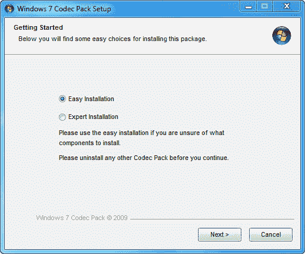
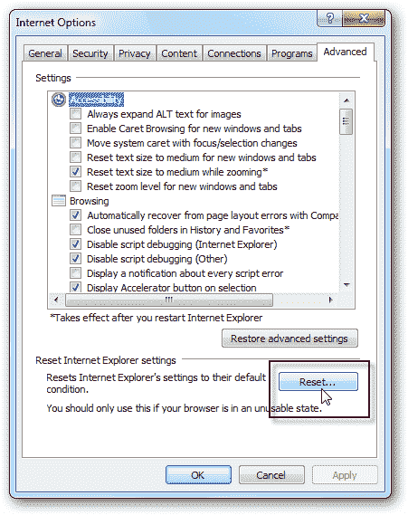
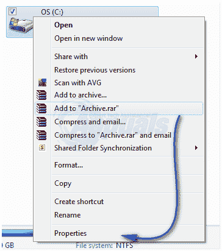
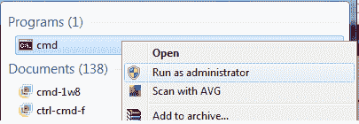
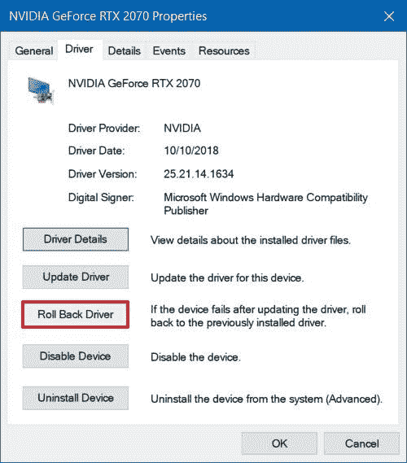
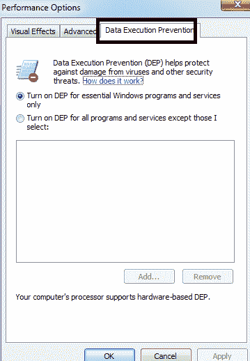

# Windows 任务管理器中的 dllhost.exe 和 COM 代理是什么？(已解决)

> 原文：<https://www.freecodecamp.org/news/what-is-dllhost-exe-and-com-surrogate-in-windows-task-manager-solved/>

COM 代理进程，简称**组件对象模型**，是 Windows 中必不可少的组件。它们用于运行其他程序需要运行的软件扩展。如果这些扩展崩溃，受影响的是代理进程，而不是运行它们的程序。

这些过程有许多使用案例，例如，在打开文件夹时创建图像和其他文件的缩略图。COM 代理进程宿主。dll 文件，所以它的名字是 dllhost.exe。

Photo by [Christin Hume](https://unsplash.com/@christinhumephoto?utm_source=ghost&utm_medium=referral&utm_campaign=api-credit) / [Unsplash](https://unsplash.com/?utm_source=ghost&utm_medium=referral&utm_campaign=api-credit)

## **COM 代理是病毒吗？**

简而言之，答案是否定的。COM 代理进程本身不可能是病毒。但是，病毒和恶意软件可以将自己伪装成 COM 代理进程。

## 我应该移除 COM 代理吗？

由于它是 Windows 的一个集成部分，我不会建议你删除它。这个容器进程使您的操作系统能够运行 COM 对象，帮助其他进程和程序工作。

## 检查 COM 代理的合法性

由于这些进程是 Windows 的真正组件，因此被网络罪犯广泛使用。这会产生一些后果——例如，COM 代理占用大量 CPU 资源，并在任务管理器中创建副本。

检查其合法性的一个简单方法是:

1.  通过**右键单击任务栏上的**并单击任务管理器来打开 Windows 任务管理器。
2.  找到 COM 代理进程，然后右键单击到**打开文件位置**。
3.  位于****C:/Windows \ System32****或 ****C:/winnt/system32** 的进程是合法的。**

## 常见错误

1.  ******COM 代理高 CPU，磁盘使用率******
2.  ******COM 代理不响应，冻结******
3.  ******COM 代理病毒******
4.  ******COM 代孕取记忆******
5.  ******COM 代理永远运行******
6.  ******COM 代理停止工作******
7.  ******通讯器代理不断崩溃，开启******

出现这些错误的原因有很多。最常见的有:

1.  第三方程序错误地注册了 COM 对象，或者它们不能正常工作(如果它们与当前版本的 Windows 不兼容，则是过时的软件)。
2.  如果在资源管理器中绘制缩略图时出现问题，这是因为编解码器过期或工作不正常。
3.  可能由病毒或恶意软件以及对 Windows 系统文件的损坏引起。

## 如何修复这些错误？

我们在上面讨论了许多错误，但其中最常见的是“ **COM 代理已停止工作**”。下面是解决它的各种方法。

即使您有上面列出的任何其他错误，这些方法也是可行的，应该有助于修复它们。

### 1.更新编解码器

解决此错误的手动方法是将 Windows (7、8 或 10)的所有**编解码器**更新到最新的更新版本。您可以从这里下载并安装您最新的 **Windows 编解码器包**:

[https://www.microsoft.com/en-in/download/details.aspx?id=507](https://www.microsoft.com/en-in/download/details.aspx?id=507)

**Windows 7 编解码器包:**【https://www.windows7codecs.com/ 

**Windows 8 & 10 编解码器包:**http://www.windows8codecs.com/

Installing Codecs

### **2。重置 Internet Explorer**

该问题也可能是由于缓存文件损坏造成的。在这种情况下，最好重置 IE。

1.  按住**窗口键**和**按 R** 。在运行对话框中，键入 **inetcpl.cpl** 并点击 **OK。**转到高级选项卡，选择重置。
2.  选择**删除个人设置**并再次点击重置按钮。一旦你完成了所有这些，重启你的电脑并进行测试。

Resetting Internet Explorer

### 3.检查磁盘错误

如果在打开保存在特定的**驱动器**而不是 C:\中的文件时出现此错误，那么您应该检查该驱动器是否有错误。如果您没有任何额外的驱动器，只需检查 C:\驱动器。

1.  按住**窗口键**并按下 **E** 。在 **Windows 7/Vista** 上，你会看到驱动器列表。
2.  在 Windows 8/10 上，从左侧窗格中选择**这台电脑**以查看驱动器。**在选中的要检查的**硬盘**上右击**，然后选择**属性**。

Checking Disk for Errors

3.点击顶部的**工具**选项卡，然后点击**错误检查下的**立即检查**。检查**两个**选项**和点击**开始**。

### 4.重新注册 dll

1.  在升级的命令提示符下运行以下命令。点击开始，输入 **cmd，**，右键点击搜索结果中的 **cmd** 程序。然后选择**以管理员身份运行**。

Running cmd as Administrator

2.在**命令提示符**窗口中，键入以下命令，并逐个按下**回车键**:

`regsvr32 vbscript.dll`

Re-registering the DLLs

### 5.回滚到以前的显示适配器驱动程序

1.  为此，按住**窗口键**和**按 R** 。在运行对话框中，键入 **hdwwiz.cpl** ，点击 **OK** 。
2.  滚动到设备管理器中的**显示适配器**部分。右键单击它并选择属性。
3.  点击**回滚驱动程序**并按照屏幕上的指示进行操作。

在某些情况下，此选项是灰色的。如果是这种情况，请尝试以下方法。

Display Adapter

Roll Back Driver

### **6。将 dllhost.exe 添加到 DEP(数据执行阻止)例外中**

转到开始>控制面板>系统>高级系统设置>性能设置>数据执行保护。

1.  选择 **"** 打开所有程序和服务的 DEP，除了我选择的: **"**
2.  点击"**添加"**，在 32 位 Windows 机器上导航到**C:\ Windows \ System32 \ dllhost . exe**，在 **64 位机器上，添加**C:\ Windows \ syswow 64 \ dllhost . exe****
3.  将**dllhost.exe**添加到例外列表后，**应用更改**或点击**确定。**

Data Execution Prevention

### 7.切换到列表或详细信息视图/禁用缩略图

我们已经讨论过 **COM 代理**负责你的缩略图。为了避免这个问题，你可以禁用缩略图。

此外，您可以通过以下操作切换到**列表**或**细节**视图:

1.  打开 ****文件浏览器**** 。
2.  点击 ****视图选项卡**** ，选择 ****列表**** 或 ****明细**** 选项。

### 8.更新您的防病毒软件

据报道，某些反病毒软件，如卡巴斯基反病毒软件，有时会导致 **COM 代理**进程出现问题。

为了解决这些问题，您应该安装当前防病毒软件的最新版本。

* * *

*感谢您阅读本文。我希望它能帮助您修复 COM 代理错误。*