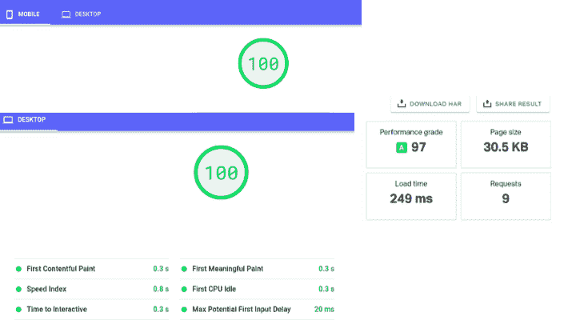
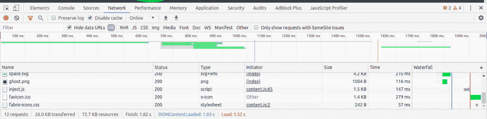
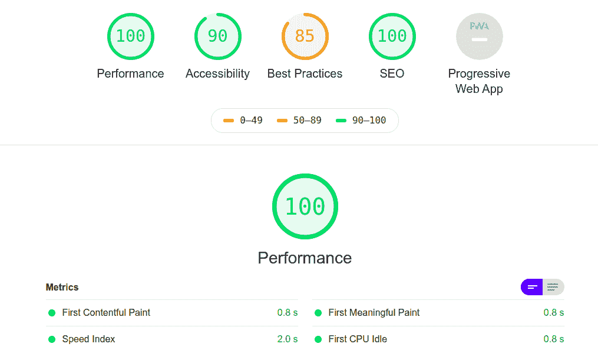
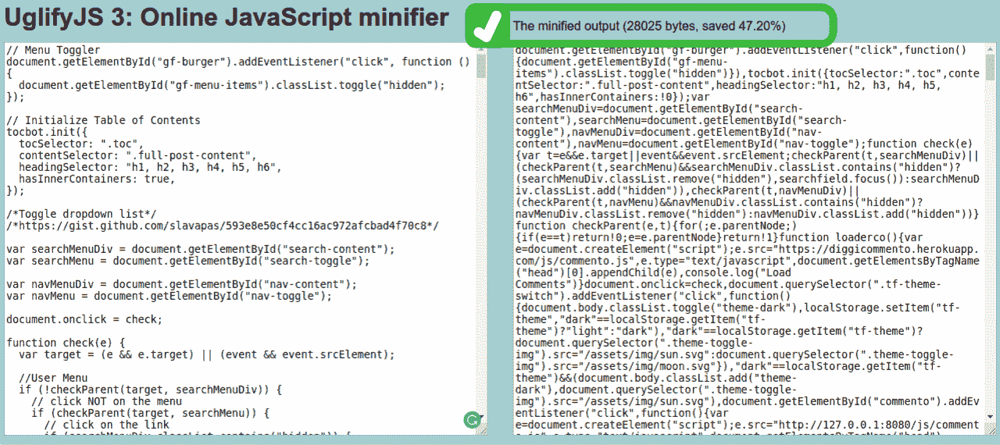

# 网站速度优化开发者指南

> 原文：<https://www.freecodecamp.org/news/developers-guide-to-website-speed-optimization/>

我想了很多关于我们如何优化网站速度的问题。世界变得越来越繁忙，没有人喜欢等待网站加载。

用户能做的让网站运行更快的事情很少。但是对于我们这样的开发者来说，可能性是无穷的。真正的优化从代码开始，在服务器端完成，比如托管、CDN、缓存等等。

在这里，我收集了优化网站的最佳方法，这些方法是我在 Ghost CMS 上为我的博客创建主题时学到并实现的。

这是结果的图片。

Custom theme demo

主题是如此之快，因为它不包含任何额外的功能，除了我需要一个非常小的博客。我每月支付 5 美元的云托管费用。现在我已经隐藏了这个域名，因为它是临时托管的(测试一些新的东西)。

## 为什么速度很重要

人们很忙，他们不会浪费宝贵的时间等待你的网站加载。

自 2010 年 4 月[以来，网站加载速度一直是 SEO 中最重要的因素之一。用户喜欢快捷的网站，在那里他们可以获得有用的信息。](https://webmasters.googleblog.com/2010/04/using-site-speed-in-web-search-ranking.html)

加载速度更令人兴奋的一点是，它会影响你的品牌形象。我可以很容易地回忆起 3-4 个点击后立即加载的超高速网站。

假设你正在访问一个产品网站，它需要 10 秒钟来加载。你会在计费页面再浪费 10 秒吗？这会如何影响你的信任？你会相信一个需要很长时间加载的网站吗？

> 在你作为开发者之前，像用户一样思考。

好的网站加载速度更快，用户很快就能看到网页。

## 不同的速度测试工具

现在你知道为什么我们需要优化我们的网站来加快加载速度了。这里有一个在性能基准测试中流行的工具的快速概述。

### 你自己的浏览器

是的，你的浏览器有一个强大的工具，让你知道你的网站的加载速度。我通常使用它来获取每个网页请求中加载的文件(脚本和样式表)数量的详细信息。

打开浏览器的开发工具(右键单击，然后检查)，然后转到网络选项卡。在禁用缓存的情况下重新加载网页，你会看到加载速度的详细统计。

Chrome network tools

但是这种方法是有局限性的，因为它只测试你所在位置的加载速度。我们知道在全球不同的地方速度会发生变化。

### [Pingdom 工具](https://tools.pingdom.com/)

这里是全球速度测试的解决方案:选择多个地点来测试你的网站加载速度。

它还提供了一份详细的报告，其中包含您可以用来进一步优化的建议。

### [页面速度洞察](https://developers.google.com/speed/pagespeed/insights/)(基于灯塔)

Page Speed Insights 创造了这样一种信念:100 分对于 SEO 来说是必须的。

然而，这并不完全正确，因为一些最受欢迎的网站得分低于 70。

Page speed insights 使用 Lighthouse 作为他们的分析工具，它与 SEO 没有直接关系。

Lighthouse 是一款开源的网站性能分析工具。它审计网站的性能、搜索引擎优化、可访问性、渐进式网络应用等等。

如果你正在本地开发一个网站，Lighthouse 也可以作为一个浏览器扩展或 [NPM 包](https://www.npmjs.com/package/lighthouse)使用。

Lighthouse website analysis report

它给出了一些其他工具无法报告的重要优化细节。对于缩小网页尺寸，优化网站加载速度有很大的帮助。

### [GTmetrix](https://gtmetrix.com/)

我发现这比其他服务更准确。它给出了关于你的网站加载速度的准确见解。它还提供了一份关于最佳实践的深入报告，可以进一步提高您网站的性能。

## 优化网站加载速度的最佳方法

接下来我们将开始优化工作。所有这些步骤对提高任何网站的性能都非常有帮助。

但是请记住，不是所有的步骤对每个人都是必要的。你可以跳过那些可能会破坏你网站的步骤(在优化过程中经常发生)。

### 尽可能避免额外的包和脚本

当我开始 web 开发时，我更喜欢用 NPM 安装来解决所有问题。但我是 noob:)。很快我意识到为我面临的每个问题安装一个新的软件包的成本。

使用 npm 包有利于快速开发，但是每个新的包都附带了许多你可能永远都不需要的额外功能。

真正的问题在于更新项目。软件包会随着时间而贬值，所以管理大量的软件包就像一场噩梦。

尝试自己解决基本问题是一个好主意，而不是找一个 NPM 公司帮你解决。

这里有一个有用的 [VS 代码扩展](https://marketplace.visualstudio.com/items?itemName=wix.vscode-import-cost)，可以让你知道导入包的大小。

同样的事情也适用于 jQuery。曾几何时，它是每个应用程序必备的 JavaScript 库。但是现在香草 JS 依然坚挺。

如果您可以避免使用 jQuery，它将为您的网页节省大约 30KB 的额外加载。

这个网站有助于寻找 jQuery 替代品:[惊人的 jQuery 替代品集合。](http://youmightnotneedjquery.com/)

我仅通过从 Ghost CMS 主题中删除 jQuery 就节省了大约 100 毫秒。用普通的 Js 替换 jQuery 需要做很多工作，但是结果非常棒。

可以说每个剧本在表演中都很重要。

### 移除未使用的 CSS

CSS 框架对于 web 应用的快速开发非常有帮助。然而，它们有许多我们在项目中从未使用过的组件和样式。

在这种情况下，PurgeCSS 非常有用，因为它从样式表中移除了未使用的 CSS。

它并不像看起来那么容易使用，但是值得花时间投资。

只是提醒一下:有时 PurgeCSS 也会删除对您的项目有用的 CSS。所以我建议你在使用后对网站进行适当的手动验证和测试。

作为一个例子，我的网站的黑暗主题被打破了，因为 PurgeCSS 删除了 CSS 变量，因为它们当时没有被使用。

### 缩小 CSS 和 JavaScript

您应该在将 Javascript 和 CSS 文件推送到生产服务器之前缩小它们。

Minify CSS 和 Javascript 意味着从文件中删除不必要的代码，如注释、空格、制表符，因为在生产中它们只供浏览器理解。

这将减少大约 50%的文件大小，并使您的网页加载速度更快。

Minfied Javascript size reduced by 47%

这里有你可以使用的在线 CSS 和 Javascript 迷你程序。

*   [在线 CSS 缩小器](https://cssminifier.com/)
*   [在线 JavaScript Minifier](https://javascript-minifier.com/)

这是将顺风 CSS 与缩小和清除 CSS 一起使用时的另一个观察结果:

*   样式表的原始大小:~150KB
*   使用 Minify+Purge CSS: 4.9KB(一切正常)

不过，这不是一次性的解决方案。最初它破坏了许多东西(像夜间模式和 Javascript 触发的许多其他功能)，因为 purge CSS 删除了它，因为它们在那个时候没有被使用。

我不得不手动检查并从清除 CSS 插件中排除这些样式。

### 压缩和调整图像大小

图片是影响任何网站加载速度的关键因素。很多网站甚至在不需要的时候也使用高分辨率图像。

最完美的例子是，对于 250 x 250 的作者图像，您不需要 2000 x 2000 的图像。

在上传图片到网上之前，一定要考虑裁剪和压缩图片。

你可以使用在线压缩工具，如 [Tiny PNG](https://tinypng.com/) 来压缩图片，然后在你的网站上使用。使用图像压缩，您可以减少高达 60-70%的图像大小。

### 延迟加载图像

正如我所说，图片是网站加载速度的关键因素。这意味着在加载图像时，您必须采取正确的步骤来优化图像。

首先，你可以推迟屏幕外的图像。这意味着当用户滚动到 1 个视窗高度后的图像时，这些图像将被加载。

惰性加载也是值得推荐的，它对于优化你的网站快速加载非常有效。

这很有帮助，因为有时用户不需要一直滚动到页面底部，阅读你网站的所有内容。所以延迟加载只在用户滚动到图像时才加载。

您必须小心地实现延迟加载，并确保 JavaScript 回退作为一种替代方案。

可以以 Medium.com 的文章为例进行图片的懒加载。他们将一个分辨率非常低的图像作为占位符，并在用户滚动到原始图像时加载它。

参见 [CodePen](https://codepen.io) 上 Jeremy Wagner ( [@malchata](https://codepen.io/malchata) )的 Pen [懒装例子](https://codepen.io/malchata/pen/mXoZGx)。