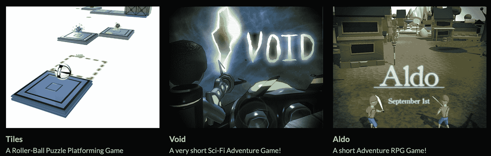
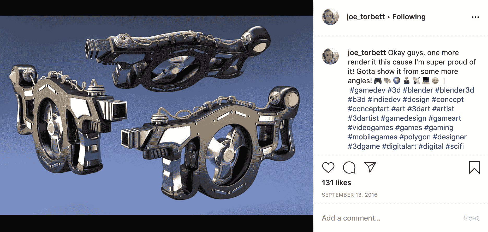
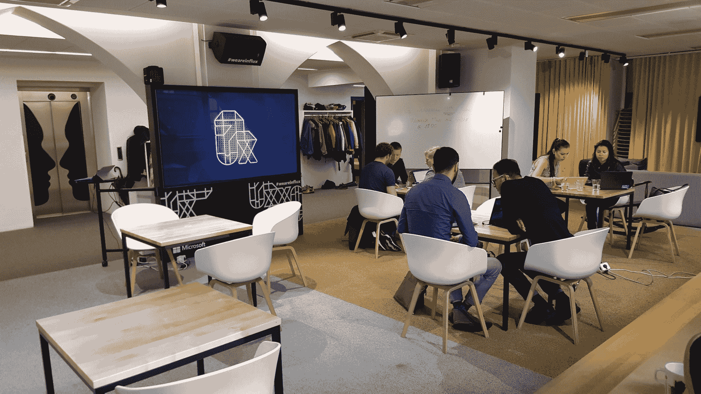
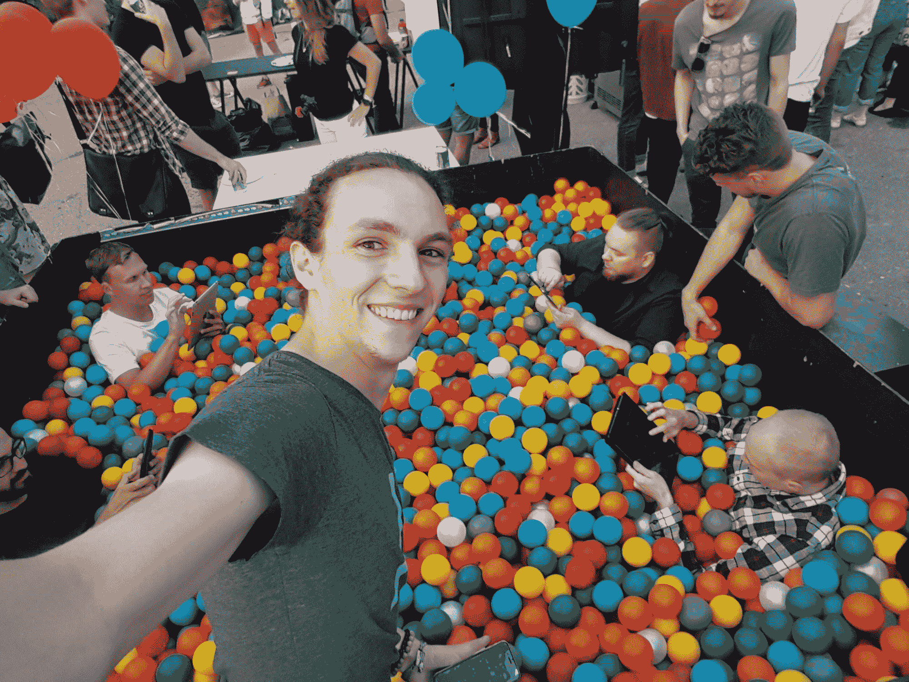
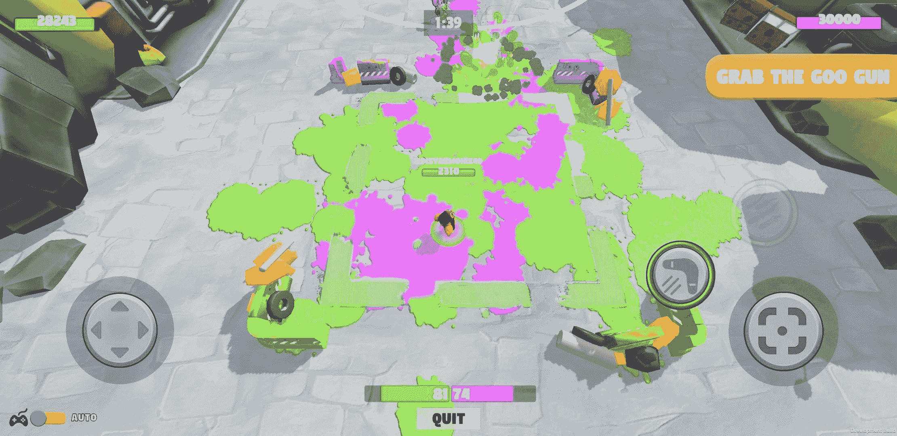
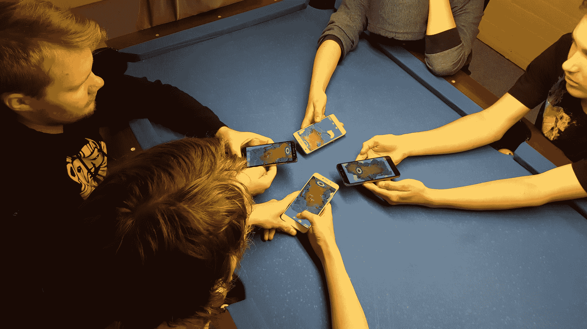
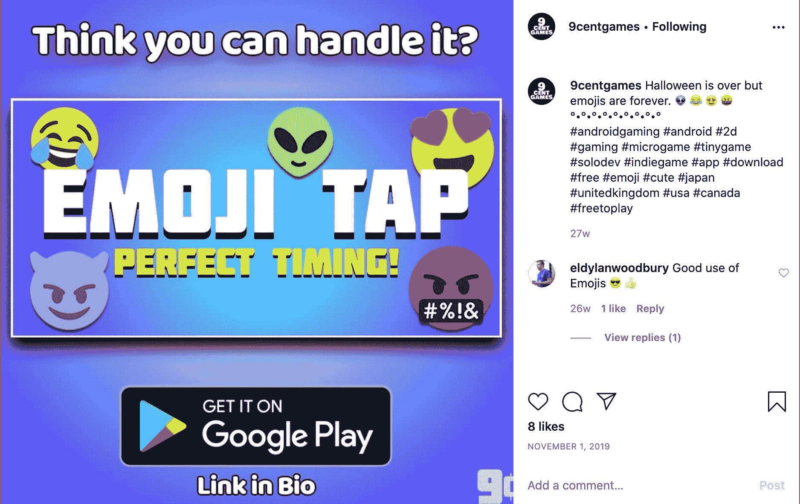

# 从自学成才的开发者到手机游戏创业者——乔伊·托贝特访谈

> 原文：<https://www.freecodecamp.org/news/interview-with-a-self-taught-developer-turned-mobile-game-entrepreneur/>

我还记得第一次去乔伊家的时候。他的房间就像任何一个 11 岁孩子的房间一样，完全是一场灾难。在他的父母为混乱道歉后，我逗他笑了，“没关系，”我说，“这样更容易看到他所有的东西！”

直到高中之后，我们才彻底背离了彼此。我去了商学院，而他追求摄影，被他申请的所有大专院校拒绝。

我绝不会想到，六年后我们会走上完全相同的道路——两人都是自学成才的开发者，但道路不同。

我记得乔伊第一次告诉我他在 Unity 开发的游戏。当我们年轻的时候，我们花了无数的时间玩《我的世界》，所以我认为这是那个领域的事情。

我很快就要出国留学了，当然没有太注意他的新爱好。我从未想到这会发展成更伟大的事业。

他已经从在 Instagram 上分享他的项目，到在芬兰共同创立了一家公司，并完全从零开始他的最新风险投资， [9 Cent Games](https://www.instagram.com/9centgames/) 。

我想在这里分享他的故事。

## 你为什么开始自学游戏开发？

大约一年前，我开始涉足 Photoshop 和后期效果。我玩滑板弄伤了脚踝，有很多空闲时间。我使用 Photoshop 的工作让我进入了 3D 艺术领域。

我开始思考，我能用这些 3D 模型做什么？我不会做动画。工作量太大了。我认为你需要一个团队。所以我想，也许我可以给这些模型编码。

我开始尝试用这些 Unity 教程来学习。我实际上放弃了几次，直到它真正在我脑海中闪现。慢慢的，我开始积累知识，只是发布简单的游戏，在 Reddit 上提问。Instagram 上的社区也非常非常鼓舞人心。然后就变成了现在这个样子，六年后还是什么。我想我是 2014 年开始的。

Unity 在 YouTube 上有一大堆教程。有一个[太空射击游戏](https://www.youtube.com/watch?v=kX0hnOS1QQQ&list=PLX2vGYjWbI0RibPF7vixmr4x8ONJX-mNd)，然后是一个[滚球游戏](https://www.youtube.com/watch?v=W_fAidYRGzs)。我根据他们的滚珠教程制作了一个叫做[瓷砖](https://www.youtube.com/watch?v=Jk4sO4m4uGI)的小球类游戏。那是我做的第一个游戏。

## 你为什么辞职？

哦，我真的不明白。我很难真正掌握哪怕是最基本的编程概念。对于循环，if 语句，诸如此类。我在 Unity 中使用了 update 循环来编写大约一百条 if 语句，而不是仅仅使用一个 for 循环来做基本的事情。我一点也不理解。

有东西一直把我拽回来。我做了一个平台游戏，然后是一个小射击游戏，然后我做了一个叫 Aldo 的游戏，这是一个动作 RPG，有六个任务和几个不同的世界。我一直在尝试拓展我的游戏，一想到能走得更远一点，我就很兴奋。

然后你意识到你的知识有巨大的缺口，你不知道如何计划这些项目。所以你必须退后一步。变小。

Thumbnails of the early games

## 你是如何变得更擅长规划项目的？

老实说，研究游戏，看看 YouTube 上游戏设计崩溃的视频，看看这些游戏是如何构建的，以及背后的想法。

我会挑选任何我能找到的元素，复制它，然后尝试用一些小方法使它成为我自己的。或者直接复制一些东西，看看我是否能通过编程复制一个很酷的机械装置。

这简直就像是拼凑起来的。我可以给你看一些我很久以前写的代码，你会笑的。

## 你在 Instagram 上分享了你所做的一切。为什么？那是什么感觉？

Instagram 过去和现在都是我的头等大事。这也是一切开始的方式。那里有一个很大的开发社区。特别是游戏开发社区。每个人都分享他们的作品，对想法的评论；人们通常都很支持。

这非常激励人心。发帖让我保持活跃，推动我前进，因为它是如此孤独。你有时会感到孤独。你必须真正地自我激励，每天早上自己起床，除了你对编码的热情之外没有其他原因。

Instagram 是一种保持责任感的方式，也是一种建立动力的方式，因为你获得的影响力和社区都是真实的。

我今天仍然使用相同的标签与社区保持联系，如 [#gamedev](https://www.instagram.com/explore/tags/gamedev/) 、 [#indiegamedev](https://www.instagram.com/explore/tags/indiegamedev/) 、 [#madewithunity](https://www.instagram.com/explore/tags/madewithunity/) 、 [#unity3d](https://www.instagram.com/explore/tags/unity3d/) 。

## Instagram 实际上导致你共同创立了一家公司，对吗？

是啊，我在 Instagram 上遇到了我未来的商业伙伴。我正在张贴我的作品，他开始喜欢一些照片。我的搭档非常喜欢我做的一些武器设计。他最终给我发了短信，我们开始交换想法。

我们交换了很长时间的想法，最终我买了一张从多伦多飞来的机票，去芬兰和他见面。有点超现实。赫尔辛基有一个庞大的社区。像 Rovio T1 和 T2 Supercell T3 这样的工作室都在那里。芬兰有一些疯狂的游戏公司。

我在会走路之前就开始跑了。很快我们有了自己的公司[动作反应游戏](https://www.actionreaction.games/)，并开始计划我们的第一款游戏，战斗泡泡。

我们刚刚开始开发游戏。我以前从未开发过多人游戏，所以这是一个障碍。我们尝试了所有这些不同的后端工具，都有点工作，但有点不。每天都有新的挑战。在这段时间里，我学到了我现在所知道的 80%的东西。

## 你是如何找到其他志同道合的人和你一起开始这个项目的？

我的搭档主导了很多，因为他是负责联络的人。在那些日子里，我更多的是在技术方面。他领导了这支部队。我说过，赫尔辛基的社区很大！

我想在我加入之前，他有两个工程师和他一起工作来建造一个原型。不合适，所以他们最终离开了。最终，我们找到了一位合作的艺术家。另一个来自那里的非常非常专业的人。所有这些人都是他从关系网中认识的。

## 什么时候变得更严重了？

2018 年 4 月左右。我们刚刚结束融资，这是事情真正开始加速的时候。这是令人难以置信的艰苦导致这一点。

有很多会议。有很多音高。很多人会无缘无故地与你见面，但他们甚至不会回应你，即使他们在最初的会面中看起来非常兴奋。很多时候我都不在那里，但有足够多的时候我在那里。我在那里看到了那些真正获得投资的关键公司。所以这很酷。

Our co-working space

这完全是一种折磨。这是一项艰苦的工作，只需要建立核心关系网，弄清楚谁真的会给你钱，谁真的相信你，以及我为什么会在这里？

芬兰就是这样一个中心。那里的资金流动有点慢，但从某种意义上说，也有点慢。赫尔辛基有成千上万的天使投资者和风险投资家专注于游戏投资。我不想点名 drop 或任何东西，但我们有一些非常酷的人参与了早期财务方面的战斗。

我们最终筹集了大约 10 万欧元，然后芬兰政府有了一个项目，他们基本上翻了一番。

## 投资之后事情发生了怎样的变化？

安排所有事情，紧迫的截止日期，以及更多的会议。我们有非常明确的目标，需要更快地行动。步伐大不相同。这绝对是自我提升。

有更多的测试，比赛，试图让球队更好地协调，这是一个很大的斗争。我们并不总是意见一致。很艰难。你心里知道有人真的在支持你。在这件事上，你会感到一种巨大的责任感。

很不幸，我是唯一一个被隔离的人。其他人每天都在办公室工作。我会尽可能多地来芬兰，在那里亲自动手，但我是唯一一个远离芬兰的人。

这有点吓人，尤其是当事情开始变得有点不确定的时候。你知道，随着事情的发展。

## 战斗部落最大的成功是什么？

当然是我们开发的技术，软件，以及让游戏上线。我们的发布会非常成功。我们有五万次下载。不幸的是，我们没有货币化机制。这是我们的一个巨大疏忽。

Battle Blobs launch party

很多都是有机的。我们确实付钱给一家公司帮助我们营销。我不认为他们真的帮了太多忙。但后来不知何故，中国得到了它，它飙升。

真的很奇怪。两周内，它的下载量达到了 15000 次左右，这只是随机的。我们根本没有在中国营销。当时我们只在英国做营销。我们被告知那是最好的地方。我现在质疑这一点，但似乎我们的应用程序的营销和外观在那里有一些吸引力。

## 你是什么时候开始觉得事情没有朝着正确的方向发展的？

我们计划在发布后进行第二轮投资。我们的主要目标是留住客户，吸引客户，基本上就是生产高质量的产品。我们努力争取第二轮融资。我们做了我们能做的一切，甚至把整个游戏变得更简单。

An early prototype of gameplay

当时间表开始缩短时，你会注意到现金流在下降，接下来你会知道，我们会降低工资，因为我们想生存得更久一点。这时事情变得相当粗略，你开始有点担心整件事，然后你开始真正地质疑自己。

我发现自己开始质疑自己作为联合创始人的生存能力。即使我们获得了融资，我还能按照需要的方式运作吗？我实际上没有经营公司的经验。这是很多自我怀疑和强烈的情绪。

当它开始崩溃的时候被远程吸。甚至连工作都很难。我坐在电脑前无所事事，因为我无事可做。无事可做。我们只是在等待，希望能获得一轮融资。

【2019】八月中旬，我的合伙人基本上说，你看，也许做点损管，找个工作。如果你需要或者做任何你需要做的事。差不多就是这样。

我休了几个星期的假。我在《我的世界》连续玩了两周。就像治疗一样。

## 公司和所有建立起来的东西都怎么了？

它仍然存在。我认为它在技术上仍然属于动作-反应游戏。我已经有一段时间没和这些人聊过了，但我听说他们正试图把它授权出去。我没听说过那件事。我想这还没发生。

我们建立的技术非常可靠。这是一个完整的多人视频游戏后端。你可以在我们构建的框架内构建任何类型的多人游戏。很厉害。

老实说，那也很麻烦。它可能有点太多了，也许我们在技术上做得太多了。这真的是最大的事情之一——也许我们在技术上做得太多了。这就是我们的很多钱去了哪里，去了不需要去的地方。给那些试图过度设计东西的工程师们。

## 你犯过的最大的错误是什么？

有一些恐慌的时刻，我迅速做出决定，我应该后退一步，喘口气，多想想。我的恐慌引起了别人的恐慌，这是一个灾难的公式。

我个人并没有感到自信。我没有编码经验。我们的首席技术官真的在提升技术，当他提升时，我落后了，因为我跟不上。

我不知道。老实说，我大概还是不知道；它非常非常先进。所以我认为这是另一个障碍。我试图填补我无法填补的空缺。我可能会在公司里扮演一个更好的角色，会更有效率，更成功。

我是制片人，所以我有一个好角色，我很忙。我在管理所有的发行。我在确保版本稳定。我尽可能地做质量保证，尽管这本身就是一个挑战。

我们的质量保证和测试过程并不好。出于某种原因，很难让团队进行测试。我们只是不想玩这个游戏。

我总是说伙计们，我们必须测试一下。我们需要测试这个。你知道，我们会测试 2v2 或 1v1，没错，它功能正常。程序行得通，但游戏行得通吗？游戏围绕 3v3 打造。我们需要玩这个 3v3。伙计们，马上就要上映了。我们需要玩这个 3v3。

2v2 testing 

我们从来没有花时间确保游戏真的有趣。就像，和一屋子的人坐在一起玩到死，直到我们知道我们需要做什么。我们从没这么做过。在我目前的项目中，我仍然没有这样做。这是我仍然面临的另一个问题，但我正在努力。

我们犯的最大的错误是我们最初投资的时候。在我们的种子前期融资中，我们获得了 100 万美元的估值。

如果你在种子期前的估值是 100 万美元，而实际上，你只值 10 万美元。你拿着你以百万美元估值得到的钱去成长为百万美元估值。

当你这样做的时候，你会让你的原始投资者认为他们买了一家百万美元的公司，然后你的下一个投资者实际上得到了一家百万美元的公司，然后你的原始投资者被骗了，或者你在骗下一个投资者，因为他们得到了比你之前的投资者更差的交易。

这就造成了一轮不可能融资的局面。如果我们从一开始就进行真正的估值，我们可能会进入第二轮。最终还是有实际价值的，但不是在我们最初估值的时候。

## 如果你能重新开始，你会做什么不同的事？

关注编程基础。我会花更多的时间去理解软件设计概念和如何扩展软件，因为你将要构建的软件在某一点上不能移动，因为你没有正确地构建它。

最终你会有成千上万行的代码，它们被阻塞了，因为它们太垃圾了。你真的不得不放弃它。我已经做过了。我已经做过很多次了，感觉很糟糕。

如果我一开始就有更好的基本面，我们可能会领先一整年。

我现在使用[固体设计原则](https://en.wikipedia.org/wiki/SOLID)和其他类似的概念。我认为那很有帮助。你不必为了让一个功能工作而不断重写东西。在这个过程中，你也遇到了更少的错误和问题。

## 在你两周的休息后，什么是开始新生活的转折点？

我会一直想着它。在我的脑海里，在运行动作反应游戏时，我总是看着这些微型游戏公司，像[巫毒](https://www.voodoo.io/)或 [POPCORE](https://popcore.com/) 。这些超级大公司实际上制作了有史以来最简单的游戏。他们总是名列前茅。

有一次我休息了一下，我想，好吧，我可以试着发行一款游戏。它慢慢开始发生。我有一个整体框架的愿景来帮助降低游戏开发的成本。有一天醒来，我想，是时候开始了。

还有一个情感障碍。我几乎有一种负罪感，好像我在通过做自己的事来欺骗 Action React 游戏，这是一种怪异的感觉。感觉像是离婚。太疯狂了。

一开始只是想看看我能以多快的速度推出一款游戏。我从第一天开始就在 20 天内推出了一款游戏，名为 emoji tap。那真是太酷了。然后我在大约 14 天后把它换成了万圣节版本。所以我在前两个月内技术上推出了两款游戏，感觉很棒。

Emoji tap

我想我真的从建立战斗博客中学到了目标、期限和时间安排的重要性。我还学到了很多构建更大项目的编程基础。我的学习速度确实慢了下来，但我现在真的很喜欢我的工作。

## 这些天你在忙什么？

我的新项目正式命名为 9 分游戏。我真的专注于构建框架，所以我可以快速轻松地制作新游戏。它处理应用内购买、广告、产品和几乎所有你需要的最小可行产品。

从那时起，我计划创造游戏，然后让游戏帮助框架成长。当框架成长时，游戏也通过继承成长。

我想确保所有使用我们的框架构建的游戏都有一个坚实的成功基础。我想让开发人员能够快速构建，同时降低开发成本。就是这个想法。

它非常注重移动。关于 iOS 和 Android 部署的一切都完全处理好了。都是跨平台的。这可能已经完成了，但对我来说，这主要是一个很好的锻炼，因为我正在尝试这样做。

我刚刚发布了我的新游戏，细菌:病毒粉碎！在安卓上。它永远不会来 iOS，因为苹果说不。他们不想在隔离期间发布任何病毒游戏。

我把它变成了怪癖。这是个亚原子粒子游戏。这将是一个和细菌完全一样的游戏，但是它会有一个不同的皮肤。

* * *

如果你想进一步追踪乔伊的旅程，你可以在 Instagram、 [@9centgames](https://www.instagram.com/9centgames/) 或 [@joe_torbett](https://www.instagram.com/joe_torbett/) 上找到他。你还可以在[安卓和 iOS](https://linktr.ee/9centgames) 上下载他所有的最新发布的作品！

别见外！如果你有任何问题，请随时写信，[给我发邮件推荐你最喜欢的书，](mailto:braedongough@gmail.com) [在 Linkedin 上联系我](https://www.linkedin.com/in/braedon-gough-ba92a048/)或[在 twitter 上关注我](https://twitter.com/bbbraedddon)！