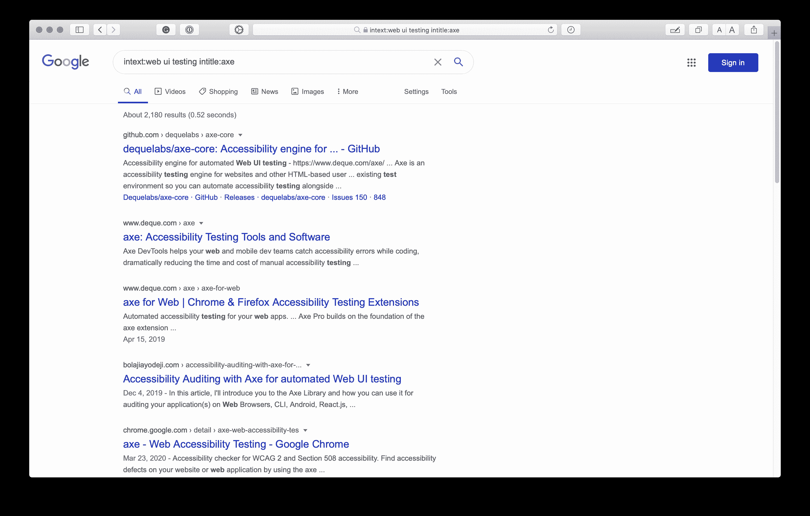

# 如何提出有效的问题:开发者实用指南

> 原文：<https://www.freecodecamp.org/news/asking-effective-questions-a-practical-guide-for-developers/>

学习是一场没有终点的旅行。在你职业生涯的每一个点上，你都会不断地学习，再学习，再不学习。

找到问题答案的能力是关键，这些答案可以通过调试、谷歌搜索或提问获得。这些都是每个人都应该学习的技能。

虽然提问很好，但是错误的或者低效的方式可能会导致很多小时的无效工作。在这篇文章中，向你展示如何提出有效的问题，成为一个更好的谷歌人，并磨练你解决问题的技巧。

## 阅读搜索提问方法

freeCodeCamp 为他们的学生想出了这个神奇的方法，叫做[阅读搜索提问](https://www.freecodecamp.org/forum/t/how-to-get-help-when-you-are-stuck-coding/19514)方法，在这个方法中，你可以有效地解决你的问题，同时也尊重他人的时间。

我们希望您在提问前按顺序遵循这些步骤。

*   **阅读**错误或文档
*   **搜索**谷歌或 Stackoverflow
*   向寻求帮助

### 阅读你的错误

找到问题解决方案的第一步是理解问题本身。很多开发者在不了解问题的情况下提问。记住，你要高效地提问，也要尊重你要问的人的时间。

大多数情况下，错误的答案就在错误本身。如果你看了错误本身就可以自己解决的问题，这是不体贴的。

调试错误的一个好方法是在控制台或终端上记录错误并读取错误。在这个阶段可能会发生五件事:

*   你发现了漏洞
*   您确定 bug 的位置(可能是文件或代码的一部分)
*   您了解错误的原因
*   您概述了可能的 bug 修复
*   您实现了可能的修复

通常，仅仅这一步就可以帮助你解决问题。你练习的越多，你在调试和修复问题上就越擅长。一些错误可能比你的能力更复杂，然后你需要寻求外部帮助或资源。

### 阅读文档

让我们假设你不能从第一步就解决你的问题(但是你至少能够识别 bug)。然后你需要阅读一些文档。

这可能并不适用于所有的 bug，但是在进入下一步之前，请确保完成这一步。在确定了您的 bug 之后，是时候确定原因并列出可能的修复方法了。

> 文档是一组在纸上、在线、数字或模拟媒体(如录音带或 CD)上提供的文档。例如用户指南、白皮书、在线帮助、快速参考指南。纸质或硬拷贝文档已变得不那么常见。~ [维基百科](https://en.wikipedia.org/wiki/Documentation)

文档是特定编程语言、框架、库或技术的官方指南。获得特定问题的第一手资料的最佳途径是查看该技术的官方帮助指南。

你可能配置错误，安装了一些错误的包或者忘记导入一些东西。但是当你阅读对这个错误负责的技术人员的文档时，它可以帮助你快速找到解决方法。

最近我在做一个 Gatsby 项目，我在生产中遇到了一些控制台错误和空白页面。但这并没有发生在发展中。

```
TypeError: t.test is not a function 
```

很模糊对吗？在确定了错误位置、阅读了文档并尝试了几种修复方法后，我发现了一些东西:在 Gatsby Google analytics 插件配置中，我将旨在避免从自定义路径发送页面浏览量的数组留空。

```
plugins: [
    {
      resolve: `gatsby-plugin-google-analytics`,
      options: {
        trackingId: 'UA-XXXXXXXX-1',
        head: false,
        anonymize: true,
        respectDNT: true,
        exclude: [''],
        pageTransitionDelay: 0,
      }
] 
```

在花了 3 个小时阅读错误、试图识别错误和阅读 Gatsby 文档之后，我发现`exclude[]`选项没有任何价值。删除这个修复了我的问题，因为我根本不需要排除任何页面。

这说明了为什么您应该花一些时间进行调试。这可能需要一些时间，而且会令人沮丧。这个 bug 可能看起来很蠢，修复可能很简单，但是值得。你花在调试上的时间越多，你就变得越好，下次你就能更快地修复更复杂的错误。

### 搜索

现在，如果你已经阅读了你的错误和一些文档，但是你的 bug 变得越来越复杂，是时候“有效地”搜索网络了。

搜索问题解决方案的最佳地点之一是 [Google](https://google.com) ，因为它已经抓取了许多网页、开发社区和文档的内容，如 [StackOverflow](https://stackoverflow.com/) 、 [Hashnode](https://hashnode.com/) 、 [freeCodeCamp News](https://www.freecodecamp.org/news/) 、 [MDN](https://developer.mozilla.org/en-US/docs/Web) 、 [CSS tricks](https://css-tricks.com/) 、 [Hackernoon](https://hackernoon.com/) 以及许多其他内容。

以下是一些有用的谷歌搜索技巧，你可以尝试更有效地获得答案:

*   添加一个特定的域名，将你的搜索导向一个特定的网站，节省一些时间。你可以将`site: sitename`添加到你的搜索中，它将只返回来自那个网站的结果。


*   在特定网站中搜索特定标题和文本。这将允许您的结果包括与您指定的标题或文本关键字相关的资源。

> 标题:斧头

> intitle:axe intext:web ui 测试

> intitle:axe intext:web ui 测试站点:bolajiayodeji.com



*   将特定的关键字添加到搜索中，并提取出文件路径等个人信息。如果您的 bug 与 Python 有关，请将其添加到您的搜索查询中。如果它与对象相关，也添加它。这将把结果简化为与您的 bug 相关的更广泛的可能资源，因为几乎每种编程语言中都有对象。
*   Google 会自动从您的查询中忽略大多数非字母数字字符。像**这样的符号`！@#$%^ & *(){}[] < >** 不在您的搜索范围内。所以你可以专注于更具体的关键词，如上所述。
*   复制并粘贴您的错误(删除特定信息)；有 99.9%的可能性是其他人遇到了同样的错误，并且可能打开了一些问题或者写了一篇关于它的文章。永远不要低估 StackOverflow 和 GitHub 问题的力量。
*   搜索在过去几年内，因为编程变化相当快。这将确保你不会碰到多余的资源。
*   重申，多次尝试不同的关键词和更一般的关键词，打开多个标签页，直到找到答案。一开始这可能会很尴尬，但是随着你坚持这样做，你会变得更好，随着时间的推移，你会花更少的时间和更少的标签来找到答案。

### 要求

现在是抢手的钻石。我建议，在你问任何问题之前，确保你已经完成了第一步和第二步。

这可能很难，但是你越早适应这一点，你就会成长得越好。有人问我问题，当我把他们的问题复制粘贴到谷歌上时，第一个结果 100%回答了这个问题。这感觉不太好。

大多数情况下，我必须把链接发给他们。与此同时，他们可以自己完成这项工作，为我节省一些时间，同时提高他们解决问题的技能。

即使你的隔壁邻居在谷歌工作，如果你的父亲是一名软件工程师，如果你的密友比你多两年的经验，试着不要问他们问题，直到你自己投入时间找到解决方案。这将帮助您:

*   建立更多的自信，因为你不需要太依赖别人。(如果有一天，你的好朋友不在了，你会怎么做？！)
*   节省你打算向谁提问的时间。世界上有成千上万的开发者，你可能不是唯一一个问同样问题的人。通过首先完成第 1 步和第 2 步，您也可以帮助其他经验较少或问题较为复杂的人快速获得答案。
*   培养你解决问题、调试、研究和谷歌搜索的技能。这些是帮助你成为更好的开发者的基本技能。只有坚持不懈地练习，你才能掌握一项技能，所以试着定期练习，看着自己成长并掌握这门艺术。

> 谷歌是一种技能，你知道吗？
> 
> — Bolaji Ayodeji (@iambolajiayo) [April 30, 2020](https://twitter.com/iambolajiayo/status/1255694731482365952?ref_src=twsrc%5Etfw)