# 我如何使用天气 API 构建自己的预测工具

> 原文：<https://www.freecodecamp.org/news/how-i-built-my-own-forecasting-tool-using-a-weather-api/>

突然的天气和气候变化是每个人都在应对的事情。事实上，全球绝大多数人口依靠准确、实时的天气数据和预报来做出明智的决策。

这增加了可靠的 Android 和 iOS 天气应用的重要性。在本文中，我们将向您展示如何使用 NodeJS 和天气 API 创建一个简单的预测工具。

但在此之前，我们先来回顾一下天气应用的重要性。

# 为什么我们需要天气应用程序？

一个功能丰富的[天气预报](https://en.wikipedia.org/wiki/Weather_forecasting) app 可以为各行各业提供巨大的价值。天气应用程序的一些显著优势包括:

*   提供当地天气状况和即将到来的天气预报，从而节省您的时间。
*   提供关于当前和预期天气状况的实时通知。
*   帮助政府和地方行政部门防备自然灾害和拯救生命。
*   帮助农民采取预防措施。
*   促进全球旅行和旅游业。
*   提供清晰的天气预报，这对航空和物流行业至关重要。

# 构建天气应用程序需要什么

以下是成功构建天气应用所需的一些东西:

*   熟悉使用 JavaScript (Node.js)
*   文本编辑器，如记事本或 IDE。我最喜欢的是 Visual Studio。
*   访问可靠的天气 API，如 ClimaCell
*   访问地图服务
*   HTML、CSS 和 Bootstrap 的知识

一旦你准备好这些，你就可以开始了。

# ClimaCell 天气 API 概述

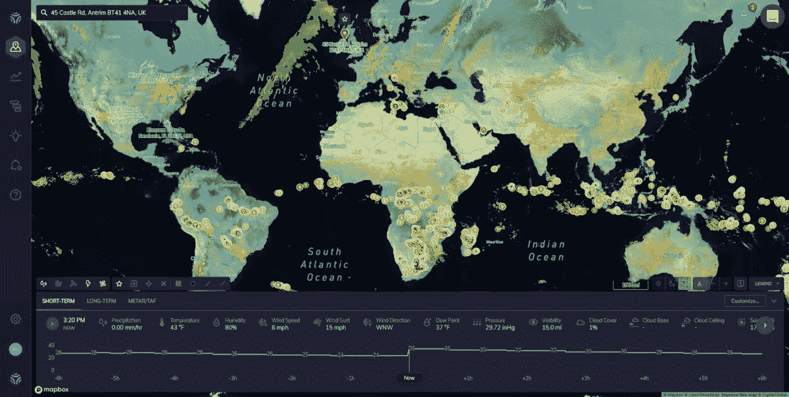

ClimaCell 是一个受欢迎的天气提供商，它通过一个易于使用的 API 提供超精确的历史天气数据和天气预报。

# 建筑过程

在这一节中，我将向您展示我是如何创建一个预测应用程序的，在这个应用程序中，用户输入他们的城市或任何其他地点的名称，并从 ClimaCell API 获取天气数据。API 通过返回数据来响应请求，然后将数据显示给用户。

## 安装 NodeJS 并创建一个新项目

对于这个项目，我们将使用 node . js——JavaScript 最流行的运行时环境之一。Node.js 帮助开发人员快速创建 web 应用程序。它提供了大量用于创建高级 web 应用程序的库和模块。

如果你的设备上没有 Node.js，可以从[官网](https://nodejs.org/en/)安装。
安装完成后，我们使用这个命令初始化 NPM——node . js 使用的默认数据包管理器。

`$ npm init`

这将创建我们的项目，因此会提示您输入一些细节，比如包名、描述、Git 存储库等等。

接下来，我们安装运行项目所需的模块。为了生成 Node.js 应用程序框架，我们使用 express——一个用于构建 Node.js web 应用程序的框架。

`$ npm install express`

安装 express framework 有助于您运行服务器，处理客户端请求，并连接带有响应的正确 HTML 模板。接下来，我们还将安装 unirest——一个简单而强大的解决方案，允许您请求一个库。

它将帮助我们向 ClimaCell API 发出请求并处理响应。

使用此命令:

`npm install unirest`

此时，我们已经安装了必要的模块，项目已经准备好了。
接下来，我们使用快速生成器工具生成一个天气应用程序。在命令行上，键入以下内容:

`express --view=pug weather-app-nodejs`

您现在应该在命令行上看到这样的视图:

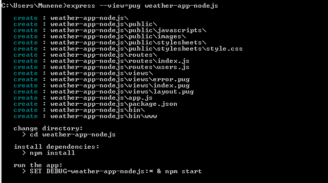

## 获取 ClimaCell 天气 API

要访问 ClimaCell API，您需要在他们的页面上注册一个帐户。

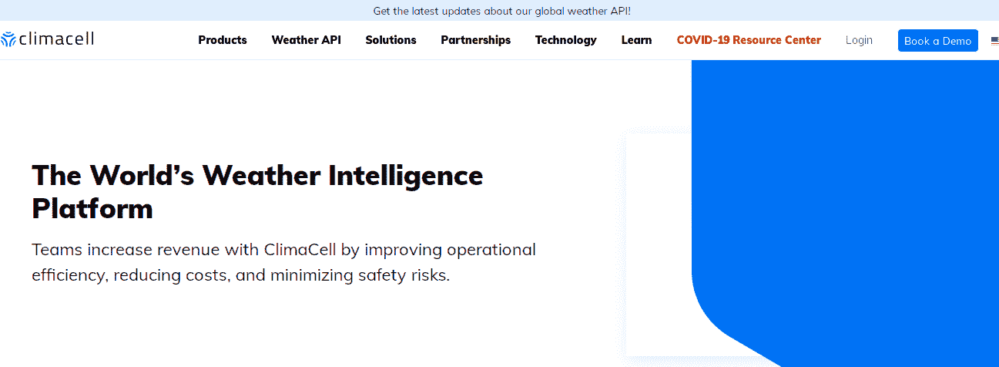

一旦你创建了一个帐户，登录他们的微天气 API 仪表板，看起来像这样:

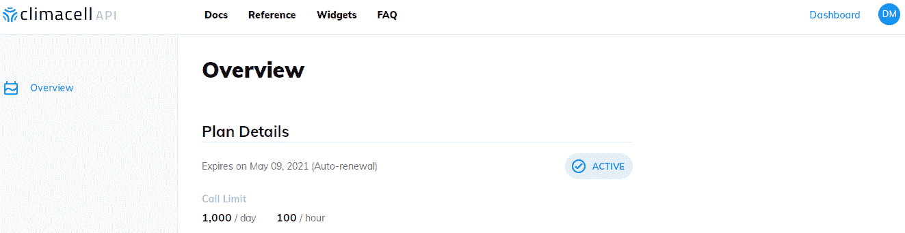

在仪表板上，点击引用以检查 API 端点。如您所见，ClimaCell API 有许多端点，包括短期预测、每小时预测、实时数据等等。

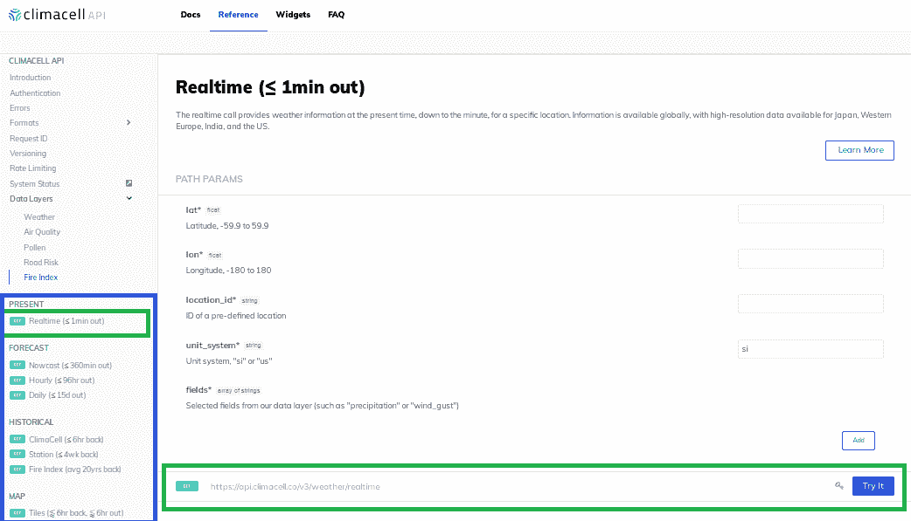

值得一提的是，每个端点都有自己的代码片段。例如，下面是获取实时天气数据的 Node.js 代码片段。

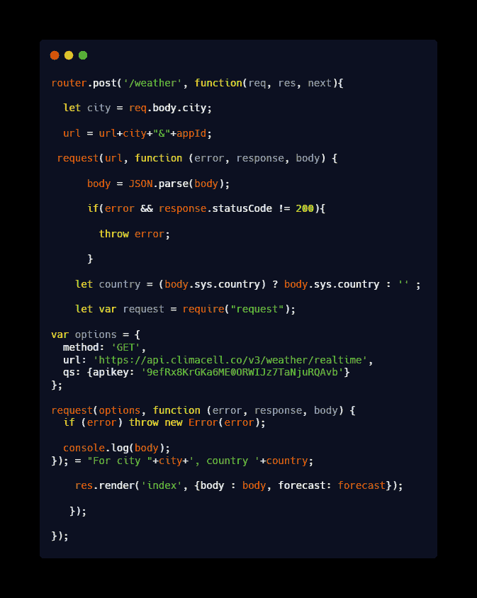

[Raw](https://carbon.now.sh/embed?bg=rgba(0%2C0%2C0%2C1)&t=blackboard&wt=none&l=javascript&ds=true&dsyoff=20px&dsblur=68px&wc=true&wa=true&pv=56px&ph=56px&ln=false&fl=1&fm=Hack&fs=14px&lh=133%25&si=false&es=1x&wm=false&code=router.post(%27%252Fweather%27%252C%2520function(req%252C%2520res%252C%2520next)%257B%250A%250A%2520%2520let%2520city%2520%253D%2520req.body.city%253B%250A%250A%2520%2520url%2520%253D%2520url%252Bcity%252B%2522%2526%2522%252BappId%253B%250A%250A%2520request(url%252C%2520function%2520(error%252C%2520response%252C%2520body)%2520%257B%250A%250A%2520%2520%2520%2520%2520%2520body%2520%253D%2520JSON.parse(body)%253B%250A%250A%2520%2520%2520%2520%2520%2520if(error%2520%2526%2526%2520response.statusCode%2520!%253D%2520200)%257B%250A%250A%2520%2520%2520%2520%2520%2520%2520%2520throw%2520error%253B%250A%250A%2520%2520%2520%2520%2520%2520%257D%250A%250A%2520%2520%2520%2520let%2520country%2520%253D%2520(body.sys.country)%2520%253F%2520body.sys.country%2520%253A%2520%27%27%2520%253B%250A%250A%2520%2520%2520%2520let%2520var%2520request%2520%253D%2520require(%2522request%2522)%253B%250A%250Avar%2520options%2520%253D%2520%257B%250A%2520%2520method%253A%2520%27GET%27%252C%250A%2520%2520url%253A%2520%27https%253A%252F%252Fapi.climacell.co%252Fv3%252Fweather%252Frealtime%27%252C%250A%2520%2520qs%253A%2520%257Bapikey%253A%2520%279efRx8KrGKa6ME0ORWIJz7TaNjuRQAvb%27%257D%250A%257D%253B%250A%250Arequest(options%252C%2520function%2520(error%252C%2520response%252C%2520body)%2520%257B%250A%2520%2520if%2520(error)%2520throw%2520new%2520Error(error)%253B%250A%250A%2520%2520console.log(body)%253B%250A%257D)%253B%2520%253D%2520%2522For%2520city%2520%2522%252Bcity%252B%27%252C%2520country%2520%27%252Bcountry%253B%250A%250A%2520%2520%2520%2520res.render(%27index%27%252C%2520%257Bbody%2520%253A%2520body%252C%2520forecast%253A%2520forecast%257D)%253B%250A%250A%2520%2520%2520%257D)%253B%250A%250A%257D)%253B)

## 修改应用程序

要调用 ClimaCell API，我们需要首先编辑一些文件。在这里，您可以使用记事本或在 IDE 中打开项目目录以便于编辑。它应该如下所示:

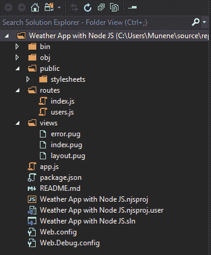

我们通过将 bootstrap 添加到 layout.pug 来开始修改我们的文件。

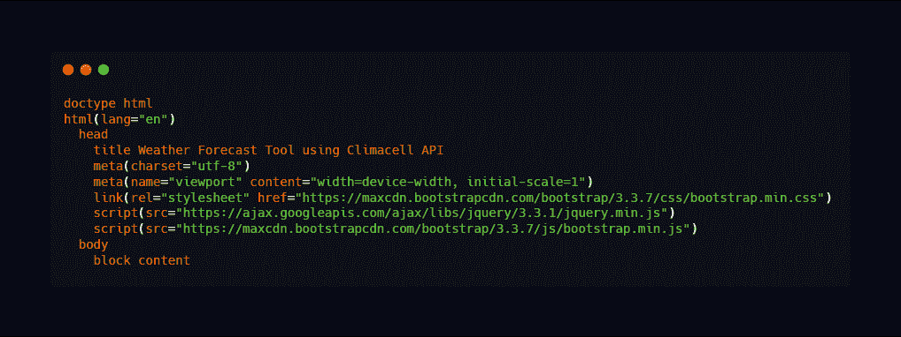

[Raw](https://carbon.now.sh/embed?bg=rgba(0%2C0%2C0%2C1)&t=blackboard&wt=none&l=javascript&ds=true&dsyoff=20px&dsblur=68px&wc=true&wa=true&pv=56px&ph=56px&ln=false&fl=1&fm=Hack&fs=14px&lh=133%25&si=false&es=1x&wm=false&code=doctype%2520html%250Ahtml(lang%253D%2522en%2522)%250A%2520%2520head%250A%2520%2520%2520%2520title%2520Weather%2520Forecast%2520Tool%2520using%2520Climacell%2520API%250A%2520%2520%2520%2520meta(charset%253D%2522utf-8%2522)%250A%2520%2520%2520%2520meta(name%253D%2522viewport%2522%2520content%253D%2522width%253Ddevice-width%252C%2520initial-scale%253D1%2522)%250A%2520%2520%2520%2520link(rel%253D%2522stylesheet%2522%2520href%253D%2522https%253A%252F%252Fmaxcdn.bootstrapcdn.com%252Fbootstrap%252F3.3.7%252Fcss%252Fbootstrap.min.css%2522)%250A%2520%2520%2520%2520script(src%253D%2522https%253A%252F%252Fajax.googleapis.com%252Fajax%252Flibs%252Fjquery%252F3.3.1%252Fjquery.min.js%2522)%250A%2520%2520%2520%2520script(src%253D%2522https%253A%252F%252Fmaxcdn.bootstrapcdn.com%252Fbootstrap%252F3.3.7%252Fjs%252Fbootstrap.min.js%2522)%250A%2520%2520body%250A%2520%2520%2520%2520block%2520content)

接下来，我们通过将下面的代码片段添加到 index.pug 文件来创建一个表单。

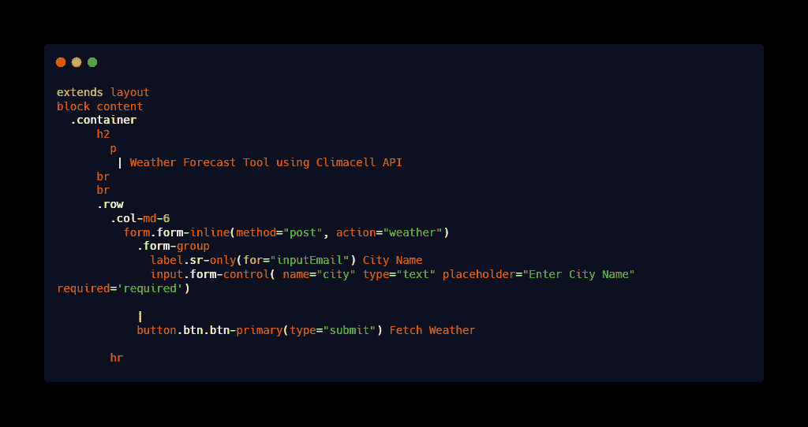

注意我们如何使用 [HTTP post 方法](https://en.wikipedia.org/wiki/POST_(HTTP))向服务器发送数据。上面的代码还将操作参数设置为天气路线，并将文本输入添加为“城市”
还增加了获取天气的输入按钮。

我们现在在表单下方创建一个 HTML 表格来显示获取的天气记录。

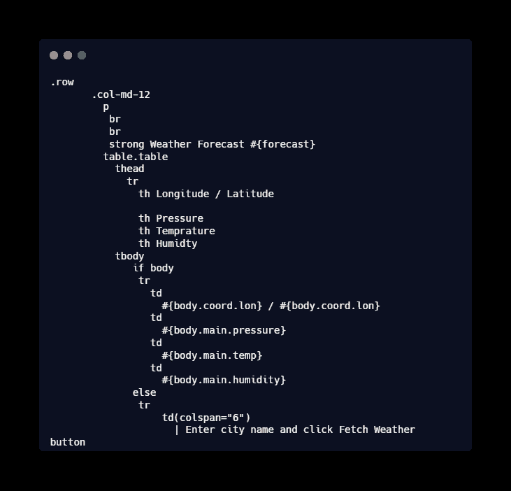

[Raw](https://carbon.now.sh/embed?bg=rgba(0%2C0%2C0%2C1)&t=blackboard&wt=none&l=htmlmixed&ds=true&dsyoff=20px&dsblur=68px&wc=true&wa=true&pv=56px&ph=56px&ln=false&fl=1&fm=Hack&fs=14px&lh=133%25&si=false&es=1x&wm=false&code=.row%250A%2520%2520%2520%2520%2520%2520%2520.col-md-12%250A%2520%2520%2520%2520%2520%2520%2520%2520%2520p%250A%2520%2520%2520%2520%2520%2520%2520%2520%2520%2520br%250A%2520%2520%2520%2520%2520%2520%2520%2520%2520%2520br%250A%2520%2520%2520%2520%2520%2520%2520%2520%2520%2520strong%2520Weather%2520Forecast%2520%2523%257Bforecast%257D%250A%2520%2520%2520%2520%2520%2520%2520%2520%2520table.table%250A%2520%2520%2520%2520%2520%2520%2520%2520%2520%2520%2520thead%250A%2520%2520%2520%2520%2520%2520%2520%2520%2520%2520%2520%2520%2520tr%250A%2520%2520%2520%2520%2520%2520%2520%2520%2520%2520%2520%2520%2520%2520%2520th%2520Longitude%2520%252F%2520Latitude%250A%2520%2520%2520%2520%2520%2520%2520%2520%2520%2520%2520%2520%2520%2520%2520%250A%2520%2520%2520%2520%2520%2520%2520%2520%2520%2520%2520%2520%2520%2520%2520th%2520Pressure%250A%2520%2520%2520%2520%2520%2520%2520%2520%2520%2520%2520%2520%2520%2520%2520th%2520Temprature%250A%2520%2520%2520%2520%2520%2520%2520%2520%2520%2520%2520%2520%2520%2520%2520th%2520Humidty%250A%2520%2520%2520%2520%2520%2520%2520%2520%2520%2520%2520tbody%250A%2520%2520%2520%2520%2520%2520%2520%2520%2520%2520%2520%2520%2520%2520if%2520body%250A%2520%2520%2520%2520%2520%2520%2520%2520%2520%2520%2520%2520%2520%2520%2520tr%250A%2520%2520%2520%2520%2520%2520%2520%2520%2520%2520%2520%2520%2520%2520%2520%2520%2520td%250A%2520%2520%2520%2520%2520%2520%2520%2520%2520%2520%2520%2520%2520%2520%2520%2520%2520%2520%2520%2523%257Bbody.coord.lon%257D%2520%252F%2520%2523%257Bbody.coord.lon%257D%250A%2520%2520%2520%2520%2520%2520%2520%2520%2520%2520%2520%2520%2520%2520%2520%2520%2520td%2520%250A%2520%2520%2520%2520%2520%2520%2520%2520%2520%2520%2520%2520%2520%2520%2520%2520%2520%2520%2520%2523%257Bbody.main.pressure%257D%250A%2520%2520%2520%2520%2520%2520%2520%2520%2520%2520%2520%2520%2520%2520%2520%2520%2520td%250A%2520%2520%2520%2520%2520%2520%2520%2520%2520%2520%2520%2520%2520%2520%2520%2520%2520%2520%2520%2523%257Bbody.main.temp%257D%250A%2520%2520%2520%2520%2520%2520%2520%2520%2520%2520%2520%2520%2520%2520%2520%2520%2520td%250A%2520%2520%2520%2520%2520%2520%2520%2520%2520%2520%2520%2520%2520%2520%2520%2520%2520%2520%2520%2523%257Bbody.main.humidity%257D%250A%2520%2520%2520%2520%2520%2520%2520%2520%2520%2520%2520%2520%2520%2520else%250A%2520%2520%2520%2520%2520%2520%2520%2520%2520%2520%2520%2520%2520%2520%2520tr%250A%2520%2520%2520%2520%2520%2520%2520%2520%2520%2520%2520%2520%2520%2520%2520%2520%2520%2520%2520td(colspan%253D%25226%2522)%250A%2520%2520%2520%2520%2520%2520%2520%2520%2520%2520%2520%2520%2520%2520%2520%2520%2520%2520%2520%2520%2520%257C%2520Enter%2520city%2520name%2520and%2520click%2520Fetch%2520Weather%2520button)

插入上面的代码片段会创建一个如下所示的表:

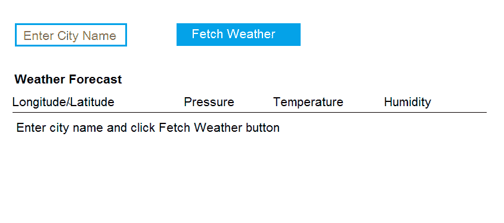

## 调用 ClimaCell API

要向 ClimaCell API 发送请求，我们必须安装[请求模块](https://nodejs.dev/making-http-requests-with-nodejs)。

`npm i request --save`

接下来，我们在 index.js 文件中添加 ClimaCell API 凭证。打开 routes 目录中的文件，添加在 ClimaCell 仪表板上获得的 API 键:

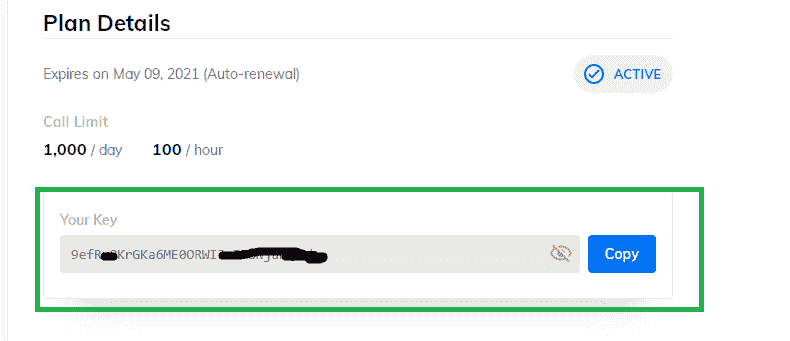

下面是添加 API 凭证的代码:

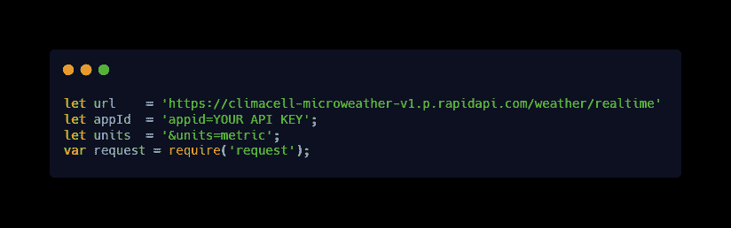

[Raw](https://carbon.now.sh/embed?bg=rgba(0%2C0%2C0%2C1)&t=blackboard&wt=none&l=javascript&ds=true&dsyoff=20px&dsblur=68px&wc=true&wa=true&pv=56px&ph=56px&ln=false&fl=1&fm=Hack&fs=14px&lh=133%25&si=false&es=1x&wm=false&code=let%2520url%2520%2520%2520%2520%253D%2520%27https%253A%252F%252Fclimacell-microweather-v1.p.rapidapi.com%252Fweather%252Frealtime%27%250Alet%2520appId%2520%2520%253D%2520%27appid%253DYOUR%2520API%2520KEY%27%253B%250Alet%2520units%2520%2520%253D%2520%27%2526units%253Dmetric%27%253B%2520%250Avar%2520request%2520%253D%2520require(%27request%27)%253B)

添加 API 凭证后，我们更新索引路由。这是通过替换index.js 文件中 **'/'** 路线中的代码段来实现的。

[Raw](https://carbon.now.sh/embed?bg=rgba(0%2C0%2C0%2C1)&t=blackboard&wt=none&l=javascript&ds=true&dsyoff=20px&dsblur=68px&wc=true&wa=true&pv=56px&ph=56px&ln=false&fl=1&fm=Hack&fs=14px&lh=133%25&si=false&es=1x&wm=false&code=%252F*%2520GET%2520home%2520page.%2520*%252F%250Arouter.get(%27%252F%27%252C%2520function(req%252C%2520res%252C%2520next)%2520%257B%250A%2520res.render(%27index%27%252C%2520%257B%27body%27%253A%27%27%252C%2520forecast%253A%2520%27%27%257D)%253B%250A%257D)%253B)

最后，我们在 index.js 中创建天气路线。

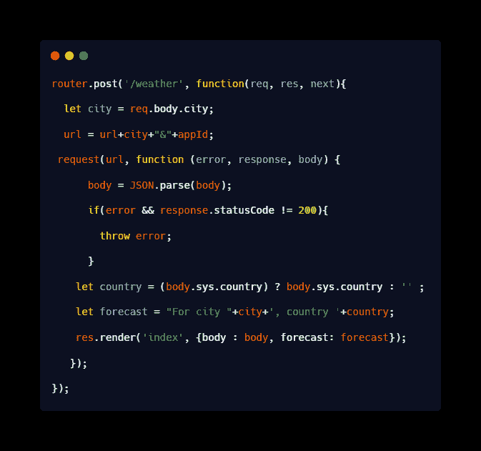

[Raw](https://carbon.now.sh/embed?bg=rgba(0%2C0%2C0%2C1)&t=blackboard&wt=none&l=javascript&ds=true&dsyoff=20px&dsblur=68px&wc=true&wa=true&pv=56px&ph=56px&ln=false&fl=1&fm=Hack&fs=14px&lh=133%25&si=false&es=1x&wm=false&code=router.post(%27%252Fweather%27%252C%2520function(req%252C%2520res%252C%2520next)%257B%250A%250A%2520%2520let%2520city%2520%253D%2520req.body.city%253B%250A%250A%2520%2520url%2520%253D%2520url%252Bcity%252B%2522%2526%2522%252BappId%253B%250A%250A%2520request(url%252C%2520function%2520(error%252C%2520response%252C%2520body)%2520%257B%250A%250A%2520%2520%2520%2520%2520%2520body%2520%253D%2520JSON.parse(body)%253B%250A%250A%2520%2520%2520%2520%2520%2520if(error%2520%2526%2526%2520response.statusCode%2520!%253D%2520200)%257B%250A%250A%2520%2520%2520%2520%2520%2520%2520%2520throw%2520error%253B%250A%250A%2520%2520%2520%2520%2520%2520%257D%250A%250A%2520%2520%2520%2520let%2520country%2520%253D%2520(body.sys.country)%2520%253F%2520body.sys.country%2520%253A%2520%27%27%2520%253B%250A%250A%2520%2520%2520%2520let%2520forecast%2520%253D%2520%2522For%2520city%2520%2522%252Bcity%252B%27%252C%2520country%2520%27%252Bcountry%253B%250A%250A%2520%2520%2520%2520res.render(%27index%27%252C%2520%257Bbody%2520%253A%2520body%252C%2520forecast%253A%2520forecast%257D)%253B%250A%250A%2520%2520%2520%257D)%253B%250A%250A%257D)%253B)

这个代码片段使输入表单中的数据能够被发送到索引路径。一旦用户输入了一个城市名，就会使用请求对象将它分配给 city 变量。

然后，URL 被附加上城市名和 ID，请求被发送到 ClimaCell API。

clima cell API 服务器响应以 JSON 文件的形式返回，然后被解析并提供给输出模板。

例如，如果用户正在寻找波士顿天气预报，应用程序将返回:

注意-本例中的温度以开尔文表示，等于 50°F 或 10°c。

## 添加地图以可视化您的数据

您可以将交互式地图集成到预测应用程序中，以增强用户体验。这可以通过为 web 应用程序使用第三方地图服务提供商来实现。

Mapbox 就是这样一个工具，它可以帮助开发者为他们的应用程序创建令人惊叹的天气地图。它可以与任何天气应用程序无缝集成。

要使用地图框，在他们的网站上注册，然后[查看他们的 API](https://www.mapbox.com/install/) 。有针对 Android、iOS、Web 和 Unity 的集成。在这种情况下，我们选择 Web 集成作为我们的工具。我们既可以安装 Mapbox CDN，也可以使用模块捆绑器。让我们使用模块捆绑器。

第一步是安装软件包

`npm install Mapbox-gl –save`

接下来，我们在 HTML 文件中添加 GL JS CSS 文件，方法是在<头>

`<link href='https://api.mapbox.com/mapbox-gl-js/v1.8.1/mapbox-gl.css' rel='stylesheet' />`

中包含这个代码片段，现在我们可以将地图添加到我们的应用程序中了。为此，请使用下面的代码片段。

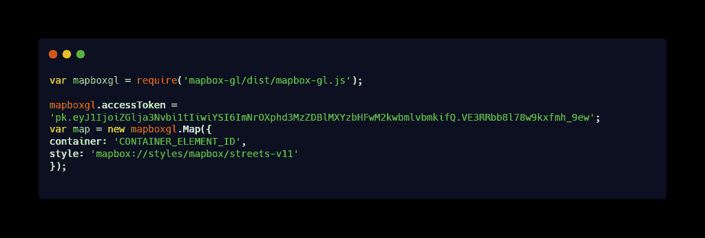

[Raw](https://carbon.now.sh/embed?bg=rgba(0%2C0%2C0%2C1)&t=blackboard&wt=none&l=javascript&ds=true&dsyoff=20px&dsblur=68px&wc=true&wa=true&pv=56px&ph=56px&ln=false&fl=1&fm=Hack&fs=14px&lh=133%25&si=false&es=1x&wm=false&code=var%2520mapboxgl%2520%253D%2520require(%27mapbox-gl%252Fdist%252Fmapbox-gl.js%27)%253B%250A%2520%250Amapboxgl.accessToken%2520%253D%2520%27pk.eyJ1IjoiZGlja3Nvbi1tIiwiYSI6ImNrOXphd3MzZDBlMXYzbHFwM2kwbmlvbmkifQ.VE3RRbb8l78w9kxfmh_9ew%27%253B%250Avar%2520map%2520%253D%2520new%2520mapboxgl.Map(%257B%250Acontainer%253A%2520%27CONTAINER_ELEMENT_ID%27%252C%250Astyle%253A%2520%27mapbox%253A%252F%252Fstyles%252Fmapbox%252Fstreets-v11%27%250A%257D)%253B%250A)

您可以通过替换

“容器 _ 元素 _ID”。

以下是使用 Mapbox 生成的地图示例:

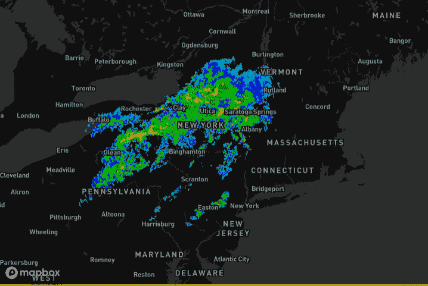

# 下一步是什么？

至此，大部分工作已经完成，您的应用程序可以使用 ClimaCell API 获得任何城市的天气预报。

但是，您可以考虑向您的应用程序添加更多的交互式功能或扩展其功能。

以下是您可能想做的一些事情:

*   添加搜索功能。
*   改善用户界面的外观。
*   通过 ID 或名称查询应用程序。
*   显示目标城市及其各自 id 的列表。
*   添加参数以显示其他天气数据。
*   集成实时通知和警告信号。

如您所见，基本的应用程序构建过程非常简单明了。通过遵循上述过程来利用天气 API 的强大功能，即使是初级开发人员也可以在几分钟内启动并运行他们的天气应用程序。