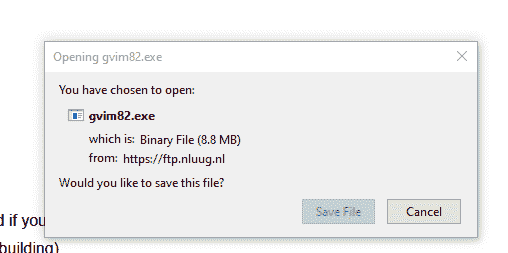
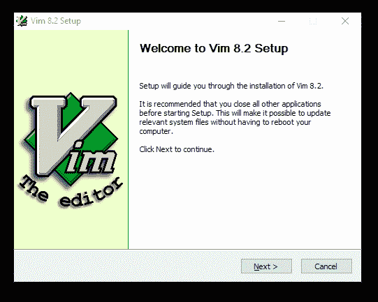
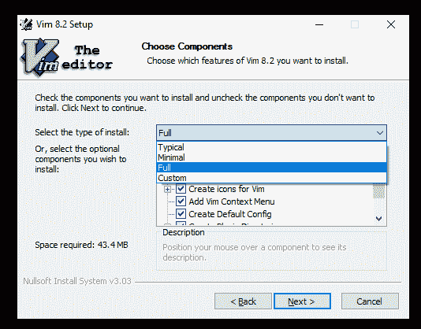
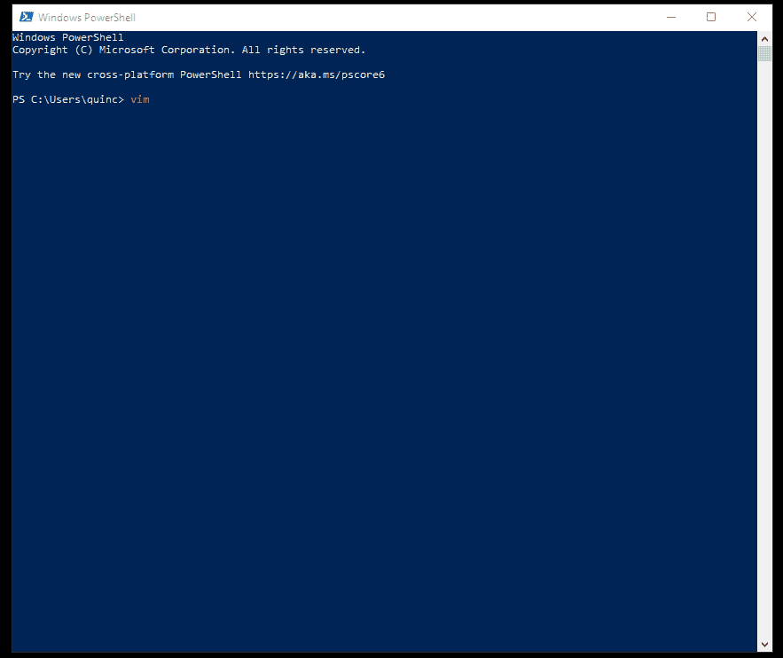
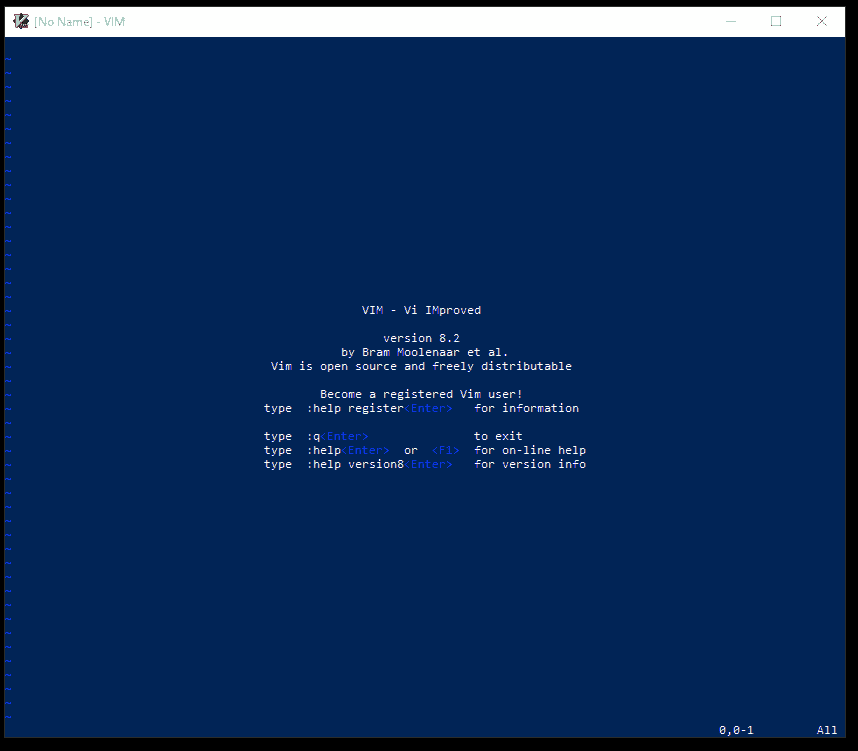

# Vim Windows 安装指南–如何在您的电脑上运行 PowerShell 中的 Vim 文本编辑器

> 原文：<https://www.freecodecamp.org/news/vim-windows-install-powershell/>

Vim 是一个强大的代码编辑器。如此强大，以至于 Linux 和 Mac 都默认安装了它。

但是如果你使用 Windows 作为你的操作系统，你将需要单独安装 Vim。

幸运的是，微软使得安装 Vim 并让它在你的电脑上运行变得非常容易。

## 如何下载 Vim

您可以直接从 Vim 下载最新版本的 Vim 文本编辑器。

他们构建了一个特殊的自动执行安装程序，引导您在硬盘上的正确位置安装 Vim。

## 如何安装 Vim

请注意，对于 Windows，您将从技术上下载一个叫做 gVim 的东西，它是 Vim 的一个版本，包括一个基本的图形用户界面(GUI)。你可以通过下载这个可执行的安装程序来[安装。](https://ftp.nluug.nl/pub/vim/pc/gvim82.exe)

A screenshot of what you'll se when you attempt to open the file. Because this is an .exe file, Windows will ask your permission first.

一旦你下载了文件，你只需要运行它，你会看到一个漂亮的安装向导，如下所示:

A screenshot of the wizard you'll see when you first run the Vim installer

他们有一个推荐的“典型”安装。但是，如果您有一个相当大的硬盘，选择“完整”选项来安装所有内容并没有什么坏处:

A screenshot of the Vim installer where you can choose what parts of Vim you want to install.

## 如何在 PowerShell 中运行 Vim

然后，一旦您安装了 Vim，您应该能够从您的 Windows 命令提示符启动它。

请注意，到 2020 年，PowerShell 将拥有与 CMD 相同的所有功能，并且还会有更多功能。我推荐一切使用 PowerShell。

通过在开始栏的搜索栏中键入“powershell ”,可以从 Windows 菜单栏打开 PowerShell。

Windows 将打开 PowerShell，您将看到类似如下的命令提示符:

A screenshot of the Windows PowerShell prompt.

一旦你进入 PowerShell，下面是如何运行 Vim 本身。你所要做的就是键入“vim”并按回车键。这将打开 Vim。一旦 Vim 打开，您应该会看到:

A screenshot of Vim when you open it for the first time.

祝贺您，您现在已经安装了 Vim。

## 如何在 VS 代码中运行 Vim

如果您已经在使用 VS 代码，并且希望在不损失 VS 代码功能的情况下获得 Vim 的速度，我有一个好消息。在 VS 代码中运行类似 Vim 的体验是可能的。

这里有一个针对 VS 代码的 Vim 插件可以帮助你做到这一点。在我写这篇文章的时候，这个插件已经被安装了将近 200 万次。

## 如何学习如何正确使用 Vim

Vim 是一个强大的代码编辑器，您需要大量的练习才能熟悉它。

这里有几个 Vim 教程，将真正帮助您快速掌握基础知识，并让您的手指立刻飞起来。

首先，Vim 与其他代码编辑器的一个不同之处在于它有“模式”。这里有[Vim 的所有模式解释，并附有示例](https://www.freecodecamp.org/news/vim-editor-modes-explained/)。

Vim 可能会令人生畏。要学的东西太多了。但是这个指南将告诉你如何不再害怕 Vim。

如果您已经在使用 VS 代码，并且想要完全切换到 Vim，[本文将解释如何做到这一点](https://www.freecodecamp.org/news/vim-for-people-who-use-visual-studio-code/)。

下面是改变#100DaysOfCode 创始人亚历克斯·卡拉威生活的 7 条 Vim 建议。在本文中，他不仅解释了这些，还展示了这些技巧的实际应用。

## Vim:学习它，体验它，热爱它。

自布莱姆·米勒首次创建 Vim 以来的 30 年间，它的影响力已经传播到了世界各地。甚至在今天，Vim 项目仍在积极维护并不断改进。

这些年来，我遇到了很多信赖 Vim 的开发人员。

我希望这个指南已经帮助你在你的 Windows PC 上运行 Vim。我希望我在这里与你分享的其他教程将帮助你在未来几个月内从零到六十。

关键是要坚持练习，不要因为要记住多少 Vim 快捷键而气馁。最终，所有这些都将成为肌肉记忆，你将从一个文件飞到另一个文件，像终结者一样敲打代码。

没有比直接进入代码库并立即开始修改代码更酷的感觉了，甚至不用鼠标或触控板。这就是 Vim 承诺的力量，并且确实实现了。