# 编程如何找到我:一个 21 岁开发人员的 7 年历程

> 原文：<https://www.freecodecamp.org/news/7-year-journey-of-a-21-year-old-developer/>

我在这里读过一些关于人们编码之旅的精彩故事，我也有兴趣分享我自己的故事。在开始讲述我的旅程之前，让我先简单介绍一下我自己，然后我们将进入倒叙模式。

我的名字叫 Mehul Mohan，我出生并成长在印度的新德里。目前，我正在从果阿的比特皮兰尼完成我的 CSE 学士学位，但是不要让这个事实欺骗了你:**大学在我的旅程中没有起到什么作用**，正如我们将在这篇长长的自我吹嘘指南中探讨的那样？。

在一级防范禁闭的这些日子里，我花了大部分时间在我的 YouTube 频道和一个名为 codedamn 的雄心勃勃的开发平台上工作。但下面会按时间顺序详细介绍。

我写这篇文章的原因之一是因为它使我能够沿着记忆的轨迹，将它永远保存在互联网上。

## 2010 年-开始

我真诚地相信，我进入编程纯粹是出于偶然。我是一个快乐的孩子，刚刚被提升到六年级。在我的学校，我们的校舍在第五节课后发生了变化，所以我们处于一个全新的环境中。新的建筑，新的老师，新的学长，一切都是新的，所以对我来说既兴奋又悲伤。

就在那时，我在家里买了第一台可以上网的电脑。我妈妈对我长时间使用电脑非常小心，因为我已经在第六节课戴眼镜了。所以，我和我姐姐每天都有 30 分钟的时间，我们通常只玩游戏。

但是我对软件和这些小东西是如何工作的着迷——点击屏幕上的东西会打开一个弹出窗口，但是为什么呢？为什么 Windows XP 启动需要这么长时间？我可以从开始(启动)屏幕更改 Windows XP 徽标吗？我可以更改写在下面状态栏中的“开始”文本吗？如果我删除回收站会发生什么？

这些问题过去一直困扰着我，我没有答案。

## 博客的崛起

大约从 2011 年开始，我开始写第一篇关于 blogger.com 的博客。我甚至不知道我在做什么，我只是看到这些网站分发破解软件和技巧来下载文件，而不需要等待从常规的文件托管网站回来。我只是好奇我怎么也能发布这些信息。

我发现 blogger.com 正是合适的地方！慢慢地，我开始学习分析、访问和 AdSense 来通过广告赚钱。与此同时，我会花上几个小时搜索最好的“订阅我们”小部件代码和网站，以显示我的访问者的国家和我在网站上有多少访问者。

我会在各种网站上发布我当时知道的一些技巧和窍门，我曾经化名为 *Techno Tweaks。* 这是因为我的第一个博客的名字叫做 technotweaker。我还在用与之关联的邮箱(technotweaksteam@gmail.com)！

后来，我为自己买了一个自定义域名。通过四处寻求帮助，我学会了如何用一个免费的 blogger 域来配置它(我说的请求是指大量的请求！).

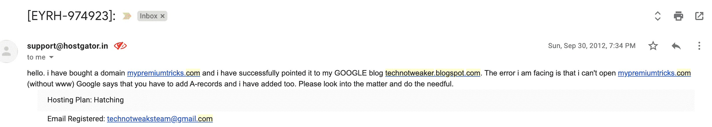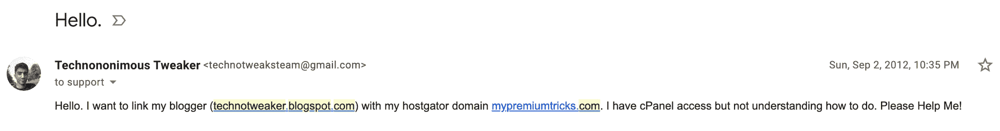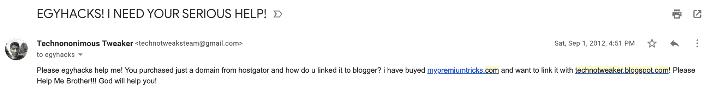

请忽略邮件中的褶皱部分？，我仍然不知道为什么我以前会这样写。

一年过去了，我在 blogger 上做得很好。我学会了一两个技巧，并在我的分享内容上获得了不错的流量。我也开始张贴一些教育性的东西——比如如何提高网站速度的指南，更快下载文件的技巧等等。然后恐怖的一天到来了，2013 年 2 月 8 日

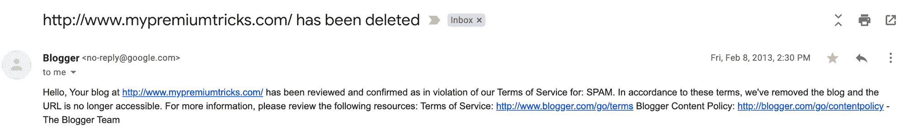

然后嘣！就这样，博主们通过博客来清除他们平台上的垃圾邮件。老实说，到 2013 年，我已经删除了 warez 的大部分内容，也没有在博客上发布。

但是现在我们在一起了，我尽我所能恢复我的博客——联系其他成功的博客，在谷歌论坛上公开问题，甚至联系为 Blogger 工作的人。

但是什么也做不了，所以我意识到在这一点上很重要——在使用 Blogger 这样的平台时，我的内容缺乏自由。blogger 除了为我托管网站之外，甚至没有给我提供任何显著的优势。

所以我决定继续前进。我试图研究其他选择，我决定在一个自托管的 WordPress 网站上采用它。这是一个大胆的决定——因为现在我必须购买一个主机方案，建立一个博客，用 WordPress 配置它，正确地做所有的事情。请注意，那时我才 14 岁，我没有办法付款。

我努力说服父母支付托管费用。现在，在印度，孩子们要求这样的事情是非常罕见的，但我的父亲曾经支付我的托管费用。我确保我选择了最便宜的方案。(我还记得我以前用 Hostgator，然后转到 GoDaddy 托管，100 美元 2 年。)

## 启蒙的状态

现在，我为管理我的东西付出了真正的代价！我总是想自己付钱，让自己负责。随着一个新博客的出现，我没有办法从广告中获得收入，因为我所有的流量都没了。我每年大概要花费 60-70 美元，包括所有的主机打包和域名费用。

我需要找到一些赚钱的方法，我在互联网上花了足够的时间来了解网上赚钱有好有坏。我选择走正道，因为，嗯，我不想被父母惩罚。

现在，我又一次花了很多时间寻找网上赚钱的方法。出现的一切我都非常熟悉:搜索引擎优化、联盟营销、客座博文、付费评论等等。

但这不是我想要的。账单到期了，我想尽快赚钱！接下来我发现了一件事——自由职业。这是我人生的又一个转折点。2013 年，我加入了自由职业平台 Fiverr。

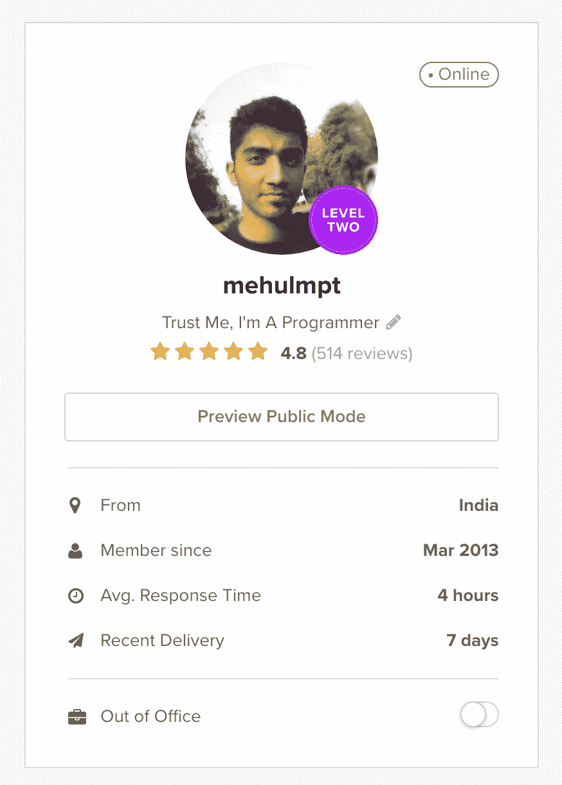

我对编程(HTML/CSS/JS)一无所知——我只知道我想学。为什么？因为这是我可以在 Fiverr 上卖的东西，而且对我定制我的小项目也很有用。

让我们看看我能否为我在 Fiverr 上选择的第一个订单找到一个对话。

## 一阶:

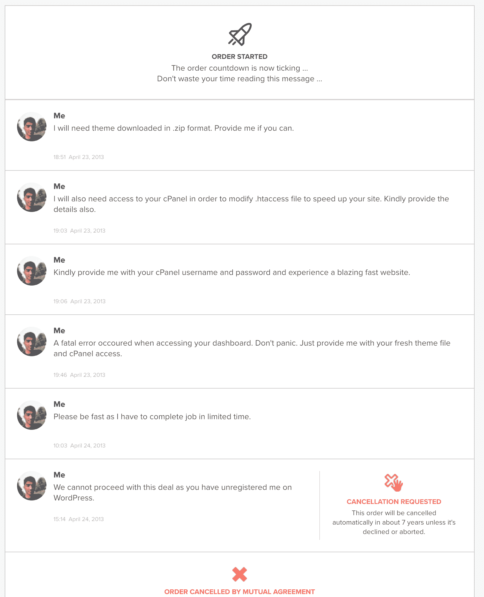

你看到我说“发生致命错误”的那部分了吗-这是我第一次制作失误。我在*functions.php*WordPress 文件的某个地方乱搞，搞砸了这个人的 WordPress 安装。现在我无法从 WordPress 本身修复任何东西，我们需要 cPanel 访问。

一天后，他没有回复我，网站关闭了，我也被注销了。订单取消了。

这之后一堆订单都成功了，直到我下一个订单取消:

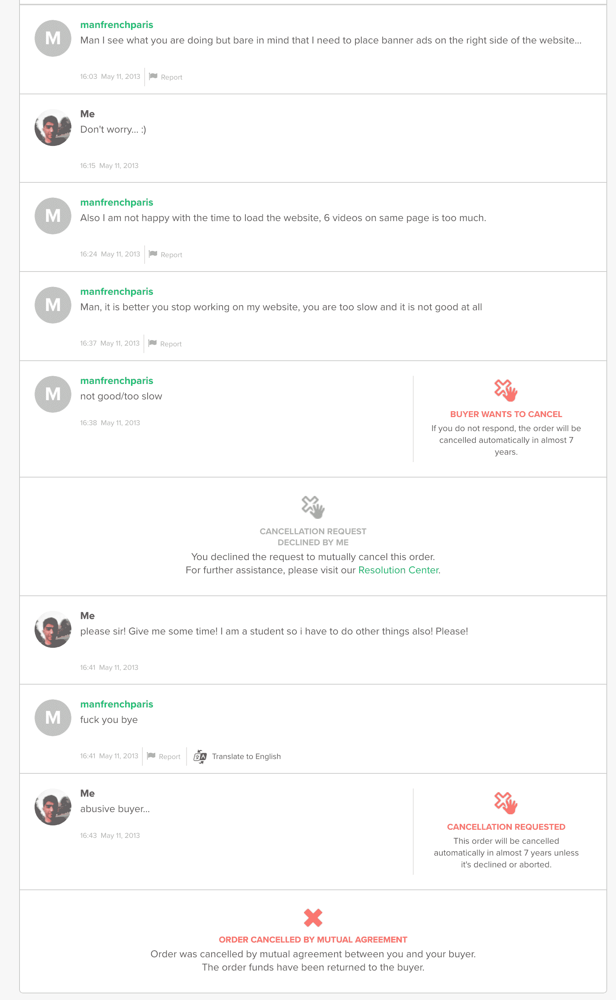

嗯，这些事情都会发生。但是你猜怎么着，我知道我做了一些超出我能力范围的事情，犯错误是可以的。我接受了这一切，从不考虑任何私人的事情，尤其是那些不知名的网民。

随着越来越多的订单滚滚而来，我开始从大量的网站和 YouTube 频道(对我的来自 thenewbston，the real OG 的 guy Bucky Roberts 大喊)快速学习概念，并参与项目。慢慢地，但是稳定地，我开始明白我在做什么——我在编程！

我在 Fiverr 上非常活跃了几年，这间接地帮助我为我将来的发展打下了基础。

两年后，我在共享主机上部署了 PHP 项目，学习了一点 bash 脚本，用 HTML/CSS/JS 编写代码，就像这是我的工作一样，并且乐在其中！

如此强大的力量，对任何网站上最好的东西的如此多的控制——一旦我看到了，就再也回不来了。当你意识到你可以编写出可以被数百万人使用，甚至数十亿人使用的程序时，你就不能再回头了——而且会非常有用。

对于编程，我也总是对“打破”事物感兴趣。我过去一直关注当时流行的黑客博客。我过去常常阅读各种公司提供的漏洞和漏洞奖励计划，过去常常想知道获得一份正确的漏洞奖励报告有多困难。

还记得我以前是如何经营一个 warez 和破解软件博客的吗？我就是从那里得到它的。

我和我的一群朋友一起创建了一个博客模板销售网站——我们以前创建和销售博客模板只需 10 美元，收入分成。

一个晴朗的早晨，在创建 blogger 模板时，我发现 Google 旗下的 Blogger 有一个被称为跨站脚本(XSS)的严重缺陷。我通过一个非常复杂的有效负载发现了这一点，这个有效负载是我在 blogger 模板的 XML 中创建一个自定义特性时想到的。

哦，天啊，那天我跳了一个小时的舞！这对我来说意义重大。我立即根据谷歌的负责任披露计划进行了举报，然后砰:

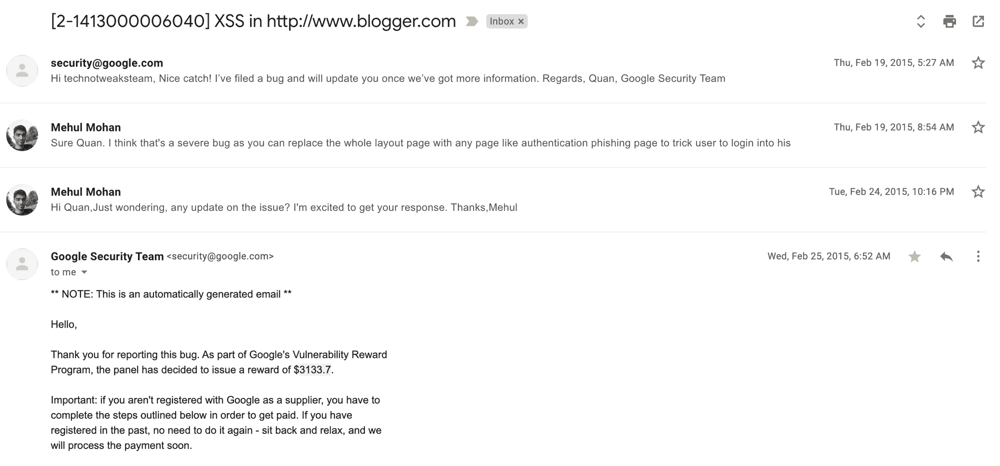

3000+美元的奖励加上我 16 岁时在谷歌名人堂的名字？唷！对我来说，这是一个令人震惊的消息，尤其是对我的家人来说——对他们来说，我过去只是为了好玩才用电脑工作。

这一下子让我对网络安全的兴趣增加了 10 倍。我学到了越来越多关于网络漏洞和相关技术的知识，这有助于我设计出至少对我来说牢不可破的软件。

后来，我被列为微软、索尼、eSet、Invision 等公司的安全研究员。

## 正在创建代号

那是 2015 年 3 月，我的第 10 次班级考试刚刚结束，我即将进入一个两年的窗口，所有在物理-化学-数学领域的印度人都将经历-印度理工学院的竞赛，印度的“精英”学院。

我的父母虽然支持我对计算机的兴趣，但他们仍然是印度人，就像其他印度父母一样，他们也希望看到他们的儿子通过 JEE 大学和 JEE 大学的高级考试，进入名牌大学，可能是 IIT 大学，这是印度 12 年级研究生最难的两项考试。

公平地说，我不想参加那场激烈的比赛。我想从事计算机工作，围绕它创建一个企业，也许找份工作什么的。但与此同时，我意识到我生活的这个社会并不全是娱乐和游戏。你必须奋斗到顶峰。

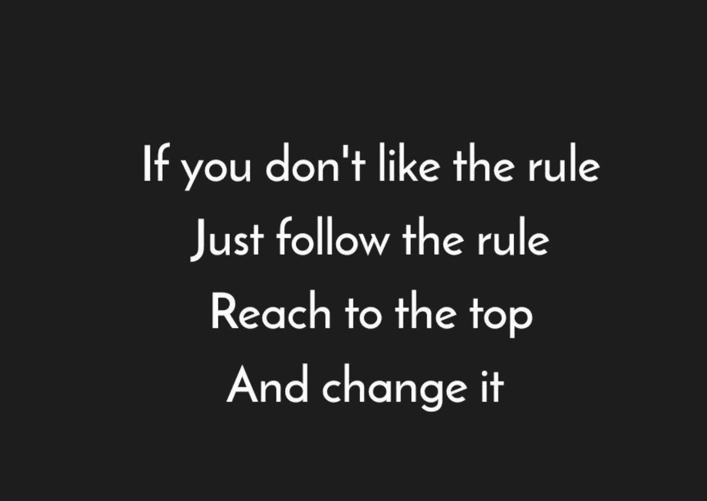

现在不知道是谁说的，反正也无所谓了。我非常赞同这句话——“如果你不喜欢规则，就遵守规则，到达顶峰，然后改变它”。这是当前社会的绝对真理，尤其是印度的教育体系。

当我在 11 班的时候，我有两个选择:

1.  我可以放弃学习/轻松对待学习，加倍努力学习计算机和编程技能(这是我想要的)，或者
2.  我可以努力学习——物理、化学、数学——与编程完全无关(至少我当时是这么想的)，离开计算机两年。

现在，当我回顾过去时，我意识到，在生活中，决定并不总是非黑即白。总有灰色的部分，你可以两者兼得。但这需要妥协和代价。

我知道我不能再做自由职业者了，这是我学习新事物的唯一来源——通过新项目。我需要接受挑战，同时我需要按照自己的方式和时间来学习——因为接下来的两年是不确定的。

**就这样，** [**代号**](https://www.youtube.com/codedamn) 诞生了。2015 年 5 月 17 日——一个受巴基启发很大的 YouTube 频道创建了。最初，我开始制作关于我所知道的和在过去 2 年中学习到的关于 web 开发的视频，并开始将我的内容放在那里。

我闭上眼睛，从不看我的 YouTube 数字，从不关注 SEO，从不关注缩略图，视频优化，“击败”排名算法，赞助，合作伙伴，什么都没有。除了发布内容，我什么都不想。

为什么？因为我内心有太多东西，以至于我开始忘记一些事情——我想给我未来的自己创造一种“证明”,证明我已经学会了这一点，也许这可以帮助其他人，就像其他 YouTubers 帮助其他人一样。

我不断发布内容，越来越多，越来越多。两年来，我除了为 JEE 学习和发布内容外，什么也没做。我获得了很少的订户和很少的评论。我知道我在玩长线游戏——在快速的硬币上收集慢速的五分硬币，我对此没有意见，我有大把的时间。

我可以在 JEE 高级中学拿到 3700 分，也可以去印度理工学院。但是我选择不去，因为那里没有计算机科学工程系。当这两年结束的时候，我向自己承诺，我只会燃烧我生命中的这两年，然后我会在我的余生中做我想做的任何事情。不错的交易，是吧？

我最初的视频是垃圾，但我感谢每一个对这些视频发表评论的人，甚至是充满仇恨的评论——因为他们给了我足够的动力来证明他们是错的，并让人们订阅我并支持我的工作。

每当我想学习一项新技能时，我会创建一个关于它的网络系列，并通过在线博客文章、视频、文档和创建示例工作项目从里到外学习它。然后我会把它和我的视频内容一起展示给我的订户——太多人想看了。

人们现在看到 [codedamn](https://www.youtube.com/codedamn) 有超过 10 万的订阅者和超过 1500 万的浏览量，但是我和 codedamn 的增长在过去 5 年里基本上是线性的。几乎所有的 YouTubers 要么达到一个指数曲线达到很高的数字，要么在此之前退出。

但我从未放弃。我一直在学习，今天还在做视频。你知道为什么吗？因为我不是为了数字而玩，也不怕市场上的其他玩家。

我是加里维的忠实追随者，从这篇文章的语气来看，你可能已经意识到了。但很少有人知道，我之所以与加里维产生如此大的共鸣，是因为尽管他说了很多关于职业道德和激情的事情，但在我发现他之前，我就已经追随并相信了其中的许多事情。

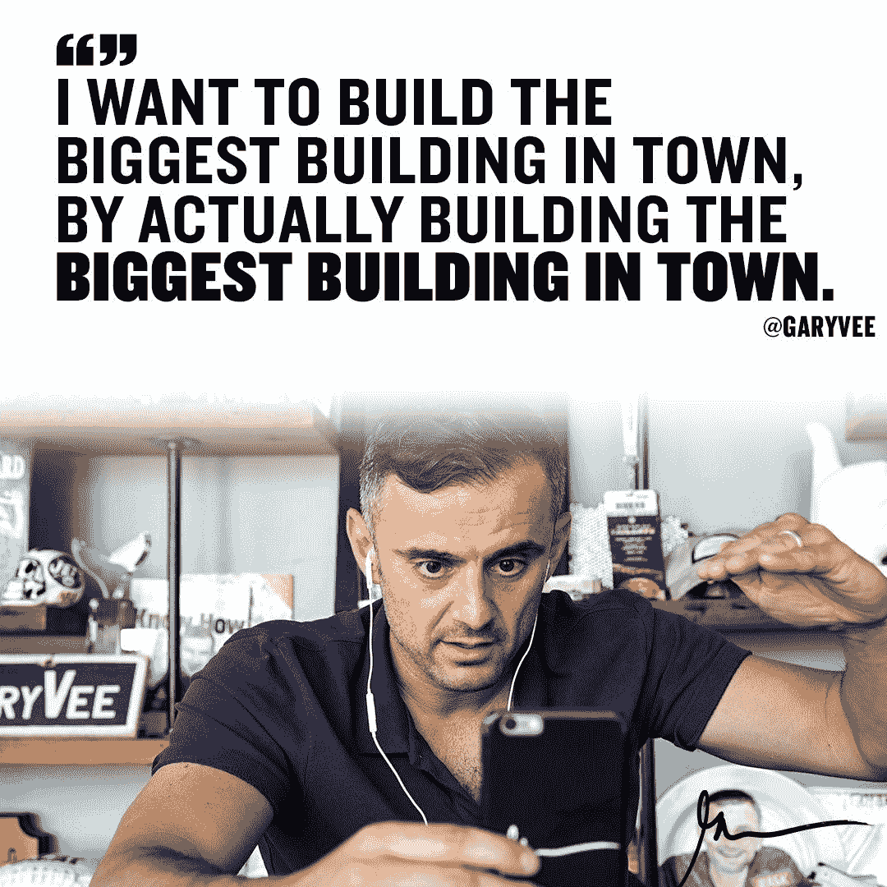

这些引语看起来如此明显却又如此美丽。随着 codedamn 的出现，这些年来我的目标也发生了变化。作为我自己学习新技术的媒介，我拥有超过 10 万人的关注，并有责任教给他们一些有用的东西！

去年，我启动了[**codedamn——改变人们学习编程方式的网络平台**](https://codedamn.com) 。我以艰难的方式做到了这一点——承担实际的项目，然后当我不能按照他们的期望工作时，被真实的人打败。

脸皮厚是好事，但通常在你准备充分的时候进入这个行业会更好。codedamn 平台让你不仅可以通过视频内容和文章学习，还可以同时练习这些语言。它类似于 freeCodeCamp，具有支持更多语言的优势(得益于云评估架构)以及持续支持和特性添加的承诺。

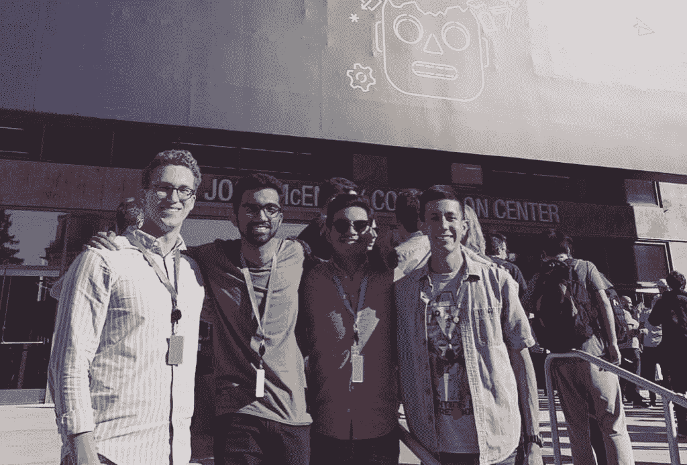

I've made some cool international friends too!

## 我学到了什么

我想在这里快速总结一下我的心得:

### 你会失败，很多次，没关系。

你可能从上面的文章中得到一个错误的印象，我总是踢屁股。我没有通过我的第一个 Fiverr 订单，我没有通过苹果公司的 WWDC 18 提交，我没有进入印度理工学院，我没有通过谷歌的实习面试，我没有通过 GSoC，我在编码时秘密失败了十亿次，我在个人生活中失败了很多次。

但是你猜怎么着？你也会失败，每个人都会失败。这没什么可羞愧的。拥抱它，继续前进。

### 我保证你会成功的，但不要放弃

数学和概率的工作方式太疯狂了。你不能连续失败太多次。某项任务失败了？起来，再做一次。又失败了？坚持做下去。一次又一次。

最难的部分是在失败后站起来——只有当你不再尝试时，你才是真正的失败。

### 别玩数字游戏了

刚开始？拜托，拜托，别再崇拜数字了。不管你有多少浏览量，有多少订阅者，追随者，粉丝。没人在乎，你也不该在乎。

不获得大量关注者的最快方法是总是想着获得大量关注者。

### 做你喜欢的事

这是一个编程相关的博客，但我不建议每个人都编码。我分享了我的故事，因为我碰巧喜欢编程。你不可以。停止推动“谷歌”的技术领先，停止追求“AWS”的工程角色，停止这种“FAANG”热潮。停下来。

如果 5 年后你最终憎恨自己的生活，并最终希望自己做了别的事情，那么所有这些都无关紧要。

找出你的共鸣。请将它货币化，并这样做。因为在你生命的尽头，你不想后悔过了不属于你的生活。

这些年来，我还做过许多其他疯狂的事情。我写了两本关于编程的书，我被选为 14 名赢得苹果公司 WWDC 19 奖学金的印度学生之一。我被甩了，又被甩了。我黑了学校的网站，过了宿舍生活，和朋友们度过了疯狂的时光。我才刚刚开始，你也是，大家也是。

和平

***注:*** *如果你想和我联系，这里有我的*[***insta gram***](https://instagram.com/mehulmpt)*和*[***Twitter***](https://twitter.com/mehulmpt)*句柄。很想听听你的想法。希望我的故事能激发你的灵感。让我们在社交上联系吧！*