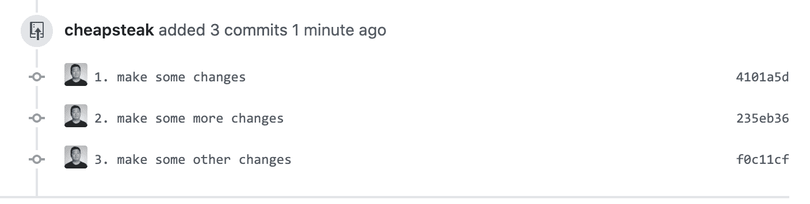
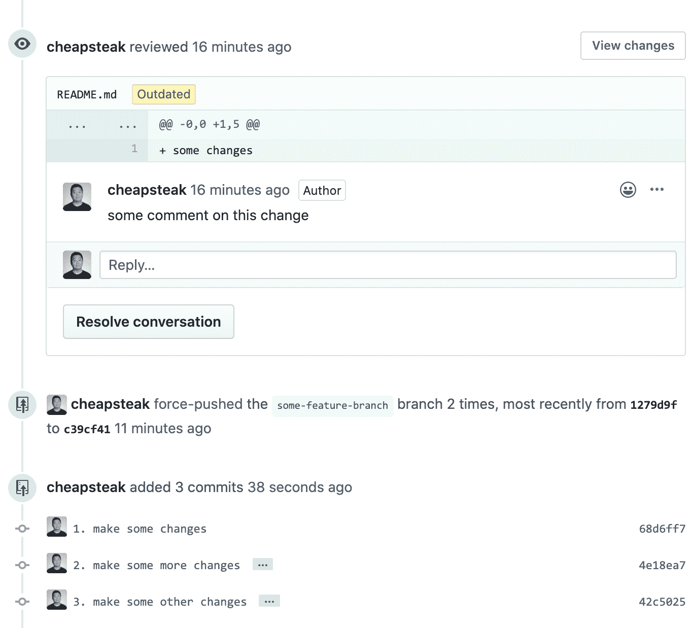
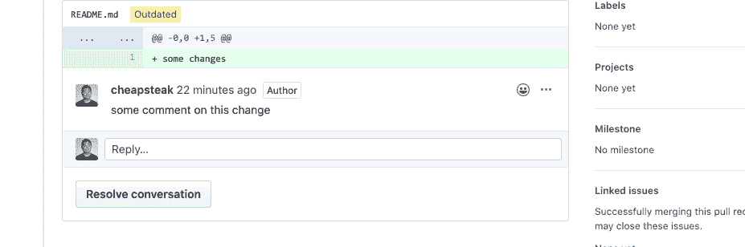
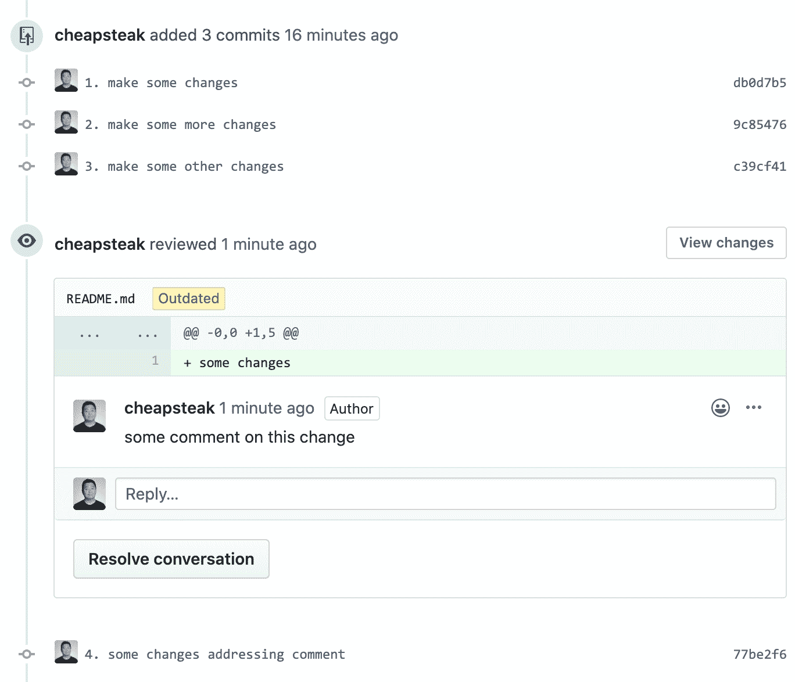

# 如何为有效的代码评审优化你的拉请求

> 原文：<https://www.freecodecamp.org/news/optimize-pull-requests-for-reviewer-happiness/>

想象一下，阅读一本小说，但是将章节按照标题的字母顺序进行切片和重新排序。或者，如果你正在看一部电影，但是场景是按照对白的第一个单词的字母顺序重新排序的，那会怎么样呢？

从这些混乱的片段中拼凑出一个故事听起来可能很有趣，但如果回顾和理解这些故事是你日常责任的一部分，新鲜感会很快消失。

## 代码中混乱的叙述

Github 上 pull 请求的“文件已更改”视图按文件路径的字母顺序列出了更改。这对于我们努力争取的小特性分支来说很好，但是经常会有复杂的变化，相互依赖的部分不可避免地导致多个文件之间的巨大差异。对于审阅者来说，使用按字母顺序排序的文件视图查看这些更改可能是势不可挡的。

相反，审阅者可以在更小更孤立的块中查看这些更改(即，逐个提交)。每个提交的消息可以传达变更想要达到的目的。和提交传达了一个合理的叙述，说明为什么这些变更对于这个特性分支是必要的。所有这些都让审稿人的工作变得更加轻松愉快。

## 准备清晰的提交历史记录

彻底使用部分分段、修改和重定基础都是有助于获得清晰的提交历史的工具，您的评审者将会欣赏这些工具。

避免创建松散集中的提交。您可能忘记了提交对逻辑分组有意义的更改，并继续编辑文件。没关系，这是常有的事。仅仅因为一个文件包含更改并不意味着所有这些更改都需要提交。

您也不必撤销不相关的更改。您可以使用交互式分段来挑选文件的哪些块应该分段提交，哪些应该留待将来提交。

积极地改变基础，以避免创建的提交的更改在以后被显著地修改甚至删除。

对于一个评审者来说，花时间去理解一次提交中发生了什么变化，然后发现他们在几次提交后的死代码上浪费了时间，这是令人沮丧的。在你要求评审之前，修改/修正/压制那些改变！

如果这听起来像是一个争论，这是一个合理的反应，因为 git 几乎不以其 UX 而闻名，我强烈建议考虑一个 Git GUI，它可以使大部分[不痛苦](https://share.getcloudapp.com/OAubWjJJ)。

## 请求复审

在您请求同事审阅拉取请求后，**停止重新调整您的提交！**将审阅者请求的变更推送到新的提交中。

"但是这不违背保持干净的提交历史的目标吗？"

保持一个干净的提交历史不是最终目标，而是一种使你的更改更容易被其他人理解和检查的方法。一旦评审开始，修改你的提交实际上使你的新变更*更难*评审。

假设您用这些提交打开了一个拉请求

(pseudo commits for demo purposes (ease-of-reference); don't actually number your commit messages)

然后，评审者对与第一次提交中所做的更改相关的内容发表评论。如果您修改提交并强制推送，那么您旧的提交将从拉请求中消失，并且所有提交(从那些被重定基础的提交开始)将在审查后显示为新的提交

All commits show up as new

自从上次审阅者查看拉取请求以来，发生了什么变化？哪些提交已被修改，因此需要注意，哪些没有修改，可以跳过？

辨别的唯一方法是查看所有强制推送的提交，并尝试回忆您现在看到的是否与以前不同。

如果你试着点击被评论的文件，看看评论是否已经被处理，或者获得更多关于评论区域的代码的上下文，你会看到这个迷人的望远镜

回到阅读一本小说的类比——想象一下读到一半，把它放一两天，当你拿起它时，你会被告知你读过的部分中的重要部分已经发生了变化，而知道到底发生了什么变化的唯一方法是从头再读一遍。不好玩。

或者，如果您改为推送单独的新提交，更改看起来会是这样:

Can you tell what's new?

您仍然应该从 master 重新开始，但是只要已经被评审的提交没有发生有意义的变化，那么您的评审者就不需要再次检查它们。考虑在 force-push 之后添加一个注释，其中包含一个到最近审查的提交的链接，以便审查者可以从他们停止的地方继续。

## 已批准更改！

到你的 PR 被批准的时候，你的分支可能已经有一些感觉有点乱的提交了。我建议合并南瓜，不要担心它。清晰的目的已经达到。来自挤压合并的 PRs 的提交消息将包含返回到 pull 请求的链接，在那里可以再次找到被挤压的提交。

我不确定壁球合并在 2020 年是否仍然有争议，如果它仍然有争议的话-有什么反应吗？？‍♂️

If Dan Abramov jumped off a bridge, would you? (Yes. The correct answer is "yes")

然而，也许您强烈地感觉到 PR 中的提交是有意义的和重要的，足以保证作为单独的提交合并回 master 中。如果是这样的话，那么现在就是你可以重新开始的时候了，直到所有的差异都被挤压成完美的提交，然后合并而不挤压。

## tldr:

*   PR 中的每个提交都应该讲述这个提交改变了什么的故事，以及理想情况下是什么激发了这个改变
*   在打开“拉/合并”请求和请求审阅者之前，积极地调整基准
*   评审开始后，*停止修改分行的提交，并推送新的提交*
*   批准后，压缩合并(或有选择地压缩提交，然后合并)

## 记住

由于这个工作流程的第二部分在很大程度上取决于 Github 如何处理重定提交，可能有一天这些问题会被平台解决，这个工作流程可能不再需要。在此之前，请考虑为您的审阅者优化您的提交:)

### 相关资源:

Stacked Git 是一个用于管理提交历史的工具，我发现它比通过 CLI 交互式重置更加直观。该教程可能看起来令人生畏，但这可能是将所有内容(包括 Emacs 使用说明)放在一个页面上的设计问题。实际上，一次只学习和使用一点点是很容易的。

如果你对这种方法有异议，或者有如何改进的建议，请告诉我( [@CheapSteak](https://twitter.com/CheapSteak) )。