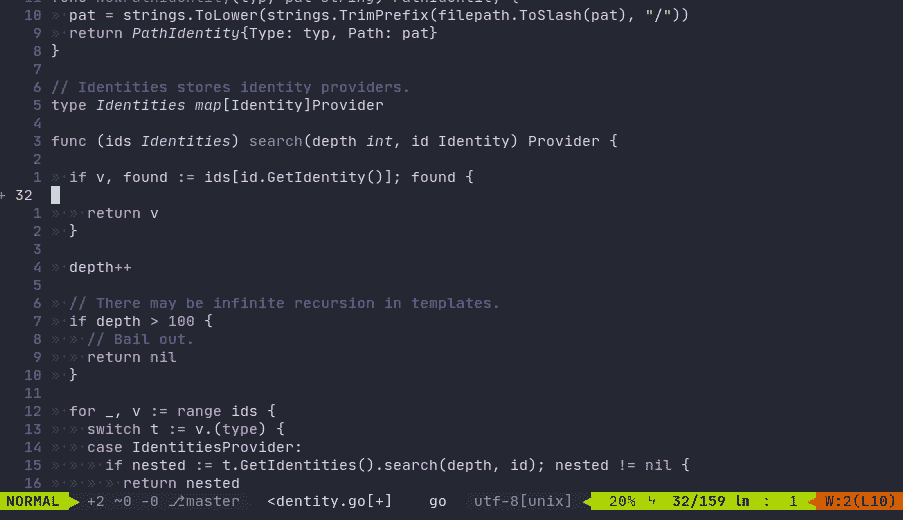
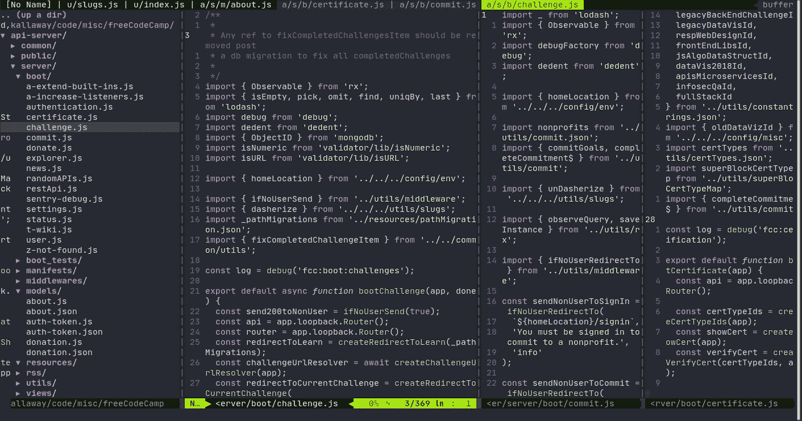
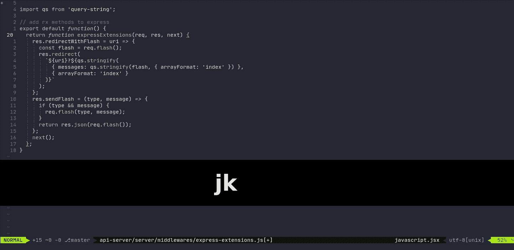
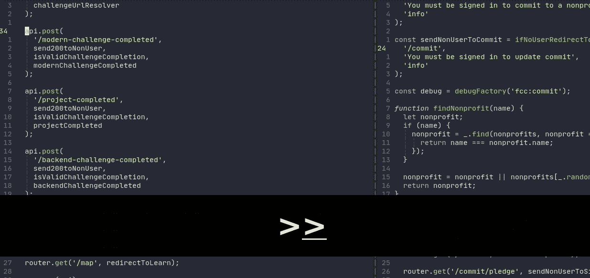
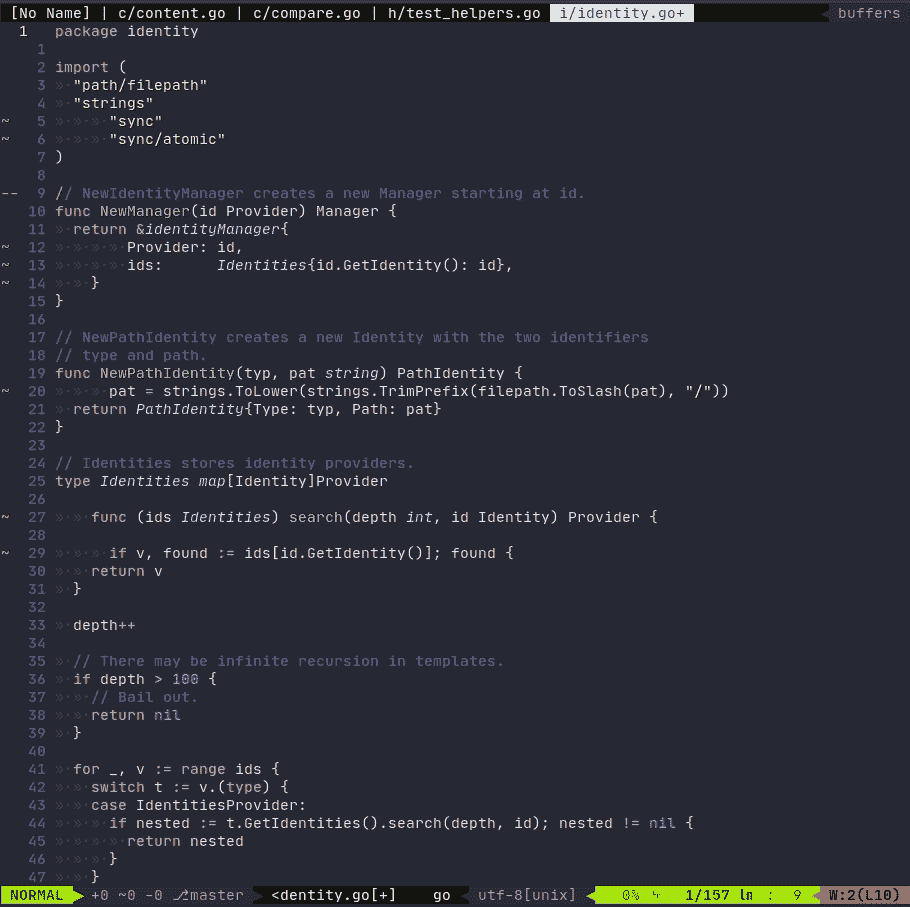
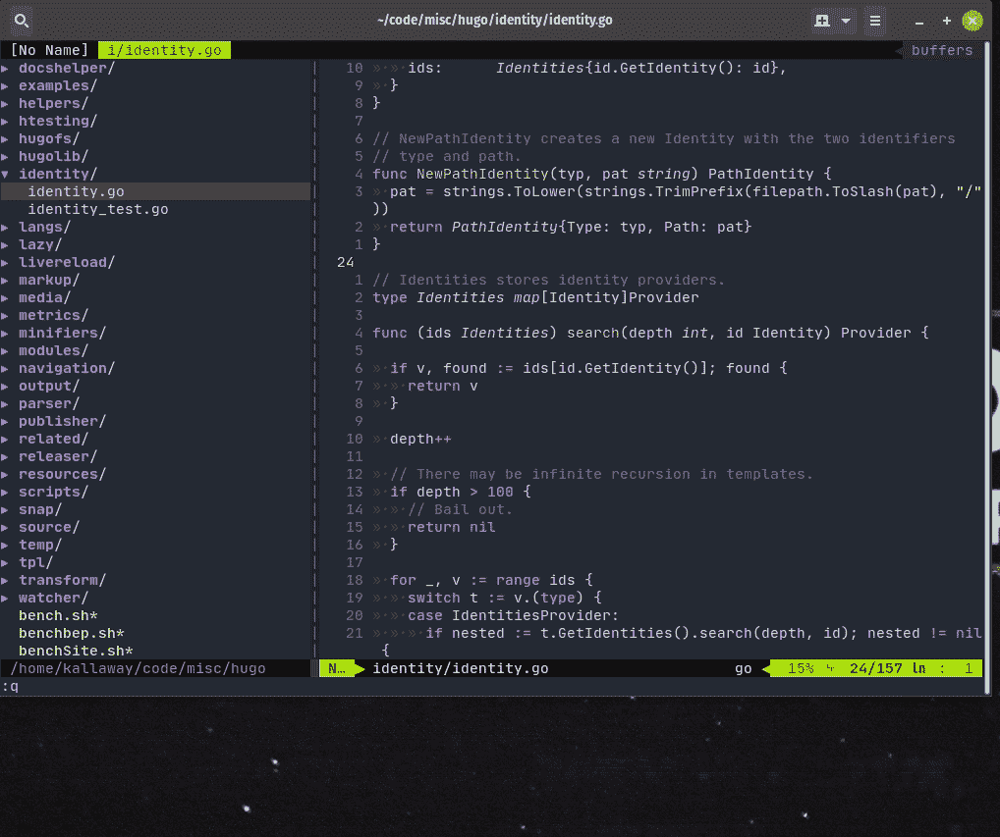
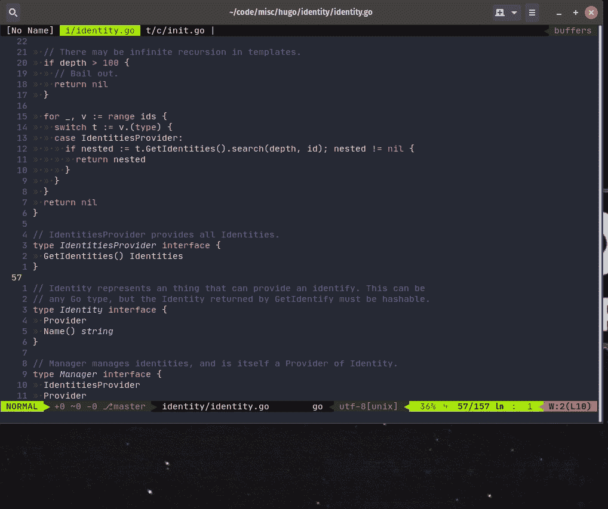

# 改变我生活的 7 个 Vim 提示(带演示)

> 原文：<https://www.freecodecamp.org/news/7-vim-tips-that-changed-my-life/>

嗨，各位程序员！您可能以前听说过 Vim 代码编辑器，甚至使用过一点。

有大量的资源涵盖了 Vim 的基础知识，我不想在这里重复这些内容。相反，我想分享一些我在工作中全职使用 Vim 时从别人那里学到的快速技巧。

这些都是很小的事情，你可以很快学会，这将在你的日常工作中产生很大的影响。他们让我的生活变得更加轻松。

记住:Vim 预装在 Mac 和 Linux 上。你只需要打开你的终端，在命令提示符下输入“vim ”,你就可以打开 Vim 了。如果你有一台 Windows 电脑，[按照这些说明在你的 PC 上安装 Vim](https://www.freecodecamp.org/news/vim-windows-install-powershell/)。

## 在开始之前

如果您对 Vim 感兴趣，但还没有开始，我想推荐以下资源:

*   [OpenVim](https://www.openvim.com) -交互式 Vim 教程
*   vim tutor——这是一个交互式命令行教程，可以在 MAC 和一些 Linux 发行版上获得和安装。只需在你的终端键入`vimtutor`
*   VimAdventures -前两个级别是免费的，如果你喜欢这种格式，完全许可费是 25 美元

如果你喜欢 Vim，但它太难独立运行，为你最喜欢的编辑器安装一个 Vim 扩展，比如 VS Code 或 Sublime 或其他。这样你就可以使用 Vim 的快速操作和快捷方式，以及你更习惯的更友好的界面。

关于学习和使用 Vim，我有一个重要的认识:你不需要掌握一切(这实际上是不可能的)就可以开始使用它。

一旦你搞清楚了这些基础知识，每当你在工作中有问题或遇到困难时，就把它写下来，然后浏览这个列表，在网上搜索如何在 Vim 中做到这一点。

通过这种方式，你将逐渐填补你可能有的任何空白，并且随着你向你的技能库中添加的每一个新的小东西，你将变得更好(这些微小的改进将类似于下面这篇文章中的提示)。

现在，让我们继续讨论有趣的事情——技巧和窍门。您不必安装任何 Vim 插件来利用这些优势。

## 1.如何在正确的缩进位置开始书写

在我学会这个之前，我习惯于跳到新的一行，进入插入模式，跳到右边的缩进位置，开始输入代码。有了这个小技巧，你就不必做所有额外的跳转，它会把你放在正确的缩进处的插入模式中。

制作方法:`S` (SHIFT+s)

演示:



## 2.自动调整窗口大小

我们经常对 Vim 中的窗口做一些事情，导致它们的大小调整不正确，有时一个太宽，另一个太窄。

最简单的方法是在一个 Vim 标签页中打开 3 个窗口，并调整打开 Vim 的终端窗口的大小。

您希望将所有窗口的大小调整为相同的大小，并平均分配可用空间。好消息是，您不必手动操作。

食谱:`CTRL+w =`

CTRL+w 的组合，随后按等号键将使窗口相等。

演示:



## 3.跳到匹配的括号/括号

将光标放在方形[或圆形(括号或花括号)上，按% (SHIFT+5)跳转到其匹配的符号。再次按下它以跳回(在它们之间切换)。

```
if (condition) {
  // code
}
// If your cursor was on {, and you pressed %, you'd jump to } 
```

菜谱:`%`将光标放在您想要查找匹配的字符上。

演示:



## 4.缩进/取消缩进一行或多行

```
>> ⁠– indents a line
<< ⁠– unindents a line 
```

当您选择了多行时(在可视行模式下)，您只需按>或

缩进时光标放在哪里并不重要——它仍然有效。缩进完成后，光标自动定位在该行的第一个非空字符上。

菜谱:一行:`>>`，`<<`。多行:`>`，`<`。

演示:



## 5.修复整个文件中的缩进

从文件的顶部开始(要到达那里，在文件的任何地方按`gg`。).然后按`=G`，Vim 会修复整个文件的缩进。如果你不从文件的开头开始，它会从当前行到文件底部自动缩进。

食谱:`=G`

按等号，然后按 SHIFT+G

演示:



## 6.使用标签的基础知识

通常，您希望同时查看多个文件或上下文。Vim 标签非常方便，但在这方面没有得到充分利用。我不知道有任何其他编辑器支持这一点(但我确信在其他地方有一种方法可以做到这一点)。

例如，我喜欢把与代码相关的文件放在我的主选项卡中，而在另一个选项卡中:带有待办事项列表的 README，以及一个我可以记下更多想法的地方。

要编写使用选项卡的命令，您需要处于命令模式。要开始编写命令，按下`:`并键入。当您键入时，该命令将显示在编辑器的左下角。按回车键执行。

菜谱:
`:tabnew`新建一个标签页
`gt` -转到下一个标签页
`gT` -转到上一个标签页
`:tabo` -关闭除当前标签页之外的所有标签页

演示:



## 7.如何快速返回到上一个文件

通常，当您用代码编辑一个文件时，您会在同一窗口中打开另一个文件。那么回到你刚刚工作过的地方就不那么容易了。你可以列出缓冲区并导航到前一个，但是你需要记住它的名字并花费你宝贵的时间。Vim 用户不喜欢在动作上花太多时间。:)所以这个可以用 CTRL+o。

它所做的就是找到你的光标的前一个位置——如果它碰巧在一个不同的文件中(你打开一个新文件时丢失的那个文件),它就把我们跳回到那里。



感谢您的阅读，我希望这些提示对您有所帮助！

？如果你想关注我的冒险，[这是我的推特](https://twitter.com/ka11away):)

？我每周写一份时事通讯，内容包括学习编码、改变习惯、个人理财、书籍推荐和要点、极简主义、创业、心理学等等。对于感兴趣的人:加入 1K+对自我提升和学习充满热情的志同道合者。
[订阅此处](https://www.dotheoppo.site/newsletter)

？这些天我在做我的副业项目——一个叫“Zerno”的应用。注册以尽快获得早期访问！
[ZERNO app](https://www.zerno.app)