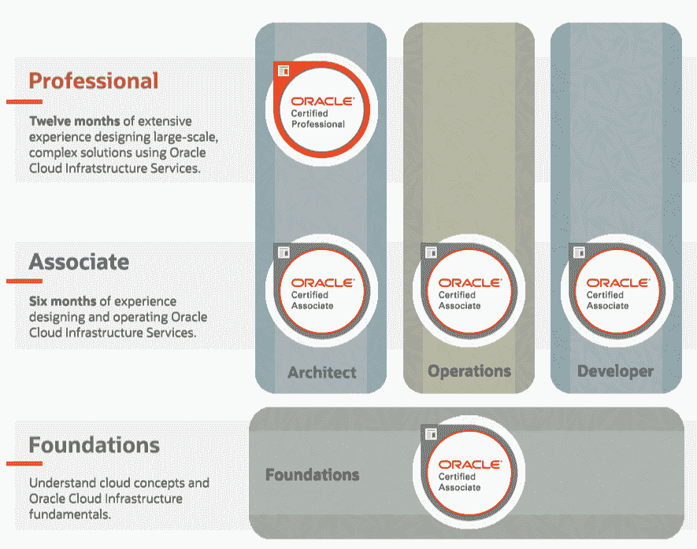

# Oracle 云认证—通过这个 3 小时的免费课程考试

> 原文：<https://www.freecodecamp.org/news/oracle-foundations-associate-certification-cloud-course/>

这个 Oracle 云认证考试平均需要大约一周的时间来准备。大多数认真致力于学习的人准备在大约四天内通过考试。

我的态度是，即使你觉得自己还没有准备好，你也应该尝试一下，这样你就可以通过考试获得实践。

## 什么是 Oracle 云基础设施？

Oracle 是一家成立于 70 年代末的技术公司，以构建企业内部软件，尤其是 Oracle 数据库而闻名。

甲骨文有自己的云提供商，就像 AWS 一样，他们称他们的平台为甲骨文云基础设施(OCI)，也称为甲骨文云。

甲骨文没有 AWS 那么多的云服务和云集成。但考虑到甲骨文是 2019 年收入和市场份额第二大软件公司。

甲骨文通过做他们最擅长的事情在云市场上开拓了自己的市场:围绕他们的甲骨文数据库提供丰富的云功能。

## 甲骨文基金会助理认证

Oracle 基础资格认证是 Oracle 云基础架构的入门级认证。

A chart of Oracle's 6 cloud certifications. The certification covered in this course serves as the foundation for all the other certifications.

这个认证和 [AWS 认证云从业者](https://www.freecodecamp.org/news/aws-certified-cloud-practitioner-training-2019-free-video-course/)非常相似。它侧重于让您熟悉:

*   云概念
*   甲骨文的全球基础设施
*   Oracle 云的核心服务(计算、存储、数据库、网络)
*   Oracle 云的计费和定价
*   Oracle 云的安全服务

如果您是云新手，那么您可以通过不到一周的学习来通过考试。

如果您已经持有 AWS 认证云从业者证书，只需几个小时的学习就可以通过考试。你只需要熟悉 OCI 的术语和一些关于账户管理和计费的概念。

在本课程中，我将向您展示几个例子，说明 AWS 和 OCI 在技术方面非常相似，只是名称不同。仅举几个例子:

*   AWS 虚拟专用云(VPC)相当于 Oracle 虚拟云网络(VCNs)
*   AWS 可用性区域(AZs)相当于 Oracle 可用性域(ADs)
*   AWS 密钥管理系统相当于 Oracle Vault
*   AWS S3 相当于 Oracle 对象存储
*   AWS 弹性块存储(EBS)相当于 Oracle 块存储
*   AWS EC2 相当于 Oracle VM

这次考试的及格分数是 68%。共有 60 个问题，既有选择题也有多选题。这意味着你可以承担大约 19 道题的错误，并且仍然通过考试。这是一个相当大的误差范围。

考试费通常为 95 美元，此甲骨文认证的有效期为 1.5 年，之后您必须重新参加考试。

## 免费的 Oracle 基础课程

我的课程将永远免费。它也是无广告的。

这个免费课程将近 3 个小时。它包括动手练习。您可以跟进并设置自己的 Oracle 云帐户。我们将一起探索网络、计算、存储和数据库服务。

您可以免费创建 Oracle 云帐户。您必须提供有效的信用卡来完成注册。但是只要你记得取消，你就不必担心意外的费用，因为甲骨文会给你 30 天 300 美元的信用。你会在一个沙盒账户里。沙盒帐户意味着你永远不会被计费，除非你选择离开沙盒。所以你可以安全地探索而不会被收费。

在课程的最后，我会告诉你如何预约考试。

好了，现在您已经了解了开始 Oracle 云认证之旅所需的一切。

[前往 freeCodeCamp 的 YouTube 频道，开始学习完整的 3 小时课程](https://www.youtube.com/watch?v=si9tjcnxruU)。