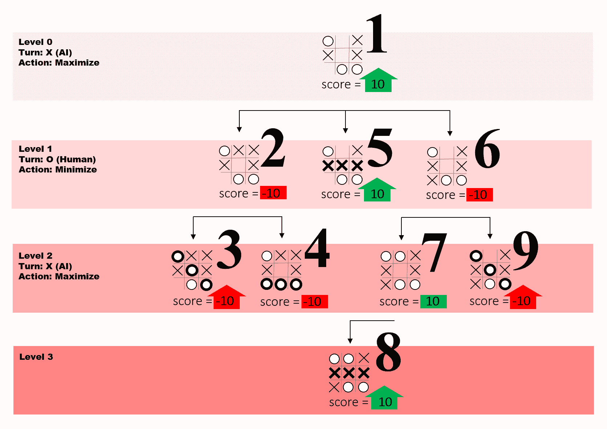

# 如何使用极大极小算法让你的井字游戏无与伦比

> 原文：<https://www.freecodecamp.org/news/how-to-make-your-tic-tac-toe-game-unbeatable-by-using-the-minimax-algorithm-9d690bad4b37/>

我花了几个小时滚动教程，观看视频，并用头撞桌子，试图用可靠的人工智能构建一个无与伦比的井字游戏。因此，如果你正在经历类似的旅程，我想向你介绍极大极小算法。

就像一个职业棋手一样，这个算法提前几步看到，并设身处地为对手着想。它继续向前玩，直到它到达棋盘的终端排列(**终端状态**，导致平局、赢或输。一旦进入终结状态，人工智能将为胜利指定一个任意的正分数(+10)，为失败指定一个负分数(-10)，或者为平局指定一个中性分数(0)。

同时，该算法根据玩家的回合来评估导致终止状态的移动。当轮到人工智能时，它会选择得分最高的棋步，当轮到人类玩家时，它会选择得分最低的棋步。使用这种策略，极大极小避免了输给人类玩家。

在下面的游戏中尝试一下，最好使用 Chrome 浏览器。

[https://codepen.io/abdolsa/embed/vgjoMb?height=454&theme-id=light&default-tab=js,result](https://codepen.io/abdolsa/embed/vgjoMb?height=454&theme-id=light&default-tab=js,result)

See the Pen [minimax 4 medium](https://codepen.io/abdolsa/pen/vgjoMb) by Ahmad Abdolsaheb ([@abdolsa](https://codepen.io/abdolsa)) on [CodePen](https://codepen.io).

极大极小算法可以最好地定义为一个递归函数，它执行以下操作:

1.  如果找到了终端状态，则返回值(+10，0，-10)
2.  浏览棋盘上的可用位置
3.  在每个可用的点上调用 minimax 函数(递归)
4.  评估函数调用的返回值
5.  并返回最佳值

如果你是递归概念的新手，我推荐你观看哈佛 CS50 的视频。

为了完全掌握 Minimax 的思想过程，让我们用代码实现它，并在下面的两个部分中看到它的实际应用。

### 代码中的极大极小值

在本教程中，你将在游戏的临近结束状态下工作，如下图 2 所示。因为 minimax 评估游戏的每一个状态(几十万)，一个接近结束的状态允许你更容易地跟踪 minimax 的递归调用(9)。

对于下图，假设 AI 是 X，人类玩家是 o。


figure 2 sample of game state

为了更容易地使用 Ti Tac Toe 板，您应该将其定义为一个包含 9 个项目的数组。每个项目都有一个索引值。这将在以后派上用场。因为上面的棋盘已经填充了一些 X 和 Y 移动，让我们定义已经有 X 和 Y 移动的棋盘( *origBoard* )。

```
var origBoard = ["O",1,"X","X",4,"X",6,"O","O"];
```

然后声明 *aiPlayer* 和 *huPlayer* 变量并分别设置为“X”和“O”*。*

此外，您需要一个寻找获胜组合并在找到时返回 true 的函数，以及一个列出棋盘上可用位置索引的函数。

```
/* the original board
 O |   | X
 ---------
 X |   | X
 ---------
   | O | O
 */
var origBoard = [“O”,1 ,”X”,”X”,4 ,”X”, 6 ,”O”,”O”];

// human
var huPlayer = “O”;

// ai
var aiPlayer = “X”;

// returns list of the indexes of empty spots on the board
function emptyIndexies(board){
  return  board.filter(s => s != "O" && s != "X");
}

// winning combinations using the board indexies
function winning(board, player){
 if (
 (board[0] == player && board[1] == player && board[2] == player) ||
 (board[3] == player && board[4] == player && board[5] == player) ||
 (board[6] == player && board[7] == player && board[8] == player) ||
 (board[0] == player && board[3] == player && board[6] == player) ||
 (board[1] == player && board[4] == player && board[7] == player) ||
 (board[2] == player && board[5] == player && board[8] == player) ||
 (board[0] == player && board[4] == player && board[8] == player) ||
 (board[2] == player && board[4] == player && board[6] == player)
 ) {
 return true;
 } else {
 return false;
 }
}
```

现在让我们通过定义带有两个参数 *newBoard* 和*玩家*的极大极小函数来深入探讨好的部分。然后，您需要找到棋盘上可用点的索引，并将它们设置为一个名为 *availSpots* 的变量。

```
// the main minimax function
function minimax(newBoard, player){

    //available spots
    var availSpots = emptyIndexies(newBoard);
```

此外，您需要检查终端状态并相应地返回值。如果 O 赢了你应该返回-10，如果 X 赢了你应该返回+10。此外，如果 *availableSpots* 数组的长度为零，这意味着没有更多的游戏空间，游戏已经导致平局，你应该返回零。

```
 // checks for the terminal states such as win, lose, and tie 
  //and returning a value accordingly
  if (winning(newBoard, huPlayer)){
     return {score:-10};
  }
	else if (winning(newBoard, aiPlayer)){
    return {score:10};
	}
  else if (availSpots.length === 0){
  	return {score:0};
  }
```

接下来，您需要收集每个空白点的分数，以便稍后进行评估。因此，创建一个名为 *moves* 的数组，循环遍历空白点，同时在一个名为 *move* 的对象中收集每次移动的索引和分数。

然后，将作为数字存储在 *origBoard* 中的空白点的索引号设置为 *move* 对象的 index 属性。之后，将*新板*上的空位设置为当前玩家，并与其他玩家和新换的*新板*调用 *minimax* 功能。接下来，您应该将包含一个 *score* 属性的 *minimax* 函数调用产生的对象存储到 *move* 对象的 *score* 属性中。

> 如果极大极小函数没有找到一个终止状态，它会递归地一层一层深入到游戏中。这种递归会一直发生，直到到达一个终止状态，并返回一个上一级的分数。

最后，Minimax 将 *newBoard* 重置为之前的状态，并将 *move* 对象推送到 *moves* 数组。

```
// an array to collect all the objects
  var moves = [];

  // loop through available spots
  for (var i = 0; i < availSpots.length; i++){
    //create an object for each and store the index of that spot 
    var move = {};
  	move.index = newBoard[availSpots[i]];

    // set the empty spot to the current player
    newBoard[availSpots[i]] = player;

    /*collect the score resulted from calling minimax 
      on the opponent of the current player*/
    if (player == aiPlayer){
      var result = minimax(newBoard, huPlayer);
      move.score = result.score;
    }
    else{
      var result = minimax(newBoard, aiPlayer);
      move.score = result.score;
    }

    // reset the spot to empty
    newBoard[availSpots[i]] = move.index;

    // push the object to the array
    moves.push(move);
  }
```

然后，极大极小算法需要评估*走法*数组中的最佳*走法*。它应该在 AI 下棋时选择得分最高的*招式*，在人类下棋时选择得分最低的*招式*。因此，如果*玩家*是 *aiPlayer* ，它会将一个名为 *bestScore* 的变量设置为一个非常小的数字，并在*移动*数组中循环，如果*移动*的*分数*高于 *bestScore* ，则算法会存储该*移动*。如果有得分相似的招式，将只存储第一个。

当*玩家*是*玩家*时，会发生相同的评估过程，但是这一次*的最佳得分*会被设置为一个较高的数字，Minimax 会寻找一个得分最低的棋来存储。

最后，Minimax 返回存储在 *bestMove* 中的对象。

```
// if it is the computer's turn loop over the moves and choose the move with the highest score
  var bestMove;
  if(player === aiPlayer){
    var bestScore = -10000;
    for(var i = 0; i < moves.length; i++){
      if(moves[i].score > bestScore){
        bestScore = moves[i].score;
        bestMove = i;
      }
    }
  }else{

// else loop over the moves and choose the move with the lowest score
    var bestScore = 10000;
    for(var i = 0; i < moves.length; i++){
      if(moves[i].score < bestScore){
        bestScore = moves[i].score;
        bestMove = i;
      }
    }
  }

// return the chosen move (object) from the moves array
  return moves[bestMove];
}
```

> 这就是极大极小函数。:)以上算法可以在 [github](https://github.com/ahmadabdolsaheb/minimaxarticle) 和 [codepen](https://codepen.io/abdolsa/pen/mABGoz?editors=1011) 上找到。尝试不同的电路板，并在控制台中检查结果。

在下一节中，让我们一行一行地检查代码，以便更好地理解 minimax 函数在图 2 所示的电路板上的行为。

### 行动中的 Minimax

利用下图，让我们按照算法的函数调用( **FC** )一个一个来。

注意:在图 3 中，大数字代表每个函数调用，级别指的是算法在游戏中领先多少步。



Figure 3 Minimax function call by function call

***1。*** *origBoard* 和 *aiPlayer* 被馈入算法。该算法列出它找到的三个空点，检查终端状态，并从第一个空点开始遍历每个空点。然后，它通过将 *aiPlayer* 放置在第一个空位置来改变*新板*。之后，用 *newBoard* 和 *huPlayer* 调用自己，等待 FC 返回值。

**2。**当第一个 FC 仍在运行时，第二个 FC 首先列出它找到的两个空位，检查终端状态，并从第一个空位开始遍历空位。然后，它通过将 *huPlayer* 放置在第一个空位置来改变*新板*。之后用 *newBoard* 和 *aiPlayer* 调用自己，等待 FC 返回值。

**3。**最后，该算法列出了空位的列表，并在检查终端状态后发现人类玩家获胜。因此，它返回一个 score 属性和值为-10 的对象。

> *由于第二个 FC 列出了两个空位，Minimax 通过将* huPlayer *放在第二个空位来改变*新板*。然后，它用新板和* aiPlayer *调用自己。*

**4。**该算法列出了空位，并在检查终端状态后为人类玩家找到了一个胜利。因此，它返回一个 score 属性和值为-10 的对象。

> *在第二个 FC 上，算法收集来自较低层(第三和第四个 FC)的值。由于*的游戏者*的回合产生了两个值，该算法选择两个值中最低的一个。因为这两个值相似，所以它选择第一个值并将其返回给第一个 FC。*

> 此时，第一个 FC 已经评估了移动第一个空位的 aiPlayer *的得分。接下来，它通过将* aiPlayer *放置在第二个空位置来改变*新板*。然后，它用* newBoard *和* huPlayer *调用自己。*

**5。**在第五个 FC 上，算法列出了空位，并在检查终端状态后发现人类玩家获胜。因此，它返回一个 score 属性和值为+10 的对象。

> *之后，第一个 FC 通过更换*新板*并将* aiPlayer *放在第三个空位上继续前进。然后，它用新板和*hup player*调用自己。*

**6。**第 6 个 FC 首先列出它找到的两个空位，检查终端状态，并从第一个空位开始遍历这两个空位。然后，它通过将 *huPlayer* 放置在第一个空位置来改变*新板*。之后，用 *newBoard* 和 *aiPlayer* 调用自己，等待 FC 返回分数。

**7。现在，该算法已经深入到递归的两个层次。它列出找到的一个空位，检查终端状态，并通过将 *aiPlayer* 放入空位来改变*新板*。之后，它用 *newBoard* 和 *huPlayer* 调用自己，等待 FC 返回一个分数，以便对其进行评估。**

**8。**在第 8 个 FC，算法做一个空点的空列表，在检查终端状态后为 *aiPlayer* 找到一个赢。因此，它返回一个 score 属性和值为+10 的上一级对象(第 7 个 FC)。

> *第 7 个 FC 只接收到一个来自下级(第 8 个 FC)的正值。因为* aiPlayer 的回合*产生了那个值，所以该算法需要返回它从较低级别接收到的最高值。因此，它返回上一级(第 6 个 FC)的唯一正值(+10)。*

> *由于 6 号 FC 列出了两个空位，Minimax 将*新板*换成了第二个空位上的*虎扑*。然后，用新板和* aiPlayer *调用自己。*

**9。**接下来，该算法列出了空位，并在检查终端状态后为 *aiPlayer* 找到了一个胜利。因此，它返回一个 score 属性和值为+10 的对象。

> *此时，6 FC 必须在从 7 FC 发送的分数(+10)(最初从 8 FC 返回)和从 9 FC 返回的分数(-10)之间进行选择。因为* huPlayer *的回合导致了这两个返回值，所以该算法找到最小分数(-10)并将其作为包含 score 和 index 属性的对象向上返回。*

> *最后，已经评估了第一个 FC 的所有三个分支(-10，+10，-10)。但是因为 aiPlayer 的回合产生了这些值，所以算法返回一个包含最高分(+10)及其索引(4)的对象。*

在上面的场景中，Minimax 得出结论，将 X 移动到棋盘的中间会产生最好的结果。:)

### 结束了！

现在你应该能够理解极大极小算法背后的逻辑了。使用这个逻辑，尝试自己实现一个极大极小算法，或者在[github](https://github.com/ahmadabdolsaheb/minimaxarticle) 或 [codepen](https://codepen.io/abdolsa/pen/mABGoz?editors=1011) 上找到上面的例子，并对其进行优化。

*感谢阅读！如果你喜欢这个故事，别忘了在社交媒体上分享它。*

特别感谢图巴·伊尔马斯、里克·麦加文和贾维德·阿斯克洛夫 *审阅本文。*