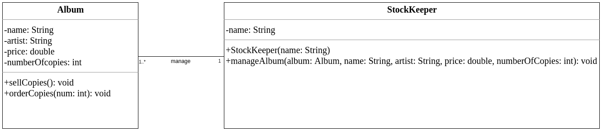
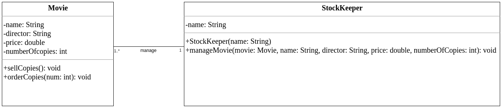
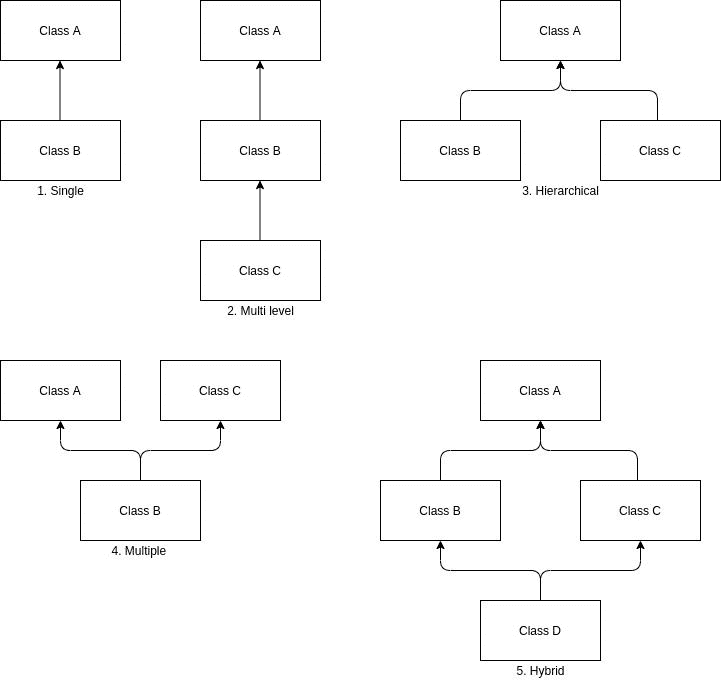
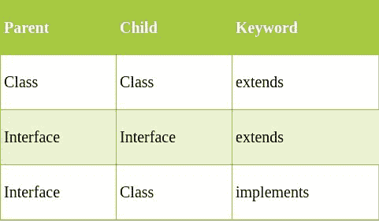
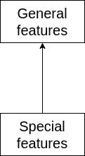
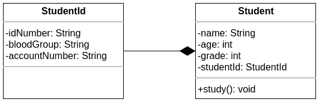
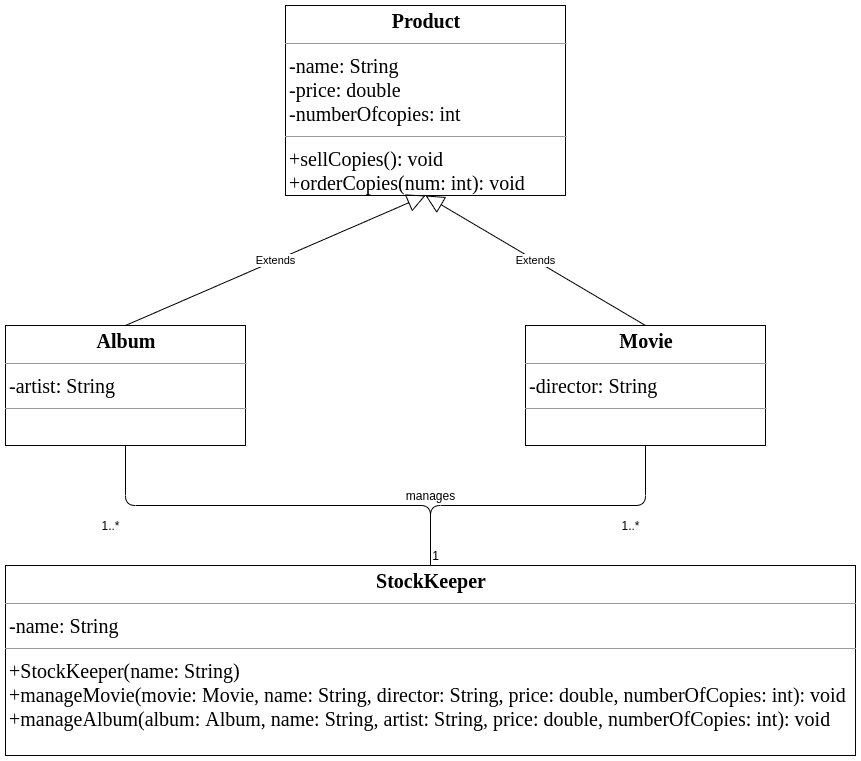
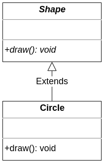
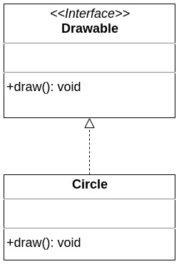

# Java 中面向对象的编程原则:面向初学者的 OOP 概念

> 原文：<https://www.freecodecamp.org/news/java-object-oriented-programming-system-principles-oops-concepts-for-beginners/>

> 面向对象编程提供了一种可持续的方式来编写面条式代码。它让你把程序作为一系列补丁来授权。
> *――保罗·格拉厄姆*

## 面向对象编程基础

面向对象编程是一种编程范式，其中一切都表示为一个对象。

对象相互传递消息。每个对象决定如何处理收到的消息。OOP 关注每个对象的状态和行为。

### 什么是对象？

对象是具有状态和行为的实体。

例如，狗、猫和车辆。举例来说，狗有年龄、颜色、名字等状态，以及进食、睡觉和奔跑等行为。

状态告诉我们物体看起来怎么样或者它有什么属性。

行为告诉我们对象做了什么。

我们实际上可以通过定义它的状态和行为，在程序中将一只真实世界的狗表示为一个软件对象。

软件对象是真实世界对象的实际表示。每当创建一个逻辑对象时，就在 RAM 中分配内存。

一个对象也指一个类的实例。实例化一个类意味着创建一个对象。

创建对象时要记住的重要事情是:引用类型应该是对象类型的**同类型**或**超类型**。我们将在本文后面看到什么是引用类型。

### 什么是类？

类是创建对象的模板或蓝图。

把一个类想象成一个曲奇，把对象想象成曲奇。


Figure 1: Illustrates class and object relationship through cookie-cutter and cookies. [Source](https://www.piqsels.com/en/public-domain-photo-sswme).

类将状态定义为实例变量，将行为定义为实例方法。

实例变量也称为成员变量。

类不占用任何空间。

为了让您对类和对象有一个概念，让我们创建一个表示真实世界 Cat 的状态和行为的 Cat 类。

```
public class Cat {
    /*
    Instance variables: states of Cat
     */
    String name;
    int age;
    String color;
    String breed;

    /*
    Instance methods: behaviors of Cat
     */
    void sleep(){
        System.out.println("Sleeping");
    }
    void play(){
        System.out.println("Playing");
    }
    void feed(){
        System.out.println("Eating");
    }

}
```

现在我们已经成功地为 Cat 定义了一个模板。假设我们有两只猫，分别叫托尔和兰博。


Figure 2: Thor is sleeping. [Source](https://www.petfinder.com/cat-breeds/collections/cutest-cat-breeds/)


Figure 3: Rambo is playing. [Source](https://www.petfinder.com/cat-breeds/collections/cutest-cat-breeds/)

我们如何在程序中定义它们？

首先，我们需要创建 Cat 类的两个对象。

```
public class Main {
    public static void main(String[] args) {
       Cat thor = new Cat();
       Cat rambo = new Cat();
    }
}
```

接下来，我们将定义它们的状态和行为。

```
public class Main {

    public static void main(String[] args) {
       /*
       Creating objects
        */
       Cat thor = new Cat();
       Cat rambo = new Cat();

       /*
       Defining Thor cat
        */
       thor.name = "Thor";
       thor.age = 3;
       thor.breed = "Russian Blue";
       thor.color = "Brown";

       thor.sleep();

       /*
       Defining Rambo cat
        */
       rambo.name = "Rambo";
       rambo.age = 4;
       rambo.breed = "Maine Coon";
       rambo.color = "Brown";

       rambo.play();
    }

}
```

像上面的代码示例一样，我们可以定义我们的类，实例化它(创建对象)并为这些对象指定状态和行为。

现在，我们已经讲述了面向对象编程的基础知识。让我们继续讨论面向对象编程的原则。

## 面向对象编程原理

这是面向对象编程范例的四个主要原则。理解它们对于成为一名成功的程序员至关重要。

1.  包装
2.  遗产
3.  抽象
4.  多态性

现在让我们更详细地看一下每一个。

## 包装

封装是将代码和数据打包成一个单元的过程。

它就像一个包含多种药物的胶囊，是一种有助于保护实例变量的技术。

这可以通过使用不能被类外任何东西访问的`private`访问修饰符来实现。为了安全地访问私有状态，我们必须提供公共的 getter 和 setter 方法。(在 Java 中，这些方法应该遵循 JavaBeans 命名标准。)

假设有一家唱片店出售不同艺术家的音乐专辑，并有一名股票保管员管理这些专辑。


Figure 4: Class diagram without encapsulation

如果查看图 4，当`Album`类的状态被设置为`public`时，`StockKeeper`类可以直接访问`Album`类的状态。

如果股票管理员创建了一个相册并将状态设置为负值会怎样？这可以由库存管理人员有意或无意地完成。

为了说明这一点，让我们看一个解释上述图表和语句的 Java 程序示例。

相册类别:

```
public class Album {
    public String name;
    public String artist;
    public double price;
    public int numberOfCopies;
    public void sellCopies(){
        if(numberOfCopies > 0){
            numberOfCopies--;
            System.out.println("One album has sold!");
        }
        else{
            System.out.println("No more albums available!");
        }
    }
    public void orderCopies(int num){
        numberOfCopies += num;
    }
}
```

库存管理员类别:

```
public class StockKeeper {
    public String name;
    public StockKeeper(String name){
        this.name = name;
    }
    public void manageAlbum(Album album, String name, String artist, double price, int numberOfCopies){
      /*
       Defining states and behaviors for album
       */
        album.name = name;
        album.artist = artist;
        album.price = price;
        album.numberOfCopies = numberOfCopies;

       /*
       Printing album details
        */
        System.out.println("Album managed by :"+ this.name);
        System.out.println("Album details::::::::::");
        System.out.println("Album name : " + album.name);
        System.out.println("Album artist : " + album.artist);
        System.out.println("Album price : " + album.price);
        System.out.println("Album number of copies : " + album.numberOfCopies);
    }
}
```

主要类别:

```
public class Main {
    public static void main(String[] args) {
       StockKeeper johnDoe = new StockKeeper("John Doe");
       /*
       Stock keeper creates album and assigns negative values for price and number of copies available
        */
       johnDoe.manageAlbum(new Album(), "Slippery When Wet", "Bon Jovi", -1000.00, -50);
    }
}
```

输出:

```
Album managed by :John Doe
Album details::::::::::
Album name : Slippery When Wet
Album artist : Bon Jovi
Album price : -1000.0
Album number of copies : -50
```

专辑的价格和拷贝数不能为负值。怎么才能避免这种情况呢？这就是我们使用封装的地方。



Figure 5: Class diagram with encapsulation

在这种情况下，我们可以阻止库存管理员分配负值。如果他们试图为专辑的价格和拷贝数分配负值，我们会将它们分配为 0.0 和 0。

相册类别:

```
public class Album {
    private String name;
    private String artist;
    private double price;
    private int numberOfCopies;
    public void sellCopies(){
        if(numberOfCopies > 0){
            numberOfCopies--;
            System.out.println("One album has sold!");
        }
        else{
            System.out.println("No more albums available!");
        }
    }
    public void orderCopies(int num){
        numberOfCopies += num;
    }
   public String getName() {
      return name;
   }
   public void setName(String name) {
      this.name = name;
   }
   public String getArtist() {
      return artist;
   }
   public void setArtist(String artist) {
      this.artist = artist;
   }
   public double getPrice() {
      return price;
   }
   public void setPrice(double price) {
      if(price > 0) {
         this.price = price;          
      }
      else {
         this.price = 0.0;
      }
   }
   public int getNumberOfCopies() {
      return numberOfCopies;
   }
   public void setNumberOfCopies(int numberOfCopies) {
      if(numberOfCopies > 0) {
         this.numberOfCopies = numberOfCopies;        
      }
      else {
         this.numberOfCopies = 0;
      }
   }
}
```

库存管理员类别:

```
public class StockKeeper {
    private String name;
    StockKeeper(String name){
        setName(name);
    }
    public void manageAlbum(Album album, String name, String artist, double price, int numberOfCopies){
         /*
          Defining states and behaviors for album
          */
        album.setName(name);
        album.setArtist(artist);
        album.setPrice(price);
        album.setNumberOfCopies(numberOfCopies);
          /*
          Printing album details
           */
        System.out.println("Album managed by :"+ getName());
        System.out.println("Album details::::::::::");
        System.out.println("Album name : " + album.getName());
        System.out.println("Album artist : " + album.getArtist());
        System.out.println("Album price : " + album.getPrice());
        System.out.println("Album number of copies : " + album.getNumberOfCopies());
    }
    public String getName() {
        return name;
    }
    public void setName(String name) {
        this.name = name;
    }
}
```

主要类别:

```
public class Main {
    public static void main(String[] args) {
       StockKeeper johnDoe = new StockKeeper("John Doe");
       /*
       Stock keeper creates album and assigns negative values for price and number of copies available
        */
       johnDoe.manageAlbum(new Album(), "Slippery When Wet", "Bon Jovi", -1000.00, -50);
    }
}
```

输出:

```
Album managed by :John Doe
Album details::::::::::
Album name : Slippery When Wet
Album artist : Bon Jovi
Album price : 0.0
Album number of copies : 0
```

通过封装，我们阻止了我们的库存管理员分配负值，这意味着我们可以控制数据。

### Java 封装的优势

1.  我们可以将类**设为只读**或**只写**:对于只读类，我们应该只提供一个 getter 方法。对于只写类，我们应该只提供一个 setter 方法。
2.  对数据的控制:我们可以通过向 setter 方法提供逻辑来控制数据，就像我们在上面的例子中限制股票管理员分配负值一样。
3.  数据隐藏:其他类不能直接访问一个类的私有成员。

## 遗产

假设我们上面讨论的唱片店也卖蓝光电影。



Figure 6: Movie, StockKeeper class diagram

在上图中可以看到，`Album`和`Movie`之间有很多共同的状态和行为(共同的代码)。

当把这个类图实现成代码时，你会为`Movie`编写(或者复制粘贴)整个代码吗？如果你这样做，你是在重复你自己。如何避免代码重复？

这就是我们使用继承的地方。

继承是一种机制，其中一个对象获得父对象的所有状态和行为。

继承使用父子关系(IS-A 关系)。

### 那么到底遗传了什么呢？

可见性/访问修饰符影响从一个类继承到另一个类的内容。

在 Java 中，作为一个**经验法则**，我们创建实例变量`private`和实例方法`public`。

在这种情况下，我们可以有把握地说，以下是继承:

1.  公共实例方法。
2.  私有实例变量(私有实例变量只能通过公共 getter 和 setter 方法访问)。

### Java 中的继承类型

Java 中有五种类型的继承。它们是单一的、多级的、分层的、多重的和混合的。

类允许单级、多级和分层继承。接口允许多重和混合继承。



Figure 7: Java inheritance types

一个类只能扩展一个类，但是它可以实现任意数量的接口。一个接口可以扩展多个接口。



Figure 8: Explains inheritance keywords.

### 关系

**I. IS-A 关系**

IS-A 关系指的是继承或实现。

#### a.一般化

泛化使用了从专门化类到泛化类的 IS-A 关系。



Figure 9: Generalization diagram

#### 二。有-有关系

一个类的实例引用了另一个类的实例。

#### a.聚合

在这种关系中，A 类和 B 类的存在互不依赖。

对于这个聚合部分，我们将看到一个`Student`类和`ContactInfo`类的例子。

```
class ContactInfo {
    private String homeAddress;
    private String emailAddress;
    private int telephoneNumber; //12025550156
}
public class Student {
    private String name;
    private int age;
    private int grade;
    private ContactInfo contactInfo;//Student HAS-A ContactInfo
    public void study() {
        System.out.println("Study");
    }
}
```


Figure 10: Class diagram shows the generalization relationship

`Student`有-个`ContactInfo`。`ContactInfo`可以用在其他地方——比如一个公司的`Employee`级也可以用这个`ContactInfo`级。所以`Student`可以没有`ContactInfo`而存在`ContactInfo`可以没有`Student`而存在。这种类型的关系称为聚合。

#### b.作文

在这种关系中，B 类没有 A 类就不能存在——但是 A 类**没有 B 类**就可以存在。

为了给你一个关于复合的概念，让我们看一个`Student`类和`StudentId`类的例子。

```
class StudentId {
    private String idNumber;//A-123456789
    private String bloodGroup;
    private String accountNumber;
}
public class Student {
    private String name;
    private int age;
    private int grade;
    private StudentId studentId;//Student HAS-A StudentId
    public void study() {
        System.out.println("Study");
    }
}
```



Figure 11: Class diagram shows the composition relationship

`Student`有-个`StudentId`。`Student`可以没有`StudentId`而存在，但是`StudentId`不能没有`Student`。这种类型的关系被称为组合。

现在，让我们回到前面讨论过的唱片店的例子。



Figure 12: Class diagram with inheritance

我们可以用 Java 实现这个图表，以避免代码重复。

#### 继承的优势

1.  代码重用:子类继承父类的所有实例成员。
2.  您可以更灵活地更改代码:就地更改代码就足够了。
3.  您可以使用多态:方法重写需要 IS-A 关系。

## 抽象

抽象是一个隐藏实现细节，只向用户显示功能的过程。

一个常见的抽象例子是踩油门会提高汽车的速度。但是司机不知道踩油门是如何提高速度的——他们不需要知道这些。

技术上抽象的意思是不完整的或以后要完成的东西。

在 Java 中，我们可以通过两种方式实现抽象:抽象类(0 到 100%)和接口(100%)。

关键字`abstract`可以应用于类和方法。`abstract`和`final`或者`static`永远不能在一起。

#### 一.抽象类

抽象类是包含关键字`abstract`的类。

抽象类不能实例化(不能创建抽象类的对象)。它们可以有构造函数、静态方法和最终方法。

#### 二。抽象方法

抽象方法是包含关键字`abstract`的方法。

抽象方法没有实现(没有方法体，以分号结束)。不应该标成`private`。

#### 三。抽象类和抽象方法

*   如果一个类中至少存在一个抽象方法，那么整个类都应该是抽象的。
*   我们可以有一个没有抽象方法的抽象类。
*   我们可以在一个抽象类中同时拥有任意数量的抽象和非抽象方法。
*   抽象类的第一个具体子类必须提供所有抽象方法的实现。
*   如果没有发生这种情况，那么子类也应该被标记为抽象的。

在真实的场景中，实现将由最终用户不知道的人来提供。用户不知道实现类和实际实现。

让我们考虑一个抽象概念用法的例子。

```
abstract class Shape {
    public abstract void draw();
}
class Circle extends Shape{
    public void draw() {
        System.out.println("Circle!");
    }
}
public class Test {
    public static void main(String[] args) {
        Shape circle = new Circle();
        circle.draw();
    }
}
```



Figure 13: Class diagram that shows the relationship between an abstract class and a concrete class

#### 我们什么时候想把一个类标记为抽象的？

1.  强制子类实现抽象方法。
2.  停止拥有该类的实际对象。
3.  保持一个类引用。
4.  保留通用类别代码。

### 连接

接口是一个类的蓝图。

接口是 100%抽象的。这里不允许有构造函数。它代表了一种关系。

**注意:**接口只定义需要的方法。我们不能保留通用代码。

一个接口只能有抽象方法，不能有具体方法。默认情况下，接口方法是`public`和`abstract`。所以在接口内部，我们不需要指定`public`和`abstract`。

因此，当一个类实现一个接口的方法而没有指定该方法的访问级别时，编译器将抛出一个错误，指出`“Cannot reduce the visibility of the inherited method from interface”`。因此实现方法的访问级别必须设置为`public`。

界面变量默认为`public`、`static`和`final`。

例如:

```
interface Runnable {
    int a = 10; //similar to: public static final int a = 10;
    void run(); //similar to: public abstract void run();
}
public class InterfaceChecker implements Runnable{
    public static void main(String[] args) {
        Runnable.a = 5;//The final field Runnable.a cannot be assigned.
    }
}
```

让我们看一个解释接口概念的例子:

```
interface Drawable {
    void draw();
}
class Circle implements Drawable{
    public void draw() {
        System.out.println("Circle!");
    }
}
public class InterfaceChecker {
    public static void main(String[] args) {
        Drawable circle = new Circle();
        circle.draw();
    }
}
```



Figure 14: Class diagram that shows the relationship between an interface and a concrete class

#### 接口中的默认和静态方法

通常我们在单独的类中实现接口方法。假设我们需要在一个接口中添加一个新方法。那么我们也必须在那个单独的类中实现那个方法。

为了解决这个问题，Java 8 引入了默认和静态方法，这些方法在接口内部实现方法，不像抽象方法。

*   **默认方法**

```
public interface DefaultInterface {
    void sleep();
    default void run() {
        System.out.println("I'm running!");
    }
}
public class InterfaceCheckers implements DefaultInterface{
    public void sleep() {
        System.out.println("Sleeping...");
    }
    public static void main(String[] args) {
        InterfaceCheckers checker = new InterfaceCheckers();
        checker.run();
        checker.sleep();
    }
}
/*
Output:
I'm running!
Sleeping...
 */
```

*   **静态方法**

类似于类的静态方法，我们可以通过它们的接口名来调用它们。

```
public interface DefaultInterface {
    void sleep();
    static void run() {
        System.out.println("I'm running!");
    }
}
public class InterfaceCheckers implements DefaultInterface{
    public void sleep() {
        System.out.println("Sleeping...");
    }
    public static void main(String[] args) {
        InterfaceCheckers checker = new InterfaceCheckers();
        DefaultInterface.run();
        checker.sleep();
    }
}
/*
Output:
I'm running!
Sleeping...
 */
```

*   **标记接口**

是一个空的界面。例如，可序列化、可克隆和远程接口。

```
public interface Serializable 
{
  //No fields or methods
}
```

### 接口的优势

*   它们帮助我们在 Java 中使用多重继承。
*   它们提供了抽象。
*   它们提供松耦合:对象彼此独立。

### 我们什么时候要把类改成接口？

1.  强制子类实现抽象方法。
2.  停止拥有该类的实际对象。
3.  保持一个类引用。

**注意:**记住，我们不能在接口内部保留公共代码。

如果你想定义可能需要的方法和公共代码，使用一个**抽象类**。

如果你只想定义一个需要的方法，使用一个**接口**。

## 多态性

多态性是一个对象呈现多种形式的能力。

当一个超类引用一个子类对象时，OOP 中就会出现多态性。

所有的 Java 对象都被认为是多态的，因为它们共享不止一个 IS-A 关系(至少所有的对象都将通过它们自己的类型和类对象的 IS-A 测试)。

我们可以通过引用变量来访问一个对象。引用变量只能是一种类型。一旦声明，引用变量的类型就不能更改。

引用变量可以声明为类或接口类型。

一个对象可以被许多不同类型的引用变量引用，只要它们是该对象的**同类型**或**超类型**。

### 方法重载

如果一个类有多个同名但参数不同的方法，这就是所谓的方法重载。

方法重载规则:

1.  **必须有不同的参数表。**
2.  可能有不同的返回类型。
3.  可能有不同的访问修饰符。
4.  可能会引发不同的异常。

```
class JavaProgrammer{
    public void code() {
        System.out.println("Coding in C++");
    }
    public void code(String language) {
        System.out.println("Coding in "+language);
    }
}
public class MethodOverloader {
    public static void main(String[] args) {
        JavaProgrammer gosling = new JavaProgrammer();
        gosling.code();
        gosling.code("Java");
    }
}
/*
Output:
Coding in C++
Coding in Java
 */
```

**注意:**静态方法也可以重载。

```
class Addition {
    public static int add(int a,int b) {
        return a+b;
    }
    public static int add(int a,int b,int c) {
        return a+b+c;
    }
}
public class PolyTest {
    public static void main(String[] args) {
        System.out.println(Addition.add(5, 5));
        System.out.println(Addition.add(2, 4, 6));
    }
}
```

**注意:**我们可以重载 main()方法，但是 Java 虚拟机(JVM)调用 main()方法，该方法接收字符串数组作为参数。

```
public class PolyTest {
    public static void main() {
        System.out.println("main()");
    }
    public static void main(String args) {
        System.out.println("String args");
    }
    public static void main(String[] args) {
        System.out.println("String[] args");
    }
}
//Output: String[] args
```

### 多态性要遵循的规则

#### 编译时间规则

1.  编译器只知道引用类型。
2.  它只能在引用类型中查找方法。
3.  输出方法签名。

#### 运行时规则

1.  在运行时，JVM 遵循精确的**运行时类型(对象类型)**来查找方法。
2.  必须将编译时方法签名与实际对象的类中的方法匹配。

### 方法覆盖

如果一个子类有和超类中声明的相同的方法，这就是所谓的方法覆盖。

方法覆盖规则:

1.  必须有相同的参数列表。
2.  必须有相同的返回类型:虽然协变返回允许我们改变被覆盖方法的返回类型。
3.  不能有限制性更强的访问修饰符:可以有限制性更弱的访问修饰符。
4.  不得引发新的或更广泛的已检查异常:可能引发更窄的已检查异常，也可能引发任何未检查异常。
5.  只有继承的方法可以被重写(必须有 IS-A 关系)。

方法重写的示例:

```
public class Programmer {
    public void code() {
        System.out.println("Coding in C++");
    }
}
public class JavaProgrammer extends Programmer{
    public void code() {
        System.out.println("Coding in Java");
    }
}
public class MethodOverridder {
    public static void main(String[] args) {
        Programmer ben = new JavaProgrammer();
        ben.code();
    }
}
/*
Output:
Coding in Java
 */
```

**注意:**静态方法不能被覆盖，因为方法在运行时被覆盖。静态方法与类相关联，而实例方法与对象相关联。所以在 Java 中，`main()`方法也不能被覆盖。

**注意:**构造函数可以重载，但不能重写。

### 对象类型和引用类型

```
class Person{
    void eat() {
        System.out.println("Person is eating");
    }
}
class Student extends Person{
    void study() {
        System.out.println("Student is studying");
    }
}
public class InheritanceChecker {
    public static void main(String[] args) {
        Person alex = new Person();//New Person "is a" Person
        alex.eat();
        Student jane = new Student();//New Student "is a" Student
        jane.eat();
        jane.study();
        Person mary = new Student();//New Student "is a" Person
        mary.eat();
        //Student chris = new Person(); //New Person isn't a Student.
    }
}
```

在`Person mary = new Student();`中，这个物体的创建非常好。

`mary`是一个`Person`类型的引用变量，`new Student()`将创建一个新的`Student`对象。

`mary`在编译时无法访问`study()`，因为编译器只知道引用类型。由于引用类型类中没有`study()`，所以它不能访问它。但是在运行时`mary`将会是`Student`类型(运行时类型/对象类型)。

有关运行时类型的更多信息，请查看这篇[帖子](https://coderanch.com/t/394210/java/compile-time-runtime-type)。

在这种情况下，我们可以通过说“在运行时，`mary`将是`Student`类型，所以请允许我调用它”来说服编译器。这样怎么能说服编译器呢？这就是我们使用铸造的地方。

我们可以在编译时将`mary`变成`Student`类型，并通过强制转换来调用`study()`。

```
((Student)mary).study();
```

接下来我们会学习选角。

### 对象类型转换

Java 类型转换分为两种类型:

1.  扩大强制转换(隐式):自动类型转换。
2.  收缩转换(显式):需要显式转换。

在原语中，`long`是比`int`更大的类型。像在对象中一样，父类比子类更大。

引用变量仅引用一个对象。转换引用变量不会改变堆上的对象，但是它通过实例成员的可访问性以另一种方式标记相同的对象。

**一、加宽铸件**

```
Superclass superRef = new Subclass();
```

**二。缩小铸件**

```
Subclass ref = (Subclass) superRef;
```

缩小范围时我们必须小心。缩小时，我们说服编译器编译没有任何错误。如果我们错误地说服它，我们将得到一个运行时错误(通常是`ClassCastException`)。

为了正确地执行缩小，我们使用了`instanceof`操作符。它会检查是否有关系。

```
class A {
    public void display(){
        System.out.println("Class A");
    }
}

class B extends A{
    public void display(){
        System.out.println("Class B");
    }
}

public class Test {
    public static void main(String[] args) {
        A objA = new B();
        if(objA instanceof B){
            ((B)objA).display();
        }
    }
}
/**
 * Output: Class B
 */ 
```

正如我之前已经说过的，当使用`new`关键字创建对象时，我们必须记住一件重要的事情:引用类型应该是对象类型的**同类型**或**超类型**。

## 结论

谢谢大家的阅读。希望这篇文章对你有帮助。

我强烈建议你多看一些关于 OOP 的相关文章。

查看我在 Medium 上的原始文章系列:[Java 中的面向对象编程原则](https://medium.com/@mvthanoshan9/object-oriented-programming-principles-in-java-820919dced1a)

如果你有任何问题，请随时告诉我。

> 梦不是你睡觉时看到的东西，而是不让你睡觉的东西。阿卜杜勒·卡拉姆，《火之翼:自传》

谢谢你。

********快乐编码！********