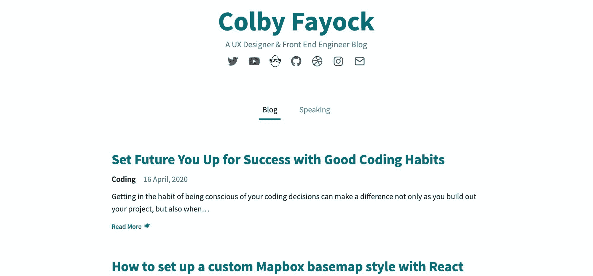
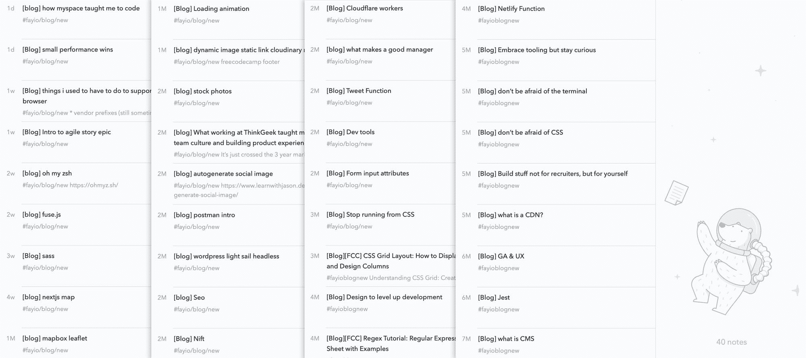

# 如何克服自己对写作的恐惧，找到开始的动力

> 原文：<https://www.freecodecamp.org/news/overcoming-your-fear-of-writing-and-how-you-can-find-motivation/>

写下我们的工作是我们大多数人的待办事项之一。但是不管是因为拖延还是恐惧，我们从来没有真正做到过。以下是你应该尝试一下的更多动机和理由！

## 为什么我们首先要写作？

也许你以前从未想过写作，或者你正在寻找更多的动力。无论如何，有很多很好的理由说明写作可以帮助我们成长。

### 帮助他人学习

编码可能很难。我们都是从某处开始的。

这是一个漫长的旅程，我们每个人都要经历，独自一人更难。幸运的是，我们已经有了像[freecodecamp.org](https://www.freecodecamp.org/)和[css-tricks.com](https://css-tricks.com/)这样的网站，让这个旅程变得更容易管理，但总会有一些毫无意义的挑战。

CSS-Tricks around 2011 when I got my first official coding job via [Way Back Machine](https://web.archive.org/web/20110701022701/http://css-tricks.com/)

这是我们分享经验帮助他人成长的机会。虽然我们最喜欢的编码网站有大量令人惊叹的教程，但也许它们遗漏了某人完全掌握解决方案所需的关键点。

无论你是在旅程的开始还是中途，每一次经历，无论大小，都可以帮助另一个开发者踏上他们自己的旅程。

这就是回报的地方。写作中我最喜欢的部分之一是从某人那里得到一条关于[我的一个教程](https://www.freecodecamp.org/news/author/colbyfayock/)如何帮助他们学习的 Twitter DM。知道自己在别人的旅途中帮助了别人，这种感觉很棒。

把这作为你回报帮助你学习和成长的社区的一种方式。

### 强化你的学习

回想一下你小学的西班牙语课，帮助学生学习的诀窍之一就是强化学习。老师们使用不同的方法，比如读、写、说、抽认卡，甚至是五月五日节，在那里你了解并庆祝墨西哥的传统，来帮助语言的坚持。

这也适用于发展概念。趁你的解决方案还在脑海中记忆犹新的时候，把它写下来！能够通过写作来教授你所学到的东西将有助于这些概念在你的头脑中扎根。

你写了，并不意味着你必须分享。如果你不愿意与他人分享，就在私人笔记本里保存一份拷贝。你总是可以自己参考它，并通过写下来来巩固你所知道的。

### 记录我们的经历

加倍努力强化你的学习，通过写下你的经历，你就像是用一张你已经解决的问题清单创造了你自己的个人 [StackOverflow](https://stackoverflow.com/) 。

尽管我们曾希望能从课堂上记住如何说西班牙语，但 10 年很快就过去了，你突然意识到你只能用西班牙语正确地说“你好”。

Hola sign from Jon Tyson on [Unsplash](https://unsplash.com/photos/8MMtYM_3xMY)

如果你是那种雄心勃勃的人，也许你保存了所有的笔记。如果没有，也许你记得一个有抽认卡的好网站。

无论哪种方式，有资源可以查阅，无论是你自己的笔记还是你仍然收藏的网站，都有助于我们快速参考我们已经遇到的挑战。通过写下你的经历，你就把它添加到了你的数字笔记本里，你知道你可以一直用它来记住你纠正的怪癖。

### 扩大你的人际网络

每个人都有自己想要写和分享内容的理由——没关系！虽然我们中的一些人可能这样做是为了帮助其他人学习，但其他人可能只是想找份工作或增加他们的 Twitter 粉丝。

分享你的经验的好处之一是，你可以立即扩大开发人员的网络，他们对你是谁以及你所做的工作有了更多的了解。

这并不能保证找到工作，但肯定会有所帮助。所有的团队在招募方式上都有点不同。较小的团队更倾向于在过程的开始就包括其他开发人员，他们更有可能打开你的博客，而不仅仅是读一点点，而是真正理解它。

但是即使你没有马上被雇佣，你也是在玩长线游戏。机遇会以小的方式出现，并在未来带来更大的机遇。

## 为什么你可能会犹豫不决，以及我们如何从另一个角度看待它

有时候光有动力是不够的。我们都有自己的挑战，可能会阻止我们做我们想做的事情。但是有时候，找到一个不同的视角，给你一点灵感，让你最终投入进去。

### 冒名顶替综合症——我该写些什么呢？

在我职业生涯的大部分时间里，这是我个人一直在为之奋斗的事情。不管我是否对自己的工作能力有信心，我从来不觉得成为一个为别人写指南的人就足够了。

[My website and blog](https://www.colbyfayock.com/)

直到另一名团队成员为这场争论带来了另一种观点(感谢)——每个人的学习方式不同，也许我讲故事的方式可以帮助别人学习。

如果有人不看我的作品，除了浪费一点点时间，还有什么后果？另一方面，也许我的博客帖子在某种程度上引起了某人的共鸣，而其他博客帖子没有，他们最终能够解决他们的问题。

这适用于任何层次的经验。正如 [Swyx](https://twitter.com/swyx) 所说，[最快的学习方式是在公共场合](https://www.swyx.io/writing/learn-in-public/)。如果你没有帮助别人，你至少在帮助自己成长。

### 找时间——写一篇文章需要一段时间

时间是个有趣的东西——当我们不想承认自己退缩的真正原因时，它就成了我们的借口。

当然并不总是这样。实际上，我们很多人已经有一大堆事情要做了，不管是工作、照顾家庭还是志愿帮助他人。辛苦工作一天后，不想只是坐在沙发上可能是一场斗争。

但是想想你的空闲时间。你能抽出 10 分钟的时间记下一些笔记，甚至开始列出你想说的一些事情的大纲吗？

虽然 10 分钟写不了一整篇博文，但如果你养成了这个习惯，每天再写一两段，你会慢慢地写完一篇让你感觉很好的分享博文。

只是不要把标准定得太高。如果你一开始就有一个不切实际的目标，你很可能会很快筋疲力尽，最终回到你现在的位置。

### 没有主题——不知道写什么

从与其他开发者的交谈中，我注意到这似乎与冒名顶替综合症有一点联系。也许你越来越自信，越来越愿意写作，但你却苦于找不到写些什么。是因为你想不出一个主题，还是因为你想的每一个主题，你都认为自己不够专业，不足以写出来？

没有话题可能是一个合理的问题，但我们周围到处都有灵感。如果你作为一名开发人员每天都在工作，你就在处理你最终需要解决的问题。为什么不写那些问题呢？如果你因为合同问题而不能写下这些问题，那么以一种抽象的方式写下这些问题又如何呢？

我的灵感来自于我与他人交谈的经历。我很幸运在一个鼓励初级开发人员成长的团队中，在我帮助他们的时候，他们的问题让我思考我认为理所当然的话题。

每当这样的话题出现时，我会立即记下来以备后用。这个话题在列表上！随着时间的推移，我的主题列表已经增长到我不认为我能在年底前完成的程度。

My personal list of topic ideas

虽然这可能会让人感到不知所措，但它也激励我有更多的选择来写我想写的东西，而不是强迫自己每周都想一个新的主题，写一些我不想写的东西。

无论如何，找到你的灵感来源。你不需要成为这方面的专家。如果有更有经验的人已经写了，那也没关系。写你知道的。分享你的经历。也许你会帮助别人从不同的角度看问题。

## 找到激励你的东西

归根结底，写作是我们每个人都需要找到自己的动力去做的事情。

试着评估你的目标。你希望实现什么？如果写作是你真正想做的事情，你需要找到自己的灵感来源。

虽然有些理由可能比其他理由更合理，但找到不做某事的理由比做某事更容易。

你能行的！？

*   [？在 Twitter 上关注我](https://twitter.com/colbyfayock)
*   [？️订阅我的 Youtube](https://youtube.com/colbyfayock)
*   [✉️注册我的简讯](https://www.colbyfayock.com/newsletter/)