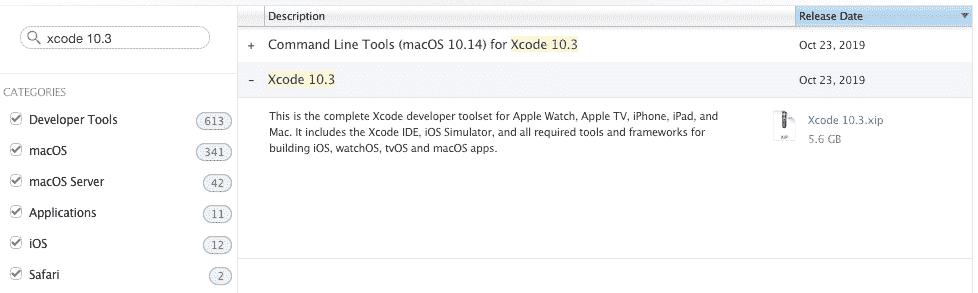
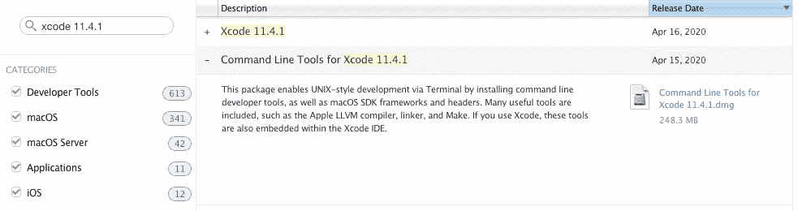
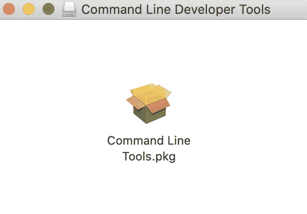
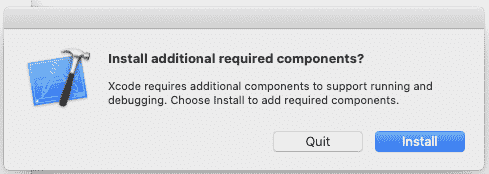

# 如何下载 Xcode 并将其安装在 Mac 上——并针对 iOS 开发进行更新

> 原文：<https://www.freecodecamp.org/news/how-to-download-and-install-xcode/>

Xcode 是开发者用来为苹果生态系统——MAC OS、iOS 和所有苹果产品——构建应用的工具。

本指南将从头到尾向您介绍如何在 Mac 上成功安装 Xcode。

在你开始之前，这里有一些方便的提示:

*   Xcode 只能在 mac 上运行。如果你在 PC 上，很遗憾你不能使用 Xcode。
*   你需要一个良好、稳定的互联网连接。最新版本的大小约为 8gb。
*   请确保您的计算机上至少有 30gb 的可用空间。最新的`.xip`文件(撰写本文时的版本是 11.4.1)被压缩了大约 8gb。当你解压后，又是 17gb。然后，您将需要命令行工具，这又是 1.5 千兆字节。

## 以下是安装 Xcode 的步骤概述

1.  Download Xcode
2.  安装命令行工具
3.  打开新版本
4.  删除文件

注意，我在下面的步骤中列出了一些终端命令。这些命令可以输入到您当前的工作目录中。这意味着您不需要导航到任何特定的文件夹。

如果你真的想的话，你可以先输入`cd`，然后在下面的步骤中输入命令。这将使您返回到个人文件夹。

## 步骤 1:下载 Xcode

有两种方法可以做到这一点。对于最新版本和理论上“简单”的安装，你可以使用 App Store。我不推荐这个选项。

我更喜欢使用开发者网站。这附带了一个额外的选项，可以下载你想要的任何版本。

### 选项 1:通过应用商店下载最新版本(不是我的首选)

理论上，这应该是一个无缝、无痛的过程。但是如果安装在最后一步由于任何原因失败了，就很难排除故障。

失败有几个原因，没有简单的方法知道哪一个是根本原因。如果遇到故障，每次尝试修复故障时，都需要重新下载整个文件。由于最新版本是 8g，我不太喜欢这种方法。

但是如果你觉得自己很勇敢，这里有一些步骤:

*   在 mac 上打开 App Store
*   签到
*   搜索 Xcode
*   单击安装或更新

### 选项 2:通过开发者网站下载特定版本(我的首选)



A screenshot of [https://developer.apple.com/download/more/](https://developer.apple.com/download/more/)

1.  前往苹果开发者网站的“更多”部分
2.  使用您的 iTunes 帐户 id 登录
3.  输入你想要的版本，并下载`Xcode_x_x_x.xip`文件。请记住，Xcode 11.4.1 是 8g，因此这将需要一段时间，具体取决于您的互联网连接。
4.  文件下载完成后，点击`.xip`提取文件。您的笔记本电脑会将其解压缩到您下载到的同一个文件夹中。这个提取过程是自动的。点击`.xip`文件后，您不需要再做任何事情。这一步需要几分钟时间。
5.  [可选]提取后，如果您使用多个版本，请将应用程序重命名为“Xcode11.x.x”。
6.  将应用程序拖到“应用程序”文件夹
7.  [可选]将新 Xcode 版本设定为默认版本。打开终端并键入`sudo xcode-select -switch /Applications/Xcodex.x.x.app`。用版本号替换`x.x.x`。例如:`Xcode11.4.1.app`。你需要输入你的电脑管理员密码。我很确定这将为您电脑上的所有用户更新默认 Xcode 版本，所以最好先和其他用户确认一下

## 步骤 2:安装命令行工具(CLT)

如果您的计算机上有多个用户，您将需要为每个用户更新 CLT。

**下载`.dmg`**



A screenshot of [https://developer.apple.com/download/more/](https://developer.apple.com/download/more/)

要更新 CLT，请访问[应用开发者网站](https://idmsa.apple.com/IDMSWebAuth/signin?appIdKey=891bd3417a7776362562d2197f89480a8547b108fd934911bcbea0110d07f757&path=%2Fdownload%2Fmore%2F&rv=1)，下载命令行工具`.dmg`。

如果您以前从未安装过 Xcode，您可以通过键入`xcode-select --install`来使用您的终端进行更新，而不必访问开发者网站。

但是如果您的机器上安装了 Xcode 的现有版本，您可能会看到以下错误:

```
xcode-select: error: command line tools are already installed, use “Software Update” to install updates
```

这意味着你需要转到开发者网站。

### 安装 CLT

当`.dmg`下载完成后，双击文件将其打开。这将打开一个小窗口，如下所示:



双击该框并按照提示安装 CLT。需要几分钟才能完成。

它可能会在安装结束时询问您是否要将它移到垃圾桶。当它这样做的时候，它正在讨论将`.dmg`文件移动到垃圾桶。因为您应该不再需要这个文件了。对此我总是说是。

## 第三步:打开 Xcode

打开“应用程序”文件夹，然后打开新版本的 Xcode。如果您重新命名了 Xcode，请确定您打开了正确的应用程序

Xcode 可能会提示您安装附加组件。单击安装。这需要几分钟时间。



安装时，检查您的默认 Xcode 版本是否是您刚刚下载的版本:

*   开放终端
*   类型`brew config`
*   您应该看到“CLT”和“Xcode”版本，以及其他所有内容。这应该反映了您刚刚下载的版本。我的情况是下载了 Xcode 11.4.1。

```
CLT: 11.4.1.0.1.1586360307
Xcode: 11.4.1 => /Applications/Xcode11.4.1.app/Contents/Developer
```

一旦组件安装完毕，Xcode 就会启动。您应该能够继续您的旧项目，并从您中断的地方无缝地继续下去*。

**请注意，如果您使用任何代理工具，如 Charles，您将需要在模拟器中重新安装这些证书。*

如果您在尝试构建或运行项目时遇到任何错误，请检查您正在尝试启动哪个设备。新版本可能不记得您之前使用的设备。如果是，点击设备并从下拉菜单中选择“添加附加模拟器”来添加您想要的设备。


## 第四步。删除文件

如果您的电脑上不需要旧版本的 Xcode，您可以卸载它们并获得一些硬盘空间。

还可以删除刚下载的版本的`.xip`文件，以及`CLT.dmg`文件。

就这些了。希望这对你成功安装 Xcode 有所帮助。好好享受吧！