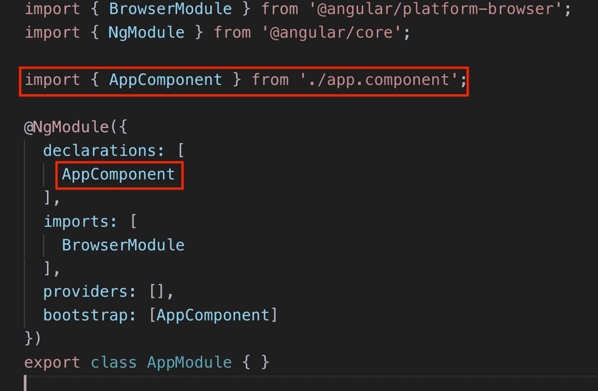
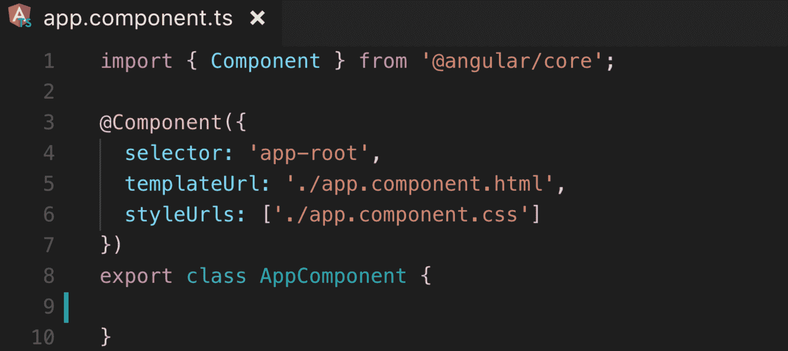

# 面向初学者的 angular 9-组件和字符串插值

> 原文：<https://www.freecodecamp.org/news/angular-9-for-beginners-components-and-string-interpolation/>

在现代 web 开发中，许多开发人员更喜欢以基于组件的方式构建网站的 UI。它也受到所有现代框架的支持。理解组件如何工作以及如何使用它们是学习 Angular 的一大步。

在这篇文章中，你将学习角度组件，如何在项目中创建和使用组件，以及什么是字符串插值。我还将在接下来的文章中介绍 Angular 的其他重要特性:

*   **第一部分:** [如何用 Angular CLI 安装你的第一个应用](https://www.freecodecamp.org/news/angular-9-for-beginners-how-to-install-your-first-app-with-angular-cli/)
*   **第二部分:**角度分量和字符串插值**(你在这里)**
*   **第三部分** : [角度指令&管道](https://youtu.be/3-eJ-A9rFEU)
*   **第四部分:** [单向角度数据绑定](https://youtu.be/x_vtX3vvE8k)
*   **第五部分:** [用 ngModel 进行角度双向数据绑定](https://youtu.be/bKfbzpANUFE)

**如果你愿意，也可以看视频版:**

[https://www.youtube.com/embed/wXmw0FxjmTc?feature=oembed](https://www.youtube.com/embed/wXmw0FxjmTc?feature=oembed)

## 什么是组件？

组件是角度应用程序最基本的构建块。我们可以想到像乐高积木一样的组件。我们创建一个组件一次，但是可以根据需要在项目的不同部分多次使用它们。

角度组件由 3 个主要部分组成:

*   HTML 模板—视图
*   类型脚本文件—模型
*   CSS 文件—样式

### 为什么我们需要组件？

使用组件在很多方面都有好处。组件将用户界面分成更小的视图并呈现数据。组件不应该参与诸如 HTTP 请求、服务操作、路由等任务。这种方法保持了代码的整洁，并将视图与其他部分分离开来(参见[关注点分离](https://en.wikipedia.org/wiki/Separation_of_concerns))。

另一个重要原因是组件将代码分成更小的、可重用的部分。否则，我们将不得不在一个 HTML 文件中包含无尽的代码行，这使得代码更难维护。

## 创建我们的第一个角分量

现在让我们创建我们的第一个组件。创建组件的简单方法是使用 Angular CLI:

```
ng g c component-name
```

g: generate, c: component

此命令使用自己的文件(HTML、CSS 和 TypeScript)创建一个全新的组件，并自动将其注册到应用程序模块:



The App Module

> **注意:**在 Angular 中，我们需要将每一个必要的服务、组件和模块注册到一个模块文件中。

现在让我们仔细看看组件模型(TypeScript 组件文件):



Inside the App Component

这实际上是一个 TypeScript 类，但将其定义为一个组件:

*   首先我们需要从 ****@angular/core**** 库中导入 ****组件**** ，这样我们就可以使用组件装饰器了
*   ****@Component**** 装饰器将该类标记为组件，并允许我们添加以下元数据
*   **选择器**用于稍后调用组件作为 HTML 标签:`<app-root> </app-root>`
*   ****TemplateUrl**** 是组件的 HTML 视图所在的路径。
*   **S**tyle URLs**(可以大于 1)是组件的样式文件所在的位置。**
*   最后，我们 ****导出**** 这个类(组件)，这样我们以后就可以在 ****app.module**** 或者项目中的其他地方调用它。

### 什么是字符串插值？

关于 Angular，人们最常问的一个问题是花括号语法是什么。组件呈现数据，但是数据会随时间变化，所以它需要是动态的。

我们在其他花括号里面用花括号来渲染动态数据:`{{ data }}`而这种表示方式叫做字符串插值。你可以在上面的视频版本中看到这个例子。

## 包裹

学习 Angular 最重要的一步是知道如何创建组件并有效地使用它们。我希望这篇文章对你有所帮助。在下一部分中，我们将看一下角度指令，比如 ng-if、ng-for、ng-class 等等。敬请期待:)

****如果你想了解更多关于 Web 开发的知识，******[****在 Youtube 上关注我****](https://www.youtube.com/channel/UC1EgYPCvKCXFn8HlpoJwY3Q) ****！******

**感谢您的阅读！**