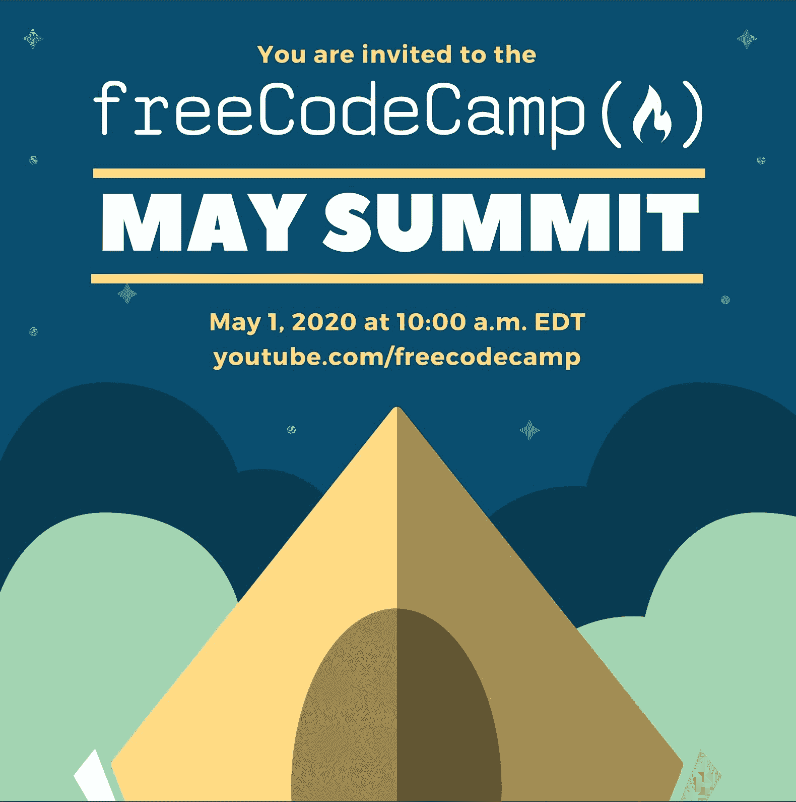

# freeCodeCamp 的五月峰会:我们将在周五的 YouTube 直播中演示什么

> 原文：<https://www.freecodecamp.org/news/may-2020-summit/>

freeCodeCamp 社区已经有一段时间没有举办大型峰会直播了。现在有了疫情冠状病毒，我们比以往任何时候都更需要社会互动。

我们的社区一直在努力对 freeCodeCamp 课程进行大量重大改进。我们已经在 YouTube 上发布了大量免费课程。我们也很高兴展示其他新工具。

该视频将于美国东部时间 5 月 1 日周五上午 10 点在 freeCodeCamp 的 YouTube 频道上开始播放。

你可以[在这里](https://www.youtube.com/watch?v=7PLx6hwRUnA&feature=youtu.be)观看 YouTube 上的直播。

这是我们在这一小时的视频中将要讲述的内容。

## 4 项新的 Python 认证

2019 年末，我们开始着手 4 项新的 Python 认证。这些都是 freeCodeCamp 核心课程的一部分，将紧随我们现有的 6 个 web 开发认证(最初将保持不变)。

Beau 将演示这些新的认证，并解释我们如何推广它们。

我们还将对如何推出 7.0 版本的 freeCodeCamp 课程进行重大更新。正如我在 12 月份所说的，我们正在转向 100%的项目导向学习。这些新的实践项目将是 100%可选的，这些都不会影响已经通过 freeCodeCamp 课程并获得认证的人。

您可以[在此](https://www.freecodecamp.org/news/python-curriculum/)阅读完整的公告文章。

我们很高兴演示这些新的认证，我们将在 5 月向 beta 测试人员开放。

## YouTube 频道的重大改进

你可能已经听说了，freeCodeCamp 社区的 YouTube 频道正在增长。

> freeCodeCamp 社区今天达到了一个新的里程碑。
> 
> 仅过去 28 天 YouTube 上 100 万小时的观看时间。
> 
> 那是 114 年。
> 
> 祝贺所有帮助创建这些课程的老师和开发者。你在帮助很多人。pic.twitter.com/1SmgwGTdJw 的❤️
> 
> — Quincy Larson ? Stay Home and Save Lives (@ossia) [April 25, 2020](https://twitter.com/ossia/status/1254089716967911426?ref_src=twsrc%5Etfw)