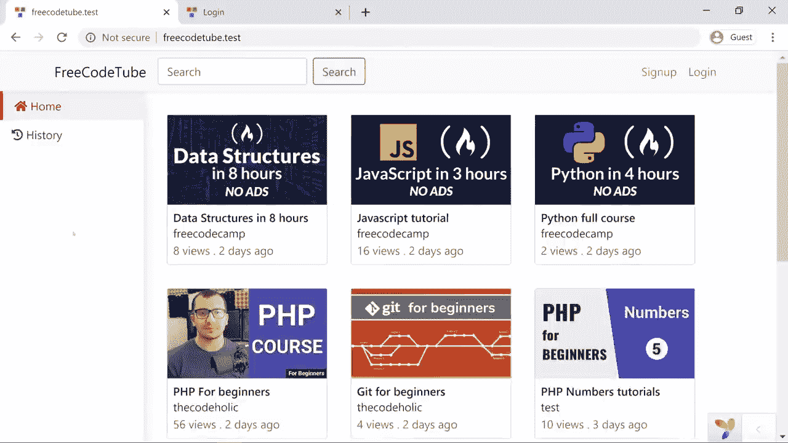

# 了解如何使用 Yii2 PHP 框架创建 YouTube 克隆

> 原文：<https://www.freecodecamp.org/news/learn-how-to-use-the-yii2-php-framework-to-create-a-youtube-clone/>

Yii 是一个快速、安全、高效的 PHP 框架，用于创建各种 web 应用程序。我们已经发布了关于如何使用 Yii2 框架的完整视频课程。

在本课程中，您将学习如何从 Zura Sekhniashvili 创建 YouTube 克隆。这是给完全初学者的，但是你应该[对 PHP](https://www.youtube.com/watch?v=OK_JCtrrv-c&vl=en) 有点熟悉。

Demo of the YouTube clone you will create in this course.

Zura 将展示如何使用 Yii2 框架来开发网站的前端和后端。作为创建者的用户将能够上传视频并提供关于视频的元数据。创作者可以将视频标记为已发布或未发布，甚至可以查看视频分析。作为观众的用户将能够观看视频，喜欢和不喜欢视频，找到类似的视频，订阅和搜索视频。

本课程结束时，您将了解如何使用 Yii2 框架，以及如何将其应用到您自己的项目中。

查看以下视频或在 freeCodeCamp.org YouTube 频道观看。

[https://www.youtube.com/embed/whuIf33v2Ug?feature=oembed](https://www.youtube.com/embed/whuIf33v2Ug?feature=oembed)