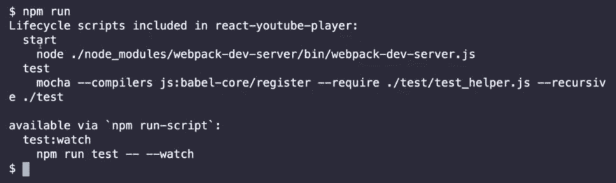
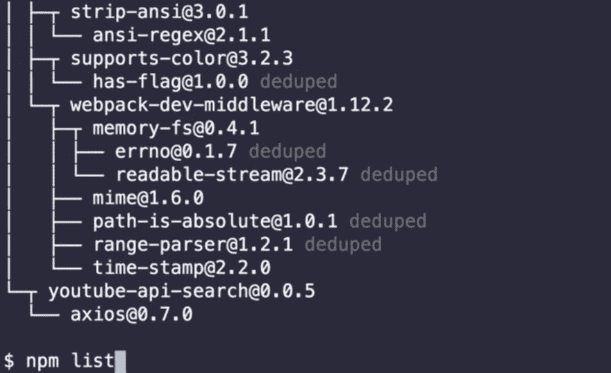
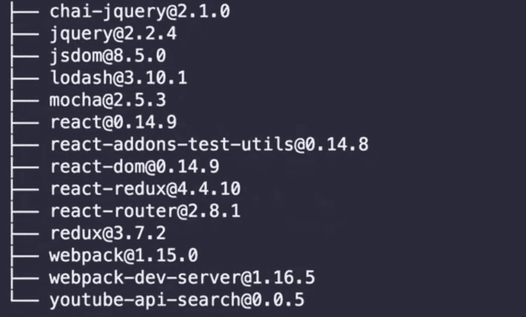
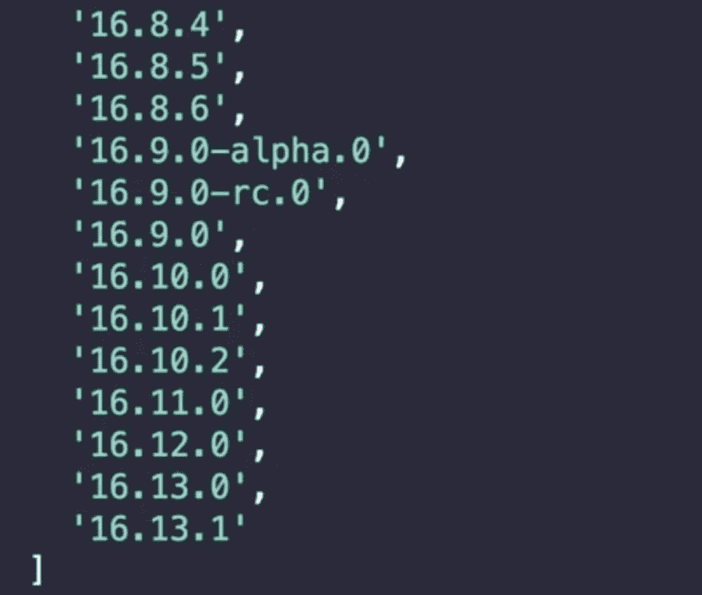
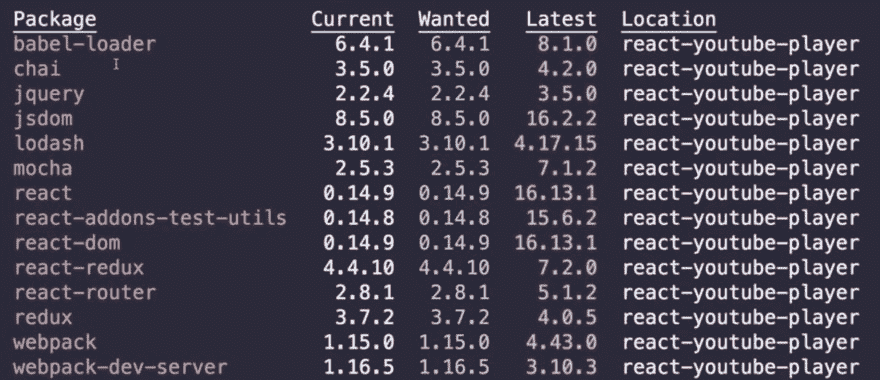
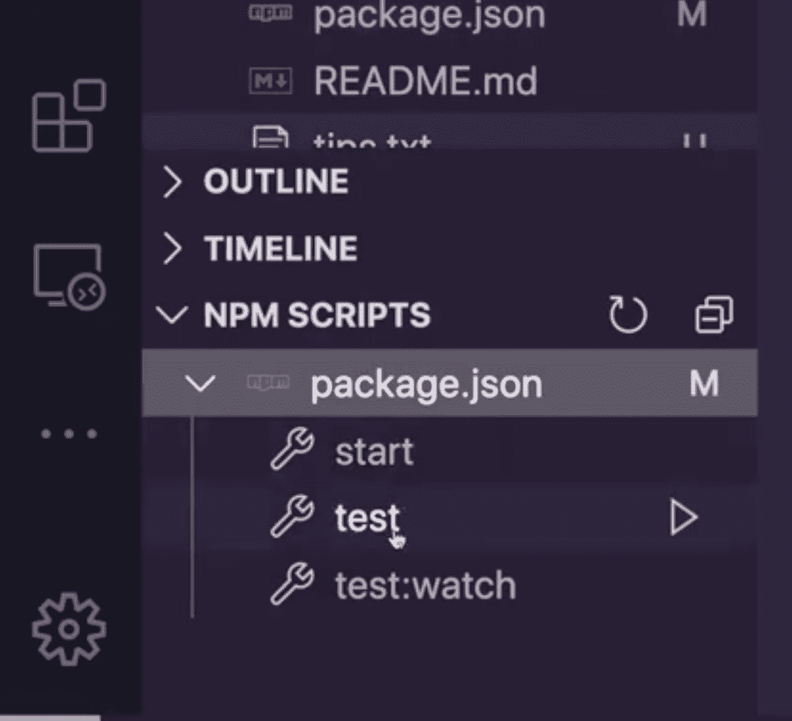

# 帮助你提高生产力的 5 个 npm 技巧和诀窍

> 原文：<https://www.freecodecamp.org/news/5-npm-tips-and-tricks/>

虽然这篇文章可能会提高你的工作效率，但至少它也会让你的一些同事对你的新技能印象深刻。人们现在会觉得你更聪明，可能更有趣。？

我已经远离了显而易见的捷径，并试图分享你可能不知道的信息。

如果你想要视频版本，看看下面。如果你读得开心，那就上我的朋友吧...？

[https://www.youtube.com/embed/EVT39ggmoM8?feature=oembed](https://www.youtube.com/embed/EVT39ggmoM8?feature=oembed)

## 1.列出可用脚本

要轻松检查项目中所有可用的脚本，只需运行:

```
npm run 
```

这将为您提供一个可爱的输出，显示如下命令:



## 2.列出已安装的软件包

```
npm list 
```

这可能向我们展示了太多，因为我们看到了我们的依赖关系的依赖性……



使用`--depth`来限制搜索的深度

```
npm list --depth=0 
```

这里您可以看到限制深度时的输出:



## 3.打开包的主页或 repo

我非常喜欢这个特性，因为您可以快速获得软件包的文档。

要自动打开软件包主页，您可以运行:

```
npm home PACKAGE_NAME 
```

要打开存储库，您只需运行:

```
npm repo PACKAGE_NAME 
```

这是非常方便的，所以你不必去谷歌寻找文档或 npm 页面，可以快速访问你不知道的包的信息。

## 4.显示软件包的所有可用版本

要获得软件包的最新版本，我们可以运行:

```
npm v react version 
```


或者对于所有版本，我们只需将“版本”设为复数。

```
npm v react versions 
```

然后，我们得到一个所有可用版本的可爱输出，如果你想检查什么是新的/旧的，或者是否有任何 alpha 版本可以试用，这是非常方便的。

下面是运行`npm v react versions`的一段输出:



## 5.寻找过期的软件包

`outdated`命令将检查 npm 注册表，看看是否有任何包是过时的。它会在命令行中打印出一个小表格，显示当前版本、所需版本和最新版本。

```
npm outdated 
```

如果你在我的例子中看到红色的包，这意味着有一些主要的漏洞，它们应该被更新。正如你在这个 4 年前的项目中看到的，它是一种健康的红色...



如果你想要不同于当前版本的版本，你可以运行`npm update`来安全地更新这些包。

我认为更新和检查过时内容的更好方法是运行`npm audit`命令，因为它提供了更多的细节。我没有把它作为一个提示，因为当我们安装依赖项时，它总是要求我们在控制台中运行它。

## Visual Studio 代码奖励提示！？

很多人不知道这一点，但实际上你可以直接从 Visual Studio 代码中运行你的脚本，使用它们可爱的界面。

在面板的左下方寻找“NPM 脚本”。



[Showing the npm scripts tab in Visual Studio Code](https://i.imgur.com/TiTJeqh.png)

你可以从这里打开你的脚本，只需点击播放图标就可以开始了。我喜欢这种方式，因为对于可能不太熟悉 *npm* 的人来说，这是一种清晰而简单的做事方式。

如果你看不到它，请确保它在你的设置中处于活动状态。？

* * *

[在 Twitter 上关注我](https://twitter.com/nialljoemaher)

订阅 [Codú社区](https://www.youtube.com/c/Cod%C3%BACommunity)