# 如何给 YouTube 上任何语言的视频添加字幕

> 原文：<https://www.freecodecamp.org/news/youtube-subtitles-tutorial-how-to-add-captions-to-a-video-in-any-language/>

【2020 年 9 月更新:YouTube 已经停产他们的社区字幕贡献工具。尽管如此，这篇文章对你这个 YouTube 创建者可能还是有帮助的。

你想要一种简单的方法来支持你最喜欢的 YouTube 创建者吗？你可以给他们的视频添加字幕或翻译。如果你是 YouTube 的创建者，你也可以给自己的视频添加字幕和翻译。字幕和翻译让更多的观众可以观看视频。

是的，YouTube 会自动为视频添加字幕。然而，这些用人工智能创建的字幕往往包含许多错误。此外，YouTube 无法为真正长的视频自动添加字幕，例如 freeCodeCamp.org YouTube 频道的许多免费编程课程。

本指南将首先介绍如何给其他人的视频添加字幕。然后，它将介绍如何在您自己的频道上给视频添加字幕。

*注意:您只能在网络浏览器中添加字幕/翻译，而不能在 YouTube 移动应用程序上添加。*

## 为频道提供字幕和翻译

如果频道所有者启用了社区贡献，您只能为视频添加字幕和翻译。它们为[freeCodeCamp.org 频道](https://youtube.com/freecodecamp)打开。？

### 第一步

在您要贡献的视频的观看页面上，单击齿轮，然后单击“字幕/抄送”。

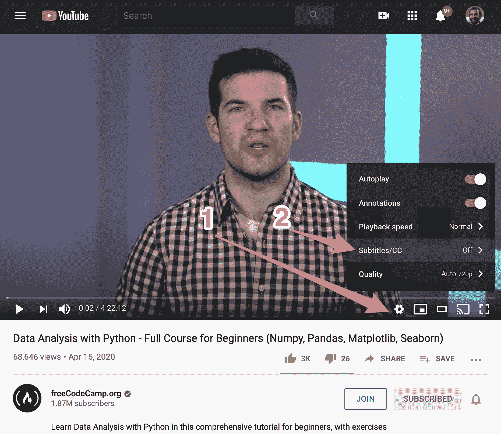

### 第二步

单击“添加字幕/抄送”按钮。

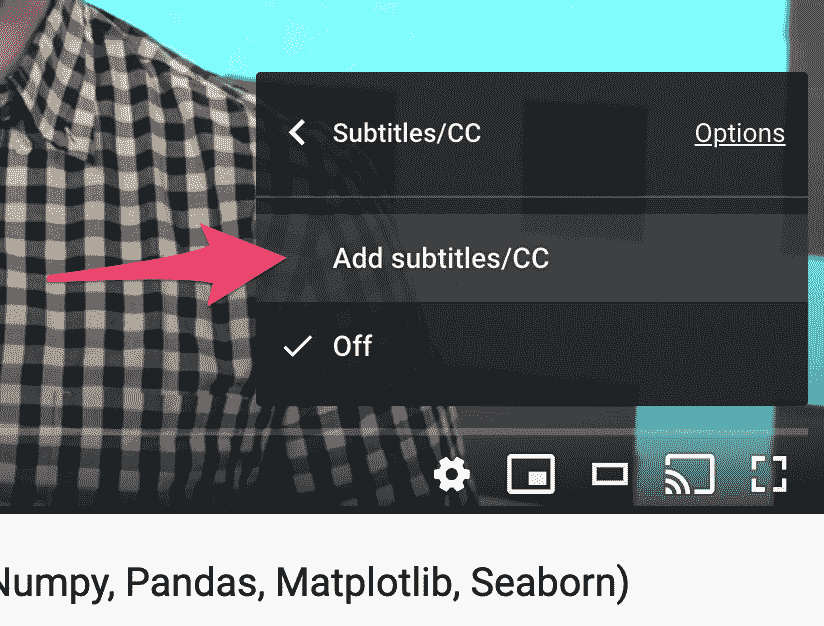

另一种从视频页面添加字幕的方法是点击视频下方的三个点，然后点击“添加翻译”。

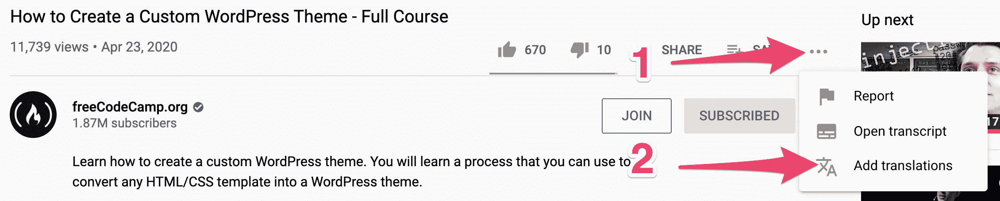

### 第三步

选择要添加的标题语言。如果视频创建者已经选择了视频的语言，该语言将显示在顶部。

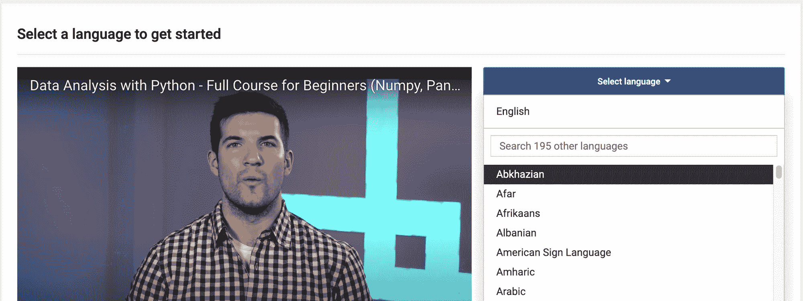

### 第四步

添加标题或翻译。如果一个视频很长，这个页面可能需要一段时间来加载。

如果 YouTube 已经自动生成了字幕，它们就会显示出来。如果其他用户已经添加了标题，标题也会显示出来。播放视频，听听内容。请使用界面更正标题或添加新标题。

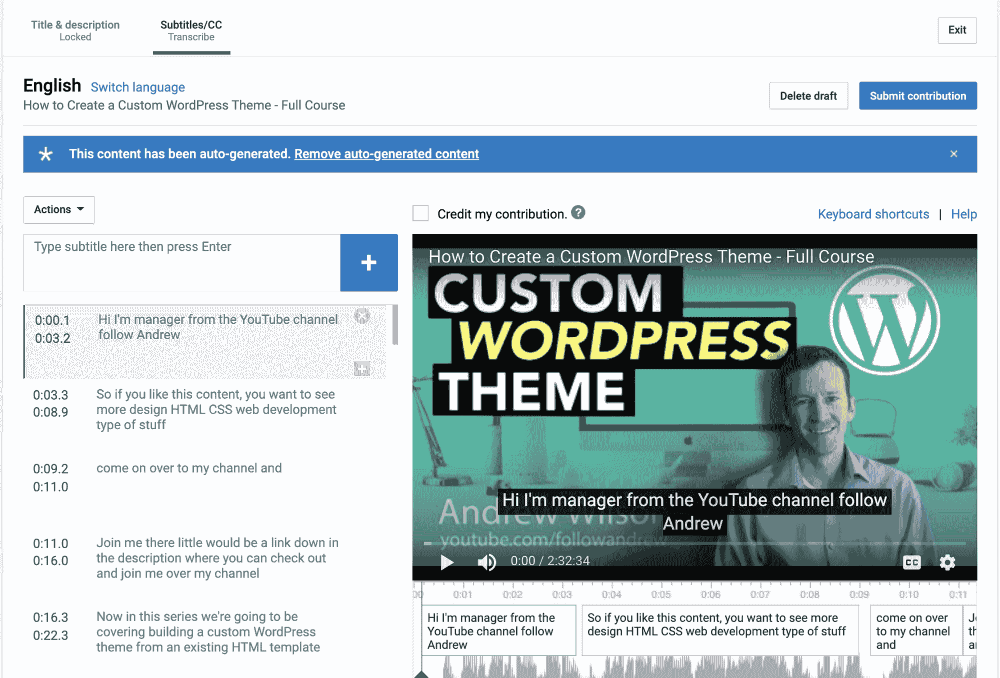

This video has captions that have been auto-generated. The captions need to be corrected.

### 第五步

添加完标题或翻译后，点击“提交稿件”。

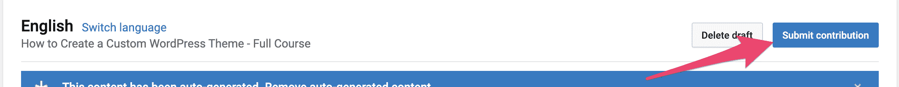

### 第六步

指出字幕是否已经完成，或者其他人是否应该继续工作。然后点击“提交”。

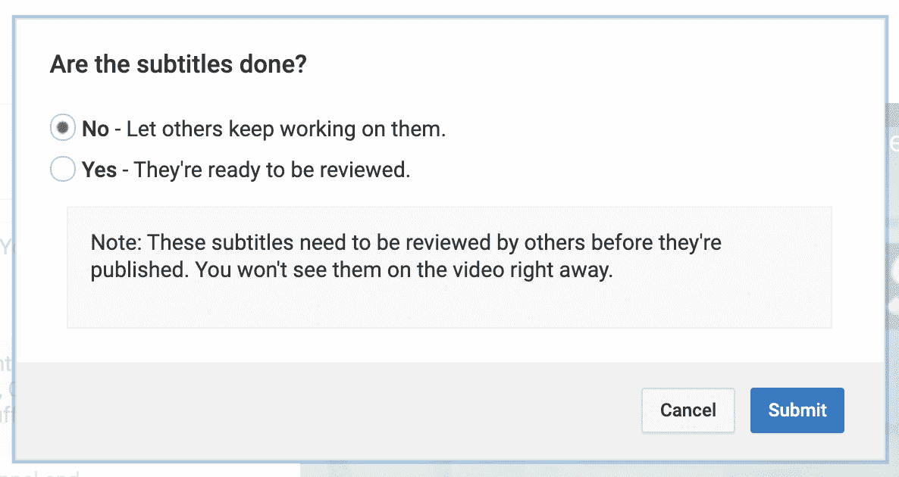

你完了！

如上所述，为了添加字幕，页面加载需要很长时间。另一种方法是将视频中的所有文字输入到文本文件中，然后通过电子邮件将文件发送给管理频道的人。频道创建者可以上传一个文本文件脚本，YouTube 会自动将脚本与视频中的单词对齐。

如果你想为 freeCodeCamp.org 频道的视频添加字幕，你可以通过电子邮件将脚本文件发送给 beau@freecodecamp.org。

## 为您自己的视频添加标题或字幕

### 第一步

进入 [YouTube studio](https://studio.youtube.com) ，点击左侧导航栏上的“字幕”链接。

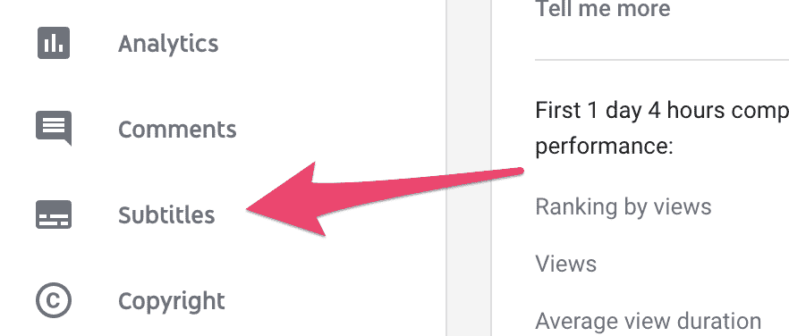

### 第二步

您将看到您频道上所有视频的列表，按上传日期排序。

找到您想要添加字幕的视频。首先，单击 v 形图标下拉语言。接下来，点击自动发布的字幕旁边的三个点。(注意:如果 YouTube 没有自动创建字幕，它只会显示“添加”。)

点击这三个点后，会弹出一个菜单。点击“在 Classic Studio 上编辑”。

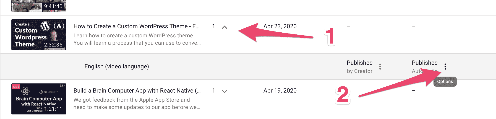

### 第三步

点击“编辑”按钮。

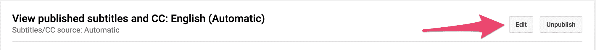

然后你可以开始编辑或添加字幕使用界面。完成后，单击“发布编辑内容”。

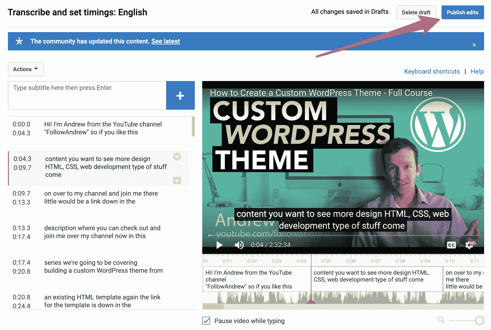

### 添加另一种语言

如果你想添加另一种语言的字幕，首先进入单个视频的编辑页面。接下来，点击“字幕”。然后，单击“添加语言”。

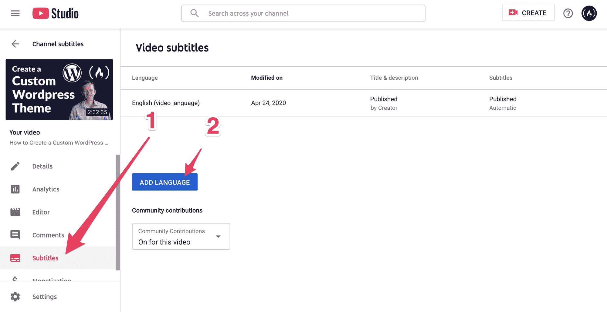

选择要添加的语言。然后，单击“添加”。

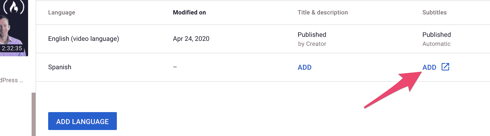

### 添加字幕的替代方式

您也可以通过上传文件来添加字幕。根据您所在的页面，您可以通过“操作”菜单或单击“上传文件”按钮来访问上传文件页面。

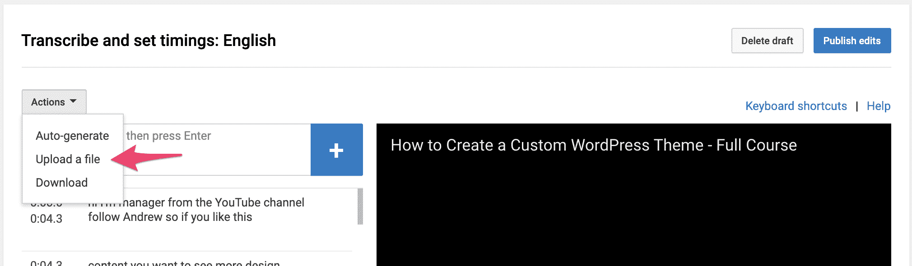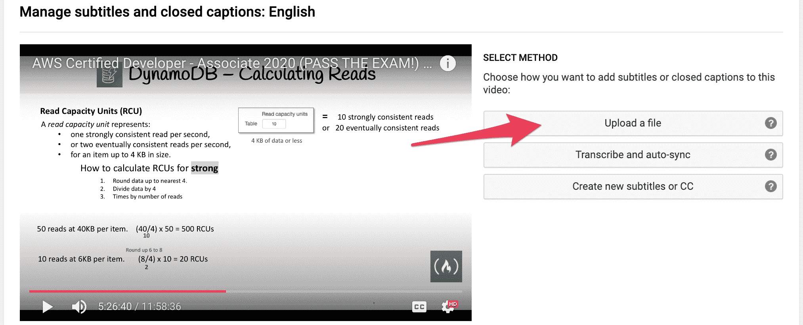

接下来，您必须选择想要上传的文件类型。如果你选择“抄本”,你可以上传一个没有时间代码的脚本文本文件，YouTube 会自动将脚本与视频中的话语进行匹配。您还可以上传包含定时信息的所有常见类型的字幕文件。

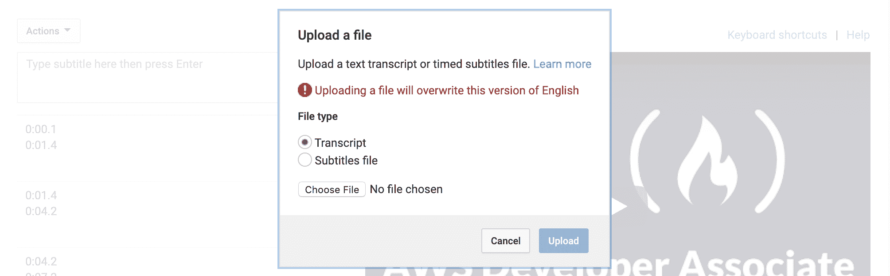

## 结论

您现在可以开始为更多视频添加字幕和翻译了！字幕和翻译将您的内容展示给更多的观众，包括聋人或重听观众，或者那些除了视频中所说的语言之外还会说其他语言的观众。