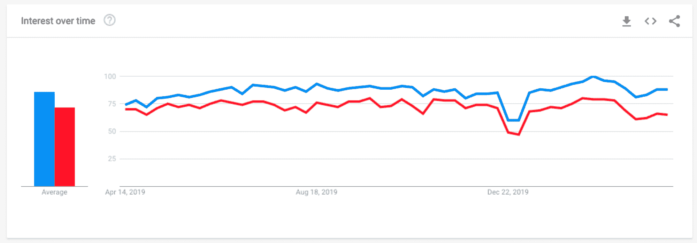

# 面向初学者的 Angular 9——如何使用 Angular CLI 安装您的第一个应用程序

> 原文：<https://www.freecodecamp.org/news/angular-9-for-beginners-how-to-install-your-first-app-with-angular-cli/>

Angular 是 Google 创建和开发的最流行的 JavaScript 框架之一。在过去的几年中，ReactJS 获得了很多关注，并成为业界最受欢迎的现代 JS 库。但这并不意味着棱角不再重要。

相反，根据 Google 趋势(全球范围)，Angular 是仅次于 React 的第二大流行框架:



**ReactJS** is represented with blue and **Angular** with red (world-wide)

作为一名前端开发人员，我曾与 Angular 合作过。现在，我想在接下来的文章中介绍 Angular 的一些重要特性:

*   **第 1 部分:**如何用 Angular CLI 安装你的第一个应用**(目前你在这里)**
*   **第二部分:** [角度分量&字符串插值](https://www.freecodecamp.org/news/angular-9-for-beginners-components-and-string-interpolation/)
*   **第三部分** : [角度指令&管道](https://youtu.be/3-eJ-A9rFEU)
*   **第四部分:** [单向角度数据绑定](https://youtu.be/x_vtX3vvE8k)
*   **第五部分:** [用 ngModel 进行角度双向数据绑定](https://youtu.be/bKfbzpANUFE)

在我的 Angular 初学者系列的第一部分中，您将学习什么是 Angular & Angular CLI，以及如何使用 CLI 安装您的第一个 Angular 应用程序。

### 先决条件

在开始学习 Angular 之前，如果您还不熟悉以下语言，我建议您先熟悉它们:

*   HTML，CSS
*   JavaScript / ES6
*   以打字打的文件

**如果你愿意，可以看下面的教程视频:**

[https://www.youtube.com/embed/cpq7cmj9Ih8?feature=oembed](https://www.youtube.com/embed/cpq7cmj9Ih8?feature=oembed)

## 什么是有角？

Angular 是 Google 开发和维护的用于构建前端应用程序的 JavaScript 框架。让我首先解释一下什么是框架…

### 什么是框架？

框架是一个完整的包，有自己的功能和库。框架有它自己的规则，你没有太多的灵活性，项目依赖于你使用的框架。Angular 是框架的一个例子。

Angular 已于 2016 年发布，但在 Angular 之前，还有 AngularJS。关于 Angular，问得最多的一个问题是 AngularJS 和 Angular 之间有什么区别？

## 角度与角度

Angular 的这两个版本让许多开发人员感到困惑。AngularJS 和 Angular 是完全不同的框架。Angular 版本(如 1、1.2、1.5 等)称为 Angular JS，从版本 2 及更高版本开始称为 Angular。

*   angular JS→1 . x 版本
*   角度→版本 2 及以上

所以 Angular 版本 2 是 AngularJS 框架的完全重写，更新的版本(如 4、5、6 等)是 Angular 版本 2 的微小变化。

**在这个文章系列中，你将学习 Angular 2+。**

# 什么是 Angular CLI？

CLI 代表命令行界面。Angular 有自己的官方 CLI，可以在开发过程中帮助我们做很多事情。

Angular CLI 用于 Angular 项目的自动化操作，而不是手动操作。CLI 自始至终支持我们这些开发人员。

例如，角度 CLI 可用于:

*   配置，环境设置
*   建筑构件、服务、路由系统
*   启动、测试和部署项目
*   安装第三方库(如 Bootstrap、Sass 等)。)

还有更多。现在让我们来看看如何一步一步地使用 CLI 安装我们的第一个 Angular 应用程序。

## 步骤 1:安装 NPM(节点程序包管理器)

首先，我们需要节点 js。NPM(节点包管理器，是节点 js 的一部分)是一个安装第三方库和我们的项目依赖的工具。如果你还没有，可以从这里下载安装[。我也在教程视频上一步步讲解过。](https://nodejs.org/en/)

## **第二步:安装角度指示器**

如果您安装了 node js，下一步是将 Angular CLI 本身安装到您的计算机上:

```
npm install -g @angular/cli
```

**g** 代表**全球安装**。如果以后使用-g，您可以在计算机上的任何 Angular 项目中使用 CLI。

**提示**:在你的命令行界面(或终端)输入`ng v`来验证你的 Angular 版本。

## 步骤 3:创建一个新的角度项目

安装完成后，您可以使用 Angular CLI 通过以下命令创建新的 Angular 项目:

```
ng new my-first-app
```

该命令创建一个新的 Angular 项目(名为 my-first-app，您可以使用任何名称),包含所有必需的依赖项和文件。您不必担心任何事情，因为 CLI 会自动为您完成。

## 第四步:运行应用程序

安装 CLI 并创建新的 Angular 应用程序后，最后一步是启动项目。为此，我们需要使用以下命令:

```
ng serve -- open
```

“打开”标志会自动打开您的本地浏览器窗口。

Angular 支持 **live 服务器**，所以你不用刷新浏览器的页面就能看到你本地的变化。更多细节和更新，请查看[官方文档](https://angular.io/cli)。

### 结论

所以在第一部分，我们对 Angular 做了一个介绍，什么是 CLI，如何安装你的第一个 Angular 应用。在第二篇文章中，你将学习[角度分量和字符串插值](https://www.freecodecamp.org/news/angular-9-for-beginners-components-and-string-interpolation/)。敬请期待:)

**如果你想了解更多关于 Web 开发的知识，** **欢迎关注我的 Youtube**[](https://www.youtube.com/channel/UC1EgYPCvKCXFn8HlpoJwY3Q)****！****

**感谢您的阅读！**