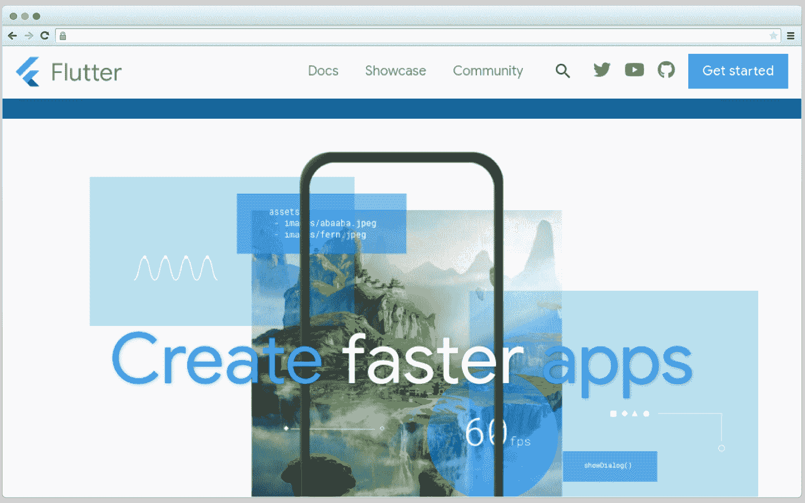
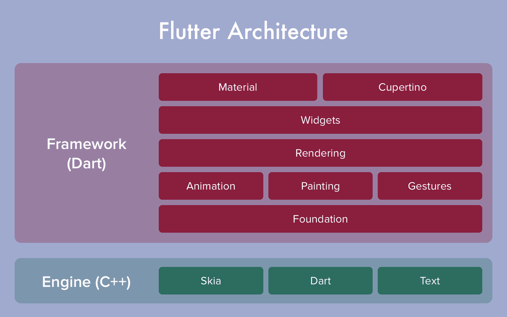
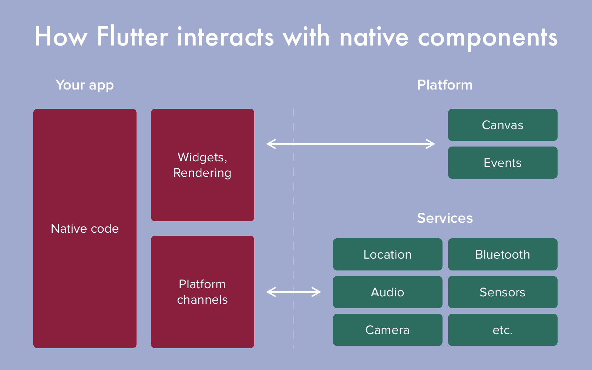
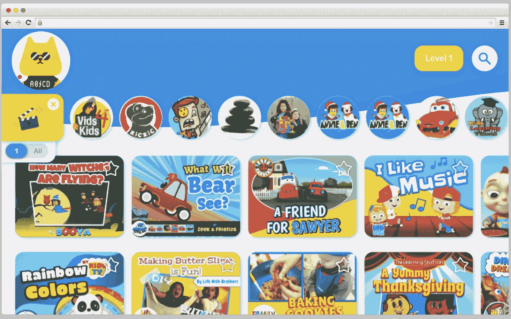
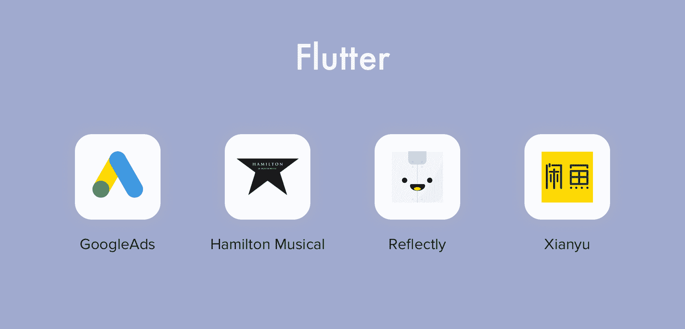

# 谷歌 Flutter 评论——为什么移动应用开发者喜欢 Flutter

> 原文：<https://www.freecodecamp.org/news/why-mobile-apps-makers-are-in-love-with-flutter/>

为什么 app 制作者都爱 Flutter？因为 Flutter 很神奇。

Flutter 迎合了企业(通过提供合理的开发成本)和开发者(通过提供出色的可用性和速度)。这就是为什么一些大公司已经转向 Flutter，如谷歌广告，阿里巴巴，Reflectly，等等。

谷歌在构建 Flutter 方面做得很好，他们会继续把这个框架做得更好。

在这篇文章中，我将对 Flutter 和它的全新功能做一个快速的概述，并且我将谈论为什么这个框架值得使用。另外，我将讨论是什么阻碍了大公司采用 Flutter。

但首先要做的是。

## 扑的要领是什么？

以下是一些你可能已经知道的关于 Flutter 的事情:

*   这是一个开源的、跨平台的工具包
*   应用程序是用 Dart 编程语言编写的
*   它有自己的图形引擎(Skia)
*   它正式支持三个平台:iOS、Android 和 web(测试版)
*   非正式地，它也支持桌面

谷歌在 2018 年 2 月底推出了第一个版本的 Flutter。截至 2020 年 4 月，提供 1.12 版本。

## Flutter 有什么特别之处？

Flutter 结合了原生应用的质量和跨平台开发的灵活性。

实际上，许多跨平台工具让你编写一次代码，就可以在 iOS 和 Android 上使用。然而，并不是所有的应用都能呈现出和原生应用一样的外观。

但这正是 Flutter 所做的:它不是原生 UI 组件(如 React Native 和 Xamarin)上的包装器，而是从头开始绘制 UI。

Flutter 保持了 app 的原生体验和手感，你不用担心它在任何平台上的表现。

此外，由于 Flutter 是一个开源框架，任何开发者都可以在 [GitHub](https://github.com/flutter/flutter) 上对其进行修改，并发送合并请求。如果你看看 Flutter 的受欢迎程度——**90.4k**GitHub**stars**、 **12k forks** 和 **18，445 commits**——你就会明白开发人员喜欢 Flutter 并致力于让它变得更好。

## Flutter 是如何工作的？

**Flutter 不是直接编译到 iOS 或者 Android 的应用**。应用程序基于渲染引擎(基于 C++构建)和 Flutter(基于 Dart 构建)的组合来启动。以这种方式生成的所有文件都附加到特定平台的每个应用程序和 SDK 程序集软件。

这就像游戏开发:一个游戏不分配它的框架，功能性是用游戏引擎进行的。Flutter 软件也是如此——所有基于 Flutter SDK 的应用都用 Flutter 元素替换了部分原生框架。

虽然它会影响最终应用的大小，但性能仍然很好——渲染速度高达 **120 FPS** 。

由于 ARM 处理器的本机编译、简单的渲染以及一组集成的小部件和工具，Flutter 使得开发过程更加简单。

此外，它还提供了一些非常有趣的功能，比如**热重装**。

它是这样工作的:

当您单击 Hot Reload 按钮时，代码中的所有更改都会立即显示在小工具、仿真器和模拟器中。应用程序从您点击热重载之前的位置继续工作:代码更新，但执行继续。

## 跨平台 app 为什么选择 Flutter？

新的 Flutter 版本将不断推出更多高级功能。但是已经有很多增强的功能完美地解释了为什么 Flutter 如此受欢迎。

**首先**，用 Flutter 进行跨平台开发，与流行的看法相反，并不会让软件变得更差。

Flutter 带有所有 Android 和 iOS 界面的原生小部件，如 Material Design 和 Cupertino。此外，该框架可以改变单独元素的行为，为应用程序的用户创建类似的 UX。

**其次**，Flutter 使得在 dev 模式下实现离散文件编译成为可能。JiT 编译加速了开发和软件调试。

**第三**，Flutter 支持灵活且可扩展的后端。

它支持 Firebase、SQLite 等插件( [pub.dev](https://pub.dev/flutter/packages) 将帮助您找到您需要的插件)。Firebase 使应用程序的基础设施可扩展、无服务器和冗余。

因此，如果你正在开发需要实时数据库或云功能的应用，Flutter 会支持你。

还有最后一个:Flutter 非常**易学**。

从一开始，Google devs 就设定了降低准入门槛的目标。他们精心设计了开发人员可以使用的文档和资源。它甚至有特殊的部分，您可以根据自己的专业开始学习框架:

*   为 [Android](https://flutter.dev/docs/get-started/flutter-for/android-devs) 开发者而战
*   针对 [iOS](https://flutter.dev/docs/get-started/flutter-for/ios-devs) 设备的抖动
*   颤振为[反应本地](https://flutter.dev/docs/get-started/flutter-for/react-native-devs)发展
*   扑向 [Xamarin。表单](https://flutter.dev/docs/get-started/flutter-for/xamarin-forms-devs) devs
*   为 [web](https://flutter.dev/docs/get-started/flutter-for/web-devs) devs 颤振

因为 Flutter 的详细文档，即使你只有制作 Android 游戏的 Unity 图形工具的经验，你也会明白如何用 Dart 编写代码。

## Flutter 1.12(最新版本)及其附加功能

让我们看看在其最新的 [1.12](https://flutter.dev/docs/development/tools/sdk/release-notes/release-notes-1.12.13) 版本中引入了哪些热门功能:

### iOS 黑暗模式

从现在开始，Flutter 支持 iOS 13 的外观和感觉，包括 Cupertino 小部件中完整的黑暗模式支持。这不仅仅是换出背景，而是调整其余的颜色，使之成为一个好的搭配。

### 添加到应用程序支持

另一个重大改进是应用程序更新，这是为了将 Flutter 集成到现有的 iOS/Android 应用程序中。

新版本的 Flutter 支持在应用程序中添加一个全屏 Flutter 实例，以及:

*   Java、Kotlin、Objective-C 和 Swift 中稳定的[API 集成](https://flutter.dev/docs/development/add-to-app#api-usage)
*   支持在颤振模块中使用插件
*   通过 Android AARs 和 iOS 框架的附加集成机制

### 测试版 web 支持

新的 Flutter master、dev 和 beta 通道为 web 提供了改进的支持。想要一些例子吗？

这是一个教育项目 **Rivet** ，它使用 Flutter 和 Firebase 创建了他们的应用程序的 web 版本。

### Dart 2.7

新版本的框架引入了 Dart 2.7。

此更新在安全字符串如何处理能力和扩展过程方面增强了使用 Dart 2.5 的体验。这有助于开发人员在变量取零值和解析字符串中的整数时防止出错。

以下是最新的 Flutter 版本的一些其他功能:

*   macOS 桌面支持(alpha)
*   多设备调试
*   黄金图像测试
*   Android 构建改进
*   更新的标靶

## 这很好，但也不是没有问题:是什么阻碍了开发人员的发展？

Flutter 真的很酷:容易上手，操作简单，由一家大型科技公司提供。然而，以下是为什么你的高级开发人员可能不像你这么乐观的原因。

### Dart 的(低)受欢迎程度

不像 Android 的 Java/Kotlin 或者 iOS 的 Swift/Objective-C，Dart 还没有很高的人气。而且也不太可能。

Dart 并不太难学，而且有大量的教程(比如这个 [one](https://dart.dev/guides/language/language-tour) )，但是一些开发人员坚持使用 Java 和其他熟悉的工具。

同时，你不能使用 Flutter 而不使用 Dart:即使是 Flutter 的杀手级特性——热重装——没有 Dart 也不行。

### 不支持所有设备

你不能像那些比 iPhone 5s 老的设备一样为 32 位 iOS 设备制作应用程序。Windows 桌面也一样:你不能在 32 位笔记本电脑上运行 Flutter。

Flutter 开发者没有计划修复它，因为“这将涉及大量的工作。”

所以如果你想用 Flutter 编码，你必须拥有一台 x64 位设备或者升级你现在使用的设备。

### 数量有限的库

虽然有很多类似 **fl_chart** (用于在 Flutter 中绘制图形) **path_provider** (用于在 Android/iOS 上定位一个文件)[**Flutter _ sliding _ tutorial**](https://github.com/Cleveroad/flutter_sliding_tutorial)等等的 Flutter 库，但是数量还是有限的。

Flutter Sliding Tutorial

这并不难解释:Flutter 是一个相对较新的框架，开发人员没有足够的时间来开发像本地语言提供的那么多的库。

尽管如此，最重要的库已经存在，而且新的库也在不断涌现。

### Flutter 应用程序的尺寸更大

...与本地开发的应用程序相比。Flutter 的团队[测量了](https://flutter.dev/docs/resources/faq#how-big-is-the-flutter-engine)捆绑和压缩后的最小应用大小(没有材料组件，只有一个中心小部件，用 flutter build apk - split-per-abi 构建)，ARM 为 4.3 MB，ARM 64 为 4.6 MB。

现在的基础 app 在安卓是~ **4MB** ，在 iOS 是~ **10MB** 。

### 几乎没有经过验证的专业知识

Flutter 可能会受到开发者的喜爱，但大公司并没有匆忙停止制作原生(或反应原生)app，转而使用 Flutter。对于大多数公司来说，最大的问题是 Flutter 的新颖性。Dart 比 Java 或者 C#更新，Flutter 本身也是全新的。

当然，有许多[的开源应用](https://www.cleveroad.com/blog/open-source-flutter-apps)，包括像 Google Ads 或 Hamilton 这样的大应用(查看完整列表[这里](https://itsallwidgets.com/))，但并不太多。

没有人想成为这样的人:采用了全新的框架，几个月后却不得不切换到原生开发。

但更重要的是，颤动是你独自走过的路:

*   没有很多被证实的最佳实践(至少在大规模项目中)
*   总有可能你是第一个面临这个特殊问题的人
*   没什么希望有人会帮你——你必须小心地迈出每一步，并准备好面对后果

## 在哪里使用颤振

首先，对于 MVP 创业公司来说，在你时间有限，经常有钱去验证商业模式的情况下，最好使用 Flutter。

一款颤振 app**便宜** *:

*   *对比两个原生应用的成本
*   开发团队规模缩小了 40%
*   线性过程
*   你可以花更多时间开发应用程序的功能

通过选择一个 Flutter 项目，你减少了开发时间。与 native 相比，颤振开发不需要太多时间。

这里有一个例子。假设你正在为两个平台制作一个类似 Instagram 的应用。iOS 的开发大约需要 700 个小时，Android——T2 也需要 700 个小时。

使用 Flutter，您将覆盖两个平台并节省时间:**700h Android+700h iOS vs . 700h Flutter。**

你节省了大量的时间，你可以花在其他事情上，如抛光功能。

## 包扎

如果你在有限的时间和有限的预算下开发应用程序，Flutter 绝对值得一试。

它就像看起来那样好，并且随着每次新的更新，Google devs 都添加了更多跨平台开发的工具。

当然，对于 C#和 Java 爱好者来说，这个框架可能看起来不同寻常，但这并不意味着它会迫使你离开舒适区。掌握了微小的语法差异后，您很快就会发现 UI 开发比原生开发快几倍。

如果你成功了，而且 Flutter 还在，它可能会在未来给你带来一些激动人心的移动开发经验和机会。