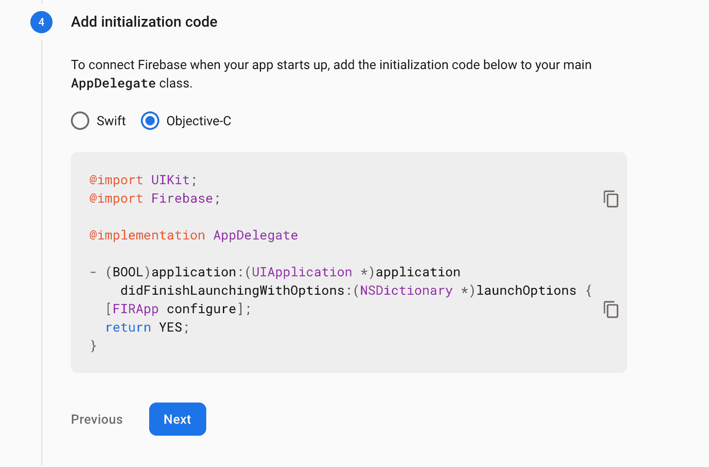
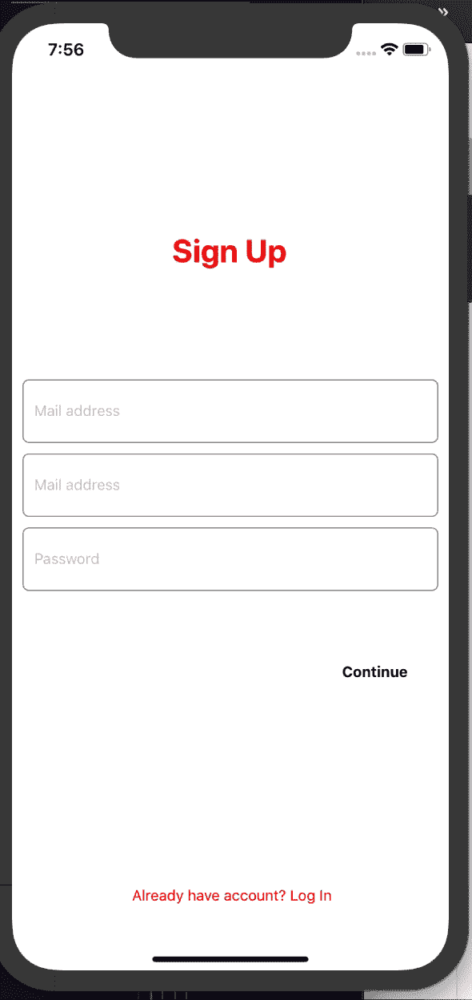
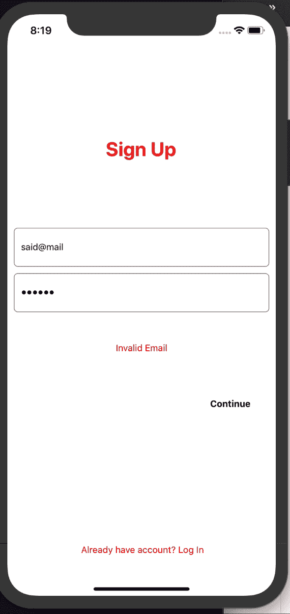
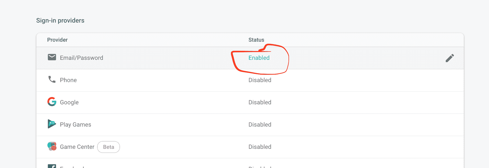

# 如何使用 Firebase 在三个步骤中添加身份验证以反应本机

> 原文：<https://www.freecodecamp.org/news/how-to-add-authentication-to-react-native-in-three-steps-using-firebase/>

身份验证使我们能够保护我们的应用，或者限制非用户成员的访问。例如，认证还可以用于限制对付费服务或特定服务的访问。

这只是应用程序中身份验证的一个例子。今天，我们将使用 Firebase 向 React 本机应用程序添加身份验证。

## 1 安装 react-native-firebase

我们做的第一件事是在我们的应用程序中安装和初始化 Firebase。在 React Native 中，我们需要为 React Native 使用一个 Firebase 容器。我们将使用 [react-native-firebase](https://github.com/invertase/react-native-firebase) 。

如果你准备从头开始一个新的 React Native 应用，并且你想使用 Firebase，你很幸运——你可以使用 React Native CLI 安装预集成的 react-native-firebase。

```
//
npx @react-native-community/cli init --template=@react-native-firebase/template authenticationFirebase
//** source: https://invertase.io/oss/react-native-firebase/quick-start/new-project 
```

然后，只需在应用程序的根目录下运行以下命令，安装 iOS 版 pod。

```
cd ios && pod install 
```

如果您在使用 Firebase 安装新项目时遇到问题，请参考 [react-native-firebase 文档](https://invertase.io/oss/react-native-firebase/quick-start/new-project)

### 将 react-native-firebase 添加到现有项目中

使用纱线或 npm 安装`react-native-firebase`组件

```
 yarn add @react-native-firebase/app 
```

或者:

```
 npm install @react-native-firebase/app 
```

然后给 iOS 安装 pods。

`shell cd ios && pod install`

### 运行应用程序

对于 iOS，有两种方法可以做到这一点:我个人使用 Xcode，因为它可以让我清楚地知道是否出现了问题和构建失败。


始终确保软件包正在运行-点击`yarn start`启动应用程序。

在 iOS 上运行应用程序的第二种方法是运行 react-native run-ios 命令-仅此而已。

## 添加 firebase 凭据

这一步需要我们在 Firebase 控制台中创建一个新项目。

在仪表板页面上创建新项目后，选择**将 Firebase 添加到 iOS 应用程序**。这将向您展示向 iOS 添加凭证的步骤，如下所示。

它由几个步骤组成:

*   下载`GoogleService-info.plist`文件，并将其放在项目的 iOS 文件夹中。
    

*   初始化 Firebase



## 适用于 Android

Android 对 Firebase 有不同的设置。在 Firebase 控制台的项目设置中，选择**将 Firebase 添加到 Android** 。


您可以在应用程序名称输入中输入任何您喜欢的名称——只要确保它符合 Firebase 的要求。然后点击**注册**。

之后需要下载`google-services.json`文件，放在 android/app 文件夹内。

然后下一步就是初始化 Android SDK。


最后一步是应用里面的 Firebase 插件:`android/app/build.gradle`。

```
apply plugin: 'com.google.gms.google-services' 
```

如果您在运行上述步骤时有任何问题，您可以随时参考 [Firebase 文档](https://firebase.google.com/docs)或 [react-native-firebase](https://rnfirebase.io/) 网站。

既然我们已经完成了集成，下一步就是实现 Firebase 函数来创建用户并在 React Native 中登录。

## 添加登录，登录

这个阶段很简单:只需要一些 React 和 JavaScript 代码来调用 Firebase 函数。我将为登录和注册创建一个简单的 UI(这对于本教程不是必需的，所以您可以跳过这一步)。



> 我将把完整的源代码放在文章的最后*

我们将使用`createUserWithEmailAndPassword`功能注册一个新用户。我已经在表单上实现了所有的验证——我们只需要调用这个函数来创建一个用户。



当用户按下继续按钮时，`__doSignUp`将被调用，代码如下所示:

```
const __doSignUp = () => {
  if (!email) {
    setError("Email required *")
    setValid(false)
    return
  } else if (!password && password.trim() && password.length > 6) {
    setError("Weak password, minimum 5 chars")
    setValid(false)
    return
  } else if (!__isValidEmail(email)) {
    setError("Invalid Email")
    setValid(false)
    return
  }

  __doCreateUser(email, password)
}

const __doCreateUser = async (email, password) => {
  try {
    let response = await auth().createUserWithEmailAndPassword(email, password)
    if (response) {
      console.log(tag, "?", response)
    }
  } catch (e) {
    console.error(e.message)
  }
} 
```

确保您安装了`@react-native-firebase/auth`以便能够调用`auth().createUserWithEmailAndPassword(email, password)`

```
// import auth
import auth from "@react-native-firebase/auth" 
```

在 Firebase 中创建新用户的函数如下所示:

```
const __doCreateUser = async (email, password) =>{
    try {
     let response =  await auth().createUserWithEmailAndPassword(email, password);
      if(response){
        console.log(tag,"?",response)
      }
    } catch (e) {
      console.error(e.message);
    } 
```

如果该函数抛出错误，请确保在 Firebase 控制台的身份验证部分启用电子邮件/密码方法。


如果一切顺利，并且输入的数据(电子邮件、密码)有效，就会出现警报。如果您检查 Firebase 控制台中的身份验证部分，您会注意到已经创建了一个新用户。


下面是`SignInComponent`的源代码。

```
const SigInComponent = () => {
  const [email, setEmail] = useState("")
  const [password, setPassword] = useState("")
  const [fetching, setFetching] = useState(false)
  const [error, setError] = useState("")
  const [isValid, setValid] = useState(true)
  const __doSignUp = () => {
    if (!email) {
      setError("Email required *")
      setValid(false)
      return
    } else if (!password && password.trim() && password.length > 6) {
      setError("Weak password, minimum 5 chars")
      setValid(false)
      return
    } else if (!__isValidEmail(email)) {
      setError("Invalid Email")
      setValid(false)
      return
    }

    __doCreateUser(email, password)
  }

  const __doCreateUser = async (email, password) => {
    try {
      let response = await auth().createUserWithEmailAndPassword(
        email,
        password
      )
      if (response && response.user) {
        Alert.alert("Success ✅", "Account created successfully")
      }
    } catch (e) {
      console.error(e.message)
    }
  }

  return (
    <SafeAreaView style={styles.containerStyle}>
      <View style={{ flex: 0.2 }}>
        {!!fetching && <ActivityIndicator color={blue} />}
      </View>
      <View style={styles.headerContainerStyle}>
        <Text style={styles.headerTitleStyle}> Sign Up </Text>
      </View>
      <View style={styles.formContainerStyle}>
        <TextInput
          label={"Email"}
          autoCapitalize={false}
          keyboardType="email-address"
          style={styles.textInputStyle}
          placeholder="Mail address"
          onChangeText={text => {
            setError
            setEmail(text)
          }}
          error={isValid}
        />

        <TextInput
          label={"Password"}
          secureTextEntry
          autoCapitalize={false}
          style={styles.textInputStyle}
          selectionColor={blue}
          placeholder="Password"
          error={isValid}
          onChangeText={text => setPassword(text)}
        />
      </View>
      {error ? (
        <View style={styles.errorLabelContainerStyle}>
          <Text style={styles.errorTextStyle}>{error}</Text>
        </View>
      ) : null}
      <View style={styles.signInButtonContainerStyle}>
        <TouchableHighlight
          style={styles.signInButtonStyle}
          onPress={__doSignUp}
          underlayColor={blue}
        >
          <View
            style={{
              flexDirection: "row",
              justifyContent: "space-around",
            }}
          >
            <Text style={styles.signInButtonTextStyle}>Continue</Text>
          </View>
        </TouchableHighlight>
      </View>
    </SafeAreaView>
  )
} 
```

对于`LoginComponent`,几乎是一样的，我们唯一需要改变的是我们使用`signInWithEmailAndPassword`方法来代替。

```
const __doSingIn = async (email, password) => {
  try {
    let response = await auth().signInWithEmailAndPassword(email, password)
    if (response && response.user) {
      Alert.alert("Success ✅", "Authenticated successfully")
    }
  } catch (e) {
    console.error(e.message)
  }
} 
```

 {
    //  this.register("said1292@gmail.com", "123456");
    this.__isTheUserAuthenticated();
  }

  __isTheUserAuthenticated = () => {
    let user = firebase.auth().currentUser.uid;
    if (user) {
      console.log(tag,  user);
      this.setState({ authenticated: true });
    } else {
      this.setState({ authenticated: false });
    }
  }; 
```

我们可以根据用户是否经过身份验证来更改 UI。我们可以用同样的方法显示用户信息。

```
firebase.auth().currentUser.email // said543@gmail.com 
```

而要注销，只需调用`await firebase.auth().signOut()`；

我确信像 [react-navigation](https://reactnavigation.org/) 这样的集成导航会很棒，但这不是我们在本文中的重点。因此，您可以随意添加导航，这样您就可以根据用户状态进行导航。

请随意查看完整的源代码？在 [GitHub](https://github.com/hayanisaid/react-native-authentication-firebase) 上

**感谢阅读*。*

最初发表于[saidhayani.com](https://saidhayani.com/How%20to%20Add%20authentication%20to%20React%20Native%20in%20three%20steps%20using%C2%A0Firebase/)

### [了解更多 React native](https://saidhayani.com/) 。

*   [推特](https://twitter.com/SaidHYN)
*   [GitHub](https://github.com/hayanisaid)
*   [Instagram](https://www.instagram.com/saaed_happy/)
*   [加入邮件列表](http://eepurl.com/dk9OJL)