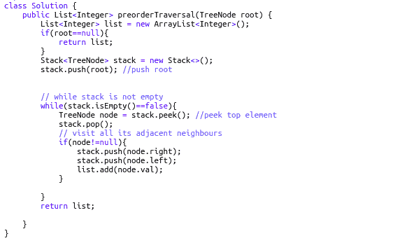
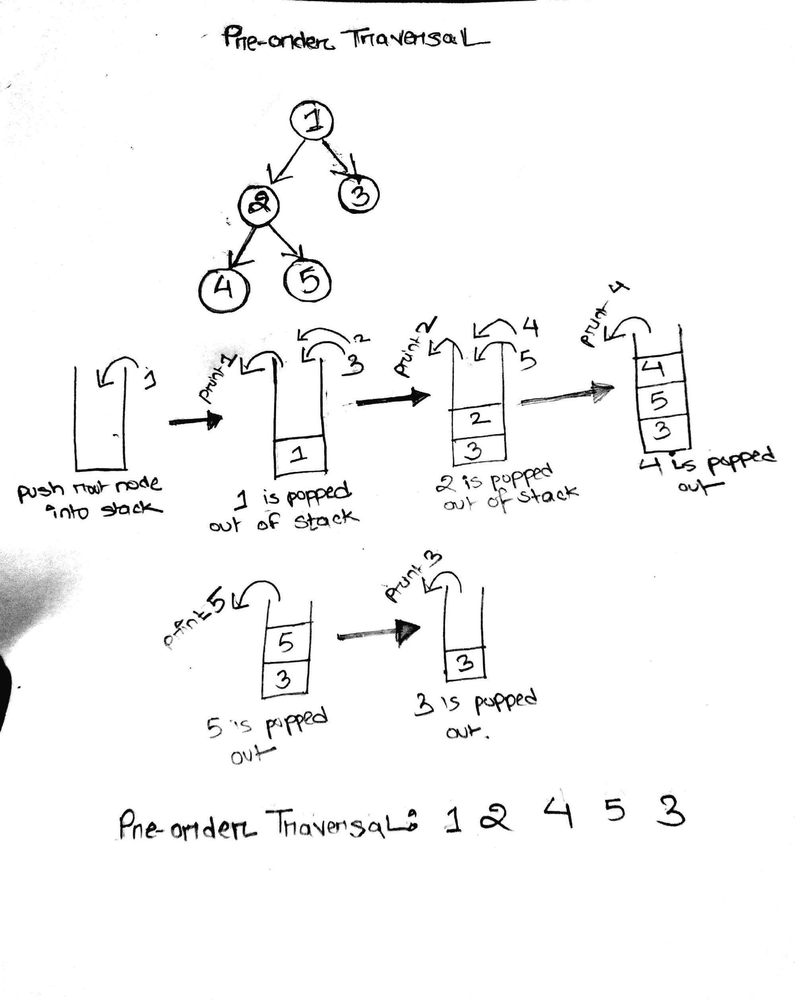
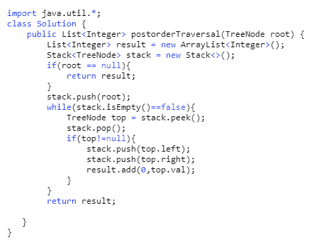
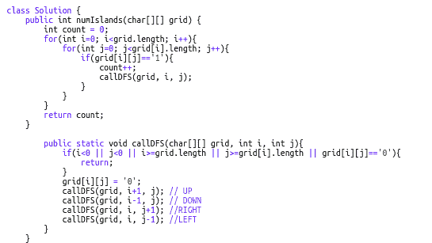
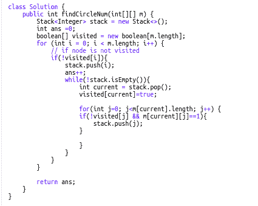

# 深度优先搜索:包含 6 个 Leetcode 示例的 DFS 图遍历指南

> 原文：<https://www.freecodecamp.org/news/dfs-for-your-next-tech-giant-interview/>

你解决过现实生活中的迷宫吗？我们大多数人在解决迷宫时采取的方法是，我们沿着一条路径走，直到我们到达一个死胡同，然后原路返回，找到另一条可能的路径。

这正是深度优先搜索(DFS)的类比。这是一种流行的图遍历算法，从根节点开始，沿着给定的分支尽可能远地行进，然后回溯，直到找到另一条未探索的路径。这种方法一直持续到图的所有节点都被访问过。

在今天的教程中，我们将发现一个 DFS 模式，它将被用来解决下一次科技巨头面试中的一些重要的树和图问题！我们将使用相同的通用技术解决一些中等难度和高难度的 Leetcode 问题。

那么，我们开始吧，好吗？

## 履行

由于 DFS 具有递归性质，因此可以使用堆栈来实现。

DFS 魔咒:

1.  将节点推入堆栈
2.  弹出节点
3.  检索已删除节点的未访问邻居，将它们推入堆栈
4.  只要堆栈不为空，就重复步骤 1、2 和 3

## 图形遍历

一般来说，二叉树有 3 种基本的 DFS 遍历:

1.  **前置顺序:**根，左，右**或**根，右，左
2.  **发布顺序:**左、右、根**或**右、左、根
3.  **按顺序:**左、根、右**或**右、根、左

### [144。二叉树前序遍历(难度:中等)](https://leetcode.com/problems/binary-tree-preorder-traversal/)

要解决这个问题，我们需要做的只是回忆一下我们的魔法咒语。让我们很好地理解模拟，因为这是我们将用来解决其余问题的**基本模板**。



首先，我们将根节点推入堆栈。当堆栈不为空时，我们弹出它，并将其左右子元素推入堆栈。

当我们弹出根节点时，我们立即将它放入结果列表中。因此，结果列表中的第一个元素是根元素(因此得名，Pre-order)。

下一个要从堆栈中弹出的元素将是当前堆栈的顶部元素:根节点的左子元素。以类似的方式继续该过程，直到遍历了整个图，并且二叉树的所有节点值都进入结果列表。



### [145。二叉树后序遍历(难度:难)](https://leetcode.com/problems/binary-tree-postorder-traversal/)

前序遍历为**根-左-右**，后序为**右-左-根**。这意味着后序遍历与前序遍历完全相反。

因此，现在可能想到的一个解决方案是简单地反转预先顺序遍历的结果数组。但是想一想——逆转它需要 O(n)时间复杂度。

更聪明的解决方案是复制并粘贴前序遍历的确切代码，但在每次迭代时将结果放在链表的顶部(索引 0)。向链表的头部添加一个元素需要花费恒定的时间。很酷，对吧？



### [94。二叉树有序遍历(难度:中等)](https://leetcode.com/problems/binary-tree-inorder-traversal/)

我们解决这个问题的方法类似于前面的问题。但是在这里，我们将访问一个节点左侧的所有内容，打印该节点，然后访问该节点右侧的所有内容。


### [323。无向图中连通分量的个数
(难度:中等)](https://leetcode.com/problems/number-of-connected-components-in-an-undirected-graph/)

我们这里的方法是创建一个名为 **ans** 的变量来存储连接组件的数量。

首先，我们将初始化所有未访问的顶点。我们将从一个节点开始，在该节点上执行 DFS 的同时(当然，使用我们的魔咒)，它会将所有连接到它的节点标记为已访问。**和**的值将增加 1。

```
 import java.util.ArrayList;
import java.util.List;
import java.util.Stack;

public class NumberOfConnectedComponents {
    public static void main(String[] args){
        int[][] edge = {{0,1}, {1,2},{3,4}};
        int n = 5;
        System.out.println(connectedcount(n, edge));

    }

    public static int connectedcount(int n, int[][] edges) {

        boolean[] visited = new boolean[n];
        List[] adj = new List[n];
        for(int i=0; i<adj.length; i++){
            adj[i] = new ArrayList<Integer>();
        }

        // create the adjacency list
        for(int[] e: edges){
            int from = e[0];
            int to = e[1];
            adj[from].add(to);
            adj[to].add(from);

        }
        Stack<Integer> stack = new Stack<>();
        int ans = 0; // ans = count of how many times DFS is carried out

        // this for loop through the entire graph
        for(int i = 0; i < n; i++){
            // if a node is not visited
            if(!visited[i]){
                ans++;
                //push it in the stack
                stack.push(i);

                while(!stack.empty()) {

                    int current = stack.peek();
                    stack.pop(); //pop the node
                    visited[current] = true; // mark the node as visited

                    List<Integer> list1 = adj[current];

        // push the connected components of the current node into stack
                    for (int neighbours:list1) {
                        if (!visited[neighbours]) {
                            stack.push(neighbours);
                        }
                    }
                }

        }
    }
        return ans;
    }
}
```

### [200。岛屿数量(难度:中等)](https://leetcode.com/problems/number-of-islands/)

这属于一个总的问题类别，其中我们必须找到连接组件的数量，但细节有点调整。

本能地，你可能会认为，一旦我们找到一个“1 ”,我们就会启动一个新的组件。我们从该单元在所有 4 个方向(上、下、右、左)进行 DFS，并到达连接到该单元的所有 1。所有这些相互连接的 1 属于同一组，因此，我们的值 **count** 增加 1。我们将这些 1 的单元标记为已访问，并继续计数其他连接的组件。



### 547。朋友圈(难度:中等)

这也遵循与寻找连通分量的数量相同的概念。在这个问题中，我们有一个 NxN 矩阵，但总共只有 N 个朋友。边是通过单元格直接给出的，因此我们必须遍历一行来获取特定“朋友”的邻居。

请注意，这里我们使用了与之前问题相同的堆栈模式。



今天就到这里吧！我希望这有助于您更好地理解 DFS，并且您喜欢本教程。如果你认为这篇文章可能对其他人有用，请推荐它！